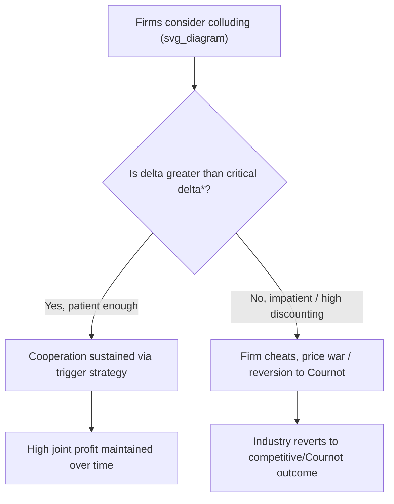

## Cartels, Collusion, and Price Leadership

### Overview

Cartels, collusion, and price leadership represent three related but distinct mechanisms by which oligopolistic firms attempt to reduce competitive rivalry and move market outcomes closer to the joint-profit-maximizing (monopoly) result. Rather than competing independently, firms coordinate — explicitly or tacitly — on price, output, or market shares to increase their collective profits at the expense of consumer surplus and allocative efficiency.

This topic sits at the intersection of oligopoly theory and antitrust/competition policy, since most jurisdictions treat explicit collusion as illegal while tacit coordination occupies a legally ambiguous space.

### Cartels: Definition and Structure

A **cartel** is a formal or informal agreement among firms in an industry to coordinate output, pricing, or market allocation decisions in order to maximize **joint industry profit**, as if the colluding firms were a single monopolist.

**Key characteristics:**

- Firms agree explicitly (or through repeated tacit signaling) on a common price or restricted output level.
- The cartel sets price and output as a monopolist would, using the industry's aggregate marginal cost curve (horizontal summation of individual firm MC curves) equated to the industry's marginal revenue.
- Profits (or output quotas) are then allocated among member firms according to some agreed rule (e.g., historical market share, capacity, or negotiated quotas).

### The Joint Profit-Maximizing Cartel Model

**Setup**: Consider $n$ firms with individual marginal cost curves $MC_i$. The cartel maximizes joint profit as if it were a monopolist facing the market demand curve $P = f(Q)$.

**Step 1 — Aggregate marginal cost**: Horizontally sum individual $MC_i$ curves to obtain $MC_{industry}$.

**Step 2 — Monopoly output rule**: Set the cartel's total output $Q^*$ where:

$$MR(Q^*) = MC_{industry}(Q^*)$$

**Step 3 — Cartel price**: Read off the price from the market demand curve at $Q^*$:

$$P^* = f(Q^*)$$

**Step 4 — Quota allocation**: Allocate individual firm outputs $q_i$ such that each firm's marginal cost equals the common $MC_{industry}$ value at $Q^*$ — this ensures production is allocated efficiently across cartel members (lowest-cost firms produce more), which is the **profit-maximizing allocation rule**, though it is not always the rule cartels actually adopt in practice.

**Numerical Example:**

Market demand: $P = 100 - Q$. Two identical firms, each with $MC_i = 10$ (constant), so $MC_{industry} = 10$ as well (constant MC sums horizontally to the same constant value regardless of number of firms).

Cartel maximizes joint profit like a monopolist:

$$TR = (100 - Q)Q = 100Q - Q^2 \implies MR = 100 - 2Q$$

Set $MR = MC$:

$$100 - 2Q = 10 \implies Q^* = 45$$

$$P^* = 100 - 45 = 55$$

If firms split output equally: $q_1 = q_2 = 22.5$

**Joint profit:**

$$\pi = (55 - 10)(45) = 2{,}025$$

Compare to the Cournot duopoly outcome with the same cost/demand structure ($Q_{Cournot} = 60$, $P_{Cournot} = 40$, total profit $= 1{,}800$): the cartel achieves **higher total industry profit** ($2{,}025 > 1{,}800$) by restricting output below the competitive/Cournot level.

### The Inherent Instability of Cartels: Incentive to Cheat

**Key Points:**

- Each individual cartel member has a **private incentive to secretly produce more than its quota**, since — given the high cartel price — the member's own marginal revenue from expanding output exceeds its marginal cost.
- This is a classic **prisoner's dilemma** structure: mutual restriction is collectively optimal, but unilateral cheating (expanding output while others hold their quota) is individually optimal for each firm.
- If enough members cheat, industry output rises back toward the competitive level and the cartel price collapses.

**Illustrating the cheating incentive**: In the numerical example above, if Firm 1 sticks to its quota of $22.5$ while Firm 2 secretly increases output, Firm 2's marginal revenue based on the *residual* demand it faces (holding Firm 1's output fixed at $22.5$) will exceed $10$ up to a higher output level than $22.5$ — meaning Firm 2 can profitably deviate as long as Firm 1 does not react.

### Factors Affecting Cartel Stability

| Factor | Effect on Stability |
| --- | --- |
| Number of firms | Fewer firms → easier monitoring, more stable |
| Product homogeneity | More homogeneous → easier to detect price-cutting, more stable |
| Demand elasticity | Less elastic demand → higher cartel profits, greater incentive to sustain |
| Cost symmetry | Similar costs across firms → easier quota agreement, more stable |
| Frequency of transactions | Frequent, small transactions → easier to detect cheating |
| Barriers to entry | High barriers → prevents new entrants from undercutting the cartel |
| Demand growth/volatility | Stable/predictable demand → easier to sustain than volatile demand |
| Punishment mechanisms | Credible retaliation threats (e.g., price wars) → increases stability |
| Legal enforceability | Cartels cannot use courts to enforce agreements (illegal in most jurisdictions) → relies on self-enforcement |

**[Inference]** Because cartel agreements are generally unenforceable through legal contracts, their stability depends heavily on repeated-game dynamics — the credibility of punishment strategies (e.g., reversion to competitive pricing if cheating is detected) is central to sustaining cooperation over time, a mechanism formally studied via the **Folk Theorem** in repeated games.

### Repeated Games and Tacit Collusion

Even without an explicit agreement, firms interacting repeatedly over time can sustain collusive outcomes through **tacit collusion**, using strategies such as:

- **Trigger strategies**: A firm cooperates (maintains high price) as long as rivals do, but reverts to competitive (or punitive) pricing permanently or temporarily if a rival deviates.
- **Tit-for-tat**: A firm matches its rival's previous-period action.

The **Folk Theorem** demonstrates that in infinitely (or indefinitely) repeated games, cooperation can be sustained as a subgame perfect Nash equilibrium provided firms are sufficiently patient (i.e., the discount factor $\delta$ is high enough) and the threat of future punishment outweighs the short-term gain from cheating today:

$$\frac{\pi_{cheat}}{1} \leq \pi_{collude} + \delta\left(\frac{\pi_{collude}}{1-\delta}\right) - \text{[punishment payoff stream]}$$

More concretely, using a simple trigger-strategy condition, collusion is sustainable if the discounted value of continued cooperation exceeds the one-time gain from deviation:

$$\pi_{collude}\cdot\frac{1}{1-\delta} \geq \pi_{cheat} + \delta \cdot \pi_{Cournot} \cdot \frac{1}{1-\delta}$$

This can be rearranged to find the **critical discount factor** $\delta^*$ above which collusion is sustainable:

$$\delta^* = \frac{\pi_{cheat} - \pi_{collude}}{\pi_{cheat} - \pi_{Cournot}}$$

If firms' actual discount factor $\delta > \delta^*$, tacit collusion can be sustained indefinitely; if $\delta < \delta^*$, firms will find it profitable to cheat, and the cartel/tacit agreement breaks down.

### Price Leadership Models

**Price leadership** is a form of tacit coordination where one firm — typically the largest or lowest-cost firm — sets the market price, and other firms follow by adopting the same price without formal agreement. This achieves coordination without the legal risk of explicit collusion.

Two principal variants:

**1. Dominant-firm price leadership**: A large firm with significant market share sets price to maximize its own profit, treating smaller "fringe" firms as price-takers who supply according to their own supply curves at the leader's chosen price. The dominant firm's residual demand is:

$$D_{leader}(P) = D_{market}(P) - S_{fringe}(P)$$

The dominant firm sets output where its marginal revenue (derived from this residual demand) equals its marginal cost, and the fringe firms supply whatever quantity they wish at the resulting price.

**2. Barometric price leadership**: A firm (not necessarily the largest) that has historically been accurate in reading market conditions initiates price changes, and other firms follow because they trust the leader's assessment of demand and cost trends — not because of any market power the leader holds. This form is generally considered less anti-competitive since it need not involve any dominant firm coercively imposing price.

**Key Points:**

- Price leadership can arise as an efficient tacit-coordination equilibrium in oligopoly, avoiding the costs and legal risks of explicit cartel agreements.
- It is functionally similar to the Stackelberg model but applied to **price** rather than quantity, and can occur without any formal agreement — making it far harder to detect and prosecute under antitrust law than explicit cartels.

### Legal and Antitrust Perspective

- **Explicit cartels** (formal price-fixing or output-restriction agreements) are illegal *per se* under most competition laws (e.g., Section 1 of the Sherman Act in the U.S., Article 101 TFEU in the EU) — meaning no defense based on "reasonableness" is typically permitted once collusion is proven.
- **Tacit collusion** and **price leadership**, absent direct evidence of communication or agreement, generally fall into a legal gray area — courts and regulators require evidence of actual coordination (not merely parallel pricing) to establish an antitrust violation, since independent, rational firms may naturally converge on similar prices without any illegal agreement.
- **[Unverified]** The precise evidentiary threshold distinguishing lawful tacit parallel pricing from unlawful tacit collusion varies significantly across jurisdictions and case law, and is subject to ongoing legal and economic debate.

### OPEC as a Real-World Cartel Example

The **Organization of the Petroleum Exporting Countries (OPEC)** is the most frequently cited real-world example of an (imperfectly stable) international cartel, coordinating crude oil production quotas among member states to influence global oil prices. Its history illustrates classic cartel dynamics:

- Periods of successful coordination and elevated prices (e.g., the 1973 oil embargo period) demonstrate the potential for substantial joint-profit gains from output restriction.
- Periods of quota-cheating by individual members, price wars, and reduced cartel discipline (e.g., various episodes since the 1980s) illustrate the classic prisoner's dilemma instability described above.
- The cartel's ability to sustain cooperation has depended heavily on factors matching the theoretical stability conditions: the dominance of Saudi Arabia as a "swing producer" capable of retaliatory production increases functions similarly to a trigger-strategy enforcement mechanism.

**[Inference]** OPEC's continued relevance as a case study stems from its scale and public visibility, but its cohesion has fluctuated considerably over decades in ways that closely track the theoretical predictors of cartel stability (number of effective decision-makers, demand elasticity shifts due to non-OPEC supply growth, and the credibility of Saudi Arabia's swing-producer punishment threat).

### Summary Comparison

| Mechanism | Formality | Legality | Coordination Method | Detection Difficulty |
| --- | --- | --- | --- | --- |
| Explicit cartel | Formal agreement | Illegal (per se) in most jurisdictions | Direct communication/contract | Easier (paper trail, meetings) |
| Tacit collusion | Informal, repeated-game based | Legally ambiguous | Trigger strategies, mutual forbearance | Difficult (no direct evidence) |
| Dominant-firm price leadership | Informal | Generally legal unless predatory intent shown | Fringe firms follow leader's price | Moderate (market share/price patterns observable) |
| Barometric price leadership | Informal | Generally legal | Firms follow a trusted price-signal firm | Difficult (no market power required) |

**Related Topics:**

- Prisoner's dilemma and repeated games in oligopoly
- The Folk Theorem and trigger strategies
- Antitrust law and Sherman Act Section 1
- Dominant-firm models and residual demand
- Stackelberg leadership model (quantity analogue)
- Game theory: cooperative vs. non-cooperative equilibria
- Non-price competition and product differentiation strategies