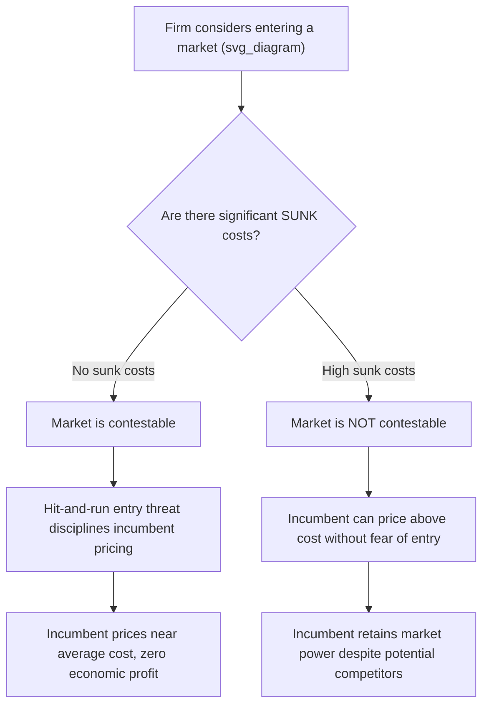

## Contestable Markets and Potential Competition

### Overview

The theory of **contestable markets** was developed primarily by **William Baumol, John Panzar, and Robert Willig** in their 1982 book *Contestable Markets and the Theory of Industry Structure*. The theory challenges the traditional view that market structure (number of firms, concentration) is the primary determinant of competitive behavior. Instead, it argues that the **threat of entry** — rather than the actual number of firms currently operating — can discipline incumbent pricing and output decisions, even in markets with very few firms (including monopolies).

A market is "contestable" if entry and exit are sufficiently easy that potential competitors can constrain incumbents' behavior without ever actually entering the market. This reframes competitive pressure as arising from **potential competition**, not just realized competition.

### Defining a Perfectly Contestable Market

A market is **perfectly contestable** if it satisfies three key conditions:

1. **Free entry**: New entrants face no cost or informational disadvantages relative to incumbents — they have access to the same technology and demand conditions.
2. **Free exit / no sunk costs**: Entrants can exit the market costlessly, recovering all their capital investment. This is the most critical condition — the absence of **sunk costs** distinguishes contestability theory from ordinary barriers-to-entry analysis.
3. **Hit-and-run entry**: Entrants can enter, undercut the incumbent's price, capture sales, and exit before the incumbent has time to retaliate by lowering its own price.

**Key Points:**

- The absence of sunk costs is the linchpin of the theory: if an entrant can recover its investment fully upon exit, entry carries **no risk**, and the entrant will always find it profitable to enter whenever incumbents are earning above-normal (supernormal) profits or pricing above cost.
- This means the *threat* of hit-and-run entry alone is sufficient to constrain incumbent pricing — actual entry need never occur in equilibrium.

### The Baumol-Panzar-Willig (BPW) Model: Key Predictions

In a perfectly contestable market, even a monopolist or a small oligopoly is forced to behave as if it faces intense competition, because any deviation from competitive-like pricing invites instant hit-and-run entry. The theory predicts specific outcomes:

**1. Zero economic (supernormal) profits in equilibrium**: If incumbents earned positive economic profit, hit-and-run entrants would enter, undercut the price slightly, capture the profitable business, and exit — driving profits back toward zero.

**2. Price equals average cost, not necessarily marginal cost**: Unlike perfect competition, a contestable monopoly may still price above marginal cost if there are economies of scale (a natural monopoly situation), but abnormal profits above the level required to just cover total costs (including a normal return on capital) cannot persist.

$$P = AC \quad \text{(zero economic profit condition)}$$

**3. Productive efficiency**: Firms in contestable markets are forced to produce at the **minimum efficient scale** and use the **least-cost technology** available, since any productive inefficiency creates an opportunity for a more efficient entrant to undercut and profitably capture the market.

**4. No cross-subsidization in multi-product firms**: In contestable markets with multi-product firms (e.g., a natural monopoly with several product lines), a firm cannot sustainably price one product below cost while pricing another above cost to compensate, because entrants could "cream-skim" by entering only the profitable product line.

### Contestability vs. Traditional Market Structure Theory

| Aspect | Traditional (Structure-Conduct-Performance) View | Contestability Theory |
| --- | --- | --- |
| Determinant of competitive outcome | Number of firms / market concentration | Ease of entry and exit (presence/absence of sunk costs) |
| Monopoly behavior | Assumed to price above cost, restrict output | Can be forced to price competitively if market is contestable |
| Policy focus | Break up concentrated industries (structural remedies) | Remove entry/exit barriers, especially sunk costs |
| Actual number of competitors | Central to the analysis | Largely irrelevant if potential entry is credible |
| Key cost concept | Fixed costs generally | Specifically **sunk** costs (unrecoverable), not just fixed costs |

**[Inference]** This reframing has significant implications for competition policy: it suggests that regulators concerned about monopoly power in a contestable market should focus on **lowering barriers to entry and exit** (e.g., removing licensing restrictions, ensuring access to essential inputs) rather than pursuing structural interventions like breaking up an incumbent firm, since the incumbent may already be constrained by potential competition.

### Sunk Costs vs. Fixed Costs: A Critical Distinction

This distinction is central to the theory and frequently a point of confusion:

- **Fixed costs** are costs that do not vary with output in the short run but *may* be recoverable upon exit (e.g., equipment that can be resold or repurposed).
- **Sunk costs** are costs that, once incurred, **cannot be recovered** under any circumstances — even upon exiting the industry (e.g., specialized advertising expenditure, R&D specific to one product, or highly specialized equipment with no resale value).

A market can have **high fixed costs but low sunk costs** and still be highly contestable (e.g., an airline route, where aircraft can be redeployed to other routes if a particular route proves unprofitable — the capital is fixed but not sunk to that specific market).

### Numerical Illustration: Hit-and-Run Entry Discipline

Suppose an incumbent monopolist has average total cost $AC = 20$ per unit at the relevant output level, and faces market demand $P = 100 - Q$.

**Without contestability discipline** (standard monopoly): The monopolist sets $MR = MC$ and could sustain a price well above $AC = 20$, earning substantial economic profit indefinitely.

**With perfect contestability**: Suppose the incumbent attempts to charge $P = 50$ (well above $AC = 20$), earning economic profit of $(50 - 20) \times Q$. Because there are no sunk costs, a hit-and-run entrant can:

1. Enter the market and offer the same product at $P = 45$ (undercutting slightly).
2. Capture the incumbent's entire customer base at the relevant demand quantity.
3. Earn profit of $(45 - 20) \times Q$ for a brief period.
4. Exit costlessly if the incumbent retaliates by matching or undercutting further.

Because this hit-and-run strategy is always profitable whenever $P > AC$, the incumbent's only stable pricing strategy is to set $P = AC = 20$, eliminating the incentive for entry altogether. The equilibrium price converges to average cost, mimicking the **long-run competitive equilibrium** outcome despite the market having only one or a few firms.

### Application to Natural Monopoly: Sustainable Pricing

Contestability theory is particularly relevant to **natural monopolies** — industries characterized by economies of scale so large that a single firm can supply the entire market at lower average cost than multiple firms could.

In a contestable natural monopoly, the incumbent must charge a **sustainable price** — one that:

- Covers average cost (so the incumbent earns zero economic profit), and
- Leaves no opportunity for an entrant to profitably undercut using a smaller-scale, potentially less-efficient technology.

If the natural monopolist attempts to price above the sustainable level (even while still exploiting scale economies), a contestability-driven entrant could serve a subset of the market profitably at a lower price, "cream-skimming" the most profitable segment of demand.

**[Inference]** This has informed regulatory approaches to network industries (e.g., utilities, telecommunications) that emphasize **removing barriers to entry** (such as mandating access to shared infrastructure) as an alternative or complement to traditional rate-of-return or price-cap regulation, on the premise that credible entry threats can substitute for direct price regulation.

### Real-World Applications and Examples

- **Airline industry (classic BPW example)**: Aircraft are highly mobile capital assets that can be redeployed across routes with minimal sunk cost, making individual point-to-point routes reasonably contestable even when served by only one or two carriers — a new entrant can add a route quickly and withdraw aircraft if unprofitable.
- **Deregulated industries**: Following deregulation (e.g., U.S. airline deregulation in 1978), contestability theory was influential in arguing that market concentration alone need not indicate a lack of competitive discipline, since potential entrants constrained pricing on many routes.
- **Digital and platform markets**: **[Inference]** Some analysts have applied contestability logic to online marketplaces or software platforms, arguing low switching/setup costs for new entrants can discipline incumbent behavior even with high market concentration — though this application is more contested, since network effects and data advantages can function as a form of sunk-cost-like barrier not fully captured in the original BPW framework.

### Criticisms and Limitations of Contestability Theory

- **Perfect contestability is a theoretical idealization.** Real markets almost always involve some sunk costs (specialized equipment, brand-building, regulatory compliance costs, switching costs for consumers), meaning few, if any, real-world markets are *perfectly* contestable.
- **Incumbent reaction speed**: The theory assumes incumbents cannot respond to entry before the entrant captures sales and exits; in practice, incumbents can often react quickly (e.g., through matching price cuts in real time), undermining the hit-and-run mechanism.
- **Reputation and strategic deterrence**: Incumbents may use strategic tools (predatory pricing signals, brand loyalty investments, long-term contracts with customers) to deter entry even without literal sunk costs on the incumbent's side.
- **Empirical evidence is mixed.** Studies of the U.S. airline industry — the theory's flagship application — found that concentrated routes often still exhibited higher fares than the theory would predict, suggesting hit-and-run entry was not fully disciplining incumbent pricing in practice. **[Unverified]** The precise degree to which airline route pricing today reflects contestability discipline versus other factors (slot constraints, brand loyalty programs, network effects) remains debated in the applied industrial organization literature.

### Policy Implications

- Shifts regulatory focus from **market structure** (number of firms) to **entry/exit conditions** (presence of sunk costs, regulatory or legal barriers to entry).
- Suggests that **merger policy** should weigh whether a market remains contestable post-merger, not just resulting concentration levels (e.g., Herfindahl-Hirschman Index) alone.
- Supports deregulation arguments in industries where technology or capital mobility reduces sunk costs, on the premise that potential competition can substitute for a large number of actual competitors.

**Related Topics:**

- Natural monopoly and sustainable pricing
- Barriers to entry and exit (structural, strategic, legal)
- Baumol-Panzar-Willig sustainability conditions
- Deregulation case studies (airlines, telecommunications)
- Market structure and the Structure-Conduct-Performance paradigm
- Predatory pricing and strategic entry deterrence
- Herfindahl-Hirschman Index and merger policy