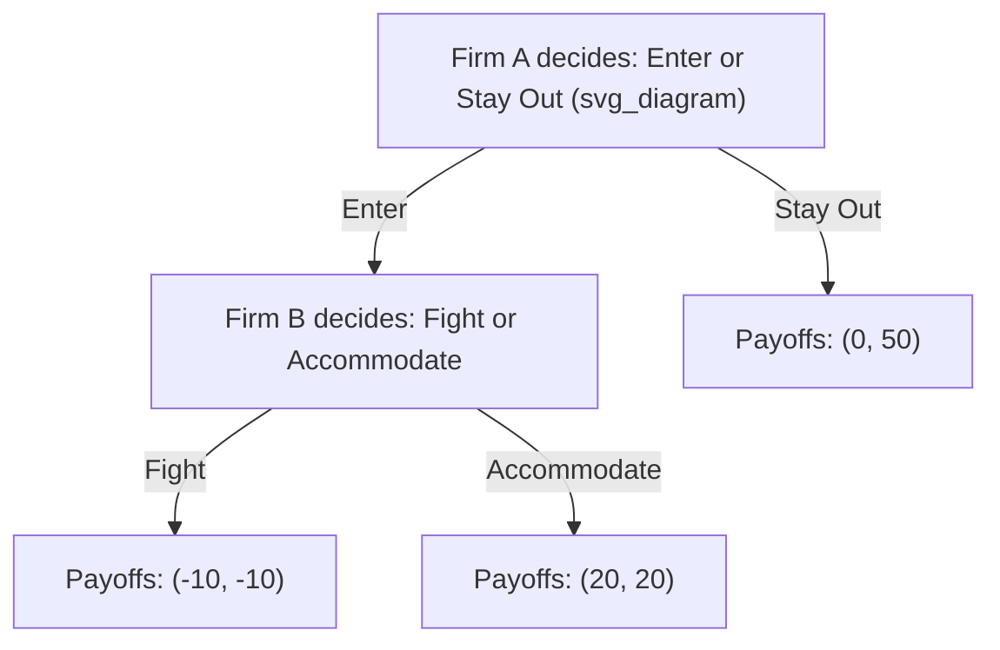

## Basic Concepts: Players, Strategies, and Payoffs

### Overview

Game theory provides the formal mathematical framework for analyzing strategic interactions — situations in which the outcome for each decision-maker depends not only on their own choices but also on the choices of others. In managerial economics, game theory underpins the analysis of oligopolistic competition, bargaining, auctions, and any setting where firms must anticipate rivals' responses. Every game, regardless of complexity, can be described using three foundational building blocks: **players**, **strategies**, and **payoffs**.

### Players

A **player** is any decision-making entity in a strategic interaction — an individual, firm, government, or other agent capable of choosing among available actions and possessing preferences over outcomes.

**Key characteristics of players:**

- **Rationality**: Standard game theory assumes each player is rational, meaning they consistently choose actions to maximize their own payoff (typically profit, utility, or some other well-defined objective), given their beliefs about the situation.
- **Common knowledge of rules**: In most basic models, it is assumed each player knows the full structure of the game — the players involved, the available strategies, and the payoff structure — and knows that other players know this too (common knowledge).
- **Finite vs. infinite players**: Most textbook models focus on **two-player games** (e.g., a duopoly) for tractability, but games can involve $n$ players (e.g., oligopoly with several firms, or an entire market of price-takers in extreme cases).

**Example**: In a duopoly pricing game, the two players are Firm A and Firm B, each choosing a price without knowing the other's simultaneous choice.

### Strategies

A **strategy** is a complete plan of action that specifies what a player will do in every possible situation they might face during the game — not merely a single action, but a comprehensive contingency plan.

**Types of strategies:**

**1. Pure strategy**: A specific, deterministic choice from the player's available action set. For example, "set price = $10" or "produce 50 units" are pure strategies.

**2. Mixed strategy**: A probability distribution over two or more pure strategies, used when no pure-strategy equilibrium exists or when unpredictability itself has strategic value (e.g., randomizing between "audit" and "don't audit" to prevent an opponent from exploiting a predictable pattern).

$$\sigma_i = (p_1, p_2, \ldots, p_k) \quad \text{where } \sum_{j=1}^{k} p_j = 1$$

Here, $\sigma_i$ represents player $i$'s mixed strategy, assigning probability $p_j$ to each pure strategy $j$.

**3. Dominant strategy**: A strategy that yields the highest payoff for a player **regardless of what any other player chooses**. If a dominant strategy exists, a rational player will always choose it.

**4. Dominated strategy**: A strategy that yields a lower payoff than some other available strategy, regardless of what opponents do — rational players never choose a dominated strategy, and such strategies can be eliminated through **iterated elimination of dominated strategies** to simplify game analysis.

**Key Points:**

- A strategy is *not* the same as an action — a strategy is the complete rule specifying an action for every possible contingency a player might encounter, particularly important in sequential (multi-move) games.
- The **strategy space** (or strategy set) $S_i$ for player $i$ is the complete collection of all strategies available to that player.

### Payoffs

A **payoff** is the numerical value (typically representing profit, utility, or another quantifiable objective) that a player receives as a result of the combination of strategies chosen by **all** players in the game — not just their own choice.

**Key characteristics:**

- Payoffs are typically represented in a **payoff matrix** for simultaneous-move games with a small number of players and strategies, or along the terminal nodes of a **game tree** for sequential-move games.
- Each player's payoff depends on the **entire strategy profile** (the combination of all players' chosen strategies), formally written as $\pi_i(s_1, s_2, \ldots, s_n)$ for player $i$'s payoff given the strategy profile $(s_1, \ldots, s_n)$.
- Payoffs encode the player's preferences and are usually assumed to satisfy the standard properties of a von Neumann-Morgenstern utility function when uncertainty or mixed strategies are involved, allowing meaningful comparison of expected payoffs.

### The Payoff Matrix: Representing Simultaneous Games

For a simple two-player, two-strategy simultaneous game, outcomes are represented in a **normal form** (matrix) representation.

**Example: A simple pricing game between two firms**

|  | Firm B: High Price | Firm B: Low Price |
| --- | --- | --- |
| **Firm A: High Price** | (50, 50) | (10, 60) |
| **Firm A: Low Price** | (60, 10) | (20, 20) |

Each cell shows **(Firm A's payoff, Firm B's payoff)** resulting from that particular combination of strategies.

**Reading the matrix:**

- If both firms set a high price, each earns $50 (mutual restraint outcome).
- If Firm A undercuts with a low price while Firm B stays high, Firm A earns $60 (capturing market share) while Firm B earns only $10.
- If both firms set a low price, both earn only $20 (competitive/price-war outcome).

In this example, **"Low Price" is a dominant strategy for both firms**: regardless of what the rival does, each firm earns a higher payoff by choosing "Low Price" (60 > 50 if the rival is High; 20 > 10 if the rival is Low). This is the structure of the classic **Prisoner's Dilemma**, where the mutually dominant strategy combination (Low, Low) yields a worse outcome for both firms than the mutually cooperative combination (High, High) would — illustrating a central insight of game theory: individually rational choices do not necessarily produce collectively optimal outcomes.

### Game Trees: Representing Sequential Games (Extensive Form)

When players move in sequence rather than simultaneously, the **extensive form** representation (a game tree) captures the order of moves, the information available to each player at each decision point, and the resulting payoffs.

**Reading the game tree:**

- **Nodes** represent decision points where a player must choose an action.
- **Branches** represent the available actions at each node.
- **Terminal nodes** (endpoints) show the resulting payoff pair for each possible complete sequence of moves.
- This particular tree represents a classic **entry deterrence game**: Firm A (a potential entrant) decides whether to enter an incumbent's market; if it enters, Firm B (the incumbent) decides whether to fight (e.g., start a price war) or accommodate (share the market peacefully).

Extensive-form games are typically solved using **backward induction**: working backward from the terminal nodes to determine what each player would rationally do at each decision point, given what will happen afterward. In the example above, Firm B would rationally choose "Accommodate" over "Fight" if entry occurs (since $20 > -10$ for Firm B), so Firm A, anticipating this, would rationally choose to "Enter" (since $20 > 0$ for Firm A).

### Strategy Profile and Equilibrium Concepts (Brief Introduction)

A **strategy profile** is a complete list of strategies, one for each player in the game: $(s_1, s_2, \ldots, s_n)$.

The most fundamental equilibrium concept, the **Nash equilibrium**, is a strategy profile in which no player can improve their payoff by unilaterally changing their own strategy, given the strategies chosen by all other players:

$$\pi_i(s_i^*, s_{-i}^*) \geq \pi_i(s_i, s_{-i}^*) \quad \text{for all } s_i \in S_i \text{ and all players } i$$

where $s_{-i}^*$ denotes the equilibrium strategies of all players other than $i$. This concept — covered in depth elsewhere in this chapter — is built directly on the three foundational concepts introduced here: it is defined in terms of players, evaluated across their available strategies, and determined by comparing resulting payoffs.

### Classification of Games Based on These Building Blocks

| Dimension | Categories |
| --- | --- |
| Timing of moves | Simultaneous vs. sequential |
| Number of players | Two-player vs. $n$-player |
| Payoff structure | Zero-sum (one player's gain is another's exact loss) vs. non-zero-sum |
| Information | Complete information (all payoffs/rules known to all) vs. incomplete information (some private information exists) |
| Repetition | One-shot (single interaction) vs. repeated (same game played multiple times) |
| Strategy type used | Pure-strategy equilibrium vs. mixed-strategy equilibrium |

**Key Points:**

- Most managerial economics applications focus on **non-zero-sum games**, since business interactions (unlike, say, a zero-sum bet) often permit mutually beneficial outcomes (e.g., both firms benefit from tacit collusion) alongside purely competitive ones.
- **Complete information** is assumed in most introductory models (both firms know each other's cost structures and payoff functions), though real-world managerial settings often involve **incomplete information**, requiring more advanced tools such as Bayesian games.

### Worked Example: Identifying Players, Strategies, and Payoffs

**Scenario**: Two competing coffee shop chains, Chain X and Chain Y, are each deciding whether to open a new location in a particular neighborhood this quarter.

- **Players**: Chain X, Chain Y.
- **Strategy space for each player**: {Open, Don't Open}.
- **Payoffs** (illustrative, in thousands of dollars of quarterly profit):

|  | Chain Y: Open | Chain Y: Don't Open |
| --- | --- | --- |
| **Chain X: Open** | (5, 5) | (15, 0) |
| **Chain X: Don't Open** | (0, 15) | (10, 10) |

**Analysis**: Neither "Open" nor "Don't Open" is a dominant strategy for either chain here — each firm's best choice depends on what it expects the rival to do (if Y opens, X prefers to open too since 5 > 0; if Y doesn't open, X prefers to open since 15 > 10). This is a **coordination-sensitive game** rather than a dominant-strategy game like the earlier pricing example, illustrating that not all strategic games share the same structure — the specific payoff values determine whether dominant strategies, multiple equilibria, or other strategic features emerge.

**Related Topics:**

- Nash equilibrium and its refinements
- Dominant and dominated strategies; iterated elimination
- Simultaneous-move vs. sequential-move games
- Backward induction and subgame perfection
- The Prisoner's Dilemma and its applications in oligopoly
- Mixed-strategy equilibria
- Repeated games and the Folk Theorem
- Bayesian games and incomplete information