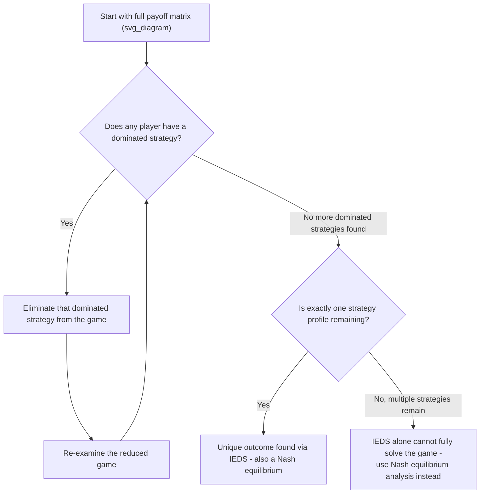

## Dominant Strategies and Iterated Elimination

### Overview

The concepts of **dominant strategies** and **iterated elimination of dominated strategies (IEDS)** provide the most intuitive and computationally simple tools for solving games, often allowing analysts to predict outcomes — or at least substantially narrow down the set of plausible outcomes — without needing the full machinery of Nash equilibrium analysis. These concepts rest on the basic idea that rational players will never choose a strategy that performs worse than an alternative, regardless of what other players do.

### Dominant Strategies

A **dominant strategy** is a strategy that yields a player a **higher (or at least equal) payoff than any other available strategy**, regardless of what strategies the other players choose.

**Strict dominance**: Strategy $s_i'$ **strictly dominates** strategy $s_i''$ for player $i$ if:

$$\pi_i(s_i', s_{-i}) > \pi_i(s_i'', s_{-i}) \quad \text{for every possible } s_{-i}$$

That is, $s_i'$ yields a strictly higher payoff than $s_i''$ for **every** possible combination of the other players' strategies $s_{-i}$.

**Weak dominance**: Strategy $s_i'$ **weakly dominates** strategy $s_i''$ if it yields a payoff at least as high for every $s_{-i}$, and strictly higher for at least one $s_{-i}$:

$$\pi_i(s_i', s_{-i}) \geq \pi_i(s_i'', s_{-i}) \quad \text{for every } s_{-i}, \text{ with strict inequality for at least one } s_{-i}$$

**Key Points:**

- If a player has a strategy that strictly dominates **every** other strategy in their strategy set, that strategy is called a **dominant strategy**, and a rational player will always choose it — no consideration of the opponent's likely behavior is even necessary.
- A **dominant strategy equilibrium** occurs when *every* player in the game has a dominant strategy; this is a very strong (and relatively rare) condition, but when it exists, it provides an unambiguous, highly robust prediction of the game's outcome.

### Example: Dominant Strategy in a Pricing Game

|  | Firm B: High Price | Firm B: Low Price |
| --- | --- | --- |
| **Firm A: High Price** | (50, 50) | (10, 60) |
| **Firm A: Low Price** | (60, 10) | (20, 20) |

**Checking Firm A's strategies:**

- If B plays High Price: A gets 60 (Low) vs. 50 (High) → Low Price is better.
- If B plays Low Price: A gets 20 (Low) vs. 10 (High) → Low Price is better.

Since "Low Price" yields a strictly higher payoff for Firm A regardless of Firm B's choice, **Low Price strictly dominates High Price for Firm A**. By symmetry, the same logic applies to Firm B. Both firms have "Low Price" as a dominant strategy, so **(Low Price, Low Price) is the dominant strategy equilibrium** — this is the classic **Prisoner's Dilemma** structure, where the dominant-strategy outcome (20, 20) is worse for both players than the mutually cooperative outcome (50, 50), which is unstable because each firm has an incentive to unilaterally deviate.

### Dominated Strategies

A strategy is **dominated** (strictly or weakly) if there exists some other strategy that always performs at least as well, and sometimes strictly better, regardless of what opponents do. A rational player will **never** choose a strictly dominated strategy, since some alternative is guaranteed to perform at least as well and sometimes better.

**Key distinction**: Not every game has a dominant strategy for every player, but many games contain strategies that are dominated *by some other specific strategy*, even without an outright single dominant strategy existing.

### Iterated Elimination of Dominated Strategies (IEDS)

**Iterated elimination of dominated strategies** is a systematic solution procedure that:

1. Identifies and removes any strategy that is dominated for any player.
2. Re-examines the reduced game (with the dominated strategy removed) to see if any *further* strategies become dominated once the eliminated strategy is no longer a consideration.
3. Repeats this process iteratively until no further strategies can be eliminated.

If this process narrows the game down to a **single remaining strategy profile**, that outcome is called the result of **iterated elimination of strictly dominated strategies**, and it is guaranteed to be a Nash equilibrium (indeed, in games solvable this way, it is typically the *unique* Nash equilibrium).

### Worked Example: Iterated Elimination in a 3x3 Game

Consider the following payoff matrix (Firm A's payoff, Firm B's payoff), where each firm chooses among three strategies:

|  | B: Left | B: Center | B: Right |
| --- | --- | --- | --- |
| **A: Top** | (4, 3) | (2, 2) | (1, 1) |
| **A: Middle** | (3, 1) | (5, 4) | (2, 3) |
| **A: Bottom** | (2, 2) | (3, 3) | (0, 0) |

**Step 1 — Check Firm A's strategies for dominance:**

Compare "Top" vs. "Middle" for Firm A:

- vs. Left: Top gives 4, Middle gives 3 → Top is better here.
- vs. Center: Top gives 2, Middle gives 5 → Middle is better here.

Neither strictly dominates the other yet. Now compare "Bottom" vs. "Middle":

- vs. Left: Bottom gives 2, Middle gives 3 → Middle is better.
- vs. Center: Bottom gives 3, Middle gives 5 → Middle is better.
- vs. Right: Bottom gives 0, Middle gives 2 → Middle is better.

**"Middle" strictly dominates "Bottom" for Firm A** in every column. Eliminate **Bottom**.

**Step 2 — Reduced game (Bottom removed):**

|  | B: Left | B: Center | B: Right |
| --- | --- | --- | --- |
| **A: Top** | (4, 3) | (2, 2) | (1, 1) |
| **A: Middle** | (3, 1) | (5, 4) | (2, 3) |

**Step 3 — Check Firm B's strategies in the reduced game:**

Compare "Right" vs. "Center" for Firm B:

- vs. Top: Right gives 1, Center gives 2 → Center is better.
- vs. Middle: Right gives 3, Center gives 4 → Center is better.

**"Center" strictly dominates "Right" for Firm B** in the reduced game. Eliminate **Right**.

**Step 4 — Further reduced game:**

|  | B: Left | B: Center |
| --- | --- | --- |
| **A: Top** | (4, 3) | (2, 2) |
| **A: Middle** | (3, 1) | (5, 4) |

**Step 5 — Re-check Firm A:**

Compare "Top" vs. "Middle":

- vs. Left: Top gives 4, Middle gives 3 → Top better.
- vs. Center: Top gives 2, Middle gives 5 → Middle better.

Still no dominance for A. **Check Firm B:**

Compare "Left" vs. "Center":

- vs. Top: Left gives 3, Center gives 2 → Left better.
- vs. Middle: Left gives 1, Center gives 4 → Center better.

Still no dominance for B either. The process **cannot be reduced further using strict dominance alone** — this reduced 2x2 game must instead be solved using standard **Nash equilibrium** best-response analysis (checking each of the four remaining cells: (Top, Left), (Top, Center), (Middle, Left), (Middle, Center)).

**Key Points:**

- This example illustrates an important limitation: IEDS does not always fully solve a game down to a unique outcome. In many games, it only **partially reduces** the strategy space, after which other tools (Nash equilibrium analysis) are needed to complete the solution.
- Games that **can** be fully solved via IEDS down to a single cell are called **dominance-solvable games**, and the resulting unique outcome coincides exactly with the unique Nash equilibrium of the game.

### Strict vs. Weak Dominance: An Important Caveat

**Iterated elimination of strictly dominated strategies (IESDS)** is a robust procedure — the order in which strictly dominated strategies are eliminated **does not affect the final outcome** (this is sometimes called "order independence").

**Iterated elimination of weakly dominated strategies (IEWDS)**, by contrast, is **order-dependent** — eliminating weakly dominated strategies in a different sequence can, in some games, lead to **different final outcomes**. This is an important technical caveat: analysts must be more careful when using weak dominance for iterated elimination, since the resulting "solution" may not be unique or well-defined without specifying an elimination order.

**[Inference]** Because of this order-dependence issue, most rigorous solution procedures in applied game theory rely on strict dominance for iterated elimination, reserving weak dominance arguments for more specialized contexts (e.g., certain auction-theoretic proofs) where the elimination order can be explicitly justified or where the result is shown to be order-independent for the specific game structure in question.

### Relationship to Nash Equilibrium

| Property | Dominant Strategy Equilibrium | Nash Equilibrium (general) |
| --- | --- | --- |
| Requires knowledge of opponent's strategy | No — optimal regardless of opponent's choice | Yes — optimal given opponent's specific equilibrium choice |
| Existence | Rare; not all games have one | Guaranteed to exist (Nash's theorem, possibly in mixed strategies) |
| Uniqueness | If it exists, it is essentially always unique | May have multiple equilibria |
| Relation | A dominant strategy equilibrium is always a Nash equilibrium | Not every Nash equilibrium involves dominant strategies |

**Key Points:**

- Dominant strategy analysis and iterated elimination are best understood as a **simplification tool** and a **special case** within the broader Nash equilibrium framework, not a competing or separate solution concept.
- When a dominant strategy equilibrium exists, it provides the strongest possible prediction, since it requires no assumptions about what a player *believes* the other will do — the strategy is optimal universally.

### Applications in Managerial Economics

- **Prisoner's Dilemma-structured pricing/output games**: Many oligopoly pricing games (as in the earlier example) resolve via dominant strategies, explaining why price wars or output expansion can occur even when firms would jointly prefer restraint.
- **Auction theory**: In a **second-price sealed-bid auction (Vickrey auction)**, bidding one's true valuation is a **weakly dominant strategy** — a widely cited application of dominance reasoning in mechanism design.
- **Simplifying complex games**: In games with many strategies, applying IEDS as a first step can substantially reduce the complexity of the analysis before resorting to full Nash equilibrium computation on the remaining reduced game.
- **Advertising and R&D "arms race" games**: Often modeled with dominant strategies to expand spending, even though mutual restraint would be more profitable — mirroring the Prisoner's Dilemma logic.

**Related Topics:**

- Nash equilibrium and best-response analysis
- The Prisoner's Dilemma
- Mixed-strategy equilibria
- Auction theory and the Vickrey (second-price) auction
- Rationalizability and iterated elimination in games without dominant strategies
- Cournot and Bertrand oligopoly as applications of dominance reasoning