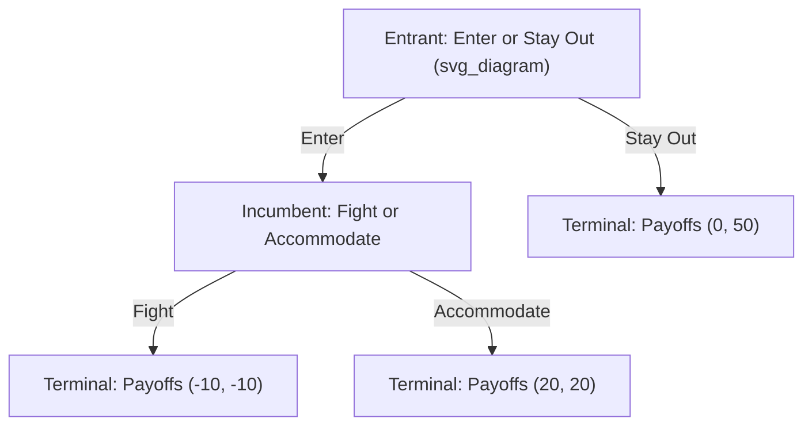
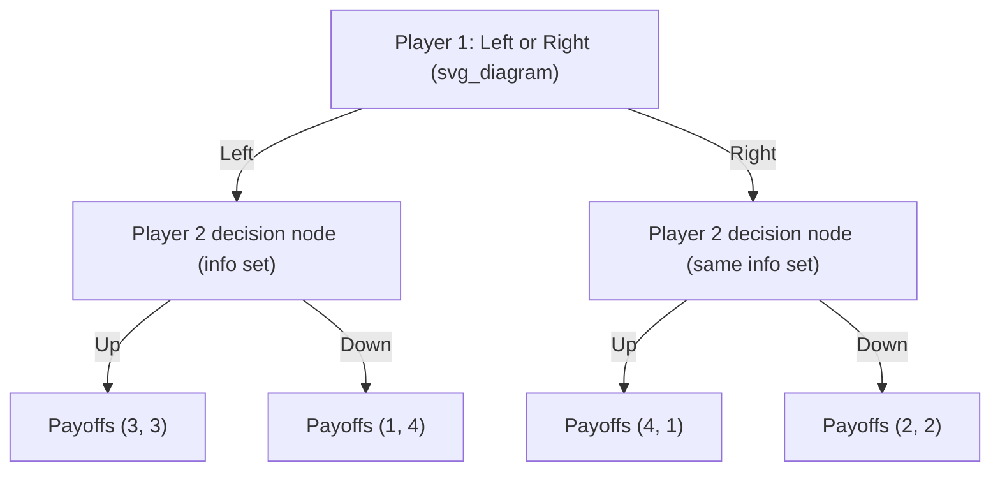
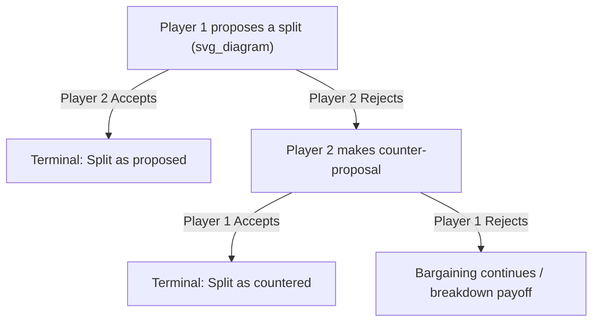

## Sequential-Move Games and Extensive Form Representation

### Overview

**Sequential-move games** are strategic interactions in which players make decisions in a specific order, with later-moving players able to observe (all or part of) the actions taken by earlier-moving players before making their own choice. This contrasts with simultaneous-move games, where all players choose without observing others' current decisions. The natural representation for sequential games is the **extensive form**, typically depicted as a **game tree**, which explicitly captures the timing, information, and payoff structure of the interaction.

Sequential games are central to managerial economics because many real strategic situations — market entry decisions, capacity investment, contract negotiation, and the Stackelberg leadership model — inherently involve a meaningful order of moves.

### Components of the Extensive Form

An extensive-form game representation consists of the following formal elements:

- **Nodes**: Points in the tree representing either a decision point (where a specific player must choose an action) or a terminal point (where the game ends and payoffs are realized).
- **Root node**: The single starting point of the game, representing the first decision to be made.
- **Branches (edges)**: Represent the specific actions available to the player at each decision node.
- **Decision nodes**: Assigned to a specific player, indicating whose turn it is to move at that point.
- **Terminal nodes**: The endpoints of the tree, each labeled with the resulting payoff vector for all players, given the complete sequence of moves leading to that point.
- **Information sets**: A collection of nodes that a player cannot distinguish between when making a decision — critical for representing situations with imperfect information about earlier moves (discussed further below).

### Basic Extensive Form Example: Market Entry Game

**Reading this tree:**

- The **root node** belongs to the Entrant, who chooses between "Enter" and "Stay Out."
- If the Entrant chooses "Stay Out," the game ends immediately at a terminal node with payoffs $(0, 50)$ — the Entrant earns nothing, the Incumbent retains its monopoly profit.
- If the Entrant chooses "Enter," play moves to a decision node belonging to the Incumbent, who then chooses between "Fight" (e.g., initiating a price war) and "Accommodate" (sharing the market peacefully).
- Each of the Incumbent's choices leads to a distinct terminal node with its own payoff vector.

### Solving Extensive-Form Games: Backward Induction

The standard solution method for finite extensive-form games with perfect information is **backward induction** — working backward from the terminal nodes toward the root, determining the optimal action at each decision node given what is known will happen afterward.

**Applying backward induction to the entry game above:**

**Step 1 — Solve the Incumbent's decision node** (the last decision in the tree): Comparing Fight ($-10$) vs. Accommodate ($20$) for the Incumbent, **Accommodate is optimal** (since $20 > -10$).

**Step 2 — Fold back to the Entrant's decision**: Knowing the Incumbent will rationally choose "Accommodate" if entry occurs, the Entrant compares:

- Enter → leads to Accommodate → payoff $20$
- Stay Out → payoff $0$

Since $20 > 0$, the Entrant's optimal choice is **Enter**.

**Resulting equilibrium path**: (Enter, Accommodate), with payoffs $(20, 20)$.

**Key Points:**

- Backward induction guarantees a solution concept known as **Subgame Perfect Nash Equilibrium (SPNE)** — an equilibrium that remains a Nash equilibrium in *every* subgame of the original game, not just along the actual path of play.
- This distinguishes SPNE from ordinary Nash equilibrium: a strategy profile could be a Nash equilibrium of the overall game while relying on a **non-credible threat** at some node that would never actually be reached, or that the player would not actually want to carry out if reached.

### Non-Credible Threats and the Value of SPNE

Consider a variation where the Incumbent could threaten, prior to the Entrant's decision, "If you enter, I will Fight." If the Entrant believed this threat, it would rationally choose "Stay Out," and the Incumbent would retain the higher payoff of $50$ rather than $20$.

However, this threat is **not credible**: if the Entrant actually entered, the Incumbent's payoff from Fight ($-10$) is worse than from Accommodate ($20$), so a rational Incumbent would never actually follow through on the threat once entry has occurred.

**Subgame perfection formally rules out such non-credible threats** by requiring optimality at *every* node, including nodes that are off the equilibrium path (i.e., nodes that would only be reached if an earlier player made an unexpected or "wrong" choice). This is a key advantage of the extensive-form/backward-induction approach over simply analyzing the normal-form payoff matrix, which cannot distinguish credible from non-credible strategies.

### Converting Between Extensive Form and Normal Form

Any extensive-form game can, in principle, be converted into an equivalent normal-form (matrix) representation by listing each player's complete **strategies** (full contingency plans, not just single actions) as the matrix's rows and columns.

**Normal form of the entry game:**

Since the Incumbent's strategy must specify an action for every node it might reach, and here it only has one decision node (reached only if Entrant chooses Enter), the Incumbent's strategy set is simply {Fight, Accommodate}.

|  | Incumbent: Fight | Incumbent: Accommodate |
| --- | --- | --- |
| **Entrant: Enter** | (-10, -10) | (20, 20) |
| **Entrant: Stay Out** | (0, 50) | (0, 50) |

**Important observation**: This normal form has **two Nash equilibria** — (Enter, Accommodate) with payoffs $(20,20)$, **and** (Stay Out, Fight) with payoffs $(0, 50)$. The second "equilibrium" relies on the Incumbent's non-credible threat to fight, which the Entrant "believes" only in the sense that neither player has an incentive to deviate *given* the other's strategy — but it is **not subgame perfect**, since it requires the Incumbent to commit to an action (Fight) that would not actually be rational if the corresponding node were reached.

**Key Points:**

- This example demonstrates precisely why **SPNE is a refinement of Nash equilibrium** — it eliminates equilibria that survive only because they rely on incredible off-path threats, which the extensive form (and backward induction) can detect but the bare normal form cannot.
- Every subgame perfect Nash equilibrium is a Nash equilibrium, but not every Nash equilibrium is subgame perfect.

### Perfect vs. Imperfect Information in Extensive-Form Games

- **Perfect information**: Every player, at every decision node, knows the complete history of all moves made previously in the game (as in the market entry example above, where the Incumbent observes the Entrant's choice before acting). Every information set contains exactly one node.
- **Imperfect information**: At least one player, at some decision node, cannot fully distinguish between two or more possible histories that could have led to that point — represented by an **information set** containing multiple nodes, typically drawn as a dashed line or oval connecting the indistinguishable nodes.

**Illustrating imperfect information**: A simultaneous-move game can actually be represented in extensive form by having the second mover's decision nodes grouped into a single information set, reflecting that the second mover cannot observe which specific action the first mover took before choosing their own action — this shows that extensive form is a fully general representation capable of encoding simultaneous games as well as sequential ones.

In this representation, if nodes B and C belong to the **same information set** for Player 2 (i.e., Player 2 cannot tell whether Player 1 chose Left or Right when making their own decision), the game is effectively simultaneous despite being drawn with Player 1 "moving first" in the tree structure — this is a technical device for representing simultaneity within the extensive-form framework.

### Multi-Stage Games and Repeated Backward Induction

Extensive-form analysis extends naturally to games with **more than two sequential moves**, requiring repeated application of backward induction at each successive node, working from the final stage back to the first.

**Example: Sequential bargaining (simplified Rubinstein-style alternating offers)**

**[Inference]** In multi-round bargaining models of this type, backward induction from a final deadline (or from an assumed continuation value under infinite-horizon discounting, as in the full Rubinstein bargaining model) determines each player's optimal offer at every stage, and the resulting equilibrium split typically depends critically on each player's discount factor (patience) and the cost of delay — more patient players tend to secure a larger share of the surplus.

### Applications in Managerial Economics

| Application | Sequential Structure |
| --- | --- |
| Stackelberg leadership model | Leader firm commits to output/price first; follower observes and responds |
| Market entry deterrence | Incumbent may commit to capacity/pricing before potential entrant decides |
| Sequential bargaining/negotiation | Alternating offers between buyer and seller over multiple rounds |
| Capital investment timing | Firm decides on irreversible investment; rivals observe and respond |
| Licensing and franchise agreements | Franchisor sets terms; franchisee decides whether to accept |

### Advantages and Limitations of the Extensive Form

**Advantages:**

- Explicitly captures the **timing** and **information structure** of strategic interactions, which the normal form obscures.
- Enables identification and elimination of **non-credible threats** via subgame perfection — a capability the normal form alone lacks.
- Naturally accommodates games with more than two sequential stages, as well as mixed perfect/imperfect information structures.

**Limitations:**

- Extensive-form trees can become extremely large and complex for games with many stages, players, or possible actions at each node, limiting practical tractability for very rich strategic settings.
- Backward induction assumes players correctly anticipate optimal future play by all parties at every node — a strong rationality and common-knowledge assumption that some experimental game theory research suggests may not always hold precisely in real human decision-making.
- **[Inference]** In games with a very large or infinite number of stages, backward induction from a definite "final" node may not be straightforward or well-defined, requiring alternative solution techniques (e.g., stationary strategies in infinite-horizon repeated games).

**Related Topics:**

- Subgame Perfect Nash Equilibrium
- The Stackelberg leadership model
- Backward induction in bargaining games (Rubinstein model)
- Credible commitment and entry deterrence
- Normal form vs. extensive form representations
- Repeated games and the Folk Theorem
- Information sets and games of imperfect information