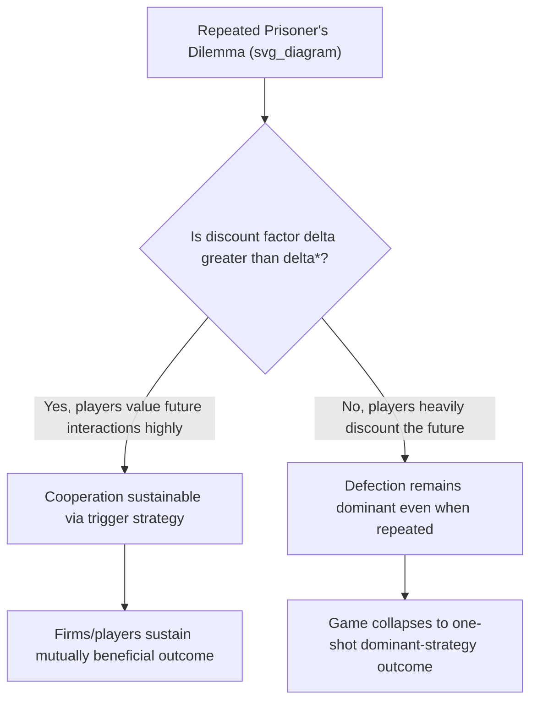

## The Prisoner's Dilemma and Cooperative Outcomes

### Overview

The **Prisoner's Dilemma** is the single most famous and pedagogically important game in all of game theory. It illustrates a profound and counterintuitive result: **individually rational behavior by each player can lead to a collectively worse outcome for everyone**, even though a mutually beneficial alternative outcome is available and known to all players. Originally formalized by Merrill Flood and Melvin Dresher in 1950 (with the "prisoner" narrative framing later added by Albert W. Tucker), the game has become the canonical model for analyzing cooperation, cheating, and the challenges of sustaining mutually beneficial agreements in economics, business, and beyond.

### The Classic Narrative

Two suspects are arrested and interrogated separately, unable to communicate with each other. Each is offered the same deal:

- If **both stay silent** (cooperate with each other), each serves a **short sentence** (e.g., 1 year) due to insufficient evidence for the major charge.
- If **one confesses (defects) and the other stays silent**, the confessor goes **free** while the silent one receives a **harsh sentence** (e.g., 10 years).
- If **both confess (defect)**, both receive a **moderately harsh sentence** (e.g., 5 years).

### Formal Payoff Structure

|  | Suspect B: Stay Silent | Suspect B: Confess |
| --- | --- | --- |
| **Suspect A: Stay Silent** | (-1, -1) | (-10, 0) |
| **Suspect A: Confess** | (0, -10) | (-5, -5) |

(Payoffs represent years in prison, so higher/less-negative numbers are preferred.)

**Analysis using dominant strategy logic:**

**Suspect A's perspective:**

- If B Stays Silent: A gets $0$ (Confess) vs. $-1$ (Silent) → Confess is better.
- If B Confesses: A gets $-5$ (Confess) vs. $-10$ (Silent) → Confess is better.

**Confess strictly dominates Stay Silent for Suspect A**, regardless of B's choice. By symmetry, the same logic applies to Suspect B. Both suspects have "Confess" as a **dominant strategy**, so **(Confess, Confess)** is the unique dominant-strategy (and Nash) equilibrium, yielding $(-5, -5)$.

**Key Points:**

- Both suspects would be strictly better off at (Stay Silent, Stay Silent), earning $(-1, -1)$ — but this outcome is **not** a Nash equilibrium, since each player has a unilateral incentive to deviate to "Confess" given the other stays silent.
- This is the defining feature of the Prisoner's Dilemma: **the socially/mutually optimal outcome is unstable**, because it is not a best response for either player, while the "worse for everyone" outcome is the stable equilibrium.

### Generalized Structure of a Prisoner's Dilemma

Any game qualifies structurally as a Prisoner's Dilemma if the payoffs satisfy the following ranking for both players (using generic labels: $T$ = Temptation to defect, $R$ = Reward for mutual cooperation, $P$ = Punishment for mutual defection, $S$ = Sucker's payoff):

$$T > R > P > S$$

with the additional condition (for repeated-game analysis) that:

$$2R > T + S$$

This second condition ensures that alternating between exploiting and being exploited is not more attractive than sustained mutual cooperation — it guarantees mutual cooperation is the socially efficient outcome, not merely "better than mutual defection."

### Business Applications: Oligopoly Pricing as a Prisoner's Dilemma

**Example: Duopoly pricing game**

|  | Firm B: High Price | Firm B: Low Price |
| --- | --- | --- |
| **Firm A: High Price** | (50, 50) | (10, 60) |
| **Firm A: Low Price** | (60, 10) | (20, 20) |

This matches the $T > R > P > S$ structure exactly: $T = 60$ (temptation to undercut), $R = 50$ (mutual high-price reward), $P = 20$ (mutual price-war punishment), $S = 10$ (sucker's payoff for staying high while rival undercuts). Both firms have "Low Price" as a dominant strategy, leading to the mutually inferior (Low, Low) outcome — this is the formal underpinning of why **tacit or explicit collusion is difficult to sustain** without additional mechanisms, and why price wars can emerge even when both firms would prefer stable, higher pricing.

**Other common business examples with this structure:**

- **Advertising wars**: Both firms would prefer moderate advertising spend, but each has an incentive to outspend the rival, leading to excessive advertising expenditure industry-wide.
- **R&D and patent races**: Firms may over-invest in duplicate R&D efforts to avoid being the "sucker" who under-invests while a rival innovates first.
- **Common resource extraction (tragedy of the commons)**: Each fisher/firm has an incentive to over-extract a shared resource, even though collective restraint would maximize long-run joint benefit.
- **International trade policy**: Countries may impose tariffs defensively even when mutual free trade would benefit both, fearing unilateral disadvantage if the other imposes tariffs first.

### Why Cooperation Fails in the One-Shot Game

**Key Points:**

- In a **single, one-shot interaction**, there is no mechanism to enforce or reward cooperation — each player's dominant strategy is determined purely by the immediate payoff comparison, with no consideration of future consequences (since there are none).
- The dilemma is not a failure of rationality — both players are behaving perfectly rationally given the incentive structure; the "failure" is a structural property of the game itself, not an error in reasoning.
- This result has been extensively used to challenge naive assumptions that "the invisible hand" or independent self-interested behavior always leads to socially optimal outcomes — the Prisoner's Dilemma is a canonical counterexample.

### Escaping the Dilemma: Repeated Games and Cooperation

When the same players interact **repeatedly** over time (rather than in a single one-shot encounter), cooperation can become sustainable as a **subgame perfect Nash equilibrium**, because players can use strategies that reward past cooperation and punish past defection.

**Trigger strategies**: A player cooperates as long as the rival has always cooperated in the past, but switches to permanent (or temporary) defection following any observed defection by the rival ("grim trigger").

**Tit-for-tat**: A player cooperates in the first round, then simply replicates whatever the rival did in the *previous* round. This strategy famously performed very well in Robert Axelrod's computer tournaments (1980s) testing repeated Prisoner's Dilemma strategies, due to its combination of being **cooperative, retaliatory, forgiving, and clear**.

**The Folk Theorem** formalizes the condition under which cooperation is sustainable: if players are sufficiently patient (high **discount factor** $\delta$, meaning they value future payoffs highly relative to a one-time gain today), the threat of future punishment can outweigh the short-term temptation to defect.

**Sustainability condition** (using a grim trigger strategy in an infinitely repeated game): Cooperation is sustainable if the discounted value of continued mutual cooperation exceeds the one-time gain from defecting followed by permanent punishment:

$$\frac{R}{1-\delta} \geq T + \frac{\delta P}{1-\delta}$$

Solving for the **critical discount factor** $\delta^*$:

$$\delta^* = \frac{T - R}{T - P}$$

If the actual discount factor $\delta > \delta^*$, cooperation can be sustained as an equilibrium; if $\delta < \delta^*$, defection remains the rational choice even in the repeated setting.

**Numerical example** using the pricing game values ($T=60, R=50, P=20$):

$$\delta^* = \frac{60 - 50}{60 - 20} = \frac{10}{40} = 0.25$$

If firms discount future profits at a rate implying $\delta > 0.25$ (i.e., they place at least moderate weight on future interactions), tacit collusion (mutual high pricing) can be sustained as a subgame perfect equilibrium via trigger strategies.

### Other Mechanisms for Escaping the Dilemma

- **Binding contracts / legal enforcement**: If an external enforcement mechanism (courts, contracts) can penalize defection, players can credibly commit to cooperation — though this is generally illegal for firms attempting to enforce price-fixing agreements.
- **Communication and reputation**: Even without formal enforcement, repeated interaction combined with reputational concerns (fear of losing future business relationships or industry standing) can support cooperative behavior.
- **Reducing the number of players**: Cooperation is generally easier to sustain and monitor with fewer players (as in a duopoly) than with many players (where individual defection is harder to detect and punish).
- **Increasing the frequency of interaction**: More frequent interactions shorten the time before defection can be detected and punished, increasing the effective cost of defecting.

### Finitely Repeated Games: The Unraveling Problem

**[Inference]** An important theoretical caveat is the **finite-horizon unraveling problem**: if the Prisoner's Dilemma is repeated a **known, finite** number of times, backward induction implies that both players will defect in the *final* round (since there is no future to protect via cooperation in that last period). Anticipating this, both players will also defect in the second-to-last round (since cooperation there cannot be "rewarded" with cooperation in the final round), and this logic unravels all the way back to the very first round — implying that, in a finite game with a known endpoint and full backward-induction rationality, defection should occur in **every** round, including the first. This result is often considered a puzzling and somewhat unrealistic prediction, since real-world repeated interactions with known endpoints (e.g., contracts with a fixed expiration date) do not always exhibit complete unraveling in practice — a discrepancy that has motivated research into bounded rationality and reputation-based explanations for observed cooperation in finite settings.

### Comparison: One-Shot vs. Repeated Prisoner's Dilemma

| Feature | One-Shot Game | Infinitely (or indefinitely) Repeated Game | Finitely Repeated Game (known endpoint) |
| --- | --- | --- | --- |
| Equilibrium outcome | Mutual defection (dominant strategy) | Cooperation possible if $\delta > \delta^*$ | Mutual defection in every round (via backward-induction unraveling) |
| Mechanism for cooperation | None available | Trigger strategies, tit-for-tat, reputation | Generally unavailable due to unraveling |
| Real-world relevance | Single, anonymous transactions | Ongoing business relationships, repeated market interactions | Contracts/relationships with a known, fixed termination date |

### Key Takeaways for Managerial Economics

**Key Points:**

- The Prisoner's Dilemma explains why oligopolistic firms often struggle to sustain tacit collusion without repeated interaction, reputational stakes, or (illegally) formal agreements.
- It underscores why **antitrust policy** treats industries prone to this dynamic with particular scrutiny — regulators recognize that firms have a natural, non-collusive incentive to defect from high-price equilibria, meaning sustained high pricing across an industry may sometimes indicate active coordination rather than pure market power.
- The shift from one-shot to repeated-game framing is one of the most important tools for understanding **when** real-world cooperation (tacit collusion, joint ventures, long-term supplier relationships) is likely to be sustainable versus fragile.

**Related Topics:**

- Repeated games and the Folk Theorem
- Trigger strategies and tit-for-tat
- Cartels, collusion, and price leadership
- Subgame Perfect Nash Equilibrium and backward induction
- Nash equilibrium and dominant strategies
- Tragedy of the commons and public goods games
- Reputation effects in repeated interactions