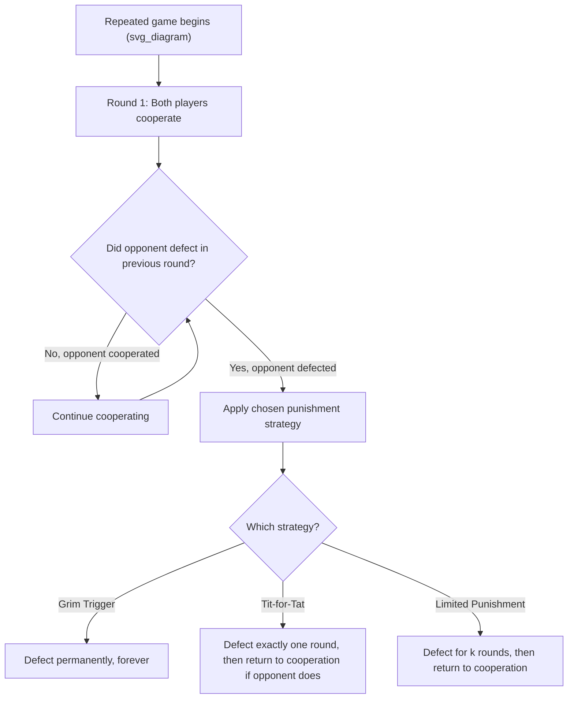

## Repeated Games and Sustaining Cooperation

### Overview

**Repeated games** are strategic interactions in which the same stage game (such as the Prisoner's Dilemma) is played multiple times between the same players, who can observe the outcomes of previous rounds before choosing their actions in subsequent rounds. This repetition fundamentally changes the strategic landscape: actions taken today can be **rewarded or punished** in future rounds, opening the door to sustained cooperation in situations where a single, one-shot interaction would result in mutual defection.

Repeated games are essential to understanding real-world business relationships — ongoing supplier contracts, tacit industry collusion, and long-term partnerships — where the "shadow of the future" disciplines behavior in ways a one-shot analysis cannot capture.

### Finite vs. Infinite (Indefinite) Repetition

**Finitely repeated games**: The stage game is played a known, fixed number of times $T$. As established in Prisoner's Dilemma analysis, backward induction from the known final round typically causes cooperation to **unravel completely** — if both players know the interaction will end at round $T$, mutual defection becomes optimal in that final round, which in turn undermines the incentive to cooperate in every earlier round as well.

**Infinitely (or indefinitely) repeated games**: The game is either played literally forever, or — more realistically and more commonly modeled — played for an **uncertain** number of rounds, where after each round there is some probability $\rho$ that the game continues to another round. This formulation avoids the unraveling problem, because there is no known "last round" from which backward induction can begin.

**Key Points:**

- The probability of continuation $\rho$ functions mathematically similarly to the **discount factor** $\delta$: both represent how much weight a player places on future payoffs relative to the present.
- Indefinite repetition (rather than literal infinite repetition) is the more realistic and widely used framework in applied economics, since it captures the intuition that business relationships have an uncertain, rather than a fixed and publicly known, end date.

### The Discount Factor and Present Value of Future Payoffs

Players in a repeated game evaluate strategies based on the **discounted sum of payoffs** across all future rounds, not merely the payoff in the current round.

$$V = \pi_0 + \delta \pi_1 + \delta^2 \pi_2 + \delta^3 \pi_3 + \cdots = \sum_{t=0}^{\infty} \delta^t \pi_t$$

where $\delta \in (0,1)$ is the discount factor, reflecting both time preference (how much a player values a dollar today versus a dollar tomorrow) and, in indefinite-horizon models, the probability that the relationship continues into the next round.

For a **constant** stream of payoffs $\pi$ repeated every period, the present value simplifies to:

$$V = \frac{\pi}{1 - \delta}$$

**Key Points:**

- A higher $\delta$ (more patient players, or a higher probability of continued interaction) makes future punishment threats more costly to the player being punished, and therefore makes cooperation easier to sustain.
- $\delta$ can be interpreted as incorporating both a standard financial discount rate and the probability that the business relationship persists (e.g., $\delta = \frac{1}{1+r} \times \rho$, combining a financial discount rate $r$ with a continuation probability $\rho$).

### Strategies for Sustaining Cooperation

**1. Grim Trigger Strategy**: Cooperate as long as the opponent has cooperated in every previous round; if the opponent ever defects even once, switch to permanent defection for all remaining rounds.

- **Advantage**: The harshest possible punishment, providing the strongest deterrent against any single defection.
- **Disadvantage**: Highly unforgiving — a single mistake, misunderstanding, or even a noisy/imperfect observation of the opponent's action can trigger permanent breakdown of cooperation, even if the "defection" was accidental.

**2. Tit-for-Tat**: Cooperate in the first round; thereafter, replicate exactly whatever the opponent did in the immediately preceding round.

- **Advantage**: Combines cooperation, retaliation (punishes defection immediately), and forgiveness (returns to cooperation as soon as the opponent does) — a combination that performed remarkably well in Robert Axelrod's famous computer tournament experiments (early 1980s) testing repeated Prisoner's Dilemma strategies against a wide variety of competing algorithms.
- **Disadvantage**: Vulnerable to cycles of mutual retaliation if actions are observed with error or noise (e.g., an accidental defection can trigger a long alternating sequence of retaliation between two tit-for-tat players).

**3. Limited (Finite) Punishment Strategies**: Punish a defection for a fixed number of rounds (e.g., $k$ rounds of defection in response to one observed defection), then return to cooperation — offering a middle ground between the harshness of grim trigger and the potential fragility of tit-for-tat under noisy observation.

### The Folk Theorem

The **Folk Theorem** is the central theoretical result establishing the conditions under which cooperation (or indeed, a very wide range of other outcomes) can be sustained as a subgame perfect Nash equilibrium in an infinitely (or indefinitely) repeated game.

**Informal statement**: In an infinitely repeated game, **any outcome that gives each player at least their minmax payoff** (the worst payoff a player can be forced down to, even when the other players are actively trying to punish them) **can be sustained as a subgame perfect Nash equilibrium**, provided players are sufficiently patient (i.e., $\delta$ is close enough to 1).

**Key Points:**

- The Folk Theorem implies that repeated interaction dramatically **expands the set of possible equilibrium outcomes** relative to the single-shot game — including outcomes, like mutual cooperation, that are impossible to sustain as equilibria in the one-shot version.
- However, this also means the Folk Theorem provides relatively weak *predictive* power on its own: since a very large range of outcomes (including many undesirable ones) can technically be sustained as equilibria, additional criteria (focal points, efficiency, historical convention, communication) are often needed to predict which specific outcome will actually emerge in practice.

### Deriving the Critical Discount Factor Condition

Using the grim trigger strategy in a repeated Prisoner's Dilemma with payoffs $T$ (temptation to defect), $R$ (mutual cooperation reward), and $P$ (mutual defection punishment):

**Value of cooperating forever** (assuming the opponent also cooperates):

$$V_{cooperate} = R + \delta R + \delta^2 R + \cdots = \frac{R}{1-\delta}$$

**Value of defecting once** (capturing the one-time gain $T$, then facing permanent mutual defection thereafter as punishment):

$$V_{defect} = T + \delta P + \delta^2 P + \cdots = T + \frac{\delta P}{1-\delta}$$

**Cooperation is sustainable** (i.e., a player prefers not to deviate) if and only if:

$$\frac{R}{1-\delta} \geq T + \frac{\delta P}{1-\delta}$$

Solving algebraically for the **critical discount factor**:

$$R \geq T(1-\delta) + \delta P$$

$$R \geq T - T\delta + \delta P$$

$$T - R \leq \delta(T - P)$$

$$\delta \geq \frac{T - R}{T - P} \equiv \delta^*$$

If the actual discount factor exceeds $\delta^*$, the grim trigger strategy sustains cooperation as a subgame perfect Nash equilibrium.

### Numerical Example

Using the duopoly pricing payoffs from the Prisoner's Dilemma framework: $T = 60$ (temptation to undercut while rival holds high price), $R = 50$ (mutual high-price reward), $P = 20$ (mutual price-war punishment).

$$\delta^* = \frac{60 - 50}{60 - 20} = \frac{10}{40} = 0.25$$

This means that as long as each firm places at least a $25\%$ weight on future profits relative to the present (a relatively low bar, easily satisfied by firms expecting continued market interaction), **tacit collusion can be sustained** via a grim trigger strategy, even without any formal agreement.

**Sensitivity analysis**: Note that $\delta^*$ decreases (making cooperation easier to sustain) when:

- The temptation payoff $T$ decreases relative to $R$ (less to gain from defecting).
- The punishment payoff $P$ decreases (harsher available punishment makes defection more costly).

**Key Points:**

- This explains why industries with a smaller "temptation to cheat" gap, or a credible ability to impose harsh retaliation (e.g., a dominant firm capable of a severe price war), tend to sustain tacit collusion more easily.

### Factors Affecting Real-World Sustainability of Cooperation

| Factor | Effect on Sustainability of Cooperation |
| --- | --- |
| Frequency of interaction | More frequent transactions → shorter detection lag → easier to sustain cooperation |
| Number of players | Fewer players → easier monitoring and attribution of defection → easier to sustain |
| Observability of actions | Actions clearly observable (e.g., posted prices) → easier to detect defection → easier to sustain |
| Demand/cost volatility | Stable conditions → easier to distinguish defection from legitimate price adjustment → easier to sustain |
| Firm patience / discount factor | Higher $\delta$ (patient firms, stable long-term relationships) → easier to sustain |
| Symmetry among players | Similar firm sizes/costs → simpler to agree on and monitor a cooperative arrangement |

**[Inference]** In practice, distinguishing a legitimate independent price change from a "defection" signal can be genuinely difficult under demand or cost uncertainty, since firms may misinterpret a rival's price change (due to a cost shock, say) as cheating, potentially triggering unwarranted retaliation — this observational noise problem is a recognized limitation of applying idealized repeated-game models directly to real, imperfectly observed markets.

### Business and Economic Applications

- **Tacit industry collusion**: Repeated interaction among a small number of oligopolists allows firms to sustain higher-than-competitive pricing without formal agreements, using implicit trigger strategies (e.g., reverting to price wars if a rival is observed undercutting).
- **Long-term buyer-supplier relationships**: Repeated dealings encourage both parties to honor informal commitments (e.g., quality standards, delivery timing) even without formal enforceable contracts, since defection would jeopardize a valuable ongoing relationship.
- **Reputation and brand trust**: Firms invest in reputation precisely because repeated interactions with customers create incentives to avoid one-time exploitative behavior (e.g., selling low-quality goods) that would be profitable only in a single, non-repeated transaction.
- **International trade agreements**: Countries sustain mutually beneficial trade liberalization through repeated interaction and the credible threat of retaliatory tariffs if one party unilaterally defects from agreed terms.

### Limitations of the Repeated-Game Framework

- **Multiplicity of equilibria**: As implied by the Folk Theorem, a very large number of outcomes can be sustained as equilibria under sufficient patience, limiting the framework's ability to make a single sharp prediction without further refinement.
- **Assumes clear observability**: Many models assume players can perfectly observe past actions; real markets often involve noisy or delayed information about rivals' true actions, complicating the practical application of trigger strategies.
- **Requires common knowledge of the game's indefinite continuation**: If players believe the relationship has a known, finite endpoint, the unraveling problem re-emerges, undermining sustained cooperation.
- **Assumes rational, forward-looking players**: Behavioral or boundedly rational deviations from the idealized model (e.g., firms that do not fully calculate optimal discount-factor thresholds) are not captured in the baseline framework.

**Related Topics:**

- The Prisoner's Dilemma and cooperative outcomes
- The Folk Theorem (formal statement and proof sketch)
- Trigger strategies, tit-for-tat, and forgiveness mechanisms
- Cartels, collusion, and price leadership
- Reputation effects and signaling in repeated interactions
- Subgame Perfect Nash Equilibrium
- Finite-horizon unraveling and backward induction