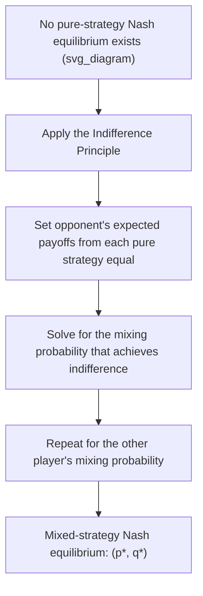

## Mixed Strategy Equilibria

### Overview

A **mixed strategy** is a probability distribution over a player's available pure strategies, rather than a single deterministic choice. **Mixed strategy Nash equilibria** arise in games where no pure-strategy Nash equilibrium exists — typically games involving conflicting interests where predictability itself is strategically costly, such that a player benefits from deliberately randomizing to prevent an opponent from exploiting a predictable pattern.

Mixed strategies are essential to game theory's completeness: **Nash's existence theorem** guarantees that every finite game has at least one Nash equilibrium, but this equilibrium may require randomization rather than a pure, deterministic choice.

### When Pure-Strategy Equilibria Fail to Exist

Consider a simple **matching pennies**-style game, common in contexts involving inspection, auditing, or competitive positioning:

|  | Player B: Strategy X | Player B: Strategy Y |
| --- | --- | --- |
| **Player A: Strategy X** | (1, -1) | (-1, 1) |
| **Player A: Strategy Y** | (-1, 1) | (1, -1) |

**Checking for pure-strategy Nash equilibria**: In every cell, at least one player has an incentive to deviate:

- (X, X): B prefers to switch to Y (gets $1$ instead of $-1$).
- (X, Y): A prefers to switch to Y (gets $1$ instead of $-1$).
- (Y, X): A prefers to switch to X (gets $1$ instead of $-1$).
- (Y, Y): B prefers to switch to X (gets $1$ instead of $-1$).

No cell is stable — this is a **zero-sum game with no pure-strategy Nash equilibrium**, meaning the only possible equilibrium must involve randomization.

### Deriving a Mixed-Strategy Equilibrium: The Indifference Principle

The central technique for finding a mixed-strategy Nash equilibrium is the **indifference principle**: a player will only be willing to randomize between two or more pure strategies if those strategies yield **exactly equal expected payoffs**, given the opponent's mixing probabilities. If one pure strategy yielded a strictly higher expected payoff, the player would simply play that strategy with certainty rather than randomizing.

**Applying this to the matching-game example**: Let Player B play Strategy X with probability $q$ and Strategy Y with probability $(1-q)$.

Player A's expected payoff from playing **Strategy X**:

$$E[\pi_A | X] = q(1) + (1-q)(-1) = 2q - 1$$

Player A's expected payoff from playing **Strategy Y**:

$$E[\pi_A | Y] = q(-1) + (1-q)(1) = 1 - 2q$$

For Player A to be willing to mix (indifferent between X and Y), these must be equal:

$$2q - 1 = 1 - 2q \implies 4q = 2 \implies q = 0.5$$

By the symmetric structure of this particular game, Player A must also mix with probability $0.5$ between Strategy X and Strategy Y for Player B to be indifferent. The **mixed-strategy Nash equilibrium** is $(0.5, 0.5)$ for both players, with each player's expected payoff equal to $0$.

**Key Points:**

- Notice the somewhat counterintuitive feature of mixed-strategy equilibria: **Player A's mixing probability is determined by Player B's payoffs (and vice versa)**, not by Player A's own payoffs. This is because the equilibrium condition is that the *opponent* must be indifferent — each player's randomization is calibrated precisely to prevent the opponent from being able to profitably exploit a predictable pattern.

### Worked Example: Business Application (Inspection Game)

**Scenario**: A firm's employee can choose to "Work Hard" or "Shirk"; a manager can choose to "Monitor" or "Not Monitor." Monitoring is costly for the manager but catches shirking.

|  | Employee: Work Hard | Employee: Shirk |
| --- | --- | --- |
| **Manager: Monitor** | (2, 3) | (2, -1) |
| **Manager: Not Monitor** | (3, 3) | (-1, 5) |

(Payoffs represent (Manager's payoff, Employee's payoff), reflecting productivity gains, monitoring costs, and shirking benefits.)

**Checking for pure-strategy equilibria:**

- If Manager Monitors: Employee prefers Work Hard ($3$) over Shirk ($-1$).
- If Manager Doesn't Monitor: Employee prefers Shirk ($5$) over Work Hard ($3$).
- If Employee Works Hard: Manager prefers Not Monitor ($3$) over Monitor ($2$).
- If Employee Shirks: Manager prefers Monitor ($2$) over Not Monitor ($-1$).

No pure-strategy equilibrium exists — each player's best response depends entirely on what the other is expected to do, and this cycles without settling.

**Step 1 — Find the Employee's mixing probability that makes the Manager indifferent.**

Let the Employee play "Work Hard" with probability $p$ and "Shirk" with probability $(1-p)$.

Manager's expected payoff from Monitoring:

$$E[\pi_{Manager}|\text{Monitor}] = p(2) + (1-p)(2) = 2$$

Manager's expected payoff from Not Monitoring:

$$E[\pi_{Manager}|\text{Not Monitor}] = p(3) + (1-p)(-1) = 4p - 1$$

Setting equal for indifference:

$$2 = 4p - 1 \implies 4p = 3 \implies p = 0.75$$

**Step 2 — Find the Manager's mixing probability that makes the Employee indifferent.**

Let the Manager play "Monitor" with probability $m$ and "Not Monitor" with probability $(1-m)$.

Employee's expected payoff from Working Hard:

$$E[\pi_{Employee}|\text{Work Hard}] = m(3) + (1-m)(3) = 3$$

Employee's expected payoff from Shirking:

$$E[\pi_{Employee}|\text{Shirk}] = m(-1) + (1-m)(5) = 5 - 6m$$

Setting equal for indifference:

$$3 = 5 - 6m \implies 6m = 2 \implies m = \frac{1}{3}$$

**Resulting mixed-strategy Nash equilibrium**: The Manager monitors with probability $\frac{1}{3}$ (and doesn't monitor with probability $\frac{2}{3}$); the Employee works hard with probability $0.75$ (and shirks with probability $0.25$).

**Key Points:**

- This equilibrium implies **some shirking still occurs in equilibrium** ($25\%$ of the time) — the mixed strategy does not eliminate shirking entirely, but rather settles at a level where the manager's monitoring cost/benefit calculation and the employee's work/shirk calculation are mutually consistent.
- This type of model — often called an **inspection game** or **auditing game** — is widely used to analyze compliance monitoring, tax auditing, quality control, and workplace incentive design.

### Interpreting Mixed Strategies: Three Perspectives

**Key Points:**

- **Literal randomization**: The player actually uses a random device (e.g., a weighted coin) to select their action each time the game is played, particularly relevant in genuinely repeated, anonymous, or adversarial contexts (e.g., security screening, sports penalty-kick strategy, tax audits).
- **Population/frequency interpretation**: In a large population of players repeatedly matched against different opponents, the mixed-strategy probabilities can represent the **fraction of the population** consistently playing each pure strategy, rather than any single individual literally randomizing.
- **Beliefs interpretation**: A player's mixed strategy can represent the **opponent's uncertainty or beliefs** about which pure strategy that player will choose, rather than the player's own literal randomization device — particularly relevant in games with incomplete information.

### Properties of Mixed-Strategy Equilibria

- **Expected payoff equality across all strategies played with positive probability**: In equilibrium, a player is indifferent among all pure strategies that receive positive probability in their mixed strategy — this is precisely why the indifference principle can be used to solve for the equilibrium probabilities.
- **Strategies never played (zero probability) may yield strictly lower expected payoffs** — a player is not necessarily indifferent to strategies outside the support of their equilibrium mixed strategy.
- **A game can have both pure-strategy and mixed-strategy Nash equilibria simultaneously** — for example, in a coordination game with two pure-strategy equilibria, there often also exists a third, less efficient mixed-strategy equilibrium in which both players randomize.

### Mixed Strategies in Zero-Sum Games and the Minimax Theorem

In **zero-sum games** (where one player's gain is exactly the other's loss), mixed-strategy equilibrium play corresponds to the classical **minimax solution** developed by John von Neumann, predating Nash's more general equilibrium concept.

$$\max_{\sigma_A} \min_{\sigma_B} E[\pi_A(\sigma_A, \sigma_B)] = \min_{\sigma_B} \max_{\sigma_A} E[\pi_A(\sigma_A, \sigma_B)]$$

This **minimax theorem** guarantees that in any finite two-player zero-sum game, there exists a value $v$ (the "value of the game") such that Player A can guarantee at least $v$ using an appropriate mixed strategy, and Player B can simultaneously guarantee that Player A gets no more than $v$ — meaning both players' optimal mixed strategies converge on the same equilibrium value from opposite directions.

**[Inference]** In the matching-pennies example above, the value of the game to Player A is $0$, reflecting the intuitively fair, symmetric nature of that particular zero-sum interaction; asymmetric zero-sum games would generally yield a nonzero value favoring one player.

### Applications in Managerial Economics

| Application | Context for Mixed Strategy Use |
| --- | --- |
| Auditing and compliance | Firms/regulators randomize inspection timing to deter consistent rule violation |
| Advertising/promotional timing | Firms randomize sale timing or promotional campaigns to prevent competitors from perfectly anticipating and undercutting |
| Sports and competitive strategy | Randomizing tactics (e.g., penalty kick direction) to avoid predictability that opponents could exploit |
| Security and fraud detection | Randomized screening or auditing schedules to prevent adversaries from learning and exploiting a fixed pattern |
| Bidding strategy in procurement | Randomizing bid levels in repeated procurement auctions to avoid predictable underbidding by rivals |

### Limitations and Critiques of Mixed-Strategy Equilibrium

- **Behavioral plausibility**: Critics note that real decision-makers may not literally randomize according to precisely calculated equilibrium probabilities; the population/frequency interpretation is often considered more behaviorally realistic than the literal-randomization interpretation for many applications.
- **Equilibrium selection with multiple equilibria**: When a game has both pure- and mixed-strategy equilibria, standard Nash equilibrium theory does not, by itself, predict which one will actually emerge.
- **Sensitivity to payoff precision**: Mixed-strategy equilibrium probabilities can be highly sensitive to the exact numerical payoff values used in the model; small changes in assumed payoffs can shift the calculated mixing probabilities substantially, which may limit precise real-world predictive accuracy without carefully estimated payoff parameters.
- **[Inference]** Experimental economics research has found that human subjects often deviate systematically from theoretically predicted mixed-strategy probabilities in laboratory games, motivating alternative behavioral models (e.g., quantal response equilibrium) that incorporate systematic deviations from perfect rationality — though the extent and consistency of such deviations vary across experimental contexts and are subject to ongoing empirical research.

**Related Topics:**

- Nash equilibrium and best-response analysis
- Zero-sum games and the minimax theorem
- The Prisoner's Dilemma (compared with mixed-strategy games)
- Inspection and auditing games
- Bayesian games and incomplete information
- Quantal response equilibrium and behavioral game theory
- Simultaneous-move games and Nash equilibrium