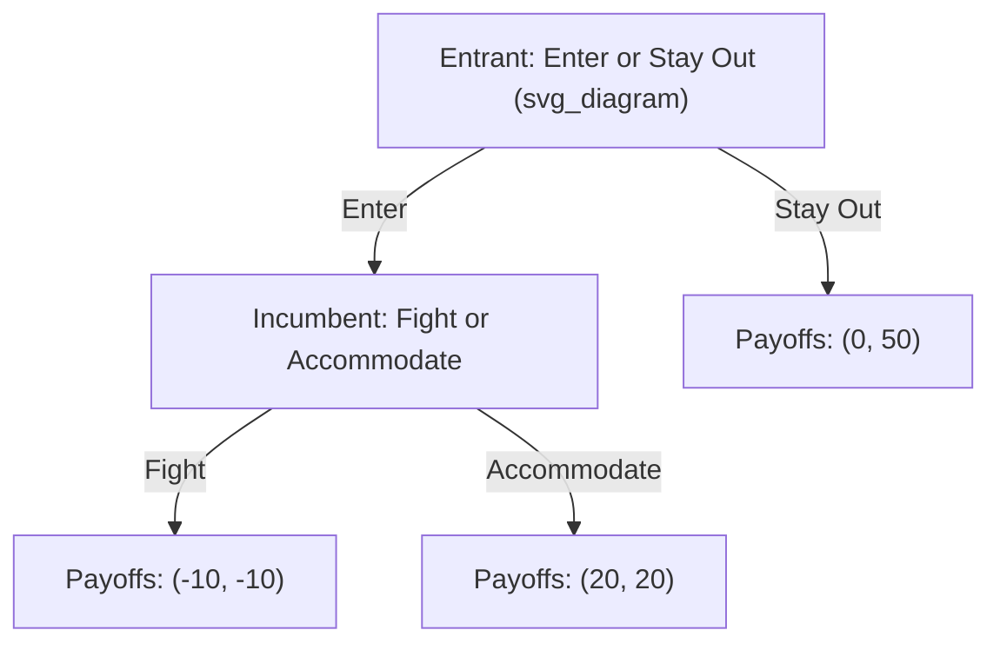
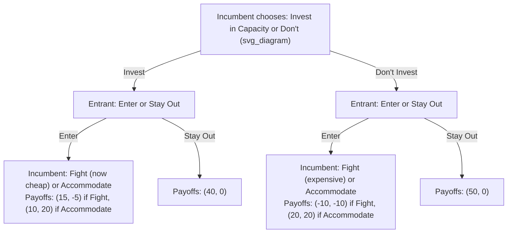
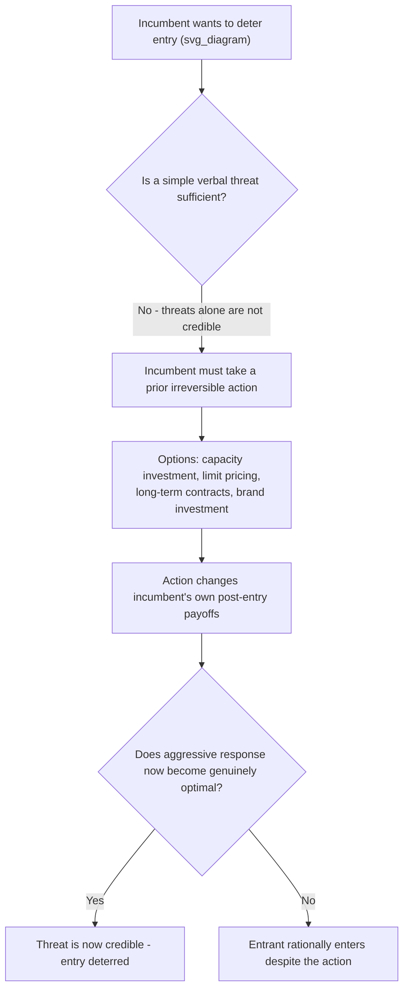

## Entry Deterrence, Limit Pricing, and Credible Commitment

### Overview

**Entry deterrence** refers to strategic actions taken by an incumbent firm to discourage potential competitors from entering its market. Because actual entry would reduce the incumbent's market share and profits, incumbents have a strong incentive to make entry unattractive — but doing so effectively requires more than simply *wanting* to deter entry; it requires making a **credible commitment** to a course of action that would genuinely hurt a potential entrant. This topic connects extensive-form game theory, backward induction, and industrial organization to explain why some deterrence threats work while others are dismissed by rational entrants as empty bluffs.

### The Central Problem: Credibility

A potential entrant will only be deterred by a threat if that threat is **credible** — that is, if the incumbent would actually find it in its own interest to carry out the threatened action *after* entry has occurred, not merely before.

**Key Points:**

- A threat that is not credible (i.e., one the incumbent would not actually want to execute if entry occurred) is called a **non-credible threat**, and rational entrants, using backward induction, will correctly anticipate that the incumbent will not follow through, and will enter anyway.
- The central strategic challenge for an incumbent seeking to deter entry is therefore not merely to *threaten* aggressive retaliation, but to take some **prior action that changes the incumbent's own payoffs**, such that aggressive retaliation becomes the incumbent's genuinely optimal response if entry occurs.

### Illustrating Non-Credible vs. Credible Threats with a Game Tree

Using backward induction: if entry occurs, the Incumbent compares Fight ($-10$) versus Accommodate ($20$) and rationally chooses Accommodate. Anticipating this, the Entrant rationally chooses to Enter, since $20 > 0$. **A pre-entry threat of "I will Fight if you enter" is non-credible** here, because the Incumbent's payoffs at the Fight/Accommodate node have not been altered by anything — Accommodate remains strictly better for the Incumbent regardless of what was threatened beforehand.

### Making the Threat Credible: Strategic Commitment Devices

For an incumbent to make a fight threat credible, it must take an **irreversible, observable prior action** that changes its own payoff structure such that fighting genuinely becomes optimal if entry occurs. Common commitment devices include:

**1. Capacity investment (excess capacity)**: By investing in production capacity beyond what is needed for its current (pre-entry) output, the incumbent lowers its own marginal cost of expanding output in response to entry, making an aggressive output/price response cheaper and more credible.

**2. Long-term contracts with customers**: Locking in customers via long-term supply agreements reduces the residual market available to an entrant, and can also commit the incumbent to particular pricing terms that discourage entry.

**3. Sunk investments in brand loyalty/advertising**: Heavy, hard-to-reverse investment in brand loyalty raises the cost an entrant faces to win customers away, without requiring any additional action from the incumbent post-entry.

**4. Learning-curve/cost advantages**: An incumbent that has already moved down the learning curve (lower unit costs due to accumulated production experience) can credibly threaten low post-entry pricing, since it remains profitable for the incumbent even at prices that would be unprofitable for a new entrant with higher unit costs.

**5. Most-favored-customer clauses / meet-the-competition clauses**: Contractual commitments to match any competitor's lower price can, somewhat counterintuitively, deter entry by guaranteeing that any entrant's price-cutting will immediately be matched, eliminating the entrant's potential gain from undercutting.

### Modeling Capacity Investment as a Commitment Device

**Setup**: Suppose the Incumbent can choose, *before* the Entrant's decision, whether to install additional production capacity $K$ at a sunk cost. This capacity investment changes the Incumbent's marginal cost of production, altering the payoffs in the post-entry subgame.

**Analysis**: In the "Invest" branch, the capacity investment has lowered the Incumbent's cost of fighting enough that **Fight ($15$) now exceeds Accommodate ($10$)** for the Incumbent if entry occurs — the threat to fight has become credible. A rational Entrant, anticipating this, would compare Enter (leading to Fight, payoff $-5$) versus Stay Out (payoff $0$), and choose **Stay Out**.

In the "Don't Invest" branch, Accommodate ($20$) still exceeds Fight ($-10$) for the Incumbent, so entry is *not* deterred (as in the earlier example), and the Entrant rationally enters.

**Key Points:**

- The Incumbent's decision of whether to invest in capacity trades off the **cost of the investment** itself against the **benefit of deterred entry** (retaining the higher payoff from a monopoly market rather than sharing it with an entrant).
- This demonstrates the general principle: **credibility is achieved by changing one's own future incentives through an irreversible prior action**, not merely by verbal threats.

### Limit Pricing

**Limit pricing** is a specific entry-deterrence strategy in which an incumbent sets its **pre-entry price below the short-run profit-maximizing monopoly price**, deliberately sacrificing some current profit in order to make the market appear less attractive to a potential entrant.

**Mechanism**: A potential entrant typically must estimate the profitability of entering based on the **current** market price and the incumbent's observed behavior. By pricing lower than the unconstrained monopoly price, the incumbent signals (accurately or not) that:

- Market demand is smaller or less favorable than an entrant might otherwise assume.
- The incumbent has a cost advantage or a substantial cost base already covered, allowing it to sustain a lower price indefinitely.
- Post-entry price competition would drive the market price down to a level insufficient to cover the entrant's own costs.

**Limit price formula** (a simplified illustrative condition): The incumbent sets a **limit price** $P_L$ such that, at $P_L$, the residual demand available to a potential entrant (market demand minus the incumbent's committed output) would yield the entrant **zero or negative economic profit**, discouraging entry:

$$P_L = \text{price at which entrant's expected post-entry profit} \leq 0$$

**Key Points:**

- Limit pricing involves an explicit **trade-off between current profit and future protection from competition**: the incumbent forgoes some short-run monopoly profit in exchange for continued market dominance (and higher long-run cumulative profit) by preventing entry altogether.
- The **Bain-Sylos postulate** (an early formalization by Joe Bain and Franco Modigliani, building on Paolo Sylos-Labini's work) assumes the entrant believes the incumbent will maintain its pre-entry output level even after entry — this assumption, if credible, allows a simple derivation of the limit output and limit price via residual demand analysis.

### The Bain-Sylos Model of Limit Output

**Setup**: Market demand is $P = a - bQ$. The incumbent currently produces $q_I$. A potential entrant, believing the incumbent will maintain this output level $q_I$ regardless of entry, evaluates the **residual demand** available to it:

$$P = a - b(q_I + q_E)$$

The entrant will only enter if it can earn non-negative profit given this residual demand and its own cost structure. The incumbent can choose $q_I$ large enough that the resulting residual demand curve leaves **no profitable entry point** for the entrant — this is the **limit output** $q_L$, and the corresponding price is the **limit price** $P_L$.

**Numerical example**: Suppose market demand is $P = 100 - Q$, and a potential entrant has fixed entry cost $F = 200$ and constant marginal cost $c = 20$.

If the incumbent commits to output $q_I$, the entrant's maximum possible profit (assuming the entrant would optimally choose its own output given the residual demand) can be calculated, and the incumbent chooses the smallest $q_I$ that reduces this maximum entrant profit to zero (accounting for the fixed entry cost $F$) — this $q_I$ is the limit output, and $P_L = 100 - q_I$ is the resulting limit price. **[Inference]** The exact numerical limit output depends on the specific functional form of the entrant's cost structure and the assumed post-entry conduct (e.g., Cournot behavior after entry), making the precise limit price sensitive to model specification choices beyond this simplified illustration.

### Criticisms of the Bain-Sylos Postulate

**Key Points:**

- The assumption that the entrant naively believes the incumbent will hold output constant post-entry, regardless of the entrant's own decision, has been criticized as **behaviorally unrealistic** — a fully rational entrant, using backward induction, might recognize that the incumbent's *truly* optimal post-entry response could differ from simply maintaining its pre-entry output level (e.g., the incumbent might rationally reduce output post-entry, as in a Stackelberg-follower-like adjustment), undermining the model's core assumption.
- Later game-theoretic treatments (incorporating full backward induction and credible commitment analysis, as discussed above) generally superseded the simple Bain-Sylos framework by explicitly modeling *why* a given pre-entry commitment (e.g., capacity investment) would or would not be credible in the post-entry subgame.

### Other Entry Deterrence Strategies

| Strategy | Mechanism |
| --- | --- |
| Predatory pricing | Temporarily pricing below cost to drive out an entrant, then raising prices after exit (legally scrutinized in many jurisdictions due to difficulty distinguishing from legitimate competition) |
| Product proliferation | Filling the product-space with many close variants/brands to leave no profitable niche for an entrant |
| Exclusive dealing / long-term contracts | Locking up key customers or suppliers, reducing an entrant's addressable market |
| Patent thickets / IP strategy | Accumulating overlapping patents to raise legal and licensing costs for a potential entrant |
| Switching cost creation | Designing products/loyalty programs that raise consumer switching costs, reducing an entrant's ability to win customers |

### Antitrust and Legal Considerations

**Key Points:**

- Many entry deterrence strategies occupy a legally ambiguous space: aggressive but legitimate competition (e.g., genuine cost-based low pricing) is generally lawful, while **predatory pricing** — pricing below cost with the specific intent to eliminate competition and later recoup losses through higher prices — is illegal under antitrust law in most jurisdictions (e.g., under the Sherman Act in the U.S.).
- **[Unverified]** The precise legal test for distinguishing lawful aggressive pricing from unlawful predatory pricing (e.g., pricing below average variable cost, as in some U.S. case law standards) varies by jurisdiction and has been the subject of extensive legal and economic debate, particularly regarding the required proof of a credible "recoupment" strategy by the incumbent.
- Regulators generally apply greater scrutiny to entry-deterrence strategies when a firm holds substantial existing market power, since such conduct is more likely to have genuine exclusionary effects on competition.

### Summary: The Logic Chain of Entry Deterrence

**Related Topics:**

- Sequential-move games and extensive form representation
- Subgame Perfect Nash Equilibrium and backward induction
- The Stackelberg leadership model
- Predatory pricing and antitrust enforcement
- Contestable markets and potential competition
- Signaling and reputation in strategic interaction
- Sunk costs and strategic commitment