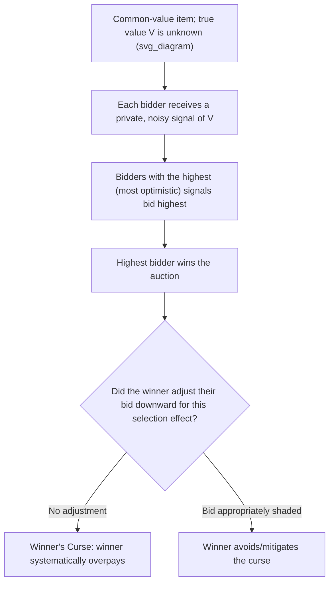

## Auction Theory and Mechanism Design Fundamentals

### Overview

**Auction theory** studies the strategic behavior of bidders and the design properties of different auction formats used to allocate goods, services, or resources through competitive bidding. It sits within the broader field of **mechanism design** — sometimes called "reverse game theory" — which asks how a designer (auctioneer, regulator, or platform) can structure the rules of a game so that self-interested, strategic participants are induced to reveal private information or behave in a way that achieves a desired outcome (e.g., revenue maximization, efficient allocation, or truthful bidding).

Auctions are pervasive in managerial economics contexts: procurement bidding, spectrum allocation, online ad exchanges, art and asset sales, and IPO pricing mechanisms all rely on auction-theoretic principles.

### The Four Classical Auction Formats

**1. English Auction (ascending-bid, open outcry)**: The auctioneer starts at a low price and raises it incrementally; bidders openly signal willingness to continue by remaining active. The auction ends when only one bidder remains, who pays the final (second-highest bidder's exit) price.

**2. Dutch Auction (descending-bid)**: The auctioneer starts at a high price and lowers it continuously until a bidder accepts, paying that price. Historically used for perishable goods (e.g., Dutch flower auctions) where speed matters.

**3. First-Price Sealed-Bid Auction**: All bidders submit bids simultaneously and privately (sealed); the highest bidder wins and **pays their own bid**.

**4. Second-Price Sealed-Bid Auction (Vickrey Auction)**: All bidders submit bids simultaneously and privately; the highest bidder wins but **pays the second-highest bid**, not their own.

### Private Values vs. Common Values

**Key Points:**

- **Private values model**: Each bidder has their own independent, personal valuation of the item, unaffected by other bidders' valuations (e.g., an art collector buying for personal enjoyment). Each bidder knows their own value with certainty but not others'.
- **Common values model**: The item has an objectively identical (but *unknown*) value to all bidders (e.g., an oil-drilling lease, where the actual quantity of oil is the same regardless of who wins, but no bidder knows it precisely). Each bidder receives a private, imperfect **signal** or estimate of this shared true value.
- **Affiliated/interdependent values**: A more general framework blending elements of both — a bidder's value estimate is influenced by their own private signal but also correlated with others' signals about the same underlying quality.

This distinction matters enormously for bidding strategy, most notably in generating the **winner's curse** phenomenon (discussed below), which arises specifically in common-value settings.

### Bidding Strategy in the Second-Price (Vickrey) Auction: Truthful Bidding as a Dominant Strategy

One of the most elegant and widely cited results in auction theory: in a **private-values, second-price sealed-bid auction**, **bidding one's true valuation is a weakly dominant strategy** for every bidder.

**Intuition/proof sketch**: Consider a bidder with true value $v$, deciding what bid $b$ to submit.

- If $b > v$ (overbidding): The bidder risks winning at a price *above* their true value (if the second-highest bid falls between $v$ and $b$), resulting in a **loss**. Overbidding can never help and can sometimes hurt.
- If $b < v$ (underbidding): The bidder risks *losing* an auction they otherwise would have won profitably (if the second-highest bid falls between $b$ and $v$), forgoing a potential gain. Underbidding can never help and can sometimes hurt.
- Bidding exactly $b = v$ eliminates both risks: the bidder wins if and only if their true value exceeds the second-highest bid, and if they win, they pay only that second-highest bid — guaranteeing they never pay more than their own valuation.

$$\text{Optimal bid: } b^*(v) = v$$

**Key Points:**

- This dominant-strategy property makes the Vickrey auction highly attractive from a **mechanism design** perspective: bidders do not need to strategize about what others might bid — truthful revelation of one's own value is always optimal, regardless of the number or behavior of other bidders.
- This is the auction-theoretic application of the **dominant strategy** concept covered earlier in this chapter — a rare case where a genuinely simple, universally optimal strategy exists.

### Bidding Strategy in the First-Price Sealed-Bid Auction: Bid Shading

In a **first-price sealed-bid auction**, bidding one's true value is *not* optimal, because a winning bidder would earn exactly zero surplus (paying precisely their own valuation). Instead, rational bidders engage in **bid shading** — submitting a bid strictly below their true valuation — to preserve some surplus if they win.

**Symmetric equilibrium bidding function** (for $n$ risk-neutral bidders with independent private values drawn from a uniform distribution on $[0, \bar{v}]$):

$$b^*(v) = \frac{n-1}{n} v$$

**Key Points:**

- As the number of bidders $n$ increases, the optimal shading factor $\frac{n-1}{n}$ approaches $1$, meaning bidders shade their bids **less aggressively** — more competition forces bidders closer to their true valuation to remain competitive.
- With only $n=2$ bidders, the optimal bid is exactly half of true value ($b^* = 0.5v$) under this uniform-distribution assumption; with many bidders, shading becomes minimal.

**Numerical example**: With $n = 4$ bidders and a bidder valuing the item at $v = 100$:

$$b^*(100) = \frac{4-1}{4}(100) = 75$$

### Revenue Equivalence Theorem

One of the most important theoretical results in auction theory, the **Revenue Equivalence Theorem**, states that under a specific set of standard assumptions, **all four classical auction formats generate the same expected revenue** for the seller, and allocate the item to the bidder with the highest valuation with the same probability.

**Required assumptions for revenue equivalence:**

- Bidders are **risk-neutral**.
- Values are **independently and identically distributed** private values.
- The auction rules guarantee the item goes to the **highest bidder**.
- Bidders with the **lowest possible valuation earn zero expected surplus**.

**Key Points:**

- Under these conditions, the English auction, Dutch auction, first-price sealed-bid auction, and second-price sealed-bid auction are all **revenue equivalent** in expectation, despite their very different bidding dynamics and payment rules.
- This is a foundational theoretical benchmark; deviations from the underlying assumptions (risk aversion, correlated/common values, asymmetric bidders, budget constraints) can break revenue equivalence and favor one auction format over another — much of applied auction theory studies precisely these deviations.

### The Winner's Curse

The **winner's curse** is a phenomenon specific to **common-value auctions**: the winning bidder is, by the very nature of winning, typically the bidder who had the **most optimistic (upward-biased) estimate** of the item's true common value — meaning the winner is systematically likely to have overpaid relative to the item's actual value.

**Mechanism**: If each bidder's signal is an unbiased but noisy estimate of the true common value, and bidders naively bid based on their raw signal without adjustment, the bidder with the highest (most optimistic) signal will win — but this selection process means the winning bid is drawn from the *upper tail* of the signal distribution, systematically overestimating the true value.

**Key Points:**

- Rational bidders should adjust for the winner's curse by **shading their bids below their raw signal-based estimate**, recognizing that winning itself is informative (bad) news about how their signal compares to others'.
- This is a well-documented phenomenon in real-world common-value settings such as **oil and gas lease auctions**, corporate takeover bidding contests, and sports free-agency bidding — companies analyzing these historical settings have found evidence consistent with the winner's curse when bidders fail to adjust sufficiently.
- **[Inference]** The degree to which sophisticated, repeat bidders (e.g., institutional players in spectrum auctions) fully correct for the winner's curse versus less-experienced one-time bidders is an active area of empirical and experimental research, with evidence suggesting experience and sophistication improve (though do not necessarily eliminate) the bias.

### Mechanism Design: The Broader Framework

**Mechanism design** generalizes auction theory to the broader problem of designing the **rules of a game** (the mechanism) to achieve a desired social or economic outcome, given that participants have private information and will act strategically (potentially misrepresenting that information) in response to the rules.

**Key concepts:**

**1. Incentive compatibility**: A mechanism is **incentive compatible** if it is in each participant's own best interest to truthfully reveal their private information (e.g., their true valuation), given the mechanism's rules — the Vickrey auction's dominant-strategy truthful-bidding property is a canonical example of incentive compatibility.

**2. The Revelation Principle**: A foundational result in mechanism design stating that **any outcome achievable by some mechanism can also be achieved by an equivalent "direct" mechanism** in which participants are simply asked to report their private information truthfully, and the mechanism is designed so that truthful reporting is each participant's optimal strategy. This significantly simplifies mechanism design theory, since it means the search for optimal mechanisms can, without loss of generality, be restricted to truthful, direct mechanisms.

**3. Individual rationality (participation constraint)**: A mechanism must guarantee that participants are willing to participate voluntarily — typically requiring that expected payoffs from participating are non-negative.

**4. The Vickrey-Clarke-Groves (VCG) mechanism**: A generalization of the second-price auction principle to more complex settings involving **multiple goods or multiple simultaneous decisions**, designed to achieve **efficient allocation** while maintaining incentive compatibility (truthful reporting remains a dominant strategy) even in multi-item contexts.

### Applications in Managerial Economics

| Application | Auction/Mechanism Design Principle |
| --- | --- |
| Procurement/reverse auctions | Firms select suppliers via competitive bidding, applying similar strategic bidding logic |
| Online advertising exchanges | Real-time bidding platforms often use second-price or generalized second-price mechanisms |
| Spectrum and resource allocation | Governments use simultaneous multiple-round auctions informed by mechanism design principles |
| Mergers and acquisitions (bidding contests) | Common-value elements (target firm's true worth) create winner's-curse risk for competing acquirers |
| Initial public offerings (IPOs) | Some IPO mechanisms (e.g., Dutch auction IPOs) directly apply auction-theoretic principles to price discovery |

### Limitations and Practical Considerations

- **Risk aversion**: If bidders are risk-averse rather than risk-neutral, revenue equivalence breaks down — first-price (and Dutch) auctions tend to generate **higher expected revenue** than second-price (and English) auctions, since risk-averse bidders shade their bids less to reduce the risk of losing.
- **Collusion among bidders**: Auction formats can be vulnerable to bidder collusion (e.g., bid-rigging rings agreeing not to compete), which is illegal in most jurisdictions but historically documented in certain procurement and asset-auction contexts.
- **Budget constraints**: If bidders face binding budget constraints, standard revenue equivalence and optimal-bidding results can be substantially altered.
- **[Inference]** Real-world auction design must often balance the elegant theoretical properties of mechanisms like the Vickrey auction (truthful dominant-strategy bidding) against practical concerns such as bidder unfamiliarity with the format, susceptibility to certain forms of strategic manipulation in repeated settings, or seller preferences for the immediacy and transparency of ascending-bid formats — which may explain why English and first-price sealed-bid formats remain far more commonly used in practice than the theoretically elegant second-price sealed-bid format.

**Related Topics:**

- Dominant strategies and iterated elimination
- The winner's curse and common-value estimation bias
- Revelation Principle and incentive compatibility
- Vickrey-Clarke-Groves (VCG) mechanisms
- Bayesian games and incomplete information
- Bid-rigging and antitrust enforcement in procurement
- Signaling and screening in markets with asymmetric information