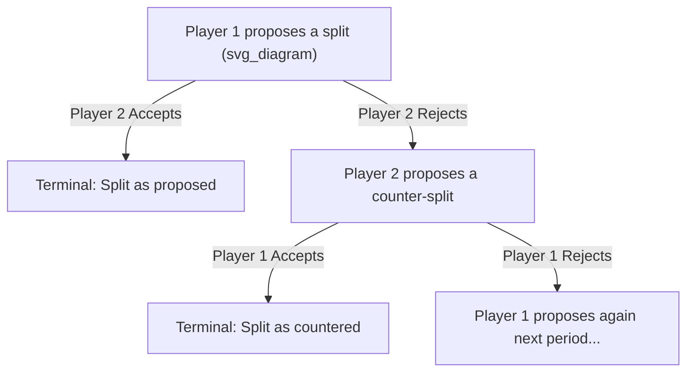

## Bargaining Theory and Negotiation Strategy

### Overview

**Bargaining theory** analyzes how two or more parties divide a surplus (a "pie") that is jointly available to them only if they reach an agreement. Unlike simultaneous-move competitive games, bargaining is fundamentally about **finding a mutually acceptable division** of value that all parties prefer to walking away from the negotiation entirely. Bargaining theory provides both **cooperative** solution concepts (which specify a fair or axiomatically justified division without fully modeling the negotiation process) and **non-cooperative** solution concepts (which model the actual sequential offer-and-counteroffer process as an extensive-form game).

This topic is directly relevant to managerial economics contexts including wage negotiations, supplier contracts, mergers and acquisitions, joint ventures, and any business relationship requiring a negotiated division of surplus.

### The Bargaining Problem: Basic Setup

**Key elements:**

- **The surplus (pie)**: The total value created if the parties reach agreement, which must be split between them.
- **Disagreement point (threat point / BATNA)**: The payoff each party receives if negotiations fail and no agreement is reached — often referred to in negotiation practice as the **Best Alternative to a Negotiated Agreement (BATNA)**.
- **Feasible set**: The set of all possible payoff combinations achievable through some agreement.
- **Bargaining power**: The relative ability of each party to secure a larger share of the surplus, influenced by factors such as patience, outside options, and the cost of delay.

**Key Points:**

- A negotiated agreement is only rational for both parties if it provides each party with **at least** their disagreement-point payoff — any agreement giving one party less than their BATNA would simply be rejected in favor of walking away.
- A stronger BATNA (a better fallback option) generally translates into greater bargaining power and a larger negotiated share of the surplus, since the threat of walking away becomes more credible and less costly.

### The Nash Bargaining Solution (Cooperative Approach)

The **Nash Bargaining Solution**, developed by John Nash (1950), is an axiomatic cooperative solution concept that identifies a unique, "fair" division of surplus satisfying a specific set of desirable properties, without explicitly modeling the negotiation process itself.

**The Nash Bargaining Solution maximizes the product of each party's gain over their disagreement point:**

$$\max_{(x,y)} (x - d_1)(y - d_2)$$

subject to $(x, y)$ being a feasible allocation, where $d_1$ and $d_2$ are the disagreement-point payoffs for Party 1 and Party 2, respectively.

**Axioms underlying the Nash Bargaining Solution:**

1. **Pareto efficiency**: The solution should not leave any value "on the table" — no other feasible allocation should make both parties better off.
2. **Symmetry**: If both parties have identical disagreement points and an identical feasible set, they should receive equal shares.
3. **Invariance to affine transformations**: The solution should not depend on the arbitrary scale or units used to measure utility.
4. **Independence of irrelevant alternatives**: Removing infeasible options that were not the chosen solution should not change the outcome.

**Numerical example**: Two firms are negotiating a joint venture with a total surplus of $100 million to divide. Firm A's disagreement payoff (BATNA) is $20 million; Firm B's disagreement payoff is $10 million.

The Nash Bargaining Solution splits the **surplus above the disagreement points equally** (in this simple symmetric transferable-utility case):

$$\text{Surplus above disagreement} = 100 - 20 - 10 = 70$$

$$\text{Each party's share of the surplus} = \frac{70}{2} = 35$$

**Resulting allocations:**

$$x^* = 20 + 35 = 55 \text{ (Firm A's total payoff)}$$

$$y^* = 10 + 35 = 45 \text{ (Firm B's total payoff)}$$

**Key Points:**

- This illustrates a core intuition of the Nash Bargaining Solution: each party first "locks in" their disagreement-point payoff, and the **additional surplus created by cooperation is then split equally** (in the simplest symmetric case) between the parties.
- A party with a **higher disagreement payoff** (stronger BATNA) captures a proportionally larger total share of the final allocation, even though the surplus itself is split equally — this formalizes the intuitive negotiation principle that a strong fallback position translates directly into bargaining leverage.

### The Rubinstein Bargaining Model (Non-Cooperative, Alternating Offers)

The **Rubinstein bargaining model**, developed by Ariel Rubinstein (1982), provides a fully specified **non-cooperative, sequential** model of the bargaining process itself, using **alternating offers** between two players over a (potentially infinite) sequence of periods.

**Setup:**

- Player 1 makes an offer in period 1 specifying a division of the pie (normalized to size $1$).
- Player 2 can **Accept** (ending the game with that division) or **Reject** (moving to period 2).
- If rejected, Player 2 makes a counteroffer in period 2; Player 1 can Accept or Reject.
- This alternation continues indefinitely until an offer is accepted; delay is costly, captured via discount factors $\delta_1$ and $\delta_2$ for Player 1 and Player 2, respectively (reflecting impatience or the cost of delay).

**Solving via backward induction / stationarity**: Because the game has an infinite horizon with a stationary (repeating) structure, Rubinstein's key insight is to find a **subgame perfect equilibrium** in which both players use stationary strategies (the same offer/acceptance rule applies in every period), allowing the infinite game to be solved via a self-referential equation rather than literal backward induction from a final period.

**Equilibrium result** (for the case $\delta_1 = \delta_2 = \delta$, symmetric patience): Player 1 (the first mover) receives:

$$x_1^* = \frac{1}{1+\delta}$$

and Player 2 receives:

$$x_2^* = \frac{\delta}{1+\delta}$$

**Key Points:**

- As $\delta \to 1$ (players become arbitrarily patient, or the time between offers shrinks toward continuous-time bargaining), the equilibrium split converges to an **even 50-50 split** — the first-mover advantage vanishes as impatience becomes negligible.
- As $\delta \to 0$ (players are extremely impatient), Player 1 (the first mover) captures nearly the **entire** surplus, since Player 2 would accept almost any positive offer rather than wait even one more period.
- **Asymmetric patience** (if $\delta_1 \neq \delta_2$) generalizes this result: the **more patient player secures a larger share** of the surplus, formalizing the intuitive negotiation principle that patience is a source of bargaining power.

### Numerical Example: Rubinstein Model with Symmetric Discounting

Suppose both players have discount factor $\delta = 0.9$ (reflecting relatively patient, low-cost-of-delay negotiators).

$$x_1^* = \frac{1}{1+0.9} = \frac{1}{1.9} \approx 0.526$$

$$x_2^* = \frac{0.9}{1.9} \approx 0.474$$

Player 1 (the first mover) secures a modest advantage (approximately 52.6% vs. 47.4%), reflecting the relatively small first-mover benefit when both parties are fairly patient. If instead $\delta = 0.5$ (more impatient/costly delay):

$$x_1^* = \frac{1}{1.5} \approx 0.667, \quad x_2^* = \frac{0.5}{1.5} \approx 0.333$$

The first-mover advantage becomes substantially larger when delay is more costly, since Player 2 is more willing to accept a worse deal immediately rather than endure costly further rounds of negotiation.

### Key Determinants of Bargaining Power

| Factor | Effect on Bargaining Power |
| --- | --- |
| Patience (discount factor) | More patient party (higher $\delta$, lower cost of delay) secures a larger share |
| Strength of outside option (BATNA) | A stronger fallback option increases the party's disagreement-point payoff, raising their negotiated share |
| Cost of delay/impasse | Higher cost of delay for a party weakens that party's bargaining position |
| Information asymmetry | A party with better information about the other's true reservation value may extract more surplus, though private information can also cause costly bargaining breakdown |
| First-mover advantage | Making the first offer provides a modest edge, particularly when discounting/impatience is significant |
| Number of alternative counterparties | More alternative negotiating partners for one side strengthens that side's outside option and bargaining leverage |

### Bargaining Under Incomplete Information

**Key Points:**

- The Rubinstein model above assumes **complete information** — both parties know each other's discount factors and valuations with certainty, guaranteeing immediate agreement (no delay occurs in equilibrium).
- Real-world negotiations often involve **incomplete information** (e.g., a seller not knowing a buyer's true maximum willingness to pay), which can lead to **costly bargaining delay or even breakdown** in equilibrium, as parties may have strategic incentives to misrepresent their true valuations or wait to signal information through costly delay.
- **[Inference]** This incomplete-information extension helps explain why real-world negotiations sometimes fail to reach agreement or involve substantial delay even when a mutually beneficial deal genuinely exists — a result that stands in notable contrast to the complete-information Rubinstein model's prediction of immediate, delay-free agreement.

### Practical Negotiation Strategy Implications

**Key Points:**

- **Strengthening your BATNA before negotiating** is one of the most robust, theoretically grounded pieces of practical negotiation advice — a credible outside option directly increases your disagreement-point payoff and thus your negotiated share.
- **Signaling patience (or willingness to walk away)** can improve bargaining position, since the Rubinstein model shows that a lower effective cost of delay for one party shifts the equilibrium split in that party's favor.
- **Making the first offer** provides a measurable, if modest, theoretical advantage, particularly in settings involving significant discounting or cost of delay.
- **Reducing information asymmetry through credible signals** (verifiable financial disclosures, third-party appraisals) can help avoid costly bargaining breakdown that can occur under incomplete information.

### Applications in Managerial Economics

| Application | Bargaining Framework Applied |
| --- | --- |
| Labor/union wage negotiations | BATNA (strike fund, alternative employment) and patience determine wage-split outcomes |
| Mergers and acquisitions | Negotiated purchase price reflects each party's outside options and relative patience |
| Supplier/buyer contract negotiations | Long-term relationship value and switching costs shape each side's disagreement point |
| Joint venture profit-sharing agreements | Nash Bargaining Solution often used as a normative benchmark for "fair" surplus division |
| Real estate and asset sale negotiations | Alternating-offer dynamics and time-on-market costs mirror the Rubinstein framework |

**Related Topics:**

- The Nash Bargaining Solution and cooperative game theory axioms
- The Rubinstein alternating-offers model
- BATNA and negotiation strategy in practice
- Bargaining under incomplete information and costly delay
- Sequential-move games and backward induction
- Subgame Perfect Nash Equilibrium
- Labor economics and collective bargaining models