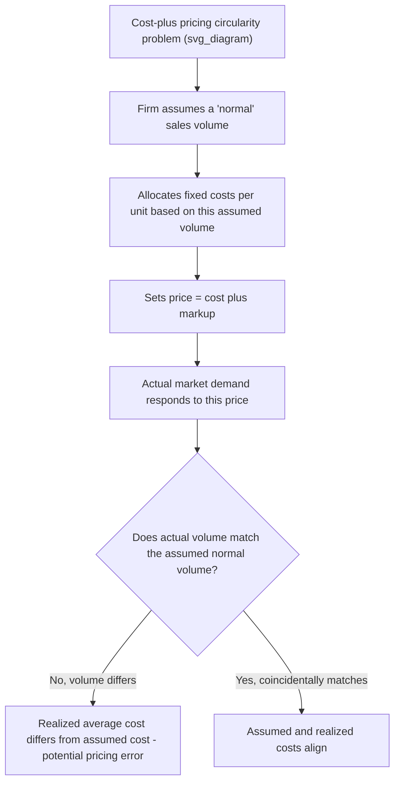

## Cost-Plus and Markup Pricing Methods

### Overview

**Cost-plus pricing** (also called **markup pricing** or **full-cost pricing**) is one of the most widely used pricing methodologies in actual business practice, despite receiving relatively limited theoretical endorsement in standard neoclassical price theory. The method sets a product's selling price by starting with a measure of the product's cost and adding a **markup** — a percentage or fixed amount intended to cover overhead costs not directly allocated to the unit and to generate a target profit margin.

Its popularity in practice, despite theoretical criticisms (discussed below), stems largely from its simplicity, its intuitive fairness appeal, and its lower informational requirements compared to marginal-revenue-based optimal pricing, which requires estimating a demand curve that many firms find difficult to observe directly.

### Basic Cost-Plus Pricing Formula

$$P = C(1 + m)$$

where $P$ is the selling price, $C$ is the relevant unit cost measure, and $m$ is the markup percentage (expressed as a decimal).

**Numerical example**: A manufacturer's unit cost is $40, and the firm applies a standard 25% markup.

$$P = 40(1 + 0.25) = 40 \times 1.25 = \$50$$

### Choosing the Cost Base: Full Cost vs. Variable Cost Markup

**Key Points:**

- **Full-cost (absorption-cost) markup pricing**: The cost base $C$ includes **both variable costs and an allocated share of fixed overhead costs** per unit, based on an assumed "normal" or budgeted production volume. This is the most common approach in practice, particularly in manufacturing.
- **Variable-cost (contribution) markup pricing**: The cost base $C$ includes **only variable costs**, with the markup percentage set high enough to ensure the resulting contribution margin covers fixed costs and generates target profit across the firm's expected total sales volume.

**Full-cost formula**:

$$C_{full} = \text{Variable cost per unit} + \frac{\text{Allocated fixed overhead}}{\text{Assumed normal volume}}$$

**Numerical example (full-cost approach)**: A firm has variable cost of $30 per unit, total fixed overhead of $200,000, and an assumed normal production volume of 10,000 units.

$$C_{full} = 30 + \frac{200{,}000}{10{,}000} = 30 + 20 = \$50 \text{ per unit}$$

Applying a 20% markup on this full cost:

$$P = 50 \times 1.20 = \$60$$

### Markup on Cost vs. Margin on Price (Sales)

A critical distinction often confused in practice is between **markup on cost** and **margin on selling price** (sometimes called "markup on sales").

**Markup on cost**:

$$m_{cost} = \frac{P - C}{C}$$

**Margin on selling price**:

$$m_{price} = \frac{P - C}{P}$$

**Converting between the two**:

$$m_{price} = \frac{m_{cost}}{1 + m_{cost}} \qquad \text{and} \qquad m_{cost} = \frac{m_{price}}{1 - m_{price}}$$

**Numerical example**: If cost $C = \$40$ and price $P = \$50$:

$$m_{cost} = \frac{50-40}{40} = \frac{10}{40} = 25\%$$

$$m_{price} = \frac{50-40}{50} = \frac{10}{50} = 20\%$$

**Key Points:**

- A **25% markup on cost** is mathematically equivalent to a **20% margin on selling price** for the same price/cost pair — these are *not* the same percentage, and confusing them is a common practical error that can lead to significant unintended pricing errors, particularly in retail and distribution industries where margin-on-price convention is standard.
- Retailers and distributors typically quote and plan around **margin on price** (gross margin percentage), while manufacturers more often use **markup on cost** — awareness of which convention is in use is essential when comparing pricing practices across different points in a supply chain.

### Determining the Target Markup Rate

The markup percentage itself is typically set to achieve a **target rate of return on investment** or a targeted profit level, in addition to covering overhead not directly captured in the unit cost base.

**Target-return pricing formula**:

$$m = \frac{\text{Target profit}}{\text{Total cost at normal volume}} = \frac{r \times K}{C \times Q}$$

where $r$ is the target rate of return on invested capital $K$, and $Q$ is the assumed normal sales volume.

**Numerical example**: A firm has invested capital $K = \$1{,}000{,}000$, targets a $15\%$ return on that investment, has unit cost $C = \$50$, and assumes normal volume $Q = 5{,}000$ units.

$$\text{Target profit} = 0.15 \times 1{,}000{,}000 = \$150{,}000$$

$$m = \frac{150{,}000}{50 \times 5{,}000} = \frac{150{,}000}{250{,}000} = 0.60 = 60\%$$

$$P = 50(1 + 0.60) = \$80$$

### The Theoretical Criticism: Cost-Plus Pricing Ignores Demand

**Key Points:**

- The most significant theoretical criticism of cost-plus pricing is that it is fundamentally **cost-driven** and largely **ignores demand conditions** — specifically, it does not directly incorporate information about the price elasticity of demand, which standard microeconomic theory (profit maximization via $MR = MC$) identifies as essential to optimal pricing.
- A firm using a fixed markup will apply the same percentage markup to a product with highly elastic demand (where a lower markup might actually maximize profit, since raising price sharply reduces quantity sold) as to a product with highly inelastic demand (where a much higher markup might be left unexploited).
- Cost-plus pricing implicitly assumes that the "normal volume" used to allocate fixed costs will actually be achieved — but if the resulting price is poorly matched to actual demand conditions, realized sales volume may differ substantially from the assumed volume, creating a potential **circularity problem**: the price depends on assumed volume, but actual volume depends on the resulting price.

### Reconciling Cost-Plus Pricing with Marginal Analysis

**[Inference]** Some economists have argued that cost-plus pricing can, under specific conditions, produce results reasonably close to marginal-cost/marginal-revenue optimal pricing — specifically, if firms empirically calibrate their markup percentages (even informally, through trial, error, and competitive observation over time) to approximate the inverse price elasticity of demand implied by the standard monopoly markup rule:

$$\frac{P - MC}{P} = \frac{1}{|\epsilon|}$$

This is the **inverse elasticity pricing rule** (a direct implication of profit maximization under $MR=MC$ for a firm with market power), which shows that the theoretically optimal margin on price is exactly the reciprocal of the absolute value of the price elasticity of demand. Firms operating in a market long enough may, through repeated adjustment of markups in response to observed sales performance, arrive at markup rates that approximate this economically optimal relationship — even without formally estimating a demand curve. This remains, however, an empirical claim about firm behavior rather than a guaranteed theoretical outcome of the cost-plus method itself.

### Why Cost-Plus Pricing Remains Widely Used in Practice

Despite the theoretical criticism above, cost-plus/markup pricing remains extremely common in real business practice for several practical reasons:

- **Lower informational requirements**: Estimating a full demand curve and its elasticity is often difficult, costly, or practically infeasible for many firms, while cost data is typically already tracked for accounting purposes.
- **Administrative simplicity**: Markup pricing is easy to communicate, apply consistently across large product lines, and delegate to non-specialist staff (e.g., retail store managers).
- **Perceived fairness and price stability**: Cost-based pricing can appear more "justifiable" to customers, regulators, and business partners than pricing based purely on what the market will bear, which can carry perceptions of price-gouging, particularly during demand surges.
- **Reduces the risk of destructive price wars**: If most firms in an industry use similar cost-plus conventions, this can (perhaps inadvertently) create a degree of pricing stability and reduce the risk of aggressive price-based competition, echoing dynamics related to the kinked demand curve model of price rigidity.

### Cost-Plus Pricing in Different Business Contexts

| Context | Typical Application |
| --- | --- |
| Government/defense contracting | Cost-plus contracts (e.g., cost-plus-fixed-fee) directly embed markup logic into contract structure, partly to manage contractor risk on uncertain-cost projects |
| Retail | Markup on cost (or margin on price) applied at the point of sale, often varying by product category based on typical elasticity/competition |
| Construction and custom manufacturing | Cost-plus contracts common due to high project-specific cost uncertainty at the bidding stage |
| Professional services (consulting, legal) | Billing rates often set via a markup over the direct cost of professional time (salary, benefits, overhead allocation) |

### Practical Numerical Example: Comparing Cost-Plus to Optimal Pricing

Suppose a firm has marginal cost $MC = \$40$ and faces demand with price elasticity $\epsilon = -2.5$ at its current price point.

**Optimal markup on price (inverse elasticity rule)**:

$$\frac{P-MC}{P} = \frac{1}{2.5} = 0.40$$

Solving for $P$:

$$P - 40 = 0.40P \implies 0.60P = 40 \implies P = \$66.67$$

This corresponds to a **markup on cost** of:

$$m_{cost} = \frac{66.67 - 40}{40} = 0.667 = 66.7\%$$

If the firm instead applied a conventional flat industry markup of, say, $25\%$ on cost, its price would be $P = 40 \times 1.25 = \$50$ — substantially **below** the theoretically optimal price given this demand elasticity, illustrating the potential for cost-plus conventions to leave profit "on the table" (or, in other elasticity scenarios, to overprice) relative to demand-informed optimal pricing.

**Related Topics:**

- The inverse elasticity pricing rule and monopoly markup
- Price elasticity of demand estimation methods
- Target-return pricing and capital budgeting
- The kinked demand curve model of price rigidity
- Peak-load and price discrimination pricing strategies
- Break-even analysis and contribution margin
- Government cost-plus contracting structures