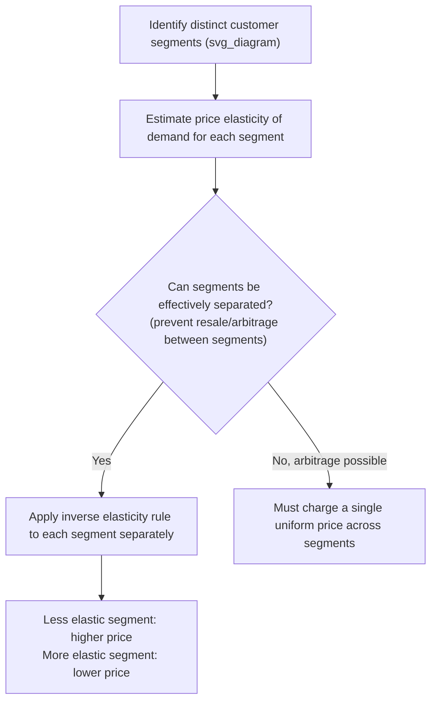

## Value-Based and Demand-Based Pricing

### Overview

**Value-based pricing** (also called **perceived-value pricing**) sets a product's price primarily according to the **value the customer perceives** they receive from the product, rather than the cost of producing it. **Demand-based pricing** is a closely related, broader category that sets price according to **demand conditions and price sensitivity** — including customer perceptions of value, but also incorporating market segmentation, willingness to pay, and elasticity considerations more generally. Together, these approaches represent a fundamental shift away from cost-plus pricing's cost-centric logic toward a **customer- and market-centric** logic, more closely aligned with the standard microeconomic prescription of setting price based on marginal revenue (which is itself derived from the demand curve).

### Value-Based Pricing: Core Concept

**Key Points:**

- Value-based pricing begins with the question: **"What is this product worth to the customer?"** rather than **"What did this product cost us to make?"**
- The theoretical ceiling for value-based pricing is the customer's **reservation price** (maximum willingness to pay) — informed by the value the product delivers relative to the next-best alternative (competitors' offerings or the customer's status quo).
- Products or features that deliver greater differentiated value relative to competitors can command a price premium **even if their production cost is similar to, or lower than, competing products** — the price is decoupled from cost, and driven instead by relative value delivered.

### The Economic Value to the Customer (EVC) Framework

A commonly used quantitative approach for value-based pricing calculates the **Economic Value to the Customer (EVC)**:

$$EVC = P_{ref} + V_d$$

where $P_{ref}$ is the price of the customer's next-best reference alternative, and $V_d$ is the **differentiation value** — the additional (positive or negative) value the product provides relative to that reference alternative, measured in monetary terms.

**Numerical example**: A specialty industrial lubricant competes against a standard reference product priced at $500 per drum. The specialty product's superior formulation reduces the customer's downtime and maintenance costs, generating an estimated $300 in additional savings per drum over the product's useful life, but also requires $50 in additional handling costs due to specialized storage requirements.

$$V_d = 300 - 50 = 250$$

$$EVC = 500 + 250 = \$750$$

The EVC of $750 represents the theoretical **price ceiling** — the maximum a fully informed, rational customer would be willing to pay while still being indifferent between the specialty product and the reference alternative. In practice, firms typically price **below** the full EVC, sharing some of the value created with the customer (as an incentive to switch and to build goodwill/loyalty), often expressed as capturing a target percentage of the value-add:

$$P = P_{ref} + (\text{Value share captured}) \times V_d$$

If the firm decides to capture $60\%$ of the differentiation value:

$$P = 500 + (0.60)(250) = 500 + 150 = \$650$$

### Demand-Based Pricing: Setting Price via the Demand Curve

**Demand-based pricing** more broadly incorporates the standard microeconomic optimal-pricing framework, setting price and output where marginal revenue equals marginal cost, using an estimated or inferred demand curve.

$$MR = MC$$

For a linear demand curve $P = a - bQ$, marginal revenue is:

$$MR = a - 2bQ$$

**Numerical example**: Demand is $P = 200 - 2Q$, marginal cost is constant at $MC = 40$.

$$MR = 200 - 4Q$$

$$200 - 4Q = 40 \implies Q^* = 40$$

$$P^* = 200 - 2(40) = \$120$$

This price of $120 substantially exceeds marginal cost of $40, reflecting the firm's market power and the specific shape (elasticity) of the demand curve at the optimal point — a result cost-plus pricing conventions would likely fail to capture unless the applied markup happened to closely mirror this demand-informed optimal margin.

### Price Discrimination as an Extension of Demand-Based Pricing

**Key Points:**

- Because different customer segments often have systematically different price elasticities and different reservation prices, demand-based pricing frequently leads naturally to **price discrimination** — charging different prices to different customers or segments for the same or similar product, based on differences in willingness to pay.
- **First-degree (perfect) price discrimination**: Charging each individual customer their exact reservation price, extracting the maximum possible consumer surplus — largely a theoretical benchmark, rarely fully achievable in practice due to the difficulty of observing each customer's exact valuation.
- **Second-degree price discrimination**: Offering a menu of different price/quantity or price/quality bundles, allowing customers to **self-select** into the option best suited to their own valuation (e.g., "good-better-best" product tiers, bulk discounts).
- **Third-degree price discrimination**: Charging different prices to different, **identifiably distinct** customer segments (e.g., student discounts, senior discounts, regional pricing, business vs. leisure airline fares) based on observable characteristics correlated with elasticity.

**Third-degree price discrimination optimal pricing rule**: For two segments with different elasticities $\epsilon_1$ and $\epsilon_2$, the profit-maximizing prices satisfy:

$$\frac{P_1}{P_2} = \frac{1 - \frac{1}{|\epsilon_2|}}{1 - \frac{1}{|\epsilon_1|}}$$

implying that the segment with the **more inelastic** demand should be charged the **higher** price.

**Numerical example**: Business travelers have elasticity $\epsilon_1 = -1.5$ (relatively inelastic), leisure travelers have elasticity $\epsilon_2 = -3.0$ (relatively elastic), for the same flight route with $MC = \$150$.

Using the individual segment markup rule $\frac{P-MC}{P} = \frac{1}{|\epsilon|}$:

$$P_1 = \frac{MC}{1 - \frac{1}{|\epsilon_1|}} = \frac{150}{1 - \frac{1}{1.5}} = \frac{150}{0.333} = \$450 \text{ (business fare)}$$

$$P_2 = \frac{MC}{1 - \frac{1}{|\epsilon_2|}} = \frac{150}{1 - \frac{1}{3.0}} = \frac{150}{0.667} = \$225 \text{ (leisure fare)}$$

This confirms the general rule: the less elastic (business) segment is charged the substantially higher price.

### Requirements for Effective Price Discrimination

**Key Points:**

- **Market power**: The firm must have some ability to set price above marginal cost (i.e., face a downward-sloping demand curve), which requires some degree of product differentiation or market power — pure price-taking competitive firms cannot price discriminate.
- **Segmentability**: The firm must be able to identify or sort customers into groups with reliably different elasticities/valuations.
- **Prevention of arbitrage (resale) between segments**: If customers charged the lower price could easily resell to customers who would otherwise pay the higher price, price discrimination collapses to a single effective price — this is why price discrimination is more commonly and effectively applied to **services** (which cannot be resold, e.g., haircuts, airline seats, consulting) than to easily resellable physical goods.

### Methods for Estimating Customer Value and Willingness to Pay

- **Conjoint analysis**: A market research technique in which customers evaluate combinations of product features and prices, allowing researchers to statistically decompose the implied value customers place on individual attributes.
- **Van Westendorp price sensitivity meter**: A survey technique asking customers to identify price points that are "too cheap," "a bargain," "getting expensive," and "too expensive," used to triangulate an acceptable price range.
- **A/B testing and price experimentation**: Directly testing different price points with different customer segments (where feasible and ethically/legally appropriate) to empirically estimate demand response.
- **Customer interviews and value-mapping workshops**: Particularly common in B2B/industrial contexts, directly quantifying cost savings, productivity gains, or risk reduction the product delivers to the customer's own business.

### Value-Based/Demand-Based Pricing vs. Cost-Plus Pricing

| Dimension | Cost-Plus Pricing | Value-Based/Demand-Based Pricing |
| --- | --- | --- |
| Starting point | Firm's own production cost | Customer's perceived value / willingness to pay |
| Theoretical alignment with profit maximization | Weak (ignores elasticity directly) | Strong (directly incorporates demand/elasticity) |
| Informational requirements | Low (primarily internal cost data) | High (requires demand/elasticity/value estimation) |
| Risk of underpricing high-value products | High | Low (explicitly captures differentiated value) |
| Administrative complexity | Low | Higher (segmentation, value quantification, potential price discrimination logistics) |
| Suitability | Commodity products, cost-uncertain projects | Differentiated products, services, segmentable markets |

### Practical Challenges and Limitations

- **Measuring perceived value is inherently difficult**: Unlike cost data, customer valuations are not directly observable and must be estimated through research methods that carry their own biases and margins of error.
- **Customer resistance/fairness perceptions**: Customers may perceive value-based pricing (particularly price discrimination) as unfair if they become aware that others are paying substantially less for a similar product, potentially damaging brand reputation or customer trust.
- **Legal and regulatory constraints**: Some forms of price discrimination are restricted by law in certain jurisdictions and contexts (e.g., the Robinson-Patman Act in the U.S. restricts certain forms of discriminatory pricing to different business buyers of the same goods), requiring careful legal review of segmentation and pricing strategies.
- **[Inference]** Successfully implementing value-based pricing typically requires substantially closer collaboration between a firm's marketing, sales, and finance functions than cost-plus pricing does, since it depends on qualitative and quantitative customer insight that purely cost-accounting-driven pricing processes do not require — this organizational/process requirement is often cited as a practical barrier to broader adoption of value-based approaches, particularly in firms with entrenched cost-plus pricing traditions.

**Related Topics:**

- The inverse elasticity pricing rule
- Price discrimination (first, second, and third degree)
- Price elasticity of demand estimation
- Cost-plus and markup pricing methods
- Peak-load pricing and dynamic pricing
- Conjoint analysis and market research methods
- Bundling and versioning strategies