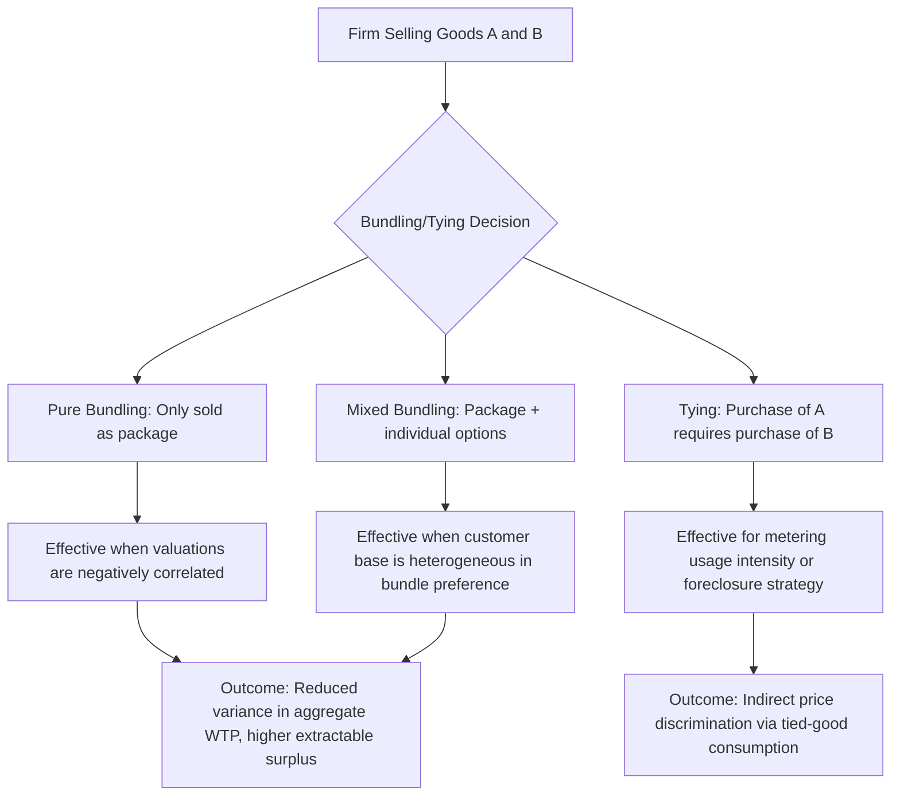

## Bundling and Tying Strategies

### Definitions

**Bundling** is the practice of selling two or more distinct products or services together as a single package, often at a combined price different from the sum of individual prices. **Tying** is a related but narrower practice where a firm requires customers to purchase one product (the *tying good*) only if they also purchase another product (the *tied good*) from the same firm, or makes purchase of the tying good conditional on the tied good.

- **Pure bundling:** Products are available *only* as a package; individual components cannot be purchased separately
- **Mixed bundling:** Products are available both as a package and individually, with the package typically priced at a discount relative to buying components separately
- **Tying:** A specific contractual or technical requirement that purchase of good A obligates or strongly encourages purchase of good B from the same seller

### Economic Rationale for Bundling

**Key Points**

- Bundling functions as an implicit price discrimination device when individual consumers' valuations of the component goods are heterogeneous, particularly when those valuations are **negatively correlated** across the bundled items
- By packaging goods together, the firm reduces the *variance* of aggregate willingness to pay (WTP) across the customer base for the bundle, allowing it to set a single bundle price that captures more aggregate surplus than would be possible pricing each component separately
- This works because summing two negatively correlated random variables produces a combined variable with lower variance than either alone — a statistical "diversification" effect applied to consumer valuations

### The Classic Two-Good Bundling Example

Consider a firm selling two goods, A and B, to two types of customers, each with different valuations:

| Customer Type | Value of A | Value of B | Sum (Bundle Value) |
| --- | --- | --- | --- |
| Type 1 | $100 | $40 | $140 |
| Type 2 | $40 | $100 | $140 |

Under **separate pricing**, the firm can charge at most $40 for each good if it wants to sell to both types (since Type 2 will not pay more than $40 for A, and Type 1 will not pay more than $40 for B), yielding total revenue of $2 \times (\$40 + \$40) = \$160$ across both customers, or alternatively the firm could price each good at $100 and sell only one unit per good to the high-valuation type, if that comparison is more profitable.

Under **pure bundling**, the firm can charge $140 for the bundle (since both types value the bundle identically at $140), and both customers will buy it, yielding total revenue of $2 \times \$140 = \$280$ — strictly greater than either separate-pricing outcome in this illustrative case, because bundling exploits the fact that individual valuations vary while the bundle valuation does not.

[Inference] This numeric result depends on the specific valuations chosen to illustrate the negative-correlation mechanism; bundling does not universally dominate separate pricing, and the profitability comparison depends on the actual joint distribution of valuations, marginal costs, and the number of customer types in a given market.

### Formal Condition Favoring Bundling

Bundling tends to increase profit relative to component pricing when:

$$\text{Var}(V_A + V_B) < \text{Var}(V_A) + \text{Var}(V_B)$$

which holds whenever the covariance term is negative:

$$\text{Cov}(V_A, V_B) < 0$$

where $V_A$ and $V_B$ are the random variables representing individual customers' valuations of goods A and B respectively. The more negative the correlation between valuations, the more effective bundling is at reducing dispersion in bundle valuations and thus at extracting surplus with a single price point.

### Types of Bundling in Practice

#### Pure Bundling

- **Example:** A cable TV package sold only as a full channel bundle with no à la carte option; a "combo meal" at a fast-food restaurant that cannot be purchased as separate line items at the combo price
- Maximizes the variance-reduction effect but sacrifices sales to customers who want only one component and are unwilling to pay for the whole bundle

#### Mixed Bundling

- **Example:** Microsoft Office sold as an individual Word license, an individual Excel license, or as the full Office suite bundle at a discount; fast-food "value meals" alongside available à la carte items; ski resort day passes bundled with equipment rental, while equipment rental alone remains purchasable
- Generally more profitable than pure bundling when there is significant heterogeneity in whether customers want all components or only a subset, because it captures both bundle-preferring and single-item-preferring customers

#### Tying (Tie-In Sales)

- **Example (aftermarket/razor-blade model):** Requiring or heavily incentivizing use of proprietary ink cartridges with a specific printer brand; single-use coffee pod machines tied to a specific pod brand
- **Example (requirements tying):** A historic antitrust matter, IBM's practice of requiring customers leasing its tabulating machines to also purchase IBM-supplied punch cards, was challenged under U.S. antitrust law
- Tying can serve several purposes: price discrimination via metering (charging more to heavy users of the tied good, effectively creating a variable per-use price on top of a fixed fee for the tying good), quality control, and — in some documented cases — foreclosure of competitors in the tied-good market

### Metering as a Tying Mechanism

**Key Points**

A specific and economically important use of tying is **metering**: using the tied good as a measurement device for intensity of use of the tying good, enabling indirect price discrimination.

- If the firm cannot directly observe how intensively a customer uses the tying product (e.g., a copier machine), but usage is proportional to consumption of the tied good (e.g., ink or toner), then tying the two allows the firm to charge heavy users more in total (through greater tied-good purchases) than light users, even under a single posted price per unit of the tied good
- **Example:** Historic copier leasing arrangements requiring lessees to buy the leasing company's own paper/toner, which let the leasing firm charge, in effect, a higher implicit price to high-volume copier users

### Bundling and Tying: Diagrammatic Overview

### Welfare and Competitive Effects

**Key Points**

- Bundling's welfare effect is theoretically ambiguous: it can increase total surplus by expanding output to customers who would not have purchased either component individually, or it can reduce welfare if it forecloses competitors who specialize in only one component of the bundle, reducing competitive pressure and consumer choice
- **Tying as foreclosure:** If a dominant firm in market A ties a competitively contestable good B to its purchase, this can raise barriers to entry for rival producers of good B, a concern that has been central to antitrust cases (e.g., historic scrutiny of operating-system bundling with browser or media-player software)
- [Inference] Whether a specific real-world bundling or tying arrangement is welfare-enhancing or anti-competitive is typically fact-specific and contested in economic and legal analysis; general theoretical ambiguity should not be read as implying any particular real firm's practice is presumptively lawful or unlawful without case-specific antitrust review

### Distinguishing Bundling from Related Concepts

| Concept | Core Mechanism | Customer Choice |
| --- | --- | --- |
| Pure bundling | Package-only sale | None — must buy whole bundle |
| Mixed bundling | Package or individual, at different prices | Choice between bundle and components |
| Tying | Conditional sale (A requires B) | Constrained — cannot get A without B |
| Cross-selling | Marketing complementary products together | Fully voluntary, no price/contractual linkage |

Cross-selling is not a form of price discrimination or tying in the strict economic sense; it lacks the pricing/contractual structure that defines bundling and tying, and is included here only to clarify the boundary of the concept.

### Practical Considerations for Firms Implementing Bundling

- **Component cost structure:** Bundling is more attractive when the marginal cost of adding an additional component to a package is low relative to its standalone price (common in digital goods and information products where marginal cost approaches zero)
- **Legal exposure:** Tying arrangements involving a firm with substantial market power in the tying good's market face heightened antitrust scrutiny in many jurisdictions; the specific legal thresholds and tests (e.g., market power requirements, per se vs. rule-of-reason analysis) vary by jurisdiction and evolve through case law, so current legal treatment should be verified against up-to-date legal sources rather than assumed static
- **Consumer perception:** Pure bundling that eliminates a previously available à la carte option can generate consumer backlash if perceived as forced consumption of unwanted components

### Related Topics

- Price discrimination strategies (first-, second-, and third-degree)
- Two-part tariffs and non-linear pricing
- Antitrust treatment of tying arrangements
- Aftermarket / razor-and-blade business models
- Network effects and platform bundling strategies
- Menu pricing and product-line versioning