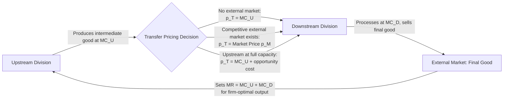

## Transfer Pricing Across Business Units

### Definition and Core Concept

**Transfer pricing** refers to the pricing of goods, services, or intangible assets exchanged between divisions, subsidiaries, or business units within the same overall firm, rather than between independent parties in an external market. Because both the "selling" division and the "buying" division are part of the same organization, the transfer price does not represent a genuine market transaction determined by independent supply and demand — it is an internal accounting and managerial mechanism that determines how consolidated firm profit is divided among internal units for performance measurement, incentive, and (in multinational contexts) tax purposes.

- The transfer price affects the **reported profitability** of each division, even though it has no effect on the **consolidated profit** of the firm as a whole in the simplest single-country case, because one division's revenue is exactly another division's cost
- Setting transfer prices correctly matters because divisional managers typically make output, investment, and effort decisions based on their own division's reported profit, so a poorly chosen transfer price can distort incentives and lead to firm-wide suboptimal decisions even though it is merely an internal bookkeeping figure

### Why Firms Need Transfer Pricing

**Key Points**

- Modern firms are frequently organized into semi-autonomous **profit centers** or **divisions** (e.g., an upstream manufacturing division and a downstream distribution division) to enable decentralized decision-making, better align incentives with local information, and evaluate managerial performance
- When one division's output is an input to another division within the same firm, some price must be assigned to that internal transfer in order to compute each division's profit-and-loss statement
- Absent a well-designed transfer price, the upstream division has no incentive to control costs or the downstream division has no accurate signal of the true cost of its input, both of which can lead to inefficient firm-wide production and pricing decisions

### The Core Economic Problem: Aligning Divisional Incentives with Firm-Wide Optimality

The central objective of transfer pricing theory is to choose an internal price such that when each division manager maximizes their own division's profit (taking the transfer price as given), the resulting firm-wide decisions replicate what a single, fully-informed central planner would choose to maximize total firm profit.

### Formal Model: Transfer Pricing with No External Market for the Intermediate Good

Consider a firm with an upstream division producing an intermediate good at marginal cost $MC_U(q)$, transferred internally to a downstream division that combines it with additional processing (marginal cost $MC_D(q)$) to produce a final good sold in an external market with demand generating marginal revenue $MR(q)$.

If there is **no external market** for the intermediate good (it can only be used internally), the economically efficient rule sets the transfer price $p_T$ equal to the upstream division's marginal cost at the profit-maximizing output level:

$$p_T = MC_U(q^*)$$

where $q^*$ solves:

$$MR(q^*) = MC_U(q^*) + MC_D(q^*)$$

This is the condition for overall firm profit maximization: total marginal revenue from the final good must equal the sum of marginal costs across both stages of production. Setting $p_T = MC_U(q^*)$ ensures the downstream division faces the true marginal cost of the input, inducing it to choose the firm-optimal output level $q^*$ when it independently maximizes its own division's profit.

### Formal Model: Transfer Pricing with a Competitive External Market

If the intermediate good **can also be bought or sold in a competitive external market** at a market price $p_M$, the efficient transfer price is simply:

$$p_T = p_M$$

- If $p_M$ exceeds the upstream division's marginal cost of internal production, the upstream division should be indifferent between selling externally at $p_M$ and transferring internally at $p_T = p_M$, since both yield the same margin
- The downstream division, facing $p_T = p_M$, will correctly compare the cost of buying the input externally versus using the internally transferred good, and total firm profit is maximized regardless of whether the units are actually transferred internally or bought/sold externally, because the opportunity cost of the intermediate good is fully reflected in $p_M$

### The General Transfer Pricing Rule (Opportunity Cost Approach)

**Key Points**

A widely used general formulation states that the efficient transfer price equals the upstream division's **opportunity cost** of supplying one additional unit internally:

$$p_T = \text{Marginal Cost of Production} + \text{Opportunity Cost of Forgone External Sales}$$

- If the upstream division has **idle/excess capacity** (no forgone external sales), the opportunity cost term is zero, and $p_T = MC_U$
- If the upstream division is **operating at full capacity** and could sell every unit externally at $p_M$, the opportunity cost of an internal transfer is the forgone external margin, so $p_T = p_M$
- This opportunity cost framework unifies the no-external-market case (opportunity cost = 0, since there's no alternative use) and the competitive-market case (opportunity cost = $p_M - MC_U$, since diverting a unit internally means forgoing an external sale at $p_M$)

### Numeric Illustration

An upstream division produces a component at $MC_U = \$20$ per unit. The downstream division processes it further at $MC_D = \$15$ per unit and sells the final product, facing demand such that $MR(q) = \$100 - 0.5q$.

**Case A: No external market for the component, upstream has excess capacity**

$$p_T = MC_U = \$20$$

Setting $MR(q^*) = MC_U + MC_D \Rightarrow 100 - 0.5q^* = 20 + 15 = 35 \Rightarrow q^* = 130$

**Case B: Upstream is at full capacity and could sell externally at $p_M = \$28$**

$$p_T = p_M = \$28$$

The downstream division now faces a higher effective input cost of $28 rather than $20, correctly reflecting that using the component internally means the firm forgoes a $28 external sale — the downstream division should only continue processing if the added value from downstream processing and final sale exceeds this true opportunity cost.

### Diagrammatic Representation

### Alternative Transfer Pricing Methods Used in Practice

Beyond the theoretically "efficient" opportunity-cost approach, firms commonly use several practical transfer pricing methods, each with distinct incentive implications:

#### Cost-Based Transfer Pricing

- **Variable-cost pricing:** $p_T = MC_U$, appropriate primarily when the upstream division has idle capacity, but provides the upstream division no contribution toward its fixed costs or profit margin, which can create resentment or a disincentive to prioritize internal transfers if performance is judged on division profit
- **Full-cost pricing:** $p_T$ = variable cost + an allocated share of fixed overhead, which tends to overstate the true marginal cost from a firm-wide optimization perspective (since fixed costs are sunk in the short run) and can lead downstream divisions to under-purchase relative to the efficient quantity
- **Cost-plus pricing:** $p_T$ = full cost plus a markup, intended to give the upstream division a profit margin on internal sales, but the markup is essentially arbitrary from an efficiency standpoint and can further distort downstream purchasing decisions away from $q^*$

#### Market-Based Transfer Pricing

- Uses the external market price (or an approximation of it, such as prices for comparable products) as the transfer price, consistent with the theoretically efficient rule when a genuine competitive external market exists
- **Example:** An automotive manufacturer's parts division transferring components to its assembly division at the same price it charges independent aftermarket customers for equivalent parts

#### Negotiated Transfer Pricing

- Divisional managers negotiate the transfer price directly, subject to a floor (upstream's marginal cost) and ceiling (downstream's marginal value or the external market price, whichever is relevant)
- Can approximate efficient outcomes if both parties have reasonable bargaining power and information, but is subject to typical bilateral bargaining inefficiencies (e.g., costly delay, breakdown in negotiation, and outcomes sensitive to relative bargaining power rather than pure efficiency) [Inference]

### Comparison of Transfer Pricing Methods

| Method | Formula | Best Suited When | Key Limitation |
| --- | --- | --- | --- |
| Marginal cost | $p_T = MC_U$ | Upstream has excess capacity, no external market | No margin/incentive for upstream division |
| Market price | $p_T = p_M$ | Competitive external market exists | Requires genuine, observable comparable market price |
| Full cost | $p_T = $ variable + allocated fixed cost | Simplicity/administrative ease desired | Can distort output below efficient level |
| Cost-plus | $p_T = $ full cost $\times (1 + markup)$ | Upstream needs guaranteed margin | Markup is arbitrary; distorts incentives |
| Negotiated | Bargained between divisions | Both divisions have market power/information | Bargaining costs, outcome sensitive to relative power |

### Transfer Pricing in Multinational Firms and Tax Considerations

**Key Points**

- In multinational firms, transfer pricing takes on an additional and economically distinct role: because the transfer price affects **where** (in which tax jurisdiction) reported profit appears, firms have a potential incentive to set transfer prices strategically to shift reported profit toward lower-tax jurisdictions
- Tax authorities in most jurisdictions require multinational firms to set transfer prices for cross-border intra-firm transactions according to the **arm's-length principle** — meaning the price should approximate what unrelated parties would have agreed to in a comparable transaction — and impose documentation and reporting requirements to enforce this
- [Unverified] Specific current transfer pricing tax regulations, documentation thresholds, and enforcement practices vary significantly by country and are subject to ongoing legal and regulatory change (including coordinated international efforts such as OECD guidelines); any application of this topic to a specific jurisdiction's current tax rules should be verified against current official guidance rather than assumed from general principles alone
- This tax dimension of transfer pricing is a distinct topic from the internal managerial-incentive rationale described above, though the same term is used for both, and multinational firms must reconcile the potentially conflicting objectives of tax-motivated transfer pricing and internally efficient managerial transfer pricing

### Common Pitfalls and Practical Limitations

- **Divisional gaming:** If divisional managers know performance is evaluated on reported divisional profit, they may lobby for transfer prices that favor their own division's reported results rather than firm-wide efficiency, creating an internal political economy problem distinct from the pure optimization model
- **Absence of a clean external market:** Many intermediate goods transferred internally are firm-specific or highly customized, meaning no clean external market price exists for comparison, forcing reliance on imperfect cost-based or negotiated approaches
- **Capacity utilization changes over time:** The efficient transfer price can shift between the "marginal cost" and "opportunity cost" regimes as upstream capacity utilization changes seasonally or over the business cycle, requiring transfer pricing policies flexible enough to adjust rather than a single fixed internal price used indefinitely [Inference]
- **Multinational compliance complexity:** Firms operating across borders must simultaneously satisfy potentially divergent tax authority requirements in each jurisdiction, adding administrative and compliance costs beyond the pure managerial-efficiency considerations

### Related Topics

- Divisional performance measurement and profit-center management
- Price discrimination strategies (first-, second-, and third-degree)
- Vertical integration versus market transactions (make-or-buy decisions)
- Opportunity cost and marginal analysis in managerial decision-making
- International tax policy and the arm's-length principle
- Principal-agent problems and incentive design within firms