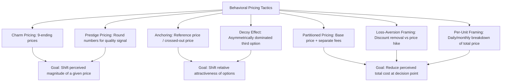

## Psychological and Behavioral Pricing Tactics

### Definition and Core Concept

**Psychological pricing** (also called **behavioral pricing**) refers to pricing tactics that exploit systematic patterns in how consumers *perceive*, *process*, and *judge* prices — patterns that often deviate from the fully rational, utility-maximizing behavior assumed in classical price theory. Rather than relying solely on the standard framework of demand elasticity and marginal cost, these tactics draw on findings from behavioral economics and cognitive psychology about how people actually form judgments about value, fairness, and magnitude when faced with a price.

- These tactics do not necessarily change the *objective* price-cost relationship in a transaction; instead, they change how a given price is **framed, presented, or contextualized** so that consumers perceive it more favorably or are nudged toward a particular purchase decision
- Behavioral pricing sits alongside, rather than replaces, standard economic pricing frameworks (price discrimination, peak-load pricing, bundling) — firms frequently combine behavioral tactics with the structural pricing strategies covered elsewhere in this chapter

### Charm Pricing (Odd-Ending Pricing)

**Key Points**

- Setting prices just below a round number (e.g., $9.99 instead of $10.00, $19.95 instead of $20.00) exploits the tendency of consumers to process the **leftmost digit** of a price more heavily than the digits that follow — a phenomenon sometimes called the "left-digit bias" — causing $9.99 to be perceptually coded as closer to $9 than to $10, even though the actual difference is only one cent
- **Example:** Widespread use of ".99" and ".95" price endings across retail, from grocery items to consumer electronics; researchers have documented measurable increases in demand at "9-ending" prices relative to prices one cent higher, even though the economically rational prediction (holding all else constant) would treat a one-cent difference as economically negligible

### Prestige (Round-Number) Pricing

- The opposite tactic: using round numbers (e.g., $100 rather than $99.99) for premium or luxury goods, where a round price can signal quality, exclusivity, or confidence, and where odd-ending pricing might instead signal "discount" positioning inconsistent with a premium brand image
- **Example:** High-end luxury goods, fine dining menus, and premium professional services frequently use round-number pricing rather than charm pricing, consistent with using price presentation itself as a quality/status signal rather than purely a value-for-money signal

### Price Anchoring

**Key Points**

- **Anchoring** refers to the cognitive tendency for an initially presented number (the "anchor") to disproportionately influence subsequent numerical judgments, even when the anchor is arbitrary or not directly diagnostic of the value being judged
- In pricing, firms often display a higher **reference price** (a "manufacturer's suggested retail price," a crossed-out "was" price, or a premium-tier option) alongside the actual selling price, so that the actual price appears more attractive by contrast, even if the actual price alone (without the anchor) would be judged differently
- **Example:** Retail displays showing a crossed-out original price next to a "sale" price; a three-tier menu of options (e.g., "Basic / Standard / Premium" software plans) where the most expensive tier serves partly to make the middle tier look like the more reasonable/moderate choice by comparison — a specific application known as the **decoy effect**, in which an intentionally unattractive or excessively expensive option is included primarily to shift the relative attractiveness of the other options

### Price Bundling Framing (Partitioned vs. Combined Pricing)

- **Partitioned pricing:** Presenting a base price separately from mandatory additional charges (e.g., shipping, taxes, or service fees disclosed only later in a purchase process), which can lower the perceived total price at the point of initial decision-making relative to presenting one all-inclusive price upfront
- **Example:** Airline base fares displayed prominently with taxes, baggage fees, and other charges added later in the booking process; event ticketing platforms displaying a base ticket price with service and processing fees added at checkout
- [Inference] The behavioral effectiveness of partitioned pricing (i.e., whether and how much it increases purchase likelihood relative to all-inclusive pricing) can depend on the specific market, consumer sophistication, and regulatory disclosure requirements, and is not a universal constant effect size across all contexts

### Loss Aversion and Reference-Dependent Pricing

**Key Points**

- Drawing on **prospect theory**, consumers tend to weigh losses more heavily than equivalently sized gains relative to a reference point — a phenomenon termed **loss aversion**
- Firms can frame price changes to exploit this asymmetry: framing a price increase as the removal of a discount (a "loss" of a benefit) is often perceived less negatively by consumers than framing an equivalent price increase as a straightforward "price hike," even though the net financial effect on the consumer is identical
- **Example:** Framing a fee as a "cash discount" for one payment method rather than a "surcharge" for another, even when the net price difference between the two payment methods is the same in both framings — a tactic historically used in some markets partly because regulations in certain jurisdictions restrict surcharges more heavily than they restrict discounts [Unverified — specific regulatory treatment varies by jurisdiction and should be checked against current local law]

### The Decoy Effect (Asymmetric Dominance)

A specific anchoring-related tactic where a firm introduces a third option that is strictly dominated by one of the two original options (worse on every relevant attribute) specifically to make that dominating option appear more attractive by comparison, thereby shifting consumer choice share toward the target option without that option's own price or features changing at all.

**Example:** A classic illustrative case structure:

| Option | Price | Feature Level |
| --- | --- | --- |
| Small | $3.00 | Low |
| Large | $7.00 | High |
| Medium (decoy) | $6.50 | Medium |

The "Medium" option is priced close enough to "Large" that it makes "Large" look like a much better value by comparison (more features for only a small additional cost), increasing the share of consumers choosing "Large" relative to a scenario where only "Small" and "Large" were offered.

### Price Framing: Per-Unit and Per-Period Decomposition

- Breaking a larger price into smaller, more digestible per-unit or per-time-period figures ("just $1 a day" instead of "$365 a year") can make the same total price feel smaller, because the smaller framed number is more easily compared to routine, low-cost daily purchases
- **Example:** Subscription services and insurance products commonly advertise a "per day" or "per month" cost breakdown of an annual commitment, even where the actual payment obligation is structured annually or the daily framing is purely illustrative

### Diagrammatic Overview of Behavioral Pricing Mechanisms

### Relationship to Classical Price Theory

**Key Points**

- Classical price theory (elasticity-based demand curves, marginal revenue equals marginal cost) assumes consumers process price information accurately and consistently; behavioral pricing tactics are, in effect, attempts to exploit **documented deviations** from that assumption
- These tactics can be understood as shifting the **perceived price** or **perceived value** without necessarily changing the actual transaction price, which in standard demand-curve terms can be modeled as a rightward shift in demand at a given actual price (i.e., behavioral framing effectively increases quantity demanded at the same real price point) — a bridge between the psychological and standard economic frameworks
- [Inference] The magnitude of demand shift attributable to any specific behavioral tactic varies considerably by product category, cultural/market context, and consumer sophistication; general behavioral pricing findings from the research literature should not be treated as fixed universal elasticities applicable to a specific untested market without empirical validation

### Common Pitfalls and Practical Limitations

- **Regulatory and disclosure constraints:** Some tactics, particularly partitioned pricing (drip pricing) and misleading reference-price claims (advertising an artificially inflated "original" price purely to make a "discount" look larger), face increasing regulatory scrutiny and disclosure requirements in various jurisdictions [Unverified — regulatory specifics vary by jurisdiction and change over time; should be verified against current consumer protection law]
- **Consumer sophistication and habituation:** Widely used tactics like charm pricing may lose some effectiveness as consumers become more familiar with them over time, though empirical evidence on the degree of habituation varies across studies and contexts [Inference]
- **Brand and trust risk:** Aggressive use of drip pricing, misleading anchors, or manipulative decoy structures can damage consumer trust and brand reputation if perceived as deceptive, a cost not captured in short-run demand-shift models alone
- **Interaction with other pricing strategies:** Behavioral tactics are typically layered on top of, rather than substituted for, the structural pricing strategies covered elsewhere in this chapter (price discrimination, bundling, peak-load pricing); a coherent pricing strategy generally requires consistency between the structural pricing logic and the behavioral presentation of that logic

### Related Topics

- Prospect theory and loss aversion in consumer decision-making
- Price discrimination strategies (first-, second-, and third-degree)
- Bundling and tying strategies
- Penetration versus skimming pricing for new products
- Consumer protection regulation and pricing disclosure requirements
- Behavioral economics and heuristics in managerial decision-making