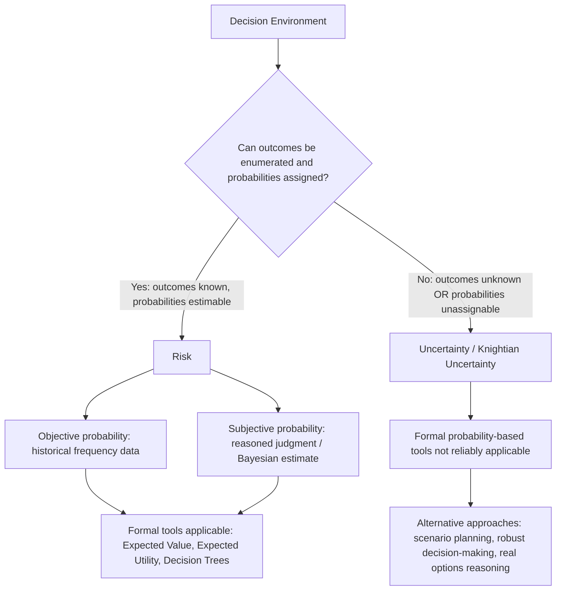

## Distinguishing Risk From Uncertainty

### Definition and Core Concept

**Risk** and **uncertainty** are frequently used interchangeably in everyday language, but managerial economics treats them as analytically distinct conditions of imperfect knowledge about the future, following a distinction most influentially articulated by economist Frank Knight in the early twentieth century. The distinction turns on whether the **probability distribution** of possible outcomes is known (or knowable) to the decision-maker.

- **Risk** describes a decision environment in which the possible outcomes are known and their associated probabilities can be estimated — either objectively (from established relative frequencies) or subjectively (from reasoned judgment) — allowing the decision-maker to compute expected values and apply formal probability-based decision tools
- **Uncertainty** (sometimes called **Knightian uncertainty** to distinguish it from risk) describes a decision environment in which either the possible outcomes themselves are not fully known in advance, or, even if outcomes are identifiable, no meaningful probability can be assigned to them, making formal expected-value calculation impossible or unreliable

### The Knightian Distinction in Detail

**Key Points**

- Frank Knight's 1921 formulation held that **measurable uncertainty** (risk) is fundamentally different in kind, not merely degree, from **unmeasurable uncertainty** (true uncertainty), and that this distinction has real economic consequences — notably, Knight argued that profit itself arises specifically as compensation for bearing true (unmeasurable) uncertainty, since purely measurable risk can in principle be diversified away or insured against, while true uncertainty cannot
- Under **risk**, a decision-maker can, at least in principle, construct a full list of possible outcomes and attach a probability to each, summing to 1, enabling the use of expected value, expected utility, and other formal probabilistic decision criteria
- Under **uncertainty**, no such complete, reliable probability distribution exists — either because the *set of possible outcomes itself* is not fully knowable in advance (sometimes described as encountering genuinely novel possibilities not previously observed or conceived), or because historical frequency data is unavailable, unreliable, or not applicable to a genuinely unprecedented situation

### Sources of Objective and Subjective Probability Under Risk

- **Objective (frequency-based) probability:** Derived from repeated, observable historical events under stable, comparable conditions (e.g., the probability of a manufacturing defect based on a long historical production record, or actuarial mortality tables built from large populations)
- **Subjective (judgment-based) probability:** Derived from an individual decision-maker's reasoned belief about the likelihood of an outcome, even absent a long, stable historical frequency record, typically formalized in decision theory using Bayesian probability concepts
- Both objective and subjective probability estimates fall within the "risk" category as economists typically define it, since both permit the assignment of numerical probabilities usable in expected-value calculations — the Knightian distinction is not fundamentally about whether the probability is "objective" versus "subjective" in origin, but about whether *a* usable probability distribution can be meaningfully assigned at all

### Illustrative Examples: Risk vs. Uncertainty

| Scenario | Category | Rationale |
| --- | --- | --- |
| A casino's expected payout on a roulette wheel | Risk | Fixed, known probabilities derived from the physical structure of the game |
| An insurer pricing life insurance premiums using actuarial mortality tables | Risk | Large historical datasets support statistically reliable probability estimates |
| A firm estimating demand for a well-established product category based on historical sales data | Risk | Historical frequency data exists and is reasonably applicable to near-term forecasting |
| A firm deciding whether to invest in a genuinely novel technology with no historical precedent or comparable market | Uncertainty | No reliable probability distribution over outcomes can be constructed; the very set of possible outcomes may not be fully known |
| A firm assessing the impact of a wholly unprecedented geopolitical or regulatory event | Uncertainty | Historical frequency data is inapplicable or unavailable, and the range of possible outcomes may itself be difficult to enumerate |

[Inference] The boundary between risk and uncertainty in any specific real-world business decision is often a matter of degree rather than a clean binary; many practical situations involve a mix of estimable risk components and genuinely unmeasurable uncertain components, and reasonable analysts can disagree about which category a specific real situation best fits.

### Diagrammatic Representation

### Why the Distinction Matters for Managerial Decision-Making

**Key Points**

- The distinction determines which **decision-making tools** are appropriate: under risk, formal quantitative techniques such as expected monetary value (EMV), expected utility theory, and decision-tree analysis can be meaningfully applied because the necessary probability inputs exist
- Under true uncertainty, applying those same formal tools risks creating a false sense of precision — assigning fabricated or unjustified probability estimates to genuinely unknown outcomes can produce misleadingly confident-looking calculations that do not actually reflect the underlying epistemic situation
- This has direct implications for **risk management strategy**: measurable risk can often be transferred through market mechanisms such as insurance, hedging, and diversification (since an insurer or counterparty can itself rely on the law of large numbers across a portfolio of similar measurable risks), whereas true uncertainty is generally not insurable in the conventional sense, precisely because no reliable probability basis exists for pricing such insurance
- Recognizing when a business faces true uncertainty (rather than merely risk) motivates the use of qualitatively different strategic approaches — such as scenario planning, maintaining strategic flexibility/optionality, incremental/staged investment (real options reasoning), and building organizational adaptability — rather than relying solely on a single expected-value-maximizing calculation

### Formal Distinction in Decision-Theoretic Terms

Under risk, a decision-maker facing a choice among actions $a_i$ with outcomes $x_j$ can compute expected value as:

$$EV(a_i) = \sum_{j} p_j \cdot x_j$$

where $p_j$ is the known (or estimated) probability of outcome $x_j$, and $\sum_j p_j = 1$.

Under true uncertainty, this calculation is not reliably possible because either the set $\{x_j\}$ is incomplete/unknown, or no defensible values of $p_j$ can be assigned. In such cases, decision theory offers alternative, non-probabilistic decision criteria (several of which are addressed as distinct topics in their own right, such as maximin, maximax, and minimax regret criteria), which do not require a probability distribution over outcomes at all, instead relying on other decision rules applied directly to the range of possible outcomes.

### Common Pitfalls and Practical Limitations

- **False precision:** A common managerial error is treating a genuinely uncertain situation as if it were measurable risk by assigning seemingly precise probability estimates that are not actually well-grounded, creating misplaced confidence in quantitative outputs (e.g., a detailed financial model with confidently stated probability inputs for a scenario with no real historical or theoretical basis for those specific numbers) [Inference]
- **Underuse of formal tools where risk genuinely applies:** Conversely, some decision-makers may over-rely on qualitative judgment or intuition even in situations where reasonably reliable probability estimates are actually available from historical data, forgoing the discipline that formal expected-value analysis can provide
- **Boundary ambiguity:** Because many real business decisions blend components of measurable risk with genuinely novel uncertain elements, correctly identifying which decision-analysis toolkit is appropriate for a given real-world problem requires careful judgment rather than a simple rule, and reasonable practitioners can disagree on the classification of a specific case [Inference]
- **Evolving knowledge over time:** A situation that begins as Knightian uncertainty (e.g., a brand-new market or technology with no track record) can gradually transition toward measurable risk as more data accumulates and outcome patterns become observable, meaning the risk/uncertainty classification of a given decision context is not necessarily fixed permanently

### Related Topics

- Expected value and expected utility theory
- Decision criteria under uncertainty (maximin, maximax, minimax regret, Laplace criterion)
- Decision trees and sequential decision-making under risk
- Risk aversion, risk neutrality, and risk-seeking behavior
- Real options and strategic flexibility under uncertainty
- Insurance, hedging, and diversification as risk management tools
- Scenario planning and robust decision-making