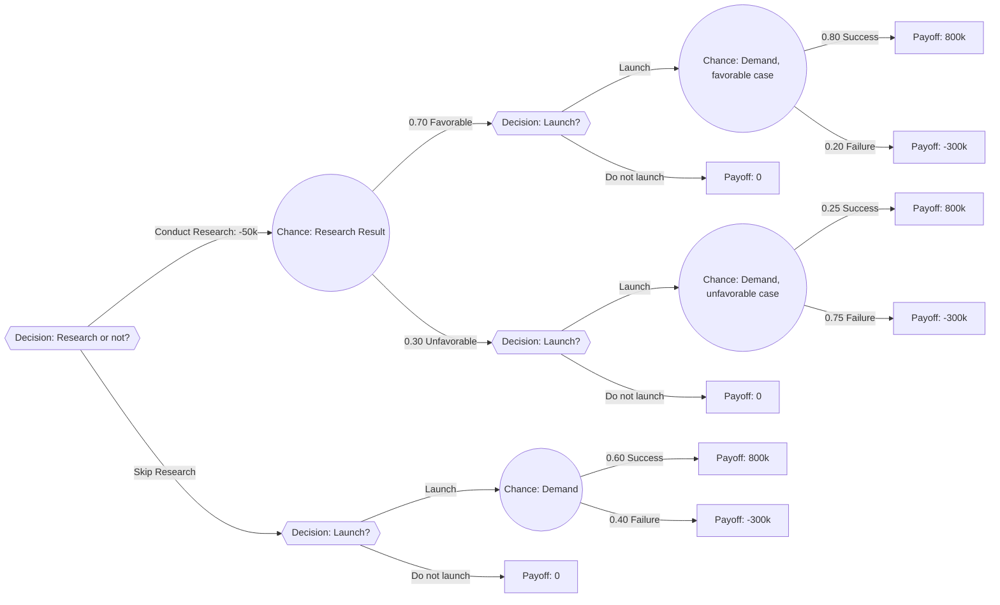

## Decision Trees for Sequential Decision Problems

### Definition and Core Concept

A **decision tree** is a graphical and analytical tool used to structure and solve decision problems that involve a **sequence** of decisions and uncertain events unfolding over time, where later decisions may depend on the outcomes of earlier chance events. Decision trees extend basic expected value analysis to multi-stage problems by explicitly mapping out the branching structure of decisions and outcomes, then applying expected value calculations systematically from the end of the tree back to the beginning — a technique known as **backward induction** or "folding back" the tree.

- Decision trees are appropriate under conditions of **measurable risk** (as distinguished from Knightian uncertainty), since each chance event in the tree requires an assigned probability
- The technique is particularly valuable for problems with **sequential structure**: an initial decision, followed by a chance event, followed potentially by a further decision that depends on how the chance event resolved, and so on

### Components of a Decision Tree

**Key Points**

- **Decision nodes** (conventionally drawn as squares): points where the decision-maker chooses among available alternative actions; the decision-maker controls the outcome at these nodes
- **Chance nodes** (conventionally drawn as circles): points where an uncertain event occurs, with each possible outcome branch assigned a probability; the decision-maker does not control the outcome at these nodes, only observes it after it occurs
- **Terminal nodes / payoffs** (conventionally drawn as triangles or simply as end-of-branch values): the final payoff (profit, cost, utility) associated with a complete path through the tree from the initial decision to that endpoint
- **Branches**: lines connecting nodes, representing either an available choice (from a decision node) or a possible outcome (from a chance node)

### The Backward Induction (Fold-Back) Procedure

**Key Points**

The tree is solved by working from right to left (from the final outcomes back toward the initial decision):

1. At each **chance node**, compute the expected value by multiplying each branch's payoff by its probability and summing — this expected value becomes the effective "payoff" assigned to that chance node for purposes of the calculation at the preceding node
2. At each **decision node**, compare the expected values (or, if it is a terminal decision node, the direct payoffs) associated with each available branch, and select the branch with the **highest expected value** (assuming a risk-neutral, expected-value-maximizing decision-maker) — this selected value becomes the effective payoff assigned to that decision node
3. Continue this process leftward through the tree until reaching the initial decision node, at which point the analysis identifies both the optimal initial choice and the expected value of following the optimal strategy at every subsequent decision point (a complete **decision policy**, not just a single action)

### Worked Numeric Example: Sequential New-Product Decision

A firm must decide whether to conduct **market research** ($50,000 cost) before deciding whether to launch a new product, or to skip research and decide immediately.

**Without market research**, the firm faces a direct launch decision:

- Launch: 60% chance of $800,000 profit, 40% chance of -$300,000 loss
- Do not launch: $0 profit (certain)

**With market research** ($50,000 cost), the research outcome itself is uncertain:

- 70% chance research indicates "favorable" conditions, after which the firm would still face a launch decision, but with revised (better) odds: 80% chance of $800,000 profit, 20% chance of -$300,000 loss if it launches
- 30% chance research indicates "unfavorable" conditions, after which revised odds are: 25% chance of $800,000 profit, 75% chance of -$300,000 loss if it launches

**Step 1 — Fold back the "without research" branch:**

$$EV(\text{Launch, no research}) = 0.60(800{,}000) + 0.40(-300{,}000) = 480{,}000 - 120{,}000 = \$360{,}000$$

Since $360,000 > $0 (do not launch), the optimal choice without research is to launch, yielding $EV = \$360{,}000$.

**Step 2 — Fold back the "favorable research" branch:**

$$EV(\text{Launch} \mid \text{favorable}) = 0.80(800{,}000) + 0.20(-300{,}000) = 640{,}000 - 60{,}000 = \$580{,}000$$

Since this exceeds $0 (do not launch), the optimal choice given favorable research is to launch, yielding $EV = \$580{,}000$.

**Step 3 — Fold back the "unfavorable research" branch:**

$$EV(\text{Launch} \mid \text{unfavorable}) = 0.25(800{,}000) + 0.75(-300{,}000) = 200{,}000 - 225{,}000 = -\$25{,}000$$

Since $-\$25{,}000 < \$0$ (do not launch), the optimal choice given unfavorable research is to **not launch**, yielding $EV = \$0$.

**Step 4 — Fold back the market research chance node:**

$$EV(\text{Research branch}) = 0.70(580{,}000) + 0.30(0) = 406{,}000$$

Subtracting the $50,000 research cost:

$$EV(\text{Conduct research}) = 406{,}000 - 50{,}000 = \$356{,}000$$

**Step 5 — Compare the initial decision:**

$$EV(\text{Conduct research}) = \$356{,}000 \quad \text{vs.} \quad EV(\text{No research, launch directly}) = \$360{,}000$$

Since $360,000 > $356,000, the fold-back analysis indicates the firm is (marginally) better off **skipping market research and launching directly**, despite research providing valuable information, because in this particular numeric example the cost of research ($50,000) slightly exceeds its expected value of improving the launch decision. [Inference] This conclusion is specific to the numeric probabilities, payoffs, and research cost assumed in this illustrative example; changing any of these inputs (e.g., a cheaper or more diagnostically reliable research study) could reverse which branch has the higher expected value.

### Diagrammatic Representation

### The Expected Value of Perfect and Sample Information

**Key Points**

The market-research example above illustrates a broader and important concept: the **expected value of sample information (EVSI)** — the maximum amount a decision-maker should be willing to pay for an imperfect information source (like a market research study) before it changes the decision, calculated as:

$$EVSI = EV(\text{best strategy with information, before subtracting its cost}) - EV(\text{best strategy without information})$$

In the example above: $EVSI = 406{,}000 - 360{,}000 = \$46{,}000$. Since the actual cost of research ($50,000) exceeds the EVSI ($46,000), the research is not worth purchasing in this case — a direct, quantified justification for the fold-back conclusion above.

A related and simpler benchmark is the **expected value of perfect information (EVPI)** — the maximum a decision-maker should pay for a hypothetically *perfect* forecast (one that removes all uncertainty about the outcome before the decision is made), calculated as the difference between the expected value under perfect foresight and the expected value of the best strategy without any additional information. EVPI provides a theoretical upper bound: no real (imperfect) information source, such as market research, should ever be worth more than EVPI, since perfect information is by definition at least as valuable as any imperfect source.

### Sensitivity Analysis Within Decision Trees

**Key Points**

Because the optimal decision path depends on the specific probability and payoff estimates used, it is standard practice to test how **sensitive** the fold-back conclusion is to changes in key inputs — for example, recalculating the tree under a range of plausible probability estimates for the chance nodes, or a range of plausible cost estimates for an action like market research, to determine whether the recommended decision changes materially across that range. [Inference] The degree of sensitivity in any specific decision tree depends entirely on the particular numeric structure of that tree; some trees have a decision that remains optimal across a wide range of input assumptions (a "robust" recommendation), while others are highly sensitive to small input changes, and this should be checked explicitly rather than assumed.

### Advantages and Limitations of Decision Tree Analysis

**Key Points**

- **Advantage — explicit structure:** Decision trees force the decision-maker to explicitly enumerate the sequence of decisions, chance events, and payoffs, which itself can surface previously unconsidered options or outcomes and improve the clarity of the decision problem
- **Advantage — handles sequential/contingent decisions:** Unlike a single-stage expected value calculation, decision trees correctly capture situations where a later decision should depend on the resolution of an earlier uncertain event (a defining feature of many real strategic and operational decisions)
- **Limitation — probability and payoff estimation:** Like all expected-value-based tools, decision tree analysis requires the decision-maker to supply probability estimates and payoff values for every branch; the reliability of the tree's conclusion is entirely bounded by the reliability of these inputs
- **Limitation — assumes risk neutrality by default:** The basic fold-back procedure described above selects branches based on raw expected monetary value, implicitly treating the decision-maker as risk-neutral; incorporating risk aversion requires substituting expected utility values for raw expected monetary values at each node, a modification covered under expected utility theory
- **Limitation — tree complexity:** Real-world sequential decisions can involve many decision points and chance events, causing the tree to grow very large ("combinatorial explosion") and potentially difficult to construct, communicate, and validate for large or highly branching problems [Inference]

### Common Pitfalls and Practical Limitations

- **Omitting relevant branches or options:** A decision tree is only as complete as the alternatives and outcomes the analyst includes; omitting a viable strategic option or a plausible outcome can bias the fold-back conclusion without the omission being visually obvious in the final tree diagram
- **Anchoring on a single set of probability estimates:** Presenting the fold-back result from only one specific probability scenario, without sensitivity analysis across a plausible range, can create false confidence in a conclusion that might reverse under only modestly different assumptions
- **Ignoring correlation between chance nodes:** Standard decision tree construction generally treats sequential chance nodes as having probabilities conditioned appropriately on the branch taken to reach them, but analysts must take care to correctly specify these conditional probabilities rather than mistakenly treating sequential uncertain events as unconditionally independent when they are not
- **Confusing expected value with a guaranteed outcome:** As with basic expected value analysis, the fold-back result identifies the optimal expected value across the branching structure, not a guarantee of what will actually occur along any single realized path through the tree

### Related Topics

- Probability distributions and expected value analysis
- Expected utility theory and risk attitudes
- Distinguishing risk from uncertainty
- Value of information (perfect and sample information)
- Sensitivity analysis and Monte Carlo simulation
- Real options analysis in capital budgeting