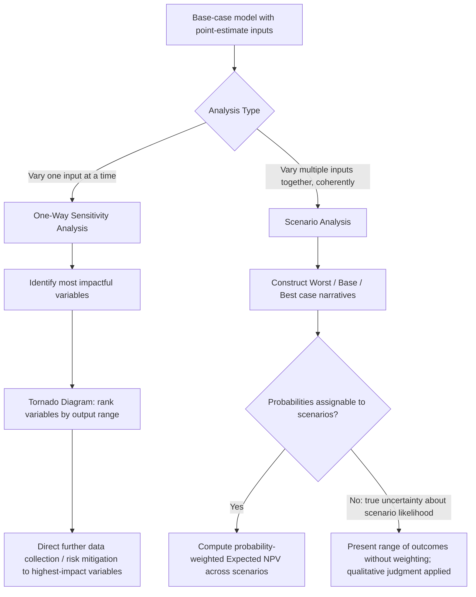

## Sensitivity and Scenario Analysis

### Definition and Core Concept

**Sensitivity analysis** and **scenario analysis** are complementary techniques used to examine how a decision's outcome (typically an expected value, net present value, or recommended course of action) changes in response to variation in the underlying input assumptions. Both techniques address a core limitation of standard expected-value and decision-tree analysis: that the reliability of any quantitative conclusion is entirely bounded by the reliability of the input estimates used, and decision-makers benefit from understanding *how much* a conclusion depends on any single assumption before committing to it.

- **Sensitivity analysis** typically varies **one input variable at a time** (holding all others constant) to isolate that variable's individual effect on the outcome — sometimes called "what-if" analysis
- **Scenario analysis** varies **multiple input variables simultaneously**, in internally consistent combinations, to construct a small number of coherent alternative futures (commonly "best case," "base case," and "worst case," though more scenarios can be constructed) and evaluates the outcome under each complete scenario

### Why These Techniques Are Necessary

**Key Points**

- Point-estimate expected value calculations, net present value analyses, and decision-tree fold-back results present a single "answer" that obscures how much that answer would change if the underlying assumptions (demand forecasts, cost estimates, discount rates, probability estimates) turned out to be even modestly different from what was assumed
- Presenting only a single-point conclusion risks creating a false sense of precision, particularly for decisions that rely on estimates of variables that are inherently difficult to forecast precisely (future demand, competitor behavior, macroeconomic conditions)
- Sensitivity and scenario analysis provide **decision-makers with a range** of possible outcomes and, importantly, identify **which specific assumptions matter most** to the ultimate conclusion — information that is directly actionable, since it tells the analyst where additional research or data-gathering effort would be most valuable, and tells the decision-maker which assumptions deserve the most scrutiny before committing to a course of action

### One-Way Sensitivity Analysis

**Key Points**

The simplest form of sensitivity analysis varies a single input variable across a plausible range while holding all other inputs at their base-case values, and observes how the output (e.g., NPV) responds.

**Example:** A firm evaluating a new project has a base-case NPV of $500,000, calculated using an assumed unit sales volume of 10,000 units per year. A one-way sensitivity analysis on sales volume alone might produce:

| Sales Volume (units/year) | Resulting NPV |
| --- | --- |
| 7,000 (pessimistic) | -$200,000 |
| 10,000 (base case) | $500,000 |
| 13,000 (optimistic) | $1,200,000 |

This single table immediately reveals that the project's NPV is **highly sensitive** to the sales volume assumption — a roughly 30% shortfall in volume relative to the base case would turn the project from profitable to unprofitable, information that is far more actionable for a decision-maker than the single $500,000 base-case figure alone.

### The Tornado Diagram

A common way to visually summarize the results of *multiple* one-way sensitivity analyses (one for each key input variable) is the **tornado diagram**, which ranks variables by the width of the output range they produce when varied across their own plausible range, with the widest (most impactful) variable displayed at the top.

<svg xmlns="http://www.w3.org/2000/svg" viewBox="0 0 800 400" font-family="Arial, sans-serif">
<text x="400" y="24" text-anchor="middle" font-size="16" font-weight="bold">Tornado Diagram: NPV Sensitivity by Input Variable (svg_diagram)</text>
<line x1="400" y1="60" x2="400" y2="360" stroke="black" stroke-width="1" />
<text x="400" y="378" text-anchor="middle" font-size="11">Base-case NPV</text>

<rect x="150" y="75" width="500" height="35" fill="#dc2626" fill-opacity="0.6" />
<text x="60" y="97" font-size="12" text-anchor="end">Sales Volume</text>

<rect x="220" y="130" width="360" height="35" fill="#f97316" fill-opacity="0.6" />
<text x="60" y="152" font-size="12" text-anchor="end">Unit Price</text>

<rect x="280" y="185" width="240" height="35" fill="#eab308" fill-opacity="0.6" />
<text x="60" y="207" font-size="12" text-anchor="end">Variable Cost</text>

<rect x="330" y="240" width="140" height="35" fill="#16a34a" fill-opacity="0.6" />
<text x="60" y="262" font-size="12" text-anchor="end">Discount Rate</text>

<rect x="365" y="295" width="70" height="35" fill="#2563eb" fill-opacity="0.6" />
<text x="60" y="317" font-size="12" text-anchor="end">Fixed Cost</text>

<text x="400" y="345" text-anchor="middle" font-size="11" font-style="italic">Variables ranked by output range — widest bars (top) have the greatest impact on NPV</text>

</svg>

**Key Points**

The tornado diagram's primary value is **prioritization**: it directs managerial attention and any further data-gathering, forecasting refinement, or risk-mitigation effort toward the variables that most influence the decision (sales volume and unit price in the illustration above), rather than spreading equal analytical attention across every input regardless of its actual impact on the outcome.

### Scenario Analysis

**Key Points**

Unlike one-way sensitivity analysis, scenario analysis varies **several inputs together in internally consistent combinations**, reflecting the reality that many input variables are correlated with one another in a coherent underlying economic scenario (e.g., a recession scenario would plausibly involve both lower sales volume *and* pricing pressure simultaneously, not one changing while the other stays fixed).

**Example:** Continuing the project evaluation above, a full scenario analysis might specify:

| Scenario | Sales Volume | Unit Price | Variable Cost | Resulting NPV |
| --- | --- | --- | --- | --- |
| Worst case | 7,000 units | $45 | $32 | -$650,000 |
| Base case | 10,000 units | $50 | $28 | $500,000 |
| Best case | 13,500 units | $55 | $25 | $1,800,000 |

Note that in the worst-case scenario, sales volume *and* price *and* cost all move unfavorably together, reflecting a coherent narrative (e.g., a demand downturn coinciding with competitive pricing pressure and rising input costs) — this internal consistency across variables is the defining feature that distinguishes scenario analysis from a simple set of independent one-way sensitivity tests.

### Combining Scenario Analysis with Probability: Expected Value Across Scenarios

**Key Points**

If probabilities can reasonably be assigned to each constructed scenario, scenario analysis can be combined directly with expected value analysis:

$$E[\text{NPV}] = \sum_{s} p_s \cdot NPV_s$$

**Example:** Assigning probabilities of 0.25 (worst case), 0.50 (base case), and 0.25 (best case) to the scenarios above:

$$E[\text{NPV}] = 0.25(-650{,}000) + 0.50(500{,}000) + 0.25(1{,}800{,}000)$$

$$= -162{,}500 + 250{,}000 + 450{,}000 = \$537{,}500$$

This combined approach retains the internally consistent, multi-variable structure of scenario analysis while still producing a single expected-value summary figure, bridging the two techniques rather than treating them as mutually exclusive.

### Diagrammatic Overview of the Sensitivity/Scenario Analysis Process

### Relationship to Monte Carlo Simulation

**Key Points**

Sensitivity analysis (one variable at a time) and scenario analysis (a small number of discrete, coherent combinations) can both be understood as simplified precursors to **Monte Carlo simulation**, a more computationally intensive technique that assigns full probability distributions to multiple uncertain inputs simultaneously and repeatedly samples from those distributions (often thousands of times) to generate a complete probability distribution of the output (e.g., NPV) rather than just a handful of discrete scenario points.

- Monte Carlo simulation captures the effect of inputs varying **continuously and simultaneously** (including correlations between inputs, if specified), providing a fuller picture of output risk than a small number of discrete scenarios can
- [Inference] Monte Carlo simulation requires meaningfully more data and modeling effort to specify full probability distributions (and correlation structures) for each uncertain input, compared to the relatively lightweight effort of one-way sensitivity analysis or a small set of scenarios; the appropriate level of analytical sophistication for a given decision depends on the stakes involved and the availability of reliable input data, and is a matter of practical judgment rather than a fixed rule

### Sensitivity Analysis in Situations of Genuine Uncertainty

**Key Points**

When a decision involves genuine Knightian uncertainty rather than measurable risk — meaning reliable probabilities cannot be assigned even to a small set of scenarios — scenario analysis can still be valuable as a purely **qualitative exploration tool**, presenting a range of plausible futures without attempting to probability-weight them into a single expected value. In such cases, the scenarios serve to stress-test a proposed decision's robustness (does it perform acceptably across *all* plausible scenarios, even without knowing which is most likely?) rather than to compute a single best-estimate expected outcome — an approach more aligned with the decision criteria used explicitly under uncertainty (such as maximin or minimax regret) than with expected-value maximization.

### Common Pitfalls and Practical Limitations

- **False precision in probability weighting:** Assigning specific numeric probabilities to scenarios (as in the expected-value-across-scenarios calculation above) can create a false sense of analytical rigor if those probabilities are themselves not well-grounded — this is a direct instance of the broader risk/uncertainty distinction, and analysts should be cautious about applying probability weights to scenarios representing outcomes for which no reliable probability basis actually exists [Inference]
- **Anchoring on only three scenarios:** The common "worst/base/best case" structure, while useful for communication, can create an implicit and potentially misleading anchor suggesting these three points span the *entire* plausible range of outcomes, when in reality more extreme outcomes (better than "best case" or worse than "worst case") may remain possible but unexamined
- **Ignoring correlation in one-way sensitivity analysis:** Because one-way sensitivity analysis varies only a single input while holding all others fixed, it can understate the true range of possible outcomes if, in reality, multiple inputs are likely to move together (as scenario analysis is specifically designed to address) — using one-way sensitivity results alone, without complementary scenario or simulation analysis, risks an incomplete picture of joint variable risk
- **Overreliance on tornado diagram rankings without examining interaction effects:** A tornado diagram, by construction, shows each variable's *individual* effect holding others constant, and does not directly reveal interaction effects between variables (where the combined effect of two variables moving together differs from the sum of their individual effects) [Inference]

### Related Topics

- Probability distributions and expected value analysis
- Decision trees for sequential decision problems
- Distinguishing risk from uncertainty
- Monte Carlo simulation in capital budgeting
- Decision criteria under uncertainty (maximin, maximax, minimax regret)
- Net present value and capital budgeting under risk