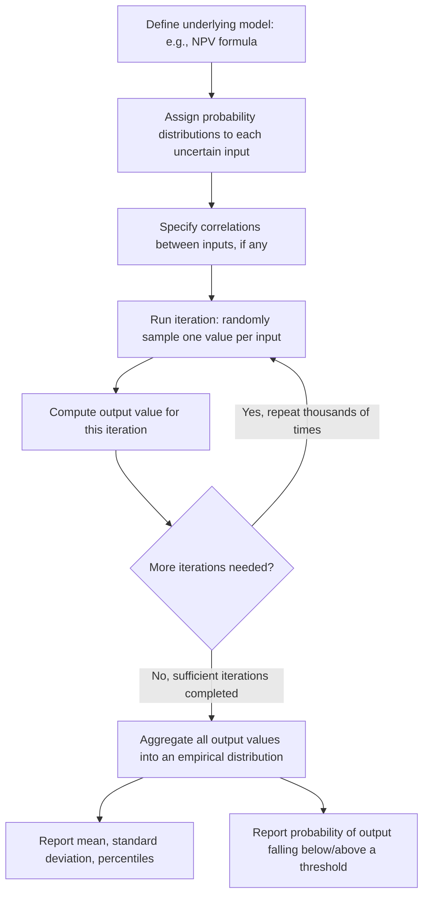

## Monte Carlo Simulation in Managerial Decisions

### Definition and Core Concept

**Monte Carlo simulation** is a computational technique that models the uncertainty in a managerial decision by assigning full probability distributions to multiple uncertain input variables simultaneously, then repeatedly generating random samples from those distributions (often thousands or tens of thousands of times) to compute the corresponding output value on each iteration. Aggregating the results across all iterations produces an entire **probability distribution of the output** (e.g., project NPV, expected profit) rather than a single point estimate or a small handful of discrete scenarios.

- The technique is named after the Monte Carlo casino, reflecting its foundation in repeated random sampling analogous to games of chance
- Monte Carlo simulation is best understood as a natural extension of the sensitivity and scenario analysis techniques covered previously: where scenario analysis examines a small number of discrete, coherent input combinations, Monte Carlo simulation examines the full continuous range of possible input combinations, weighted according to their specified probability distributions

### Why Monte Carlo Simulation Is Used

**Key Points**

- Many real managerial decisions involve **multiple simultaneously uncertain inputs** (e.g., unit sales volume, unit price, variable cost per unit, and the discount rate, all uncertain at once) whose combined effect on the output cannot be easily derived analytically, particularly when the underlying model involves non-linear relationships or complex interactions between variables
- A small number of discrete scenarios (as in basic scenario analysis) necessarily leaves gaps between the examined points and can miss important regions of the output distribution, particularly the **tails** of the distribution (very good or very bad outcomes) that may be individually unlikely but still decision-relevant
- Monte Carlo simulation directly produces useful risk metrics that point estimates cannot: the full **probability distribution of NPV or profit**, the probability that the outcome falls below a critical threshold (e.g., the probability of a negative NPV), and standard statistical summary measures (mean, standard deviation, percentiles) describing the output's dispersion

### The Monte Carlo Simulation Process

**Key Points**

1. **Build the underlying model:** Specify the mathematical relationship connecting the uncertain inputs to the output of interest (e.g., an NPV formula that depends on sales volume, price, variable cost, fixed cost, and the discount rate)
2. **Assign probability distributions to each uncertain input:** Rather than a single point estimate, each key input is specified with a full distribution (e.g., sales volume might be modeled as normally distributed with a specified mean and standard deviation, or as triangularly distributed with a specified minimum, most-likely, and maximum value based on expert judgment)
3. **Specify any correlations between inputs:** If inputs are believed to move together in a coherent economic relationship (e.g., higher sales volume correlated with lower per-unit variable cost due to economies of scale), correlation structures can be built into the simulation so that random draws respect these relationships rather than treating every input as fully independent
4. **Run repeated random iterations:** On each iteration, the simulation software randomly draws one value from each input's specified distribution (respecting any specified correlations), computes the resulting output value using the underlying model, and records that output
5. **Aggregate results across all iterations:** After many iterations (commonly thousands to tens of thousands, depending on the desired precision and the complexity of the model), the collected output values form an empirical probability distribution, from which summary statistics and probability estimates can be computed

### Diagrammatic Representation of the Process

### Worked Conceptual Example

A firm evaluating a new product's first-year profit models the outcome as:

$$\text{Profit} = (\text{Price} - \text{Variable Cost}) \times \text{Sales Volume} - \text{Fixed Cost}$$

Rather than plugging in single point estimates for each variable, the firm specifies:

| Input | Distribution Assumption |
| --- | --- |
| Price | Normal, mean $50, standard deviation $3 |
| Variable Cost | Normal, mean $28, standard deviation $2 |
| Sales Volume | Triangular, minimum 8,000, most likely 10,000, maximum 14,000 |
| Fixed Cost | Fixed (known with certainty) at $150,000 |

On each of, say, 10,000 simulation iterations, the software randomly draws a Price, Variable Cost, and Sales Volume value from their respective distributions, computes the resulting Profit for that iteration, and stores it. After all iterations are complete, the firm can report results such as: "the simulation indicates a mean expected profit of $95,000, a standard deviation of $42,000, and a 18% probability that first-year profit will be negative." [Inference] These specific illustrative summary figures depend on the exact distributional assumptions and random sampling used; presented here purely to demonstrate the *type* of output Monte Carlo simulation generates, not as a literal calculated result from a specific real dataset.

### Interpreting Monte Carlo Simulation Output

<svg xmlns="http://www.w3.org/2000/svg" viewBox="0 0 800 400" font-family="Arial, sans-serif">
<text x="400" y="24" text-anchor="middle" font-size="16" font-weight="bold">Monte Carlo Output: Distribution of Simulated Profit (svg_diagram)</text>
<line x1="80" y1="340" x2="720" y2="340" stroke="black" stroke-width="1.5" />
<line x1="80" y1="340" x2="80" y2="60" stroke="black" stroke-width="1.5" />
<text x="30" y="65" font-size="12">Frequency</text>
<text x="680" y="358" font-size="12">Simulated Profit</text>

<rect x="150" y="320" width="30" height="20" fill="#dc2626" fill-opacity="0.5" />
<rect x="180" y="290" width="30" height="50" fill="#dc2626" fill-opacity="0.5" />
<rect x="210" y="250" width="30" height="90" fill="#f97316" fill-opacity="0.5" />
<rect x="240" y="200" width="30" height="140" fill="#eab308" fill-opacity="0.5" />
<rect x="270" y="150" width="30" height="190" fill="#16a34a" fill-opacity="0.5" />
<rect x="300" y="110" width="30" height="230" fill="#16a34a" fill-opacity="0.6" />
<rect x="330" y="100" width="30" height="240" fill="#16a34a" fill-opacity="0.7" />
<rect x="360" y="120" width="30" height="220" fill="#16a34a" fill-opacity="0.6" />
<rect x="390" y="160" width="30" height="180" fill="#eab308" fill-opacity="0.5" />
<rect x="420" y="210" width="30" height="130" fill="#f97316" fill-opacity="0.5" />
<rect x="450" y="260" width="30" height="80" fill="#dc2626" fill-opacity="0.5" />
<rect x="480" y="300" width="30" height="40" fill="#dc2626" fill-opacity="0.4" />

<line x1="200" y1="340" x2="200" y2="60" stroke="black" stroke-width="1.5" stroke-dasharray="5,3" />
<text x="130" y="55" font-size="11">Profit = \$0 threshold</text>

<text x="400" y="380" text-anchor="middle" font-size="11" font-style="italic">Shaded area left of the threshold line represents the simulated probability of a loss</text>

</svg>

### Applications in Managerial Decision-Making

#### Capital Budgeting and Project Evaluation

- **Example:** Simulating a project's NPV distribution by assigning distributions to uncertain cash flow drivers (sales growth rate, input costs, competitive response) across multiple future years, producing a full risk profile of the investment rather than a single NPV figure

#### Inventory and Supply Chain Management

- **Example:** Simulating uncertain customer demand and supplier lead times to determine appropriate safety stock levels and evaluate the probability of stockouts under a given inventory policy

#### New Product Launch Risk Assessment

- **Example:** Simulating combined uncertainty in market adoption rate, pricing, and production cost to assess the probability that a new product achieves a minimum acceptable return, directly informing the go/no-go launch decision

#### Portfolio and Project Selection

- **Example:** Comparing the simulated output distributions of several candidate projects side by side, allowing decision-makers to evaluate not just each project's expected value but also its relative risk profile (e.g., a project with a lower expected NPV but a much narrower, more predictable distribution might be preferred by a risk-averse firm over a higher-expected-value project with a wide, high-variance distribution)

### Advantages Relative to Simpler Techniques

**Key Points**

- **Captures joint variation:** Unlike one-way sensitivity analysis, Monte Carlo simulation naturally captures the combined effect of multiple inputs varying simultaneously, including any specified correlations between them
- **Produces a full distribution, not just discrete points:** Unlike basic scenario analysis (which typically examines only a handful of discrete combinations), simulation produces a continuous empirical distribution, allowing for more nuanced risk metrics such as specific percentiles or the exact probability of exceeding/falling below any chosen threshold
- **Communicates risk more completely:** Presenting a decision-maker with a full distribution (or a histogram/probability curve) rather than a single number better conveys both the expected outcome and the genuine uncertainty surrounding it, supporting more informed risk-based decision-making

### Limitations and Practical Considerations

**Key Points**

- **Garbage-in, garbage-out risk:** Monte Carlo simulation is only as reliable as the probability distributions specified for each input; if those distributions (their shape, mean, standard deviation, or correlation assumptions) are poorly estimated or unjustified, the resulting output distribution will be correspondingly unreliable, despite the sophisticated-seeming computational process used to generate it [Inference]
- **Model specification risk:** The simulation is also entirely dependent on the correctness of the underlying mathematical model connecting inputs to outputs; an incorrectly specified model (e.g., omitting an important cost driver, or mis-specifying how variables interact) will produce a misleading output distribution no matter how well the individual input distributions are estimated
- **Computational and software requirements:** Running a meaningful Monte Carlo simulation typically requires dedicated software or spreadsheet add-ins capable of repeated random sampling and result aggregation, representing a greater implementation effort than a simple sensitivity table or a handful of manually calculated scenarios [Inference]
- **Correlation misspecification:** Incorrectly assuming inputs are independent when they are actually correlated (or vice versa) can produce a systematically biased output distribution — for example, understating the width of the output distribution's tails if genuinely correlated inputs are modeled as independent, since independent variation tends to average out more than correlated variation does
- **Interpretation requires statistical literacy:** Effectively using and communicating simulation output (percentiles, probability of loss, distributional shape) requires a degree of statistical literacy among decision-makers that a simple point estimate or basic scenario table does not demand, which can be a practical barrier to adoption or a source of misinterpretation if the audience is unfamiliar with probabilistic output [Inference]

### Comparison Across Risk Analysis Techniques

| Technique | Inputs Varied | Output Produced | Relative Complexity |
| --- | --- | --- | --- |
| One-way sensitivity analysis | One at a time | Output range per variable | Low |
| Scenario analysis | Multiple, in a few discrete combinations | A handful of discrete output values | Low to moderate |
| Decision tree analysis | Sequential chance/decision nodes | Optimal expected value and decision policy | Moderate |
| Monte Carlo simulation | Multiple, continuously and simultaneously | Full probability distribution of output | High |

### Common Pitfalls and Practical Limitations

- **Overconfidence in simulation precision:** The sheer volume of computed iterations (often thousands) can create an unwarranted impression of precision or rigor that is not actually justified if the underlying input distributions were themselves loosely estimated — the simulation faithfully propagates whatever uncertainty (and whatever errors) exist in its inputs, and does not independently verify or improve the quality of those inputs
- **Neglecting to validate distributional assumptions:** Selecting a convenient distributional form (e.g., defaulting to a normal distribution for every input) without checking whether that form is actually appropriate for the specific variable being modeled can distort the resulting output distribution, particularly in the tails
- **Insufficient number of iterations:** Running too few iterations can produce an output distribution that has not yet converged to a stable estimate, particularly for tail-probability estimates (e.g., the probability of an extreme loss), which by definition require enough iterations to be sampled with reasonable frequency to estimate reliably [Inference]
- **Confusing the simulated distribution with certainty about the future:** As with all probability-based decision tools, the output distribution reflects the modeled uncertainty given the specified inputs and structure — it is not a guarantee of the actual range of future outcomes if the real world deviates from the assumptions embedded in the model

### Related Topics

- Sensitivity and scenario analysis
- Probability distributions and expected value analysis
- Decision trees for sequential decision problems
- Net present value and capital budgeting under risk
- Distinguishing risk from uncertainty
- Correlation and statistical dependence in forecasting models