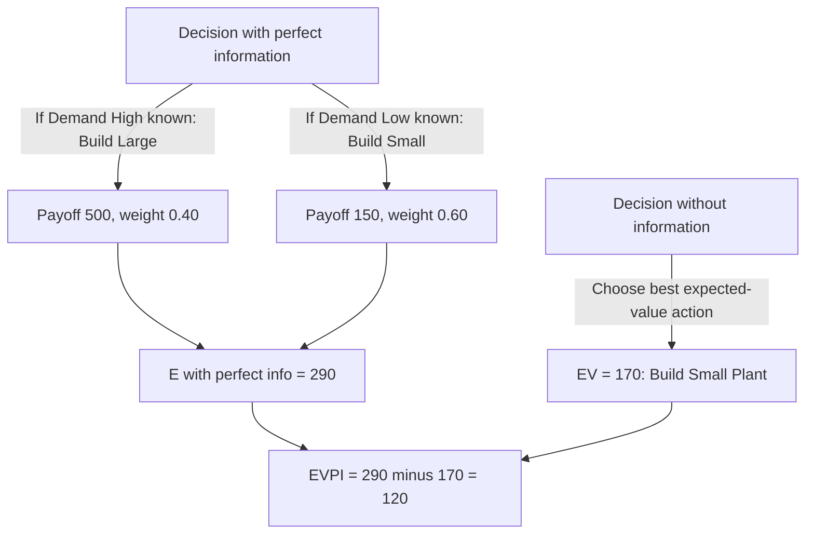

## The Value of Information

### Definition and Core Concept

The **value of information** framework quantifies how much a decision-maker should rationally be willing to pay for additional information *before* making a decision, by comparing the expected value of decision-making *with* that information against the expected value of decision-making *without* it. This framework provides a rigorous, quantitative answer to a pervasive managerial question — "Is it worth commissioning this market research / hiring this consultant / running this pilot test before deciding?" — rather than relying on intuition alone about whether more information is "worth it."

- The value of information is meaningful specifically within the framework of **decision-making under risk**, where outcomes and probabilities can be estimated; the technique quantifies how *additional* information can improve the decision-maker's probability estimates or resolve uncertainty about which state of the world will occur
- Two related but distinct measures are used: the **expected value of perfect information (EVPI)**, representing an idealized upper bound, and the **expected value of sample information (EVSI)**, representing the value of a specific, realistic (imperfect) information source

### Expected Value of Perfect Information (EVPI)

**Key Points**

EVPI answers the question: "If I could know with certainty, in advance, which state of the world (outcome) would occur, how much better off would I be, on average, compared to having to decide under my current uncertainty?"

The formal calculation proceeds in two steps:

1. Compute the expected value of decision-making **with perfect foresight**: for each possible state of the world, determine which action would be optimal *if that state were known with certainty*, and take the payoff of that best action; then average these best-case payoffs across all states, weighted by their probabilities
2. Subtract the expected value of the **best single strategy chosen without additional information** (the standard expected-value-maximizing choice made under current uncertainty)

$$EVPI = E[\text{payoff under perfect information}] - EV(\text{best strategy without information})$$

### Worked Numeric Example: EVPI

A firm must decide whether to build a **large** or **small** manufacturing plant, facing uncertain future demand that will turn out to be either **high** (probability 0.40) or **low** (probability 0.60). The payoff matrix (in $ thousands of profit) is:

| Decision | Demand High (p=0.40) | Demand Low (p=0.60) |
| --- | --- | --- |
| Build Large Plant | 500 | -100 |
| Build Small Plant | 200 | 150 |

**Step 1 — Compute expected value of each action without additional information:**

$$EV(\text{Large}) = 0.40(500) + 0.60(-100) = 200 - 60 = 140$$

$$EV(\text{Small}) = 0.40(200) + 0.60(150) = 80 + 90 = 170$$

The best strategy without additional information is **Build Small Plant**, with $EV = 170$.

**Step 2 — Compute expected value under perfect information:**

If the firm could know demand in advance: when demand will be **High**, the best choice is Large Plant (payoff 500); when demand will be **Low**, the best choice is Small Plant (payoff 150).

$$E[\text{payoff with perfect information}] = 0.40(500) + 0.60(150) = 200 + 90 = 290$$

**Step 3 — Compute EVPI:**

$$EVPI = 290 - 170 = 120$$

The firm should be willing to pay **up to $120,000** for a perfectly reliable forecast of future demand before making the plant-size decision — beyond that amount, purchasing the forecast would not be worthwhile even if it were perfectly accurate, since $120,000 represents the maximum possible improvement in expected value that any information source (however good) could provide.

### Diagrammatic Representation of EVPI

### Expected Value of Sample Information (EVSI)

**Key Points**

Real-world information sources — market research studies, consultant reports, pilot tests, expert forecasts — are almost never perfectly reliable; they provide **imperfect (sample) information** that improves, but does not eliminate, uncertainty about which state of the world will occur. EVSI measures the value of such a realistic, imperfect information source using the decision tree fold-back methodology (detailed under decision trees for sequential decision problems):

$$EVSI = EV(\text{best strategy using the imperfect information, before subtracting its cost}) - EV(\text{best strategy without any additional information})$$

- Computing EVSI requires specifying the **reliability** of the imperfect information source — formally, the conditional probabilities of the information source's possible signals given each true underlying state of the world (e.g., "given that true demand will actually be high, what is the probability the market research study predicts 'high demand'?"), often summarized using Bayes' Theorem to update prior probabilities based on the information signal received
- The fully worked EVSI calculation for a specific market-research example, including the necessary decision-tree fold-back steps, was demonstrated in detail under decision trees for sequential decision problems; the calculation methodology there directly instantiates the EVSI concept defined here

### Relationship Between EVPI and EVSI

**Key Points**

- **EVPI is always the theoretical upper bound on EVSI:** since perfect information is, by definition, at least as informative as any imperfect (sample) information source, no real information-gathering activity should ever be assigned a value exceeding the EVPI for that same decision — if a proposed information source is estimated to have an EVSI greater than the EVPI, this is a signal that the EVSI calculation itself likely contains an error
- The **ratio $EVSI / EVPI$** is sometimes used as an informal measure of an imperfect information source's **efficiency** relative to the theoretical ideal — a market research study with an EVSI close to its situation's EVPI is capturing most of the theoretically available informational value, while one with an EVSI far below EVPI is a relatively weak (low-diagnosticity) information source relative to what perfect information could achieve
- The decision rule for whether to actually purchase a specific real information source is straightforward: **purchase the information if and only if its actual cost is less than its EVSI** — a direct, quantified extension of standard cost-benefit reasoning to the specific problem of valuing information

### Diagrammatic Comparison of EVPI and EVSI

<svg xmlns="http://www.w3.org/2000/svg" viewBox="0 0 800 380" font-family="Arial, sans-serif">
<text x="400" y="24" text-anchor="middle" font-size="16" font-weight="bold">EVPI as Upper Bound on EVSI (svg_diagram)</text>
<line x1="100" y1="320" x2="700" y2="320" stroke="black" stroke-width="1.5" />
<text x="380" y="340" font-size="12">Expected Value</text>

<rect x="150" y="270" width="80" height="50" fill="#9333ea" fill-opacity="0.5" />
<text x="140" y="260" font-size="11" text-anchor="middle">EV, no info</text>

<rect x="300" y="220" width="80" height="100" fill="#2563eb" fill-opacity="0.5" />
<text x="290" y="210" font-size="11" text-anchor="middle">EV, sample info</text>

<rect x="450" y="150" width="80" height="170" fill="#16a34a" fill-opacity="0.5" />
<text x="440" y="140" font-size="11" text-anchor="middle">EV, perfect info</text>

<line x1="600" y1="270" x2="620" y2="270" stroke="black" stroke-width="1" />
<line x1="600" y1="220" x2="620" y2="220" stroke="black" stroke-width="1" />
<line x1="620" y1="220" x2="620" y2="270" stroke="black" stroke-width="1" />
<text x="625" y="248" font-size="11">EVSI</text>
<line x1="650" y1="270" x2="670" y2="270" stroke="black" stroke-width="1" />
<line x1="650" y1="150" x2="670" y2="150" stroke="black" stroke-width="1" />
<line x1="670" y1="150" x2="670" y2="270" stroke="black" stroke-width="1" />
<text x="675" y="215" font-size="11">EVPI</text>

<text x="400" y="365" text-anchor="middle" font-size="11" font-style="italic">EVSI is always less than or equal to EVPI, since sample information is never more valuable than perfect information</text>

</svg>

### Practical Applications

#### Market Research Commissioning Decisions

- **Example:** A firm deciding whether a proposed market research study (with a known cost and an estimable reliability/diagnosticity) is worth commissioning before a major product launch decision, using the EVSI-versus-cost comparison as a formal decision rule rather than relying on intuition about whether "more research is always good"

#### Consulting and Expert Opinion Procurement

- **Example:** Evaluating whether the fee charged by a specialized consultant or industry expert is justified by the expected improvement in decision quality their input would provide, particularly relevant when consulting fees are substantial relative to the scale of the underlying decision

#### Pilot Testing and Staged Investment

- **Example:** A firm considering a small-scale pilot program (e.g., testing a new product in one regional market before a national rollout) can frame the pilot's cost against its EVSI, recognizing that the pilot itself functions as a real information-gathering activity with quantifiable value, directly connecting to real options reasoning in capital budgeting

#### Research and Development Prioritization

- **Example:** Comparing the EVPI/EVSI of different candidate R&D investigation paths (e.g., different technical feasibility studies) to prioritize scarce research budget toward the investigations most likely to meaningfully change a subsequent go/no-go investment decision

### Common Pitfalls and Practical Limitations

- **Treating EVPI as an achievable, realistic figure:** Because EVPI assumes access to perfectly reliable foresight (an idealization essentially never available in practice), it should be interpreted strictly as a **theoretical upper bound** for benchmarking purposes, not as a realistic estimate of what any actual, real-world information source could deliver [Inference]
- **Overestimating the reliability of a real information source when computing EVSI:** EVSI calculations depend critically on accurately specified conditional probabilities describing how reliable/diagnostic the information source actually is; overstating a market research study's or forecast's true reliability will inflate the computed EVSI and could lead to purchasing information that is not actually worth its cost [Inference]
- **Ignoring the time cost of gathering information:** The basic value-of-information framework as presented here does not explicitly account for the possibility that delaying a decision to gather additional information carries its own opportunity cost (e.g., a competitor moving first, or a market window closing) — in decisions where timing itself carries significant value, this additional consideration should be incorporated alongside the basic EVPI/EVSI comparison [Inference]
- **Applying value-of-information logic under genuine Knightian uncertainty:** The EVPI/EVSI framework, like other expected-value-based tools, presumes the underlying probability distribution over states of the world is reasonably reliable; applying it to a situation of genuine, unmeasurable uncertainty risks the same false-precision problem discussed under the broader risk-versus-uncertainty distinction

### Related Topics

- Decision trees for sequential decision problems
- Probability distributions and expected value analysis
- Distinguishing risk from uncertainty
- Bayes' Theorem and updating probability estimates
- Real options analysis in capital budgeting
- Sensitivity and scenario analysis