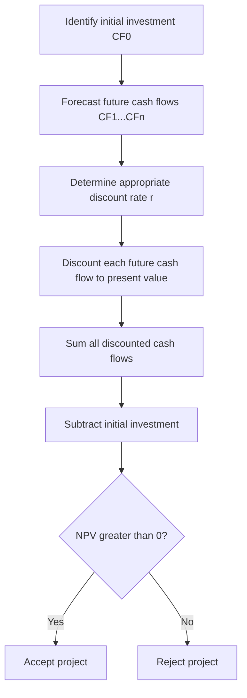

## The Net Present Value Method

### Overview

Net Present Value (NPV) is a capital budgeting technique that measures the value a project adds to a firm by discounting all expected future cash flows to their present value and subtracting the initial investment. It is grounded in the time value of money: a dollar received today is worth more than a dollar received in the future, because today's dollar can be invested to earn a return.

**Key Points**

- NPV expresses a project's profitability in absolute dollar terms, not as a percentage or ratio.
- It explicitly accounts for the timing, magnitude, and risk of cash flows through the discount rate.
- NPV is widely regarded in finance and managerial economics as the theoretically superior capital budgeting criterion because it directly measures the change in shareholder wealth.

---

### The NPV Formula

$$NPV = \sum_{t=1}^{n} \frac{CF_t}{(1+r)^t} - CF_0$$

Where:

- $CF_t$ = net cash flow in period $t$
- $r$ = discount rate (cost of capital, or required rate of return)
- $n$ = project life (number of periods)
- $CF_0$ = initial investment (cash outflow at $t = 0$)

An equivalent expanded form, showing the initial outlay as $CF_0$ at $t=0$:

$$NPV = \sum_{t=0}^{n} \frac{CF_t}{(1+r)^t}, \quad \text{where } CF_0 < 0$$

**Decision Rule**

| NPV Result | Interpretation | Decision |
| --- | --- | --- |
| $NPV > 0$ | Project adds value above the required return | Accept |
| $NPV = 0$ | Project earns exactly the required return | Indifferent (marginally acceptable) |
| $NPV < 0$ | Project destroys value relative to the required return | Reject |

For **mutually exclusive** projects, the decision rule is to select the project with the **highest positive NPV**, since accepting the highest-NPV project maximizes the increase in firm value.

---

### Step-by-Step Calculation Process

**Example (Worked Calculation)**

A firm is considering a project requiring an initial investment of $100,000, expected to generate the following after-tax cash flows over 4 years, discounted at a cost of capital of $r = 10\%$:

| Year | Cash Flow | Discount Factor $1/(1.10)^t$ | Present Value |
| --- | --- | --- | --- |
| 0 | -$100,000 | 1.000 | -$100,000 |
| 1 | $30,000 | 0.9091 | $27,273 |
| 2 | $40,000 | 0.8264 | $33,058 |
| 3 | $45,000 | 0.7513 | $33,809 |
| 4 | $35,000 | 0.6830 | $23,906 |

Sum of discounted inflows = $27,273 + $33,058 + $33,809 + $23,906 = $118,046

$$NPV = 118{,}046 - 100{,}000 = \$18{,}046$$

Since $NPV > 0$, the project is expected to increase firm value by approximately $18,046 in today's dollars and should be accepted [assuming the estimated cash flows and discount rate accurately reflect actual project conditions].

---

### Choosing the Discount Rate

The discount rate $r$ typically represents the firm's **Weighted Average Cost of Capital (WACC)**, reflecting the opportunity cost of funds from both debt and equity sources:

$$WACC = \left(\frac{E}{V}\right)r_e + \left(\frac{D}{V}\right)r_d(1-T)$$

Where $E$ = market value of equity, $D$ = market value of debt, $V = E+D$, $r_e$ = cost of equity, $r_d$ = cost of debt, and $T$ = corporate tax rate.

**Key Points**

- Higher-risk projects often warrant a risk-adjusted discount rate above the firm's WACC to compensate for greater uncertainty in projected cash flows.
- Using an inappropriately low discount rate overstates NPV; an inappropriately high rate understates it.
- The discount rate should reflect the risk of the *project*, not necessarily the risk of the firm as a whole, particularly for divisions or projects with different risk profiles than the firm's core business. [Inference: this is standard corporate finance practice, though firms vary in how rigorously they apply project-specific rates]

---

### Why NPV Is Preferred in Managerial Decision-Making

**Key Points**

- **Accounts for time value of money** — unlike simple payback period, NPV recognizes that cash flows received sooner are more valuable.
- **Uses all cash flows** — unlike payback period, which ignores cash flows beyond the cutoff date, NPV incorporates the entire project life.
- **Additivity property** — NPVs of independent projects can be summed to determine the combined effect on firm value: $NPV(A+B) = NPV(A) + NPV(B)$. This "value additivity" does not generally hold for IRR.
- **Direct link to shareholder wealth** — a positive NPV project is expected to increase the market value of the firm by that amount, aligning capital budgeting decisions with the firm's objective of value maximization.
- **Avoids IRR's reinvestment assumption problem** — NPV implicitly assumes cash flows are reinvested at the discount rate $r$ (a realistic opportunity cost), whereas Internal Rate of Return (IRR) assumes reinvestment at the IRR itself, which can be unrealistic for high-IRR projects.

---

### NPV Compared to Other Capital Budgeting Methods

| Method | Basis | Key Limitation |
| --- | --- | --- |
| **NPV** | Discounted dollar value added | Requires an accurate discount rate estimate |
| **IRR** (Internal Rate of Return) | Discount rate at which $NPV = 0$ | Can yield multiple or no real solutions for non-conventional cash flows; unrealistic reinvestment assumption |
| **Payback Period** | Time to recover initial investment | Ignores time value of money and cash flows after payback |
| **Discounted Payback Period** | Time to recover investment using discounted cash flows | Still ignores cash flows after the cutoff point |
| **Profitability Index (PI)** | Ratio of PV of inflows to initial investment | Useful for capital rationing but can conflict with NPV ranking for mutually exclusive projects of different scale |

**Relationship between NPV and PI**:

$$PI = \frac{\text{PV of future cash flows}}{CF_0} = \frac{NPV + CF_0}{CF_0}$$

A project is acceptable under PI when $PI > 1$, which is mathematically equivalent to $NPV > 0$.

---

### Handling Conflicts Between NPV and IRR

Conflicts between NPV and IRR rankings can arise for mutually exclusive projects due to:

1. **Differences in project scale** — a project with a larger initial investment can have a lower IRR but a higher NPV.
2. **Differences in the timing of cash flows** — projects with cash flows concentrated later may have lower IRR but higher NPV at low discount rates, and vice versa.

The **crossover rate** — the discount rate at which two projects have equal NPV — can be found by computing the IRR of the difference in their cash flow streams. When the firm's cost of capital is below the crossover rate, NPV and IRR rankings may disagree; when NPV and IRR conflict, NPV is generally regarded as the more reliable criterion because it directly measures dollar value added under a realistic reinvestment assumption.

---

### Sensitivity of NPV to the Discount Rate (NPV Profile)

<svg xmlns="http://www.w3.org/2000/svg" viewBox="0 0 700 380" font-family="Arial, sans-serif">
<rect x="0" y="0" width="700" height="380" fill="#ffffff" stroke="#333333" />
<text x="20" y="26" font-size="16" font-weight="bold" fill="#111111">NPV Profile: NPV vs. Discount Rate (svg_diagram)</text>
<line x1="70" y1="320" x2="650" y2="320" stroke="#333333" stroke-width="2" />
<line x1="70" y1="320" x2="70" y2="50" stroke="#333333" stroke-width="2" />
<text x="350" y="355" font-size="13" fill="#111111">Discount Rate (%)</text>
<text x="20" y="180" font-size="13" fill="#111111" transform="rotate(-90 20 180)">NPV (\$)</text>
<line x1="70" y1="200" x2="650" y2="200" stroke="#cccccc" stroke-dasharray="3,3" />
<text x="600" y="215" font-size="11" fill="#888888">NPV = 0</text>
<path d="M 90 80 C 200 130, 300 175, 380 200 C 460 225, 550 270, 620 300" fill="none" stroke="#2563eb" stroke-width="3" />
<circle cx="380" cy="200" r="5" fill="#dc2626" />
<text x="390" y="195" font-size="12" fill="#dc2626" font-weight="bold">IRR (NPV = 0)</text>
<circle cx="150" cy="105" r="5" fill="#16a34a" />
<text x="160" y="100" font-size="11" fill="#16a34a">NPV positive at low rates</text>
<circle cx="550" cy="270" r="5" fill="#dc2626" />
<text x="450" y="300" font-size="11" fill="#dc2626">NPV negative at high rates</text>

<text x="70" y="335" font-size="11" fill="`#555555`">0%</text>

<text x="620" y="335" font-size="11" fill="`#555555`">High r</text>

</svg>

As the discount rate rises, NPV declines because future cash flows are discounted more heavily. The point where the NPV curve crosses zero is, by definition, the project's IRR.

---

### Special Considerations in Practice

**Unequal Project Lives**

When comparing mutually exclusive projects with different lifespans, raw NPV comparison can be misleading. Common adjustments include the **Equivalent Annual Annuity (EAA)** method:

$$EAA = \frac{NPV \times r}{1 - (1+r)^{-n}}$$

The project with the higher EAA is preferred, since it expresses NPV as an equivalent constant annual cash flow.

**Capital Rationing**

When capital is limited and the firm cannot fund all positive-NPV projects, the **Profitability Index** is often used to rank and select projects that maximize total NPV within the budget constraint, rather than choosing based on NPV alone.

**Inflation Consistency**

Cash flows and discount rates must be treated consistently — nominal cash flows should be discounted at a nominal rate, and real cash flows at a real rate, to avoid systematic bias in the NPV estimate:

$$1 + r_{nominal} = (1 + r_{real})(1 + \text{inflation rate})$$

**Sunk Costs and Opportunity Costs**

Only incremental, relevant cash flows should be included in the NPV calculation. Sunk costs (already incurred, unrecoverable) must be excluded, while opportunity costs (value of foregone alternatives, such as using an asset the firm already owns) must be included.

---

### Limitations of NPV

- **Sensitivity to discount rate assumptions** — small changes in $r$ can materially change the NPV result and, in borderline cases, the accept/reject decision. [Inference: the degree of sensitivity depends on how far in the future cash flows are concentrated]
- **Forecast uncertainty** — NPV is only as reliable as the accuracy of projected cash flows, which are inherently uncertain, especially for long-lived or novel projects.
- **Does not express relative efficiency** — a project with a large NPV but very large investment may appear preferable to a smaller, higher-return project, even though the smaller project uses capital more efficiently; PI or IRR are sometimes used alongside NPV to address this.
- **Ignores managerial flexibility** — standard NPV does not capture the value of options to expand, delay, or abandon a project as conditions evolve; **Real Options Analysis** is often used to supplement NPV in such cases.
- **Behavior may vary by context** — actual investment outcomes depend on factors outside the model (competitive response, macroeconomic shifts, execution risk) that a purely quantitative NPV calculation cannot capture. [Unverified: extent of divergence is project- and industry-specific]

---

**Related Topics**

- Internal Rate of Return (IRR) and the multiple IRR problem
- Payback period and discounted payback period
- Profitability Index and capital rationing decisions
- Weighted Average Cost of Capital (WACC) estimation
- Sensitivity analysis, scenario analysis, and Monte Carlo simulation in capital budgeting
- Real options analysis (option to expand, delay, abandon)
- Replacement chain and Equivalent Annual Annuity analysis
- Risk-adjusted discount rates and certainty equivalents