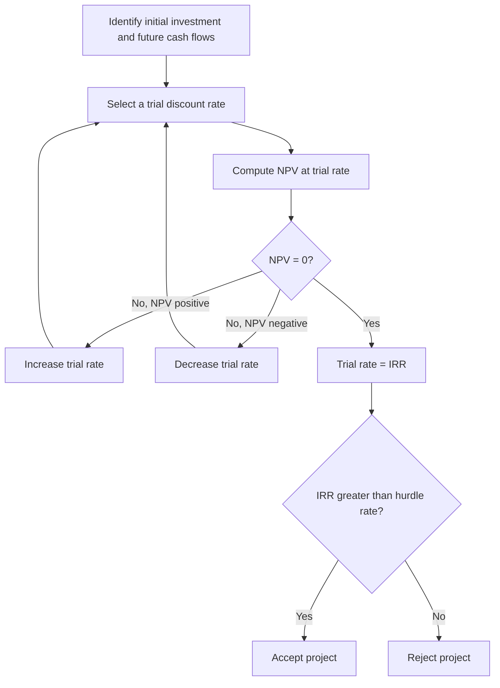

## The Internal Rate of Return Method

### Overview

The Internal Rate of Return (IRR) is a capital budgeting technique that identifies the discount rate at which a project's Net Present Value (NPV) equals zero. It represents the project's intrinsic rate of return — the compound annual growth rate the project is expected to generate on the capital invested. Managers commonly use IRR because it expresses project profitability as a single percentage figure, which is intuitive to compare against a required rate of return or hurdle rate.

**Key Points**

- IRR is the breakeven discount rate at which the present value of cash inflows exactly equals the present value of cash outflows.
- It is expressed as a percentage, making it easy to communicate and compare across projects of different sizes.
- Despite its popularity, IRR has several technical limitations that can produce misleading investment signals if applied without care.

---

### The IRR Formula

IRR is the value of $r$ that satisfies:

$$0 = \sum_{t=0}^{n} \frac{CF_t}{(1+IRR)^t}$$

Equivalently, for a conventional project with an initial outlay at $t=0$ followed by inflows:

$$CF_0 = \sum_{t=1}^{n} \frac{CF_t}{(1+IRR)^t}$$

Where:

- $CF_0$ = initial investment (negative cash flow)
- $CF_t$ = net cash flow in period $t$
- $n$ = project life

Because IRR generally has no closed-form algebraic solution for $n > 2$, it is typically found through **iterative numerical methods** (trial and error, linear interpolation, or software/financial calculator functions such as Excel's `IRR()` function).

**Decision Rule**

| Comparison | Interpretation | Decision |
| --- | --- | --- |
| $IRR > r$ (cost of capital / hurdle rate) | Project return exceeds the required return | Accept |
| $IRR = r$ | Project earns exactly the required return | Indifferent |
| $IRR < r$ | Project return is below the required return | Reject |

---

### Step-by-Step Calculation Process

**Example (Worked Calculation via Interpolation)**

A project requires an initial investment of $100,000 and generates cash flows of $30,000, $40,000, $45,000, and $35,000 over four years (the same cash flows used in the NPV example).

At $r = 10\%$: $NPV = +\$18{,}046$ (calculated previously)

At $r = 20\%$:

| Year | Cash Flow | Discount Factor $1/(1.20)^t$ | Present Value |
| --- | --- | --- | --- |
| 1 | $30,000 | 0.8333 | $25,000 |
| 2 | $40,000 | 0.6944 | $27,778 |
| 3 | $45,000 | 0.5787 | $26,042 |
| 4 | $35,000 | 0.4823 | $16,881 |

Sum of discounted inflows = $95,701; $NPV = 95{,}701 - 100{,}000 = -\$4{,}299$

Since NPV is positive at 10% and negative at 20%, IRR lies between these rates. Using **linear interpolation**:

$$IRR \approx r_1 + \frac{NPV_1}{NPV_1 - NPV_2} \times (r_2 - r_1)$$

$$IRR \approx 10\% + \frac{18{,}046}{18{,}046 - (-4{,}299)} \times (20\% - 10\%) \approx 10\% + \frac{18{,}046}{22{,}345} \times 10\% \approx 10\% + 8.08\% \approx 18.08\%$$

[Note: linear interpolation gives an approximation, since the true NPV-rate relationship is curved, not linear; software solvers such as Excel's `IRR()` function converge on a more precise value, typically close to this estimate but not identical]

Since $IRR \approx 18\% > 10\%$ (the cost of capital), the project would be accepted under the IRR rule — consistent with the accept decision reached using NPV.

---

### Relationship Between IRR and NPV

For **conventional cash flow patterns** (a single initial outflow followed only by inflows) and **independent projects**, NPV and IRR typically yield the same accept/reject decision, since both compare the project's return against the same threshold. The two methods can diverge, however, for:

1. **Mutually exclusive projects** — differing scale or timing of cash flows can cause NPV and IRR to rank projects differently.
2. **Non-conventional cash flows** — projects with cash flows that change sign more than once (e.g., outflow, inflow, then another outflow) can produce **multiple IRRs** or no real IRR at all, per Descartes' rule of signs.

**Example**

A mining project with cash flows of $-\$1{,}000$ (year 0), $+\$4{,}000$ (year 1), and $-\$3{,}200$ (year 2) — representing initial investment, extraction revenue, and reclamation costs — has two sign changes and may yield two mathematically valid IRRs (e.g., approximately 20% and 100%), neither of which alone provides a reliable decision signal. In such cases, NPV or the Modified Internal Rate of Return (MIRR) is preferred.

---

### Why IRR Can Conflict With NPV: The Reinvestment Rate Assumption

**Key Points**

- IRR implicitly assumes that all interim cash flows are reinvested at the IRR itself.
- For projects with a very high IRR, this assumption is often unrealistic, since the firm may not have access to other investment opportunities offering that same high return.
- NPV implicitly assumes reinvestment at the firm's cost of capital ($r$), which is generally a more realistic and conservative assumption.
- This difference in reinvestment assumptions is the primary theoretical reason NPV is preferred when the two methods conflict. [This is a well-established point in corporate finance theory]

---

### The Crossover Rate

When comparing two mutually exclusive projects, the **crossover rate** is the discount rate at which both projects have equal NPV. It is found by computing the IRR of the **differential cash flow stream** (Project A's cash flows minus Project B's cash flows, period by period).

<svg xmlns="http://www.w3.org/2000/svg" viewBox="0 0 700 380" font-family="Arial, sans-serif">
<rect x="0" y="0" width="700" height="380" fill="#ffffff" stroke="#333333" />
<text x="20" y="26" font-size="16" font-weight="bold" fill="#111111">NPV Profiles: Crossover Rate Between Two Projects (svg_diagram)</text>
<line x1="70" y1="320" x2="650" y2="320" stroke="#333333" stroke-width="2" />
<line x1="70" y1="320" x2="70" y2="50" stroke="#333333" stroke-width="2" />
<text x="350" y="355" font-size="13" fill="#111111">Discount Rate (%)</text>
<text x="20" y="180" font-size="13" fill="#111111" transform="rotate(-90 20 180)">NPV (\$)</text>
<line x1="70" y1="220" x2="650" y2="220" stroke="#cccccc" stroke-dasharray="3,3" />
<text x="600" y="235" font-size="11" fill="#888888">NPV = 0</text>
<path d="M 90 70 C 200 120, 300 160, 400 200 C 500 240, 570 280, 620 310" fill="none" stroke="#2563eb" stroke-width="3" />
<text x="450" y="130" font-size="12" fill="#2563eb" font-weight="bold">Project A (larger, later CFs)</text>
<path d="M 90 130 C 200 160, 300 185, 400 205 C 500 225, 570 245, 620 260" fill="none" stroke="#16a34a" stroke-width="3" />
<text x="450" y="245" font-size="12" fill="#16a34a" font-weight="bold">Project B (smaller, earlier CFs)</text>
<circle cx="330" cy="192" r="6" fill="#dc2626" />
<text x="340" y="185" font-size="12" fill="#dc2626" font-weight="bold">Crossover Rate</text>
<circle cx="500" cy="220" r="5" fill="#111111" />
<text x="470" y="290" font-size="11" fill="#333333">IRR_B</text>
<circle cx="580" cy="220" r="5" fill="#111111" />
<text x="580" y="290" font-size="11" fill="#333333">IRR_A</text>
</svg>

**Interpretation**: Below the crossover rate, Project A has the higher NPV; above it, Project B has the higher NPV — even though Project A may have a lower IRR overall. When the firm's actual cost of capital is below the crossover rate, ranking projects by IRR alone can lead to the wrong choice; **NPV should govern the final decision** in such conflicts.

---

### Modified Internal Rate of Return (MIRR)

MIRR addresses IRR's unrealistic reinvestment assumption by explicitly specifying a reinvestment rate (typically the cost of capital) for positive cash flows and a financing rate for negative cash flows:

$$MIRR = \left( \frac{FV(\text{positive cash flows at reinvestment rate})}{PV(\text{negative cash flows at financing rate})} \right)^{1/n} - 1$$

**Key Points**

- MIRR always produces a single, unique solution, eliminating the multiple-IRR problem.
- MIRR generally provides a more realistic estimate of a project's true compound annual return than IRR when reinvestment opportunities are limited.

---

### IRR Compared to Other Capital Budgeting Methods

| Method | Basis | Key Limitation Relative to IRR |
| --- | --- | --- |
| **NPV** | Dollar value added at the cost of capital | Not expressed as a percentage return; may be less intuitive to communicate |
| **MIRR** | Compound return using explicit reinvestment/financing rates | Requires an additional assumption (reinvestment rate) beyond raw cash flows |
| **Profitability Index** | Ratio of PV of inflows to investment | Does not directly indicate a rate of return |
| **Payback Period** | Time to recover investment | Ignores time value of money and profitability beyond payback |

---

### Practical Considerations for Managers

**Key Points**

- IRR is most reliable for **independent projects with conventional cash flow patterns**, where accept/reject decisions align with NPV.
- For **mutually exclusive projects**, especially those differing significantly in scale or cash flow timing, NPV should be the primary decision criterion, with IRR used as supplementary information.
- When cash flows change sign more than once, check for multiple IRRs before relying on the IRR output from software, and consider MIRR as an alternative.
- Financial software and spreadsheet functions (e.g., Excel's `IRR()`) require a reasonable initial guess and may fail to converge or return unexpected values for non-conventional cash flow patterns; results should be validated against an NPV profile. [Software behavior may vary by version and input configuration]

---

### Limitations of IRR

- **Multiple or undefined solutions** for non-conventional cash flow patterns.
- **Unrealistic reinvestment assumption**, particularly overstating attractiveness for high-IRR, short-duration projects.
- **Scale-blindness** — IRR does not indicate the absolute dollar value created, so a small project with a very high IRR may add far less value than a large project with a moderate IRR.
- **Ranking conflicts with NPV** for mutually exclusive projects, requiring careful use of the crossover rate and NPV as the ultimate tiebreaker.
- **Sensitivity to cash flow forecast errors**, similar to NPV, since IRR is entirely derived from projected cash flows. [Inference: degree of sensitivity depends on the shape and length of the cash flow stream]

---

**Related Topics**

- Net Present Value (NPV) method and NPV profiles
- Modified Internal Rate of Return (MIRR)
- Crossover rate analysis for mutually exclusive projects
- Multiple IRR problem and Descartes' rule of signs
- Profitability Index and capital rationing
- Payback period and discounted payback period
- Cost of capital and hurdle rate determination
- Sensitivity and scenario analysis in investment appraisal