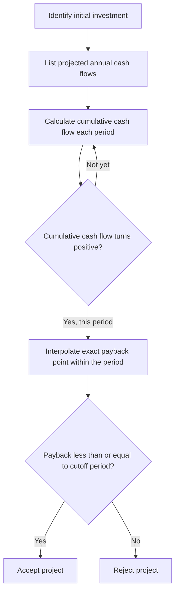
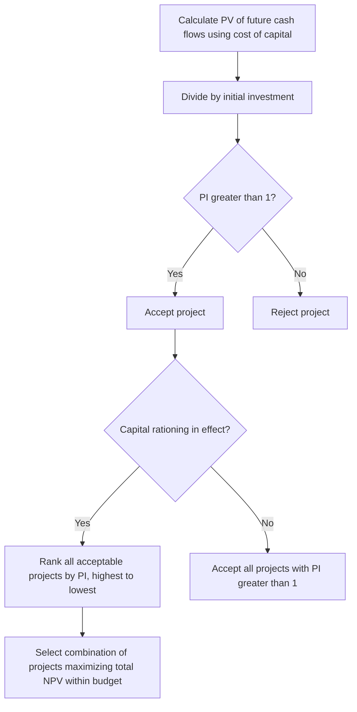

## Payback Period and Profitability Index

### Overview

Payback Period and Profitability Index (PI) are two supplementary capital budgeting techniques used alongside NPV and IRR. Payback period measures how quickly a project recovers its initial investment, emphasizing liquidity and risk exposure. Profitability Index measures the value created per dollar invested, making it especially useful for ranking projects under capital rationing. Both methods address practical decision needs that NPV and IRR do not fully capture on their own.

**Key Points**

- Payback period is simple, intuitive, and widely used as a risk-screening tool, but it ignores the time value of money (in its basic form) and all cash flows beyond the payback point.
- Profitability Index expresses value creation as a ratio, making it well-suited to comparing projects of different sizes, particularly when capital is constrained.
- Neither method should generally replace NPV as the primary decision criterion; both are best used as complements to it.

---

### Part 1: The Payback Period Method

#### Definition and Formula

The payback period is the length of time required for a project's cumulative cash inflows to equal its initial investment.

**For even (uniform) cash flows:**

$$Payback\ Period = \frac{Initial\ Investment}{Annual\ Cash\ Flow}$$

**For uneven cash flows**, payback is found by cumulative summation:

$$Payback\ Period = A + \frac{B}{C}$$

Where:

- $A$ = last period with a negative cumulative cash flow
- $B$ = absolute value of the cumulative cash flow at the end of period $A$
- $C$ = cash flow during the period after $A$

#### Step-by-Step Process

#### Worked Example

A project requires an initial investment of $100,000 with the following projected cash flows:

| Year | Cash Flow | Cumulative Cash Flow |
| --- | --- | --- |
| 0 | -$100,000 | -$100,000 |
| 1 | $30,000 | -$70,000 |
| 2 | $40,000 | -$30,000 |
| 3 | $45,000 | +$15,000 |
| 4 | $35,000 | +$50,000 |

The cumulative cash flow turns positive during Year 3. Using the formula:

$$Payback = 2 + \frac{30{,}000}{45{,}000} = 2 + 0.667 \approx 2.67\ years$$

If the firm's cutoff (maximum acceptable payback) is 3 years, this project would be **accepted**, since it recovers its investment in approximately 2.67 years.

#### Decision Rule

| Comparison | Decision |
| --- | --- |
| Payback period ≤ cutoff period | Accept |
| Payback period > cutoff period | Reject |
| Comparing mutually exclusive projects | Prefer the project with the shorter payback period |

#### Discounted Payback Period

A refinement that addresses the basic method's disregard for the time value of money by discounting cash flows before cumulating them:

$$Discounted\ Payback = A + \frac{B}{C}$$

using discounted cash flows $CF_t/(1+r)^t$ in place of nominal cash flows.

**Example (continuing the prior case, at $r=10\%$)**

| Year | Cash Flow | PV Factor (10%) | Discounted CF | Cumulative Discounted CF |
| --- | --- | --- | --- | --- |
| 0 | -$100,000 | 1.000 | -$100,000 | -$100,000 |
| 1 | $30,000 | 0.9091 | $27,273 | -$72,727 |
| 2 | $40,000 | 0.8264 | $33,058 | -$39,669 |
| 3 | $45,000 | 0.7513 | $33,809 | -$5,860 |
| 4 | $35,000 | 0.6830 | $23,906 | +$18,046 |

$$Discounted\ Payback = 3 + \frac{5{,}860}{23{,}906} \approx 3.25\ years$$

Note that the discounted payback (3.25 years) is longer than the simple payback (2.67 years), since discounting reduces the value of later cash flows — a pattern that holds generally, because discounting always weakens the contribution of future inflows relative to their nominal values.

#### Advantages and Limitations

| Advantages | Limitations |
| --- | --- |
| Simple to calculate and communicate | Ignores time value of money (simple version) |
| Useful proxy for liquidity risk and capital recovery speed | Ignores all cash flows occurring after the payback point |
| Favors projects that reduce exposure to long-term uncertainty | Cutoff period is set arbitrarily by management, not derived from theory |
| Widely used as a quick initial screening tool | Can lead to rejection of profitable long-term projects in favor of shorter, less valuable ones |
| Discounted version partially corrects for time value of money | Discounted version still ignores cash flows beyond payback |

**Key Points**

- Payback period is best used as a **supplementary screening tool** — particularly useful for firms facing liquidity constraints, rapidly changing technology, or high political/currency risk where recovering capital quickly is a priority — rather than as the sole basis for accept/reject decisions. [Inference: appropriate weight given to payback varies by firm risk tolerance and industry]

---

### Part 2: The Profitability Index (PI)

#### Definition and Formula

The Profitability Index, also called the benefit-cost ratio, measures the present value of future cash inflows generated per dollar of initial investment:

$$PI = \frac{PV\ of\ Future\ Cash\ Flows}{Initial\ Investment} = \frac{\sum_{t=1}^{n} \frac{CF_t}{(1+r)^t}}{CF_0}$$

This can also be expressed in terms of NPV:

$$PI = \frac{NPV + CF_0}{CF_0} = 1 + \frac{NPV}{CF_0}$$

#### Decision Rule

| PI Result | Interpretation | Decision |
| --- | --- | --- |
| $PI > 1$ | Present value of inflows exceeds the investment (equivalent to $NPV > 0$) | Accept |
| $PI = 1$ | Breakeven (equivalent to $NPV = 0$) | Indifferent |
| $PI < 1$ | Present value of inflows is less than the investment (equivalent to $NPV < 0$) | Reject |

#### Worked Example

Using the same project (PV of future cash flows = $118,046; initial investment = $100,000):

$$PI = \frac{118{,}046}{100{,}000} = 1.18$$

Since $PI = 1.18 > 1$, the project is accepted — for every $1 invested, the project returns $1.18 in present-value terms, generating $0.18 of net value per dollar invested.

#### Step-by-Step Process

#### Profitability Index and Capital Rationing

PI is particularly valuable when a firm faces **capital rationing** — a fixed budget insufficient to fund all positive-NPV projects. Ranking projects by PI (rather than by NPV alone) helps identify the combination of projects that maximizes total value created per dollar of scarce capital.

**Example**

A firm has $200,000 available and is evaluating three independent, divisible projects:

| Project | Initial Investment | NPV | PI | PI Rank |
| --- | --- | --- | --- | --- |
| A | $100,000 | $30,000 | 1.30 | 1 |
| B | $150,000 | $35,000 | 1.23 | 2 |
| C | $80,000 | $15,000 | 1.19 | 3 |

Selecting purely by NPV might favor Project B ($35,000) alone, using $150,000 of the $200,000 budget and leaving $50,000 uninvested (assuming no partial funding of other projects is possible). Selecting by PI, the firm would prioritize Project A ($100,000) and, with the remaining $100,000, partially fund Project C (assuming divisibility) or select the combination that maximizes total NPV within the $200,000 constraint — in this case, A + C together use $180,000 and generate combined NPV of $45,000, exceeding Project B alone. [This example assumes full or partial divisibility of projects; indivisible large projects require integer programming or combinatorial evaluation rather than simple PI ranking]

#### Advantages and Limitations

| Advantages | Limitations |
| --- | --- |
| Accounts for time value of money | Can conflict with NPV ranking for mutually exclusive projects of different scale |
| Useful for ranking under capital rationing | Less intuitive than a simple dollar figure for communicating value |
| Directly comparable across projects of different sizes | Assumes divisibility of projects in the simple ranking approach; indivisible projects require more advanced selection methods |
| Mathematically consistent with the NPV accept/reject decision for independent projects | Does not indicate the absolute dollar value created |

---

### Comparing Payback Period and Profitability Index

| Feature | Payback Period | Profitability Index |
| --- | --- | --- |
| Measures | Time to recover investment | Value created per dollar invested |
| Time value of money | Ignored (simple version); partially addressed (discounted version) | Fully incorporated |
| Best used for | Liquidity/risk screening | Ranking under capital rationing |
| Relationship to NPV | Not directly derived from NPV | Directly derived from NPV ($PI = 1 + NPV/CF_0$) |
| Primary limitation | Ignores cash flows after cutoff | Assumes project divisibility in ranking applications |

---

### Practical Guidance for Managers

**Key Points**

- Use **payback period** as an initial screening filter, especially in industries facing rapid technological change, political risk, or liquidity constraints — but do not use it as the sole decision criterion.
- Use **discounted payback** rather than simple payback whenever the time value of money is material to the decision.
- Use **PI** primarily in capital rationing situations, where the goal is to maximize total value created from a limited budget rather than to select the single largest-NPV project.
- For projects that are **mutually exclusive** and **fully fundable** (no capital constraint), NPV should govern the final decision, since PI and payback can occasionally rank projects differently than NPV when project scale differs substantially. [Inference: ranking conflicts are more likely when project sizes diverge significantly]
- Actual project outcomes depend on the accuracy of cash flow forecasts and the chosen discount rate; both payback and PI results should be interpreted with the same caution applied to any forecast-based financial model.

---

**Related Topics**

- Net Present Value (NPV) method
- Internal Rate of Return (IRR) and Modified IRR
- Capital rationing and project selection under budget constraints
- Risk analysis in capital budgeting (sensitivity, scenario, and break-even analysis)
- Cost of capital and hurdle rate determination
- Replacement decisions and equivalent annual cost analysis
- Real options and managerial flexibility in investment appraisal