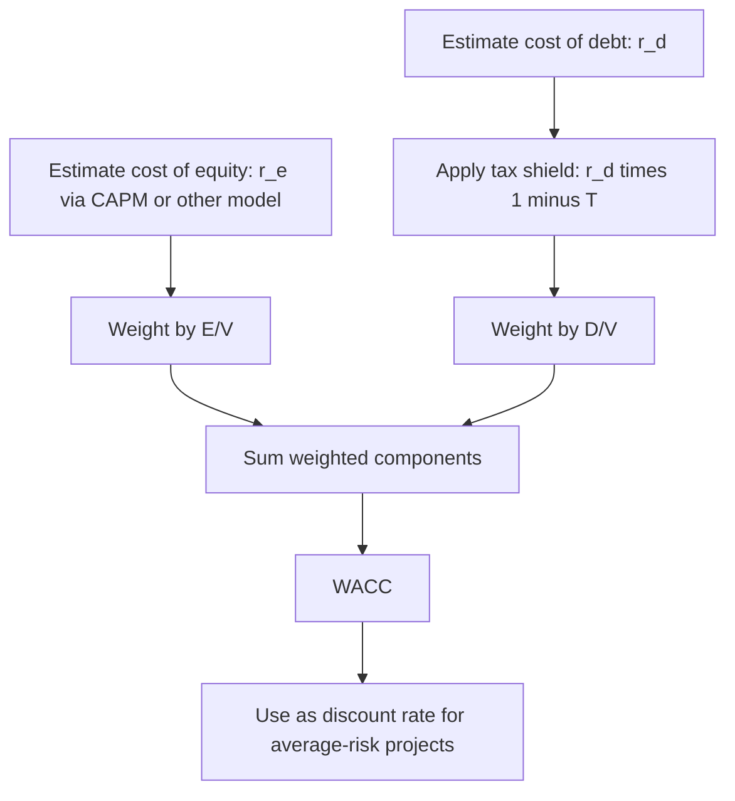

## Estimating the Cost of Capital

### Overview

The cost of capital represents the minimum rate of return a firm must earn on an investment to satisfy the expectations of its capital providers — debt holders and equity holders. It serves as the discount rate used in NPV calculations, the hurdle rate compared against IRR, and a benchmark for evaluating overall firm performance. Because most firms finance operations through a combination of debt and equity, the cost of capital is typically estimated as a **weighted average** of the costs of each financing source.

**Key Points**

- The cost of capital reflects the opportunity cost of funds — the return investors could earn on alternative investments of comparable risk.
- It is central to capital budgeting (as the discount rate), capital structure decisions, and firm valuation.
- Because it is a forward-looking estimate built on market data and assumptions, it is inherently subject to estimation uncertainty.

---

### The Weighted Average Cost of Capital (WACC)

WACC combines the after-tax cost of debt and the cost of equity, weighted by each source's proportion in the firm's target capital structure:

$$WACC = \left(\frac{E}{V}\right)r_e + \left(\frac{D}{V}\right)r_d(1-T)$$

Where:

- $E$ = market value of equity
- $D$ = market value of debt
- $V = E + D$ = total market value of the firm's financing
- $r_e$ = cost of equity
- $r_d$ = cost of debt (before tax)
- $T$ = corporate marginal tax rate

The $(1-T)$ term reflects the **tax shield on interest**, since interest payments are typically tax-deductible, reducing the effective after-tax cost of debt financing.

---

### Step 1: Estimating the Cost of Debt

The cost of debt is the effective rate a firm pays on its borrowed funds, adjusted for the tax deductibility of interest.

**Method 1: Yield to Maturity (YTM) on existing bonds**

For firms with publicly traded debt, $r_d$ is commonly estimated as the current market yield to maturity on outstanding bonds of similar maturity and risk, since YTM reflects the market's current required return on the firm's debt.

**Method 2: Bond rating-based approach**

For firms without actively traded debt, an estimate can be built from the yield on comparably rated bonds (matched by credit rating and maturity), often using a **default spread** added to the risk-free rate:

$$r_d = r_f + \text{Default Spread (based on credit rating)}$$

**After-Tax Cost of Debt**

$$r_d^{after-tax} = r_d(1-T)$$

**Worked Example**

A firm's outstanding bonds yield 6% YTM, and the firm faces a 25% marginal tax rate:

$$r_d^{after-tax} = 0.06 \times (1 - 0.25) = 0.06 \times 0.75 = 0.045 = 4.5\%$$

---

### Step 2: Estimating the Cost of Equity

Unlike debt, equity has no contractual interest payment, making its cost more difficult to observe directly. It represents the return equity investors require given the firm's risk, incorporating both the time value of money and a premium for bearing equity risk.

#### Method A: Capital Asset Pricing Model (CAPM)

The most widely used approach, CAPM expresses the required return on equity as a function of systematic (market) risk:

$$r_e = r_f + \beta(r_m - r_f)$$

Where:

- $r_f$ = risk-free rate (typically the yield on long-term government bonds)
- $\beta$ = the firm's equity beta, measuring sensitivity of the stock's returns to overall market returns
- $r_m$ = expected return on the overall market
- $(r_m - r_f)$ = market risk premium (the additional return investors require for holding market risk over the risk-free asset)

**Worked Example**

Given $r_f = 4\%$, $\beta = 1.2$, and an expected market risk premium of 6%:

$$r_e = 0.04 + 1.2(0.06) = 0.04 + 0.072 = 0.112 = 11.2\%$$

**Key Points**

- $\beta$ can be estimated via regression of the firm's historical stock returns against market index returns (see regression analysis fundamentals), obtained from financial data providers, or estimated using a comparable-company (pure-play) approach for private firms or new divisions.
- The market risk premium is itself an estimate, commonly derived from historical average excess stock returns over government bonds, though estimates vary across data sources, time periods, and methodologies. [Inference: reasonable estimates for the equity market risk premium vary meaningfully by source, historical window, and country, so this figure often differs across practitioners]

#### Method B: Dividend Growth Model (Gordon Growth Model)

For firms with a stable, predictable dividend policy, the cost of equity can be inferred from current stock price, expected dividends, and expected dividend growth:

$$r_e = \frac{D_1}{P_0} + g$$

Where:

- $D_1$ = expected dividend per share next period
- $P_0$ = current stock price
- $g$ = constant expected dividend growth rate

**Worked Example**

A firm's stock trades at $50, is expected to pay a $2.50 dividend next year, and dividends are expected to grow at 4% annually:

$$r_e = \frac{2.50}{50} + 0.04 = 0.05 + 0.04 = 0.09 = 9\%$$

**Key Points**

- This method is limited to firms with a stable dividend growth pattern; it is not suitable for non-dividend-paying firms or firms with highly volatile payout policies.
- CAPM is generally preferred in practice for its broader applicability, though the two methods can be used together as a cross-check. [Inference: whether the two methods converge depends heavily on the firm's actual growth stability]

#### Method C: Bond Yield Plus Risk Premium (Approximation)

A simpler approximation adds a subjective equity risk premium (typically 3%–5%) to the firm's own cost of debt:

$$r_e \approx r_d + \text{Equity Risk Premium}$$

This method is less rigorous and used primarily as a rough cross-check rather than a primary estimation approach.

---

### Step 3: Determining Capital Structure Weights

Weights should be based on the **market values**, not book values, of debt and equity, since market values reflect current investor expectations and the true opportunity cost of capital.

$$\frac{E}{V} = \frac{Market\ Value\ of\ Equity}{Market\ Value\ of\ Equity + Market\ Value\ of\ Debt}$$

$$\frac{D}{V} = \frac{Market\ Value\ of\ Debt}{Market\ Value\ of\ Equity + Market\ Value\ of\ Debt}$$

**Key Points**

- Market value of equity is typically calculated as share price × shares outstanding.
- Market value of debt can be approximated using book value when debt trades close to par, or estimated from bond market prices when available.
- Some firms use **target capital structure weights** (the long-run mix management intends to maintain) rather than current market weights, particularly when current leverage is expected to change materially. [Inference: choice between current and target weights is a matter of practitioner judgment and depends on expected capital structure stability]

---

### Full Worked Example: Calculating WACC

A firm has the following characteristics:

- Market value of equity: $600 million
- Market value of debt: $400 million
- Cost of equity ($r_e$, via CAPM): 12%
- Cost of debt ($r_d$, pre-tax): 6%
- Marginal tax rate: 25%

**Step 1 — Calculate weights**

$$V = 600 + 400 = 1{,}000$$

$$\frac{E}{V} = \frac{600}{1000} = 0.60 \quad \frac{D}{V} = \frac{400}{1000} = 0.40$$

**Step 2 — Calculate after-tax cost of debt**

$$r_d^{after-tax} = 0.06 \times (1-0.25) = 0.045$$

**Step 3 — Apply the WACC formula**

$$WACC = (0.60)(0.12) + (0.40)(0.045) = 0.072 + 0.018 = 0.09 = 9.0\%$$

This 9.0% represents the firm's overall cost of capital and would serve as the default discount rate for evaluating average-risk investment projects.

---

### WACC Illustration

<svg xmlns="http://www.w3.org/2000/svg" viewBox="0 0 700 340" font-family="Arial, sans-serif">
<rect x="0" y="0" width="700" height="340" fill="#ffffff" stroke="#333333" />
<text x="20" y="26" font-size="16" font-weight="bold" fill="#111111">WACC Composition (svg_diagram)</text>
<rect x="60" y="60" width="300" height="200" fill="#dbeafe" stroke="#2563eb" stroke-width="2" />
<text x="130" y="100" font-size="14" font-weight="bold" fill="#1e3a8a">Equity: 60%</text>
<text x="90" y="130" font-size="12" fill="#1e3a8a">Cost of equity (r_e) = 12%</text>
<text x="90" y="150" font-size="12" fill="#1e3a8a">via CAPM</text>
<text x="90" y="190" font-size="13" font-weight="bold" fill="#1e3a8a">Weighted: 0.60 x 12% = 7.2%</text>
<rect x="380" y="60" width="260" height="140" fill="#dcfce7" stroke="#16a34a" stroke-width="2" />
<text x="440" y="100" font-size="14" font-weight="bold" fill="#14532d">Debt: 40%</text>
<text x="410" y="130" font-size="12" fill="#14532d">Pre-tax cost = 6%</text>
<text x="410" y="150" font-size="12" fill="#14532d">After-tax = 6% x (1-25%) = 4.5%</text>
<text x="410" y="180" font-size="13" font-weight="bold" fill="#14532d">Weighted: 0.40 x 4.5% = 1.8%</text>
<rect x="200" y="280" width="300" height="40" fill="#fef3c7" stroke="#d97706" stroke-width="2" />
<text x="250" y="305" font-size="15" font-weight="bold" fill="#78350f">WACC = 7.2% + 1.8% = 9.0%</text>
</svg>

---

### Project-Specific Discount Rates vs. Firm-Wide WACC

**Key Points**

- Firm-wide WACC is appropriate only for projects with **risk similar to the firm's existing average asset risk**.
- For projects with materially different risk (e.g., a manufacturer entering an unrelated technology venture), using firm-wide WACC can lead to systematically incorrect decisions — accepting projects that are too risky and rejecting acceptable lower-risk projects.
- The **pure-play method** addresses this by identifying comparable publicly traded firms operating primarily in the project's specific business line, using their beta (unlevered and then re-levered to the investing firm's capital structure) to estimate a project-specific cost of equity.

**Unlevering and Re-levering Beta (Hamada Equation)**

$$\beta_{unlevered} = \frac{\beta_{levered}}{1 + (1-T)\left(\frac{D}{E}\right)}$$

$$\beta_{re-levered} = \beta_{unlevered} \times \left[1 + (1-T)\left(\frac{D}{E}\right)_{project}\right]$$

This process removes the comparable firm's own financial leverage effect from its beta, then reapplies the investing firm's (or project's) capital structure to obtain an appropriately risk-adjusted beta for project evaluation.

---

### Common Estimation Challenges

| Challenge | Description |
| --- | --- |
| **Beta estimation instability** | Historical beta estimates can vary depending on the time period, return frequency, and market index used [Inference: sensitivity to methodology is well documented, though the magnitude varies by firm and market] |
| **Market risk premium disagreement** | Estimates range across historical, implied, and survey-based approaches, with no single universally accepted figure |
| **Private firms / new ventures** | Lack of traded equity or debt requires reliance on comparable-company (pure-play) methods and greater estimation judgment |
| **Non-constant capital structure** | If leverage is expected to change materially over a project's life, a single static WACC may not remain appropriate throughout |
| **International and multi-currency operations** | May require country risk premiums and currency-specific risk-free rates, adding further estimation complexity |

---

### Practical Guidance for Managers

**Key Points**

- Use market-value-based weights and a target/long-run financing mix wherever possible, rather than current book values.
- Apply CAPM as the primary cost of equity method for publicly traded firms, using dividend growth or risk-premium approaches as supplementary cross-checks.
- Adjust the discount rate for project-specific risk rather than applying firm-wide WACC uniformly across projects of differing risk profiles.
- Treat the resulting WACC estimate as a reasoned approximation rather than a precise figure — sensitivity analysis on the discount rate is advisable given the multiple layers of estimation involved. [Behavior and appropriate precision may vary by firm size, industry, and data availability]

---

**Related Topics**

- Capital Asset Pricing Model (CAPM) and systematic risk
- Net Present Value and Internal Rate of Return methods
- Capital structure theory and the Modigliani-Miller propositions
- Beta estimation and the pure-play method
- Risk-adjusted discount rates for divisional/project evaluation
- Dividend discount models and equity valuation
- Bond valuation and yield to maturity