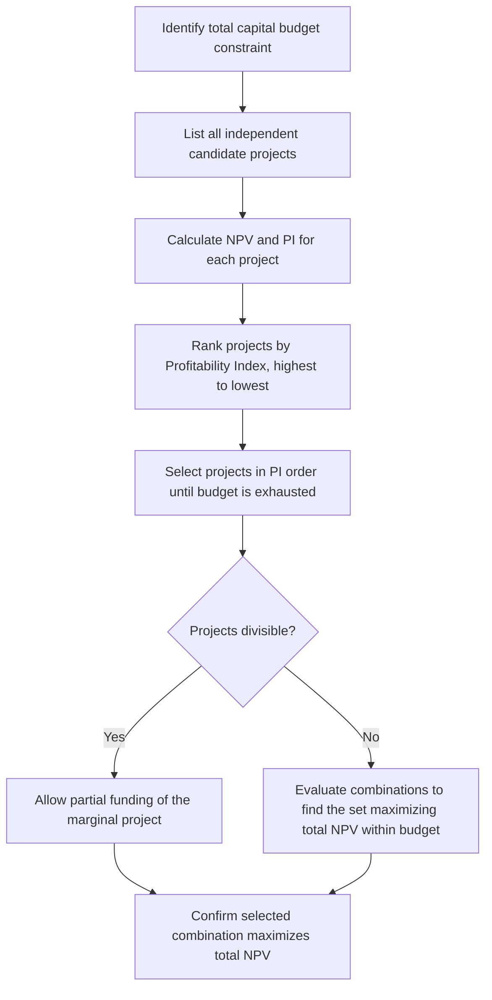

## Capital Rationing Decisions

### Overview

Capital rationing occurs when a firm faces a constraint on the total funds available for investment, preventing it from accepting all projects that independently have a positive Net Present Value. Under capital rationing, the objective shifts from simply accepting every positive-NPV project to selecting the **combination** of projects that maximizes total value creation within the available budget. This requires ranking and selection techniques beyond the standard NPV accept/reject rule.

**Key Points**

- Capital rationing can be **soft** (self-imposed by management, e.g., for organizational control or risk management) or **hard** (externally imposed, e.g., limited access to capital markets or lender covenants).
- The presence of a binding budget constraint means the firm cannot rely on NPV rankings alone if projects are of different sizes, since NPV does not indicate capital efficiency.
- The Profitability Index becomes a central tool in this context, but more complex situations require integer programming or combinatorial evaluation.

---

### Soft vs. Hard Capital Rationing

| Type | Source | Typical Cause |
| --- | --- | --- |
| **Soft Rationing** | Internally imposed by management | Maintaining financial discipline, limiting divisional spending, risk management, preserving organizational focus |
| **Hard Rationing** | Externally imposed by markets/lenders | Limited access to debt or equity markets, high cost of external financing, restrictive loan covenants, credit rating constraints |

**Key Points**

- Soft rationing is a deliberate managerial choice and can, in principle, be relaxed if a sufficiently attractive opportunity arises.
- Hard rationing reflects a genuine external constraint and is less flexible in the short run.
- Some finance theory argues that truly value-maximizing firms should be able to raise capital for any genuinely positive-NPV project in efficient markets, making hard rationing theoretically less common than soft rationing in practice. [Inference: extent to which this holds depends on market efficiency assumptions and the firm's actual access to capital, which vary by firm size and market conditions]

---

### Why NPV Ranking Alone Is Insufficient Under Rationing

When capital is unconstrained, the rule is simple: accept every project with $NPV > 0$. Under a binding budget constraint, however, selecting projects purely by **largest NPV** can be inefficient, because it ignores how much capital each project consumes.

**Illustrative Example**

A firm has $300,000 available and evaluates four independent, divisible projects:

| Project | Initial Investment | NPV | PI |
| --- | --- | --- | --- |
| A | $150,000 | $45,000 | 1.30 |
| B | $100,000 | $38,000 | 1.38 |
| C | $120,000 | $30,000 | 1.25 |
| D | $80,000 | $28,000 | 1.35 |

Ranking by NPV alone would favor Project A first ($45,000), but Project A consumes half the available budget. Ranking by **PI** instead prioritizes capital efficiency.

---

### Step-by-Step Process for Ranking Under Capital Rationing

**Worked Example (continuing the four-project case, $300,000 budget)**

Ranking by PI: B (1.38) > D (1.35) > A (1.30) > C (1.25)

| Selection Order | Project | Investment | Cumulative Investment | NPV Added |
| --- | --- | --- | --- | --- |
| 1 | B | $100,000 | $100,000 | $38,000 |
| 2 | D | $80,000 | $180,000 | $28,000 |
| 3 | A | $150,000 (partial: $120,000 usable) | $300,000 | $45,000 × (120/150) = $36,000 [assuming divisibility] |

Total NPV under PI-based selection: $38,000 + $28,000 + $36,000 = **$102,000**

Compare this to selecting by NPV alone (A first, using $150,000; then B, using the remaining $100,000; C partially funded with the final $50,000 at $30,000 × 50/120 = $12,500): $45,000 + $38,000 + $12,500 = $95,500

The PI-based ranking produces a higher total NPV ($102,000 vs. $95,500) given the same $300,000 budget, illustrating why PI is generally preferred over raw NPV ranking when capital is constrained and projects are divisible.

---

### Handling Indivisible (Lumpy) Projects

When projects cannot be partially funded — a common real-world condition, since most capital projects must be undertaken in full or not at all — PI ranking alone can be misleading, because the "leftover" budget after selecting high-PI projects may go unused or be inefficiently allocated.

**Example of the Indivisibility Problem**

| Project | Investment | NPV |
| --- | --- | --- |
| X | $250,000 | $60,000 |
| Y | $100,000 | $28,000 |
| Z | $150,000 | $40,000 |

With a $250,000 budget: selecting Project X alone yields $60,000 in NPV and exactly exhausts the budget. Selecting Y and Z together also uses $250,000 and yields a combined NPV of $68,000 — a better outcome, even though X might have appeared as the "best single project."

**Key Points**

- With indivisible projects, the correct approach is to **evaluate all feasible combinations** of projects that fit within the budget and select the combination with the highest total NPV, rather than relying on a simple ranking metric.
- For larger project sets, this combinatorial search is typically formalized using **integer (0-1) linear programming**, where each project is represented by a binary decision variable (selected = 1, not selected = 0), the objective function maximizes total NPV, and the budget constraint limits total investment.

$$\text{Maximize} \sum_{i=1}^{n} NPV_i \cdot x_i \quad \text{subject to} \quad \sum_{i=1}^{n} CF_{0,i} \cdot x_i \leq Budget, \quad x_i \in \{0,1\}$$

---

### Multi-Period Capital Rationing

Many real capital rationing problems span multiple time periods, where the budget constraint applies separately in each period rather than as a single lump sum. This requires:

1. Defining a separate budget constraint for each period.
2. Accounting for cash flows a project generates in earlier periods that may free up capital for later-period investments.
3. Using **linear or integer programming with multiple constraints** (one per period) rather than a single-period PI ranking.

**Key Points**

- Multi-period rationing problems are considerably more complex than single-period cases and are typically solved using optimization software rather than manual ranking. [Inference: manual PI-based heuristics become increasingly unreliable as the number of constrained periods grows]

---

### Capital Rationing Decision Framework

<svg xmlns="http://www.w3.org/2000/svg" viewBox="0 0 720 360" font-family="Arial, sans-serif">
<rect x="0" y="0" width="720" height="360" fill="#ffffff" stroke="#333333" />
<text x="20" y="26" font-size="16" font-weight="bold" fill="#111111">Capital Rationing Decision Framework (svg_diagram)</text>
<rect x="40" y="55" width="640" height="50" fill="#fef3c7" stroke="#d97706" stroke-width="2" />
<text x="60" y="86" font-size="13" fill="#78350f">Total capital available is less than sum of all positive-NPV project costs</text>
<rect x="60" y="130" width="280" height="90" fill="#dbeafe" stroke="#2563eb" stroke-width="2" />
<text x="80" y="155" font-size="13" font-weight="bold" fill="#1e3a8a">Projects Divisible</text>
<text x="80" y="178" font-size="12" fill="#1e3a8a">Rank by Profitability Index</text>
<text x="80" y="198" font-size="12" fill="#1e3a8a">Fund in descending PI order</text>
<rect x="380" y="130" width="280" height="90" fill="#dcfce7" stroke="#16a34a" stroke-width="2" />
<text x="400" y="155" font-size="13" font-weight="bold" fill="#14532d">Projects Indivisible</text>
<text x="400" y="178" font-size="12" fill="#14532d">Evaluate feasible combinations</text>
<text x="400" y="198" font-size="12" fill="#14532d">Use integer programming</text>
<rect x="220" y="260" width="280" height="70" fill="#ede9fe" stroke="#7c3aed" stroke-width="2" />
<text x="250" y="290" font-size="13" font-weight="bold" fill="#4c1d95">Select combination maximizing</text>
<text x="280" y="310" font-size="13" font-weight="bold" fill="#4c1d95">total NPV within budget</text>
<line x1="200" y1="220" x2="330" y2="260" stroke="#333333" stroke-width="1.5" />
<line x1="520" y1="220" x2="390" y2="260" stroke="#333333" stroke-width="1.5" />
</svg>

---

### Theoretical Critique of Capital Rationing

**Key Points**

- In classical finance theory, capital rationing is sometimes viewed as a **suboptimal** condition, since a firm operating in perfectly efficient capital markets should be able to raise funds for any genuinely positive-NPV project, implying the firm should never need to forgo value-creating investments.
- In practice, however, informational asymmetries, transaction costs of raising capital, agency concerns, and internal governance considerations mean capital rationing is a common and often deliberate feature of real-world capital budgeting. [Inference: the balance between theoretical market efficiency and observed rationing behavior is a matter of ongoing debate and varies substantially by firm and market context]
- Soft rationing, in particular, is often used intentionally as an internal control mechanism to enforce capital discipline, limit excessive risk-taking by divisions, and ensure management carefully prioritizes among competing investment opportunities.

---

### Practical Guidance for Managers

**Key Points**

- When projects are divisible and rationing is limited to a single period, ranking by Profitability Index provides an efficient and computationally simple selection method.
- When projects are indivisible or rationing spans multiple periods, manual PI ranking can produce suboptimal results; combinatorial or integer programming approaches should be used instead.
- Always confirm the selected combination genuinely **maximizes total NPV** within the constraint — the highest-ranked individual projects by PI or NPV do not always combine into the best feasible set.
- Recognize the source of the rationing (soft vs. hard), since soft rationing may be revisited if a sufficiently compelling project emerges, whereas hard rationing reflects a genuine external limit that persists until financing conditions change.

---

**Related Topics**

- Profitability Index and its use in project ranking
- Net Present Value and Internal Rate of Return methods
- Linear and integer programming applications in project selection
- Cost of capital and its role as the funding constraint threshold
- Capital structure decisions and access to external financing
- Multi-period budgeting and constrained optimization
- Agency theory and internal capital allocation