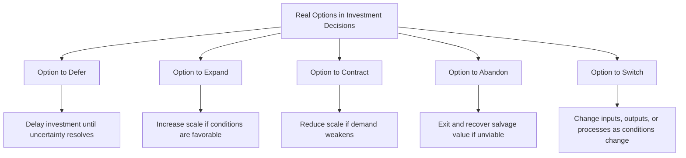
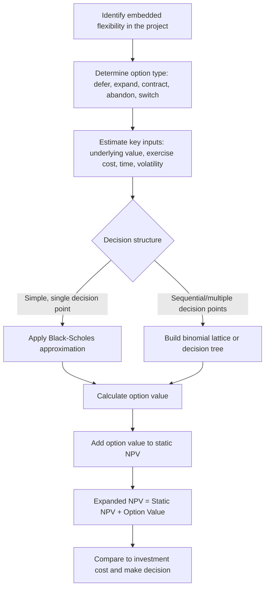

## Real Options Analysis in Investment Decisions

### Overview

Real Options Analysis (ROA) extends traditional capital budgeting by recognizing that many investment projects contain embedded managerial flexibility — the ability to expand, delay, contract, abandon, or otherwise alter a project as new information arrives. Standard NPV analysis implicitly assumes a static, now-or-never investment decision with a fixed set of future cash flows. Real options analysis instead values the **option-like flexibility** managers hold, drawing on techniques originally developed for pricing financial options.

**Key Points**

- Real options exist because investment decisions are often made sequentially and under uncertainty, with managers able to react to how conditions unfold rather than being locked into a single fixed plan.
- Standard NPV can systematically **understate** the true value of a project when significant managerial flexibility is present, because it ignores the value of being able to adapt.
- Real options are most valuable when uncertainty is high and management has genuine discretion to alter the course of the project as that uncertainty resolves.

---

### Why Standard NPV Can Understate Project Value

Traditional NPV analysis discounts a single expected cash flow stream, implicitly treating the investment decision as an irreversible, all-or-nothing commitment made today. In reality, many projects allow managers to:

- Delay investment until more information is available (**option to wait/defer**)
- Expand a successful project (**option to expand**)
- Scale back or temporarily shut down an unsuccessful project (**option to contract**)
- Abandon a project entirely and recover salvage value (**option to abandon**)
- Switch between inputs, outputs, or operating modes (**option to switch**)

Because each of these choices can only be exercised in the *favorable* direction (management is not obligated to expand, abandon, or switch if conditions are unfavorable), this asymmetry has value — the same asymmetric payoff structure that gives financial options their value.

$$NPV_{expanded} = NPV_{static} + Value\ of\ Real\ Options$$

---

### Types of Real Options

| Option Type | Description | Analogous Financial Option | Typical Business Example |
| --- | --- | --- | --- |
| **Option to Defer** | Delay investment until more information is available | Call option on the underlying project | Holding an undeveloped oil lease until prices rise |
| **Option to Expand** | Make follow-on investment if initial results are favorable | Call option on future project scale | Building a small plant with the ability to add capacity later |
| **Option to Contract** | Scale down operations if demand is weaker than expected | Put option on project scale | Reducing production shifts during a downturn |
| **Option to Abandon** | Exit the project and recover salvage/resale value | Put option on project value | Selling equipment and discontinuing an unprofitable product line |
| **Option to Switch** | Change inputs, outputs, or operating processes | Portfolio of options | A power plant that can switch between fuel sources based on relative prices |
| **Growth (Compound) Option** | Early investment creates the right, not obligation, to pursue further investments | Option on an option | R&D spending that opens the possibility of future product development |

---

### Key Inputs to Real Options Valuation

Real options valuation borrows directly from financial option-pricing parameters, mapped to their real-asset equivalents:

| Financial Option Parameter | Real Option Equivalent |
| --- | --- |
| Stock price ($S$) | Present value of expected project cash flows |
| Exercise price ($K$) | Investment cost required to exercise the option |
| Time to expiration ($t$) | Time until the investment opportunity or decision window closes |
| Volatility ($\sigma$) | Uncertainty in the value of the underlying project's cash flows |
| Risk-free rate ($r_f$) | Risk-free rate |
| Dividends | Cash flows or competitive erosion lost by delaying exercise |

**Key Points**

- A higher **volatility** in the underlying project's value increases the value of the real option — greater uncertainty raises the upside potential captured by flexibility, while the downside remains limited by the option not to invest.
- This is a critical distinction from standard NPV analysis, where higher uncertainty (often modeled as a higher discount rate) tends to *reduce* estimated project value; under real options thinking, uncertainty can *increase* strategic value, provided management retains genuine flexibility to respond to it.

---

### Valuation Approaches

#### 1. Decision Tree Analysis

The most intuitive and widely used approach for real options in a managerial context. Decision trees map out sequential decision points, associated probabilities, and payoffs, then work backward to value the initial decision.

**Worked Example: Option to Expand**

A firm can invest $50 million in an initial plant. After one year, demand will be revealed as either high (60% probability) or low (40% probability):

- If demand is **high**: the firm can invest an additional $40 million to expand, generating an expanded-project value of $120 million (PV), or continue without expanding for a base value of $70 million.
- If demand is **low**: expansion is not exercised; base project value is $30 million.

**Decision at the high-demand node:**

$$NPV_{expand} = 120 - 40 = \$80\text{M} \quad vs. \quad NPV_{no\ expand} = \$70\text{M}$$

Since $80M > $70M, management would exercise the expansion option if demand is high.

**Expected value of the project including the expansion option:**

$$E[Value] = 0.60 \times 80 + 0.40 \times 30 = 48 + 12 = \$60\text{M}$$

Compare this to a **static NPV analysis** that ignores the expansion option and simply uses the base (non-expanded) values:

$$E[Value]_{static} = 0.60 \times 70 + 0.40 \times 30 = 42 + 12 = \$54\text{M}$$

**Value of the real option** (option to expand):

$$Option\ Value = 60 - 54 = \$6\text{M}$$

This $6 million represents the additional value created by management's flexibility to expand only if demand turns out to be favorable — value that a standard, static NPV analysis would have missed entirely.

#### 2. Black-Scholes-Based Approximation

For options resembling a simple call (e.g., option to defer or option to expand with a single decision point), the Black-Scholes option pricing framework can be adapted:

$$C = S_0 N(d_1) - Ke^{-r_f t}N(d_2)$$

$$d_1 = \frac{\ln(S_0/K) + (r_f + \sigma^2/2)t}{\sigma\sqrt{t}}, \quad d_2 = d_1 - \sigma\sqrt{t}$$

Where $S_0$ = present value of expected project cash flows, $K$ = investment cost, $\sigma$ = volatility of project value, $t$ = time until the decision must be made, and $N(\cdot)$ = cumulative standard normal distribution.

**Key Points**

- This approach requires an estimate of project volatility, which is often harder to observe directly than the volatility of a traded financial asset, and is typically approximated using comparable-company volatility, simulation, or management judgment. [Inference: estimation reliability depends heavily on the quality of available comparables or simulation inputs]

#### 3. Binomial Lattice Models

A more flexible numerical approach that models the underlying project value as moving up or down by discrete amounts over a series of time steps, allowing valuation of options with multiple decision points (e.g., sequential expansion or abandonment decisions at several future dates). Binomial models are especially useful for real options because they can more easily accommodate early exercise and multiple, compound decision points than the closed-form Black-Scholes formula.

---

### Real Options Valuation Process

---

### Decision Tree Illustration

<svg xmlns="http://www.w3.org/2000/svg" viewBox="0 0 760 400" font-family="Arial, sans-serif">
<rect x="0" y="0" width="760" height="400" fill="#ffffff" stroke="#333333" />
<text x="20" y="26" font-size="16" font-weight="bold" fill="#111111">Option to Expand: Decision Tree (svg_diagram)</text>
<rect x="30" y="180" width="110" height="50" fill="#fef3c7" stroke="#d97706" stroke-width="2" />
<text x="45" y="210" font-size="12" fill="#78350f">Invest \$50M</text>
<line x1="140" y1="205" x2="260" y2="120" stroke="#333333" stroke-width="1.5" />
<text x="160" y="140" font-size="11" fill="#333333">Demand High (60%)</text>
<line x1="140" y1="205" x2="260" y2="300" stroke="#333333" stroke-width="1.5" />
<text x="160" y="270" font-size="11" fill="#333333">Demand Low (40%)</text>
<rect x="260" y="90" width="140" height="60" fill="#dbeafe" stroke="#2563eb" stroke-width="2" />
<text x="270" y="115" font-size="12" font-weight="bold" fill="#1e3a8a">High Demand Node</text>
<text x="270" y="135" font-size="11" fill="#1e3a8a">Choice: expand or not</text>
<rect x="270" y="280" width="140" height="50" fill="#fee2e2" stroke="#dc2626" stroke-width="2" />
<text x="285" y="310" font-size="12" fill="#7f1d1d">Low Demand: no expand</text>
<text x="290" y="325" font-size="11" fill="#7f1d1d">Value = \$30M</text>
<line x1="400" y1="110" x2="530" y2="70" stroke="#16a34a" stroke-width="2" />
<text x="420" y="65" font-size="11" fill="#16a34a">Expand (+\$40M)</text>
<rect x="530" y="45" width="150" height="50" fill="#dcfce7" stroke="#16a34a" stroke-width="2" />
<text x="545" y="70" font-size="12" fill="#14532d">Value = \$120M</text>
<text x="545" y="85" font-size="11" fill="#14532d">Net = \$80M</text>
<line x1="400" y1="130" x2="530" y2="170" stroke="#6b7280" stroke-width="2" />
<text x="420" y="165" font-size="11" fill="#6b7280">Do not expand</text>
<rect x="530" y="150" width="150" height="45" fill="#f3f4f6" stroke="#6b7280" stroke-width="2" />
<text x="545" y="175" font-size="12" fill="#374151">Value = \$70M</text>

<text x="30" y="370" font-size="12" fill="`#111111`" font-weight="bold">Expected value with option = 0.60(80) + 0.40(30) = $60M</text>

<text x="30" y="390" font-size="12" fill="`#111111`" font-weight="bold">Static NPV (no option) = $54M | Option value = $6M</text>

</svg>

---

### Real Options vs. Standard NPV: Comparison

| Dimension | Standard NPV | Real Options Analysis |
| --- | --- | --- |
| Treatment of uncertainty | Higher uncertainty generally reduces value (via higher discount rate) | Higher uncertainty can increase value, given genuine managerial flexibility |
| Decision structure | Single, static, now-or-never decision | Sequential decisions, updated as uncertainty resolves |
| Best suited for | Projects with predictable, well-defined cash flows and limited flexibility | Projects with significant uncertainty and meaningful managerial discretion (R&D, natural resources, phased expansions) |
| Computational complexity | Relatively simple | More complex; requires option-pricing techniques or decision trees |
| Risk of misapplication | May undervalue flexible, uncertain projects | May overstate value if flexibility is illusory or management lacks genuine discretion |

---

### Common Applications in Managerial Decision-Making

- **Natural resource extraction** (oil, gas, mining) — option to defer development until commodity prices are favorable.
- **Pharmaceutical R&D** — staged investment through clinical trial phases, with the option to abandon at each stage if results are unfavorable (a compound option).
- **Technology and product development** — option to expand a pilot product line if market reception is strong.
- **Real estate development** — option to delay construction until pre-leasing or market conditions justify commitment.
- **Manufacturing flexibility** — option to switch between input sources or production processes in response to relative cost changes.

---

### Limitations and Practical Cautions

- **Estimating volatility is difficult** — unlike traded financial assets, real project value volatility is not directly observable and must be approximated, introducing estimation uncertainty into the option value itself. [Inference: the reliability of this approximation depends heavily on the quality of comparable data or simulation assumptions]
- **Assumes genuine managerial flexibility** — real options analysis overstates project value if management does not actually have the discretion, resources, or organizational willingness to exercise the option when conditions warrant. [Unverified: whether flexibility is "genuine" in a given organization requires case-specific judgment]
- **Model complexity can obscure communication** — decision trees are relatively intuitive for management audiences, while Black-Scholes-based or lattice approaches may be harder to explain to non-technical stakeholders despite their added rigor.
- **Risk of double-counting** — care must be taken not to already embed optionality-like optimism in the base-case cash flow forecasts before separately adding option value, which would overstate total project value.
- **Not a replacement for NPV** — real options analysis is best used as a **supplement** to standard NPV/DCF analysis for projects with significant embedded flexibility, not as a wholesale substitute for well-established capital budgeting techniques.

---

**Related Topics**

- Net Present Value and Internal Rate of Return methods
- Decision tree analysis and sequential decision-making under uncertainty
- Black-Scholes option pricing model
- Binomial option pricing and lattice methods
- Sensitivity analysis, scenario analysis, and Monte Carlo simulation
- Capital budgeting under uncertainty
- Staged/phased investment and compound options in R&D decisions