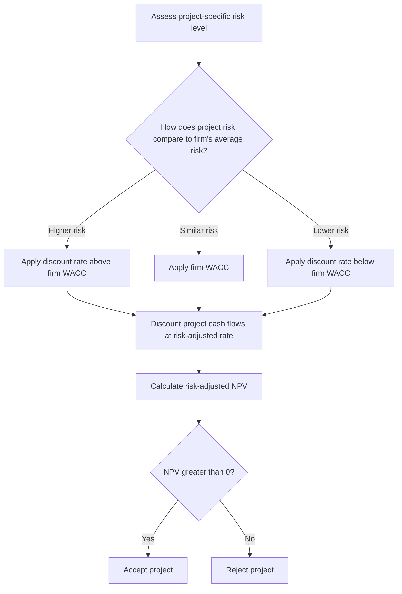

## Risk-Adjusted Discount Rates in Capital Budgeting

### Overview

The risk-adjusted discount rate (RADR) method incorporates project risk directly into capital budgeting by modifying the discount rate used to calculate NPV, rather than adjusting the projected cash flows themselves. Higher-risk projects are discounted at higher rates, and lower-risk projects at lower rates, reflecting the principle that investors require greater compensation for bearing greater uncertainty. This approach is one of the most widely used methods for incorporating risk into investment appraisal because it fits naturally into the standard NPV framework.

**Key Points**

- RADR adjusts the **denominator** (discount rate) of the NPV calculation to reflect risk, in contrast to the certainty equivalent method, which adjusts the **numerator** (cash flows).
- The core principle is that a project's discount rate should reflect the risk of that specific project, not necessarily the risk of the firm as a whole.
- Using a single firm-wide discount rate for all projects, regardless of their individual risk, is a common but potentially costly error in practice.

---

### The Basic Framework

The standard NPV formula is modified by substituting a risk-adjusted rate $r^*$ for the firm's baseline cost of capital:

$$NPV = \sum_{t=1}^{n} \frac{CF_t}{(1+r^*)^t} - CF_0$$

Where:

$$r^* = r_f + Risk\ Premium$$

The risk premium is added to reflect the specific level of risk associated with the project's cash flows, above and beyond the risk-free rate.

---

### Why Firm-Wide WACC Is Not Always Appropriate

A firm's overall Weighted Average Cost of Capital (WACC) reflects the **average risk** of its existing asset base. Applying this single rate to all new projects, regardless of their individual risk characteristics, can lead to systematically poor decisions:

| Scenario | Consequence of Using Firm-Wide WACC |
| --- | --- |
| High-risk project evaluated at firm's average WACC | Discount rate is too low; project appears more attractive than it truly is, risking **acceptance of value-destroying projects** |
| Low-risk project evaluated at firm's average WACC | Discount rate is too high; project appears less attractive than it truly is, risking **rejection of value-creating projects** |

**Key Points**

- This mismatch is sometimes referred to as an inappropriate application of a single "hurdle rate" across a diversified project portfolio.
- Over time, applying a uniform discount rate can bias the firm's overall project mix toward riskier investments, since only unusually profitable but risky projects will clear an artificially low bar for their true risk, while safe but modest-return projects are systematically screened out. [Inference: the direction of this bias is a standard result in corporate finance theory, though its practical magnitude depends on how heterogeneous a firm's project risk actually is]

---

### Risk Categories and Illustrative Discount Rate Adjustments

Firms often group projects into risk categories, each assigned a different discount rate relative to the firm's base WACC:

| Risk Category | Example Projects | Illustrative Discount Rate Adjustment |
| --- | --- | --- |
| **Low risk** | Replacement of existing equipment, cost-reduction projects with predictable savings | WACC − 1% to 2% |
| **Average risk** | Expansion of existing product lines in existing markets | WACC (unadjusted) |
| **Above-average risk** | New product introduction in an existing market | WACC + 2% to 4% |
| **High risk** | Entry into an entirely new business or geographic market | WACC + 4% to 8% or more |
| **Speculative/R&D** | Early-stage research, unproven technology | WACC + 8% or more, or evaluated via real options methods |

[Inference: the specific numerical adjustments shown are illustrative examples of common industry practice rather than a universal standard — actual risk premiums vary substantially by firm, industry, and the analyst's judgment]

---

### Worked Example: Applying Different Discount Rates by Risk Category

A firm has a base WACC of 10%. It is evaluating two projects with identical projected cash flows but different risk profiles:

- **Project A** (equipment replacement, low risk): discount rate = 8%
- **Project B** (new market entry, high risk): discount rate = 15%

Both projects require an initial investment of $100,000 and are expected to generate $30,000 annually for 5 years.

**Project A at 8%:**

$$NPV_A = 30{,}000 \times \left[\frac{1 - (1.08)^{-5}}{0.08}\right] - 100{,}000 = 30{,}000 \times 3.9927 - 100{,}000 = 119{,}781 - 100{,}000 = \$19{,}781$$

**Project B at 15%:**

$$NPV_B = 30{,}000 \times \left[\frac{1 - (1.15)^{-5}}{0.15}\right] - 100{,}000 = 30{,}000 \times 3.3522 - 100{,}000 = 100{,}566 - 100{,}000 = \$566$$

Despite having **identical cash flow projections**, Project B's NPV is dramatically lower once its higher risk is reflected in the discount rate — illustrating how the same projected cash flows can warrant very different accept/reject conclusions depending on the risk-adjusted rate applied. Had both projects incorrectly been evaluated at the firm's base 10% WACC, both would have appeared similarly attractive, masking Project B's substantially higher risk.

---

### Methods for Estimating the Project-Specific Risk Premium

#### 1. Risk Classes / Categorical Approach

As illustrated above, projects are grouped into qualitative risk categories (low, average, high, speculative), each assigned a discount rate adjustment based on managerial judgment and historical experience. This approach is simple to apply but relies heavily on subjective classification.

#### 2. Pure-Play (Comparable Company) Approach

For a specific new venture or division, identify publicly traded firms operating primarily in that same line of business, estimate their beta, and use CAPM to derive a project-specific cost of equity:

$$r_e^{project} = r_f + \beta_{project}(r_m - r_f)$$

The comparable firm's beta is typically **unlevered** (to remove its own capital structure effect) and then **re-levered** using the investing firm's target capital structure, following the Hamada equation approach discussed in cost of capital estimation.

#### 3. CAPM with Project-Specific Beta

When sufficient data exists to estimate or approximate a beta specific to the project's industry or risk class (rather than the firm's overall corporate beta), CAPM can be applied directly using that project-specific beta rather than the firm's own equity beta.

#### 4. Build-Up Method

Commonly used for private companies or projects lacking direct market comparables, this method starts with the risk-free rate and adds a series of discrete premiums:

$$r^* = r_f + Equity\ Risk\ Premium + Size\ Premium + Industry\ Risk\ Premium + Specific\ Company/Project\ Risk\ Premium$$

**Key Points**

- The build-up method is more subjective than CAPM-based approaches, since several of its components (particularly the specific-risk premium) rely on analyst judgment rather than direct market data. [Inference: reliability depends heavily on the quality and consistency of the premiums selected]

---

### Risk-Adjusted Discount Rate vs. Certainty Equivalent Method

| Feature | Risk-Adjusted Discount Rate (RADR) | Certainty Equivalent (CE) Method |
| --- | --- | --- |
| Where risk is incorporated | In the discount rate (denominator) | In the cash flows themselves (numerator) |
| Formula structure | $\sum \frac{CF_t}{(1+r^*)^t}$ | $\sum \frac{CF_t \times \alpha_t}{(1+r_f)^t}$, where $\alpha_t$ is a certainty equivalent factor between 0 and 1 |
| Handling of risk over time | Assumes risk compounds at a constant rate each period | Allows risk adjustment to vary period by period |
| Practical usage | More widely used due to simplicity and intuitive link to required return | Theoretically more flexible but harder to apply due to difficulty estimating period-specific certainty equivalent factors |

**Key Points**

- RADR implicitly assumes that project risk **increases at a constant compounding rate** over time (since the same rate is applied to every future period), which may not accurately reflect projects where risk is concentrated in particular periods (e.g., early-stage technology risk that resolves after a few years).
- The certainty equivalent method can, in principle, address this limitation by allowing the risk adjustment factor to vary by period, but it is used less frequently in practice due to the added estimation burden.

---

### RADR Illustration Across Risk Categories

<svg xmlns="http://www.w3.org/2000/svg" viewBox="0 0 720 340" font-family="Arial, sans-serif">
<rect x="0" y="0" width="720" height="340" fill="#ffffff" stroke="#333333" />
<text x="20" y="26" font-size="16" font-weight="bold" fill="#111111">Risk-Adjusted Discount Rates by Project Category (svg_diagram)</text>
<line x1="80" y1="290" x2="680" y2="290" stroke="#333333" stroke-width="2" />
<line x1="80" y1="290" x2="80" y2="50" stroke="#333333" stroke-width="2" />
<text x="20" y="170" font-size="12" fill="#111111" transform="rotate(-90 20 170)">Discount Rate (%)</text>
<rect x="110" y="230" width="90" height="60" fill="#bbf7d0" stroke="#16a34a" stroke-width="2" />
<text x="115" y="220" font-size="11" fill="#14532d">Low Risk: 8%</text>
<rect x="230" y="200" width="90" height="90" fill="#bfdbfe" stroke="#2563eb" stroke-width="2" />
<text x="225" y="190" font-size="11" fill="#1e3a8a">Average: 10%</text>
<rect x="350" y="150" width="90" height="140" fill="#fde68a" stroke="#d97706" stroke-width="2" />
<text x="335" y="140" font-size="11" fill="#78350f">Above-Avg: 13%</text>
<rect x="470" y="90" width="90" height="200" fill="#fecaca" stroke="#dc2626" stroke-width="2" />
<text x="460" y="80" font-size="11" fill="#7f1d1d">High Risk: 18%</text>
<rect x="590" y="60" width="90" height="230" fill="#e9d5ff" stroke="#7c3aed" stroke-width="2" />
<text x="575" y="50" font-size="11" fill="#4c1d95">Speculative: 22%+</text>
<line x1="80" y1="220" x2="680" y2="220" stroke="#999999" stroke-dasharray="4,4" />
<text x="600" y="235" font-size="10" fill="#888888">Firm WACC = 10%</text>
</svg>

---

### Common Errors in Practice

**Key Points**

- **Applying a single hurdle rate firm-wide** regardless of individual project risk, leading to systematic overinvestment in high-risk projects and underinvestment in low-risk ones.
- **Double-counting risk** — inflating the discount rate for risks that have already been reflected in conservative cash flow estimates, effectively penalizing the project twice.
- **Confusing diversifiable and non-diversifiable risk** — under CAPM-based reasoning, only systematic (market) risk should command a risk premium; project-specific risk that could be diversified away by shareholders holding a broad portfolio should not necessarily inflate the discount rate in a purely CAPM-consistent framework, though many practitioners do incorporate total risk premiums for practical reasons. [Inference: the extent to which firms follow strict CAPM logic versus broader risk premiums varies by practice and industry]
- **Static risk assumption** — assuming a project's risk profile remains constant over its entire life, when in reality risk often decreases as a project matures and uncertainty resolves (a limitation better addressed through real options analysis or period-specific certainty equivalents).

---

### Practical Guidance for Managers

**Key Points**

- Segment the capital budget by project risk category rather than applying a single discount rate across all investment decisions.
- Use CAPM with a project-specific (pure-play) beta wherever reliable comparable data exists, reserving the more subjective build-up method for private ventures or highly specialized projects.
- Periodically review and update risk category classifications and associated discount rate adjustments, since risk premiums are estimates that can shift with changing market conditions.
- For projects with substantial embedded managerial flexibility (staged decisions, options to expand or abandon), consider supplementing RADR with real options analysis, since higher uncertainty in RADR always reduces value, whereas the true impact of uncertainty may be more nuanced when genuine flexibility exists.
- Recognize that the resulting risk-adjusted NPV is an estimate whose accuracy depends on the quality of the underlying risk premium assumptions; actual outcomes may vary depending on how project risk evolves in practice. [Behavior may vary by firm, industry, and the specific risk estimation method used]

---

**Related Topics**

- Estimating the cost of capital (WACC, CAPM, pure-play method)
- Certainty equivalent method in capital budgeting
- Real options analysis in investment decisions
- Sensitivity analysis, scenario analysis, and Monte Carlo simulation
- Systematic vs. unsystematic risk and diversification
- Capital rationing decisions
- Net Present Value and Internal Rate of Return methods