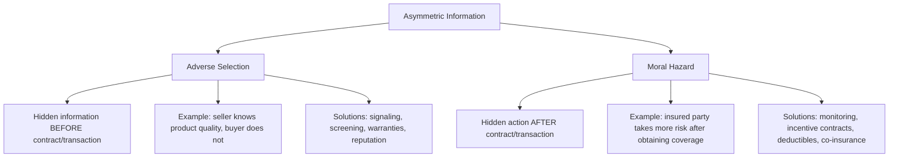
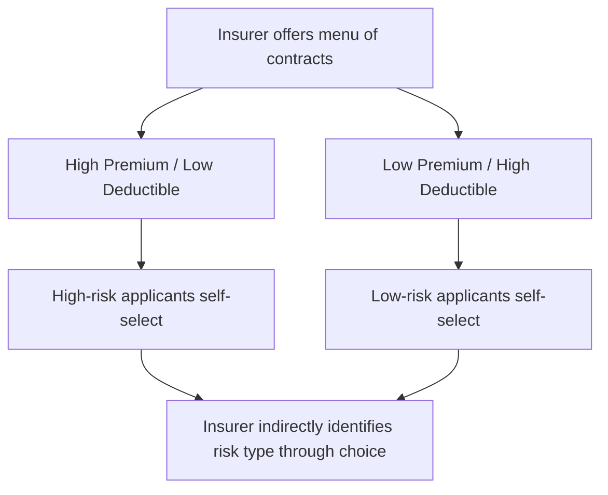

## Asymmetric Information and Market Failure

### Overview

Asymmetric information exists when one party to a transaction possesses more or better information than the other, creating an imbalance that can distort market outcomes. In managerial economics, asymmetric information is a central source of market failure — a situation in which markets fail to allocate resources efficiently, even in the absence of external factors like taxes or public goods. Understanding asymmetric information helps managers design contracts, pricing structures, and organizational mechanisms that mitigate its costly effects.

**Key Points**

- Asymmetric information undermines the standard efficient-market assumption that all parties have equal access to relevant information.
- It generates two principal categories of problems: **adverse selection** (a hidden information problem occurring before a transaction) and **moral hazard** (a hidden action problem occurring after a transaction).
- Left unaddressed, asymmetric information can cause markets to shrink, underperform, or collapse entirely — a phenomenon formally modeled in George Akerlof's "market for lemons."

---

### The Two Core Problems of Asymmetric Information

| Dimension | Adverse Selection | Moral Hazard |
| --- | --- | --- |
| Timing | Before the transaction/contract | After the transaction/contract |
| Nature of hidden element | Hidden **characteristics** or **type** | Hidden **actions** or **effort** |
| Classic example | Used car market (seller knows quality, buyer doesn't) | Insurance (insured party takes more risk once covered) |
| Primary remedies | Signaling, screening, warranties | Monitoring, incentive alignment, deductibles |

---

### Adverse Selection: The "Market for Lemons"

Adverse selection occurs when one party has private information about a characteristic or quality that the other party cannot directly observe before entering into a transaction, leading the market to attract a disproportionate share of low-quality participants.

**The Lemons Model (Akerlof)**

In the used car market, sellers know their car's true quality, but buyers cannot distinguish a good car ("peach") from a defective one ("lemon") before purchase. Because buyers cannot verify quality, they are only willing to pay a price reflecting the *average* quality of cars in the market.

$$P_{market} = E[Quality] = \text{weighted average of high- and low-quality car values}$$

Since this average price is below what a "peach" is actually worth, owners of high-quality cars are discouraged from selling, while owners of low-quality cars are more willing to sell at that price. This shifts the average quality of cars remaining in the market downward, which in turn lowers the price buyers are willing to pay further, potentially driving the process toward market collapse.

**Worked Example**

Suppose the used car market has an equal mix of high-quality cars worth $20,000 and low-quality cars worth $10,000 to sellers. If buyers cannot distinguish between them, they are willing to pay only the expected average value:

$$P = 0.5(20{,}000) + 0.5(10{,}000) = \$15{,}000$$

At $15,000, owners of high-quality ($20,000) cars will not sell, since the price is below their car's true value. Only low-quality car owners remain willing to sell. Buyers, anticipating this, revise their expectations downward, and the equilibrium price falls further — potentially toward $10,000, at which point only lemons are traded and the market for good used cars effectively disappears. This illustrates how information asymmetry alone, without any change in the underlying quality of goods, can cause a market to unravel.

---

### Market Failure: Why Asymmetric Information Distorts Efficiency

In a standard competitive market with full information, prices adjust to reflect true value, and resources are allocated efficiently — the First Welfare Theorem's efficiency result depends critically on this assumption. Asymmetric information breaks this mechanism in several ways:

**Key Points**

- **Mispriced risk** — prices reflect average, not individual, quality or risk, causing systematic mispricing for both high- and low-quality participants.
- **Reduced market participation** — high-quality sellers or low-risk buyers may exit the market entirely rather than accept unfavorable average-based pricing, shrinking overall market volume below the efficient level.
- **Inefficient allocation** — resources may flow to lower-quality or higher-risk participants rather than to their most valuable use, violating the efficiency conditions of a well-functioning market.
- **Potential for complete market collapse** — in extreme cases, adverse selection can eliminate a market entirely, even though mutually beneficial trades would exist under full information (this is the formal definition of market failure due to information asymmetry).

---

### Moral Hazard

Moral hazard arises after a contract or transaction has been agreed upon, when one party can take hidden actions that affect the outcome, and the other party cannot fully observe or verify those actions.

**Classic Examples**

| Context | Hidden Action Problem |
| --- | --- |
| Insurance | Insured party takes less care (e.g., drives less carefully) once coverage reduces personal financial consequences |
| Employment | Employee reduces effort once compensation is not directly tied to observable output |
| Lending | Borrower takes on riskier projects with borrowed funds than the lender would have approved of, since the borrower captures the upside while the lender bears more of the downside risk |
| Corporate management | Managers (agents) pursue personal objectives (e.g., empire-building, excessive perks) that diverge from shareholder (principal) interests once ownership and control are separated |

**Key Points**

- Moral hazard is closely related to the **principal-agent problem**, where the principal (e.g., employer, insurer, shareholder) cannot perfectly monitor the agent's (e.g., employee, insured party, manager) actions.
- The core economic issue is that the party taking the action does not bear its full costs or capture its full benefits, creating a misalignment of incentives.

---

### Signaling: Addressing Adverse Selection from the Informed Side

Signaling occurs when the party holding private information takes a costly, observable action to credibly convey that information to the uninformed party. For a signal to be effective, it must be more costly (or difficult) for low-quality types to produce than for high-quality types, so that mimicking the signal is not worthwhile for the low-quality party.

**Spence's Job Market Signaling Model**

In labor markets, employers cannot directly observe a worker's true productivity before hiring. Education can serve as a signal of productivity if it is relatively less costly (in effort or time) for genuinely high-ability workers to obtain than for low-ability workers — even if education itself does not directly increase productivity. [This is the core insight of Spence's classic signaling model; whether education functions primarily as a signal versus building human capital in practice remains a subject of ongoing debate in labor economics]

**Common Business Signals**

| Signal | Context | What It Signals |
| --- | --- | --- |
| Product warranties | Consumer goods | Confidence in product quality/reliability |
| Formal education credentials | Labor markets | Underlying ability, discipline, or productivity |
| Company brand investment | Consumer markets | Long-term commitment and quality consistency |
| Retained ownership stake by founders | IPO/investment markets | Founder confidence in firm prospects |
| Money-back guarantees | Retail | Seller's confidence that returns will be low |

---

### Screening: Addressing Adverse Selection from the Uninformed Side

Screening is the mirror-image mechanism, in which the **uninformed** party designs a menu of options or a testing process that induces the informed party to reveal private information indirectly, typically through the choices they make.

**Example: Insurance Contract Screening**

An insurer, unable to directly observe whether an applicant is high-risk or low-risk, offers a menu of policies:

- **Policy A**: High premium, low deductible (comprehensive coverage)
- **Policy B**: Low premium, high deductible (limited coverage)

High-risk individuals, anticipating frequent claims, tend to prefer Policy A despite its higher premium, since the low deductible limits their out-of-pocket exposure. Low-risk individuals, expecting few claims, prefer Policy B's lower premium, since they are less concerned about the deductible. This **self-selection** allows the insurer to indirectly infer risk type based on which policy applicants choose, even without directly observing individual risk levels.

---

### Contractual and Institutional Remedies for Moral Hazard

| Mechanism | How It Works |
| --- | --- |
| **Deductibles and co-insurance** | Require the insured party to bear part of any loss, preserving an incentive to exercise care |
| **Monitoring and auditing** | Direct observation of agent behavior, though costly and imperfect |
| **Performance-based compensation** | Ties pay to observable output (sales, profit, stock price) to better align agent incentives with principal goals |
| **Bonding and collateral** | Requires the agent to post a stake that is forfeited if performance falls short, sharing downside risk |
| **Reputation mechanisms** | Repeated interactions and reputational consequences discourage opportunistic behavior even without direct monitoring |
| **Restrictive covenants (lending)** | Loan agreements that limit a borrower's ability to take on excessive additional risk |

**Key Points**

- No single mechanism fully eliminates moral hazard; most real-world contracts represent a **trade-off** between providing risk protection (which can weaken incentives) and preserving strong incentives (which can leave the agent bearing more risk than is efficient). This trade-off is formally addressed in principal-agent contract theory.

---

### Market Failure and the Role of Institutions

**Key Points**

- Beyond private contractual solutions (signaling, screening, incentive contracts), asymmetric information problems are often addressed through **institutional mechanisms**: regulatory disclosure requirements (e.g., mandatory financial reporting for public companies), licensing and certification systems (e.g., professional credentials), credit rating agencies, and third-party inspection or certification services.
- These institutions exist, in part, precisely because private signaling and screening mechanisms alone may not fully resolve asymmetric information problems at a market-wide scale, particularly in markets with many small, dispersed participants. [Inference: the relative effectiveness of private versus institutional solutions varies by market structure and is a subject of ongoing economic and regulatory debate]

---

### Illustration: Adverse Selection Death Spiral

<svg xmlns="http://www.w3.org/2000/svg" viewBox="0 0 720 360" font-family="Arial, sans-serif">
<rect x="0" y="0" width="720" height="360" fill="#ffffff" stroke="#333333" />
<text x="20" y="26" font-size="16" font-weight="bold" fill="#111111">Adverse Selection Unraveling Process (svg_diagram)</text>
<rect x="40" y="55" width="640" height="45" fill="#fef3c7" stroke="#d97706" stroke-width="2" />
<text x="60" y="82" font-size="13" fill="#78350f">Buyers cannot distinguish quality; price reflects average quality</text>
<rect x="40" y="130" width="300" height="45" fill="#dcfce7" stroke="#16a34a" stroke-width="2" />
<text x="55" y="157" font-size="12" fill="#14532d">High-quality sellers exit (price too low)</text>
<rect x="380" y="130" width="300" height="45" fill="#fee2e2" stroke="#dc2626" stroke-width="2" />
<text x="395" y="157" font-size="12" fill="#7f1d1d">Low-quality sellers remain (price acceptable)</text>
<rect x="180" y="210" width="360" height="45" fill="#fde68a" stroke="#d97706" stroke-width="2" />
<text x="195" y="237" font-size="12" fill="#78350f">Average market quality falls further</text>
<rect x="180" y="285" width="360" height="45" fill="#fecaca" stroke="#dc2626" stroke-width="2" />
<text x="195" y="312" font-size="12" fill="#7f1d1d">Buyers revise price downward again — cycle repeats</text>
<line x1="360" y1="100" x2="190" y2="130" stroke="#333333" stroke-width="1.5" />
<line x1="360" y1="100" x2="530" y2="130" stroke="#333333" stroke-width="1.5" />
<line x1="190" y1="175" x2="360" y2="210" stroke="#333333" stroke-width="1.5" />
<line x1="530" y1="175" x2="360" y2="210" stroke="#333333" stroke-width="1.5" />
<line x1="360" y1="255" x2="360" y2="285" stroke="#333333" stroke-width="1.5" marker-end="url(#arrow)" />
</svg>

---

### Practical Implications for Managers

**Key Points**

- **In hiring**, recognize that credentials, references, and structured interviews function partly as screening tools to reduce adverse selection in candidate quality.
- **In product markets**, warranties, free trials, and money-back guarantees serve as costly signals that can help overcome buyer skepticism about unobservable quality.
- **In organizational design**, compensation structures should balance incentive alignment (to mitigate moral hazard) against excessive risk transfer to employees, who are typically less able to diversify away firm-specific risk than shareholders.
- **In supplier and partner relationships**, due diligence, third-party certification, and reputation systems function as institutional substitutes for direct information about a counterparty's hidden characteristics.
- Actual outcomes from any given signaling, screening, or incentive mechanism depend on the specific market context, and mechanisms that work well in one setting may not transfer directly to another. [Behavior may vary by industry, regulatory environment, and market structure]

---

**Related Topics**

- Adverse selection and the market for lemons model
- Moral hazard and the principal-agent problem
- Signaling theory and Spence's job market model
- Screening and self-selection contract design
- Incentive contract design (piece rates, efficiency wages, stock options)
- Insurance economics and risk-sharing mechanisms
- Regulatory disclosure and market institutions