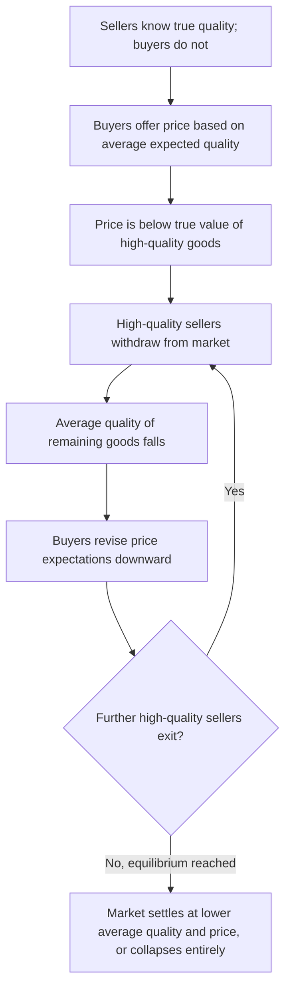
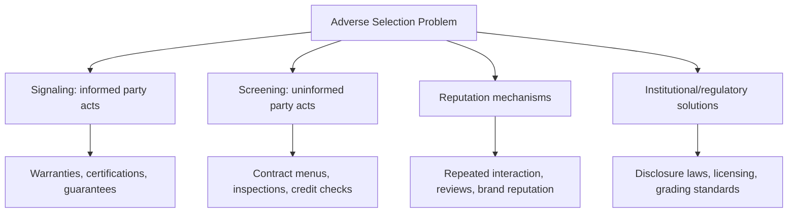

## Adverse Selection and the Market for Lemons

### Overview

Adverse selection is a form of market failure that arises when one party to a potential transaction has private information about quality or risk that the other party cannot observe before the transaction occurs. The "market for lemons," formalized by George Akerlof in his 1970 paper, is the canonical model of this phenomenon, showing how information asymmetry alone — without any change in underlying product quality — can cause high-quality goods to be driven out of a market, and in extreme cases, cause the market to unravel entirely.

**Key Points**

- Adverse selection is a **pre-contractual** (hidden information) problem — it concerns what one party knows about quality or type *before* a transaction takes place, distinguishing it from moral hazard, which concerns hidden *actions* after a transaction.
- The lemons model demonstrates that markets can fail even when all potential trades would be mutually beneficial under full information — the failure arises purely from the information gap itself.
- The term "lemon" originates from U.S. slang for a defective used car, though the model generalizes to any market where sellers know more about quality than buyers (or, symmetrically, where buyers know more than sellers, as in insurance).

---

### The Core Mechanism

This self-reinforcing cycle is often called an **adverse selection death spiral** or **market unraveling**: each round of exit by higher-quality sellers further lowers the average quality of what remains, which further lowers the price buyers are willing to pay, which induces additional high-quality sellers to exit.

---

### Formal Model Setup

Consider a market with two types of used cars:

- **High-quality ("peach")**: true value $V_H$ to sellers, worth $V_H'$ to buyers (with $V_H' > V_H$, reflecting gains from trade)
- **Low-quality ("lemon")**: true value $V_L$ to sellers, worth $V_L'$ to buyers (with $V_L' > V_L$)

Let $q$ = the proportion of high-quality cars in the population, so $(1-q)$ = proportion of low-quality cars.

If buyers cannot distinguish quality, they are willing to pay the **expected value** across both types:

$$P = q \cdot V_H' + (1-q) \cdot V_L'$$

**The Unraveling Condition**

If this expected price $P$ falls below the value high-quality sellers place on retaining their car ($V_H$), those sellers will not sell at all:

$$P < V_H \implies \text{high-quality sellers exit the market}$$

Once high-quality sellers exit, the proportion of high-quality cars among remaining sellers ($q$) falls, which lowers the buyer's willingness to pay further, potentially triggering additional rounds of exit — the unraveling process illustrated above.

---

### Worked Numerical Example

Assume a used car market where:

- High-quality cars are worth $20,000 to sellers and $22,000 to buyers
- Low-quality cars are worth $8,000 to sellers and $10,000 to buyers
- The market initially contains 50% high-quality and 50% low-quality cars ($q = 0.5$)

**Step 1 — Buyers' initial willingness to pay (based on average quality):**

$$P = 0.5(22{,}000) + 0.5(10{,}000) = 11{,}000 + 5{,}000 = \$16{,}000$$

**Step 2 — Compare to high-quality sellers' reservation value:**

Since $P = \$16{,}000 < V_H = \$20{,}000$, high-quality sellers are unwilling to sell at this price. They exit the market.

**Step 3 — Market composition shifts:**

With only low-quality sellers remaining, buyers revise their expectations. Anticipating that only lemons remain, buyers will only pay:

$$P = 1.0 \times 10{,}000 = \$10{,}000$$

**Step 4 — Final equilibrium:**

Since $10,000 exceeds low-quality sellers' reservation value of $8,000, low-quality sellers remain willing to sell, and the market settles into an equilibrium in which **only lemons are traded** — even though, under full information, high-quality cars would have traded profitably at prices between $20,000 and $22,000. This is the central result of the model: complete unraveling to the lowest-quality segment, despite the existence of mutually beneficial trades that go unrealized.

---

### Equilibrium Outcomes of the Lemons Model

| Outcome | Description | Condition |
| --- | --- | --- |
| **Full unraveling** | Only the lowest-quality goods trade; high-quality goods are withdrawn entirely | Buyer's average-quality price falls below high-quality sellers' reservation value at every quality mix |
| **Partial market** | Some high-quality goods remain, but at reduced volume and prices below full-information levels | Depends on relative proportions and value gaps between quality types |
| **Market collapse** | No trade occurs at all | Even low-quality sellers' reservation value exceeds what buyers are willing to pay, given uncertainty |
| **Full-information benchmark** | All goods trade efficiently at prices reflecting true quality | Achieved only if information asymmetry is eliminated (e.g., via signaling, screening, or disclosure) |

---

### Illustration: Market Unraveling

<svg xmlns="http://www.w3.org/2000/svg" viewBox="0 0 720 380" font-family="Arial, sans-serif">
<rect x="0" y="0" width="720" height="380" fill="#ffffff" stroke="#333333" />
<text x="20" y="26" font-size="16" font-weight="bold" fill="#111111">Lemons Model: Price and Quality Unraveling (svg_diagram)</text>
<line x1="80" y1="330" x2="680" y2="330" stroke="#333333" stroke-width="2" />
<line x1="80" y1="330" x2="80" y2="50" stroke="#333333" stroke-width="2" />
<text x="350" y="360" font-size="13" fill="#111111">Round of Unraveling</text>
<text x="20" y="200" font-size="13" fill="#111111" transform="rotate(-90 20 200)">Price (\$)</text>
<line x1="80" y1="90" x2="680" y2="90" stroke="#16a34a" stroke-dasharray="4,4" />
<text x="560" y="85" font-size="11" fill="#16a34a">High-quality value: \$20,000-\$22,000</text>
<line x1="80" y1="280" x2="680" y2="280" stroke="#dc2626" stroke-dasharray="4,4" />
<text x="560" y="275" font-size="11" fill="#dc2626">Low-quality value: \$8,000-\$10,000</text>
<circle cx="180" cy="165" r="6" fill="#2563eb" />
<text x="150" y="150" font-size="11" fill="#2563eb">Round 1: \$16,000</text>
<circle cx="380" cy="278" r="6" fill="#2563eb" />
<text x="350" y="263" font-size="11" fill="#2563eb">Round 2: \$10,000</text>
<circle cx="580" cy="278" r="6" fill="#2563eb" />
<text x="530" y="310" font-size="11" fill="#2563eb">Equilibrium: only lemons trade</text>
<path d="M 180 165 L 380 278 L 580 278" fill="none" stroke="#2563eb" stroke-width="2" stroke-dasharray="2,2" />
</svg>

---

### Real-World Markets Susceptible to Adverse Selection

| Market | Informed Party | Hidden Characteristic |
| --- | --- | --- |
| Used cars | Seller | True mechanical condition |
| Health insurance | Buyer (insured) | Underlying health status/risk |
| Life insurance | Buyer (insured) | Health, lifestyle risk factors |
| Credit/lending | Borrower | True creditworthiness/default risk |
| Labor markets | Job applicant | True productivity/ability |
| Corporate securities (IPOs) | Firm insiders | True firm value/prospects |
| Franchise/business sales | Seller | True profitability and hidden liabilities |

**Key Points**

- Note that in **insurance markets**, the direction of asymmetry is reversed relative to the classic used-car example: it is the *buyer* (the insured party) who holds private information about their own risk, while the *seller* (the insurer) is the less-informed party. The underlying unraveling logic, however, is structurally the same.

---

### Market-Based and Contractual Solutions

Since the lemons problem arises purely from information asymmetry, resolving it generally requires reducing or eliminating that asymmetry through one of the following mechanisms:

**Signaling** (informed party acts)

- Warranties and guarantees, which are more costly for sellers of genuinely low-quality goods to offer credibly
- Certified pre-owned programs in the used car industry
- Third-party inspections paid for by the seller to demonstrate confidence in quality
- Money-back return policies

**Screening** (uninformed party acts)

- Menus of insurance contracts designed to induce self-selection by risk type
- Vehicle history reports (e.g., CARFAX) purchased or required by buyers
- Independent mechanical inspections commissioned by buyers before purchase
- Credit scoring and underwriting processes in lending

**Reputation and Repeated Interaction**

- Dealer reputation, online reviews, and repeat-business incentives can substitute for one-time information asymmetry, since a seller who consistently misrepresents quality faces long-run reputational costs. [Inference: the effectiveness of reputation mechanisms depends on the frequency of repeated interaction and the visibility of quality information to future buyers]

**Institutional/Regulatory Solutions**

- Mandatory disclosure requirements (e.g., vehicle title branding for previously flood-damaged or salvage cars, "lemon laws" providing legal recourse for defective new vehicles)
- Licensing and certification requirements for certain professions or products
- Standardized quality grading systems (e.g., agricultural commodity grading)

---

### Broader Implications for Managerial Decision-Making

**Key Points**

- **Pricing strategy**: firms selling genuinely high-quality goods in markets prone to adverse selection should actively invest in credible signals (warranties, certifications, money-back guarantees) rather than relying on price alone to communicate quality, since price alone cannot separate high- from low-quality offerings when quality is unobservable.
- **Market entry decisions**: firms considering entry into markets historically plagued by adverse selection (e.g., peer-to-peer lending, gig economy services) should anticipate the need for robust screening and signaling infrastructure (ratings, reviews, verification systems) to sustain a functioning market.
- **Employee and partner selection**: the same logic underlies why firms invest in structured interviews, reference checks, and probationary periods — these function as screening tools to reduce adverse selection in hiring, where candidate quality is not fully observable at the point of hiring.
- **Platform design** (e.g., online marketplaces): two-sided platforms often build reputation and rating systems specifically to counteract the lemons problem inherent in transactions between strangers, since without such systems, the same unraveling dynamic can undermine buyer trust and shrink platform transaction volume. [Inference: while this rationale is widely cited in platform economics literature, the precise magnitude of the effect varies by market and platform design]

---

### Limitations and Extensions of the Basic Model

- **Assumes fully rational, informed-on-average buyers** — real buyers may have partial information, behavioral biases, or access to imperfect but useful signals, which can soften (but not necessarily eliminate) the unraveling dynamic. [Inference: real-world markets rarely exhibit the model's extreme full-unraveling outcome, since partial signals and institutions typically mitigate the effect to some degree]
- **Static, one-shot framing** — the original model does not incorporate repeated interactions or reputation-building, both of which are common mitigating forces in real markets.
- **Assumes no cost-effective signaling or screening exists** — in practice, many markets have developed institutions (inspections, warranties, ratings) specifically because the costs of unraveling are large enough to justify investment in solutions, meaning full lemons-style collapse is more the theoretical worst case than the typical real-world outcome.
- **Behavior may vary by market structure**, including the number of buyers and sellers, repeat-purchase frequency, and the availability of third-party verification, so the degree of unraveling observed empirically differs considerably across industries.

---

**Related Topics**

- Asymmetric information and market failure (broader framework)
- Moral hazard and the principal-agent problem
- Signaling theory and Spence's job market model
- Screening and self-selection contract design
- Insurance economics and risk classification
- Reputation systems and repeated games
- Regulatory disclosure requirements and consumer protection law