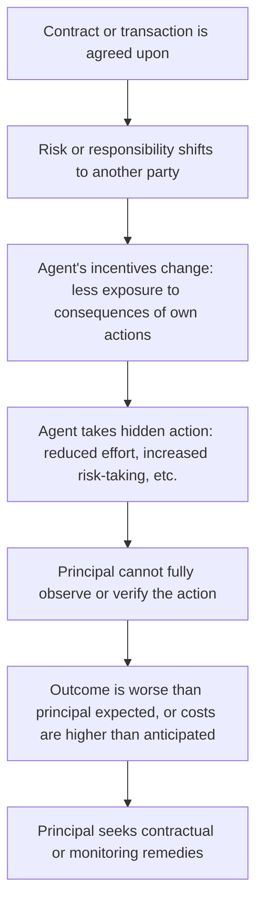
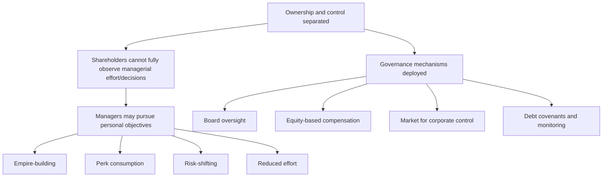

## Moral Hazard in Business Relationships

### Overview

Moral hazard occurs when one party to a transaction or contract can take hidden actions after the agreement is made that affect the outcome, while the other party cannot fully observe or verify those actions. Unlike adverse selection, which concerns hidden *information* before a transaction, moral hazard concerns hidden *behavior* after a transaction — the informed party's incentives change once risk or responsibility has shifted, often in ways that work against the other party's interests.

**Key Points**

- Moral hazard is a **post-contractual** problem: it emerges only after a relationship, contract, or transaction has been established.
- It arises whenever one party's actions are costly or impossible for the other party to fully observe, and those actions affect the value or risk of the relationship.
- Moral hazard is closely linked to the **principal-agent problem**, since it typically involves a principal (who bears consequences) and an agent (who takes the hidden action) with imperfectly aligned incentives.

---

### The Core Mechanism

The essential condition for moral hazard is a **misalignment between who bears the cost of an action and who chooses that action** — when the party taking an action does not fully internalize its consequences, they have reduced incentive to act in the other party's interest.

---

### Classic Examples of Moral Hazard

| Context | Principal | Agent | Hidden Action |
| --- | --- | --- | --- |
| Insurance | Insurer | Insured party | Reduced precaution once covered (e.g., less careful driving, delayed maintenance) |
| Employment | Employer | Employee | Reduced effort once compensation is not directly tied to output |
| Corporate governance | Shareholders | Managers | Empire-building, excessive perks, risk-shifting, underinvestment in effort |
| Lending | Lender | Borrower | Taking on riskier projects than the lender would approve, since upside is captured by the borrower |
| Healthcare | Insurer | Patient/Provider | Overconsumption of care when costs are largely covered by insurance |
| Franchising | Franchisor | Franchisee | Reduced adherence to brand standards when monitoring is costly |
| Venture capital | Investors | Founders/Management | Pursuing personal objectives (prestige projects) over value maximization |

---

### Worked Example: Insurance and Moral Hazard

Consider a firm offering full property insurance coverage with no deductible. Before insurance, a business owner invests $5,000 annually in fire-prevention measures (sprinklers, inspections, maintenance) because they bear the full cost of any fire loss.

**Without insurance:**

$$Expected\ Cost_{owner} = Prevention\ Cost + P(fire) \times Loss$$

The owner has full incentive to minimize $P(fire)$ through prevention spending, since they bear 100% of any loss.

**With full insurance (no deductible, no co-insurance):**

Once insured, the owner's exposure to loss is eliminated. The owner's private incentive to invest in prevention falls, since:

$$Expected\ Cost_{owner,insured} = Prevention\ Cost\ (fire\ risk\ now\ borne\ by\ insurer)$$

If prevention spending is costly and not directly observed by the insurer, a rational, self-interested owner may reduce prevention spending — for example, cutting the $5,000 to $1,000 — because the owner no longer bears the financial consequences of a higher fire probability. This increases the insurer's expected claims cost, a cost the insurer did not price into the original premium, since the premium was based on the owner's pre-insurance (higher-prevention) behavior.

**Key Points**

- This is the textbook illustration of moral hazard: insurance, by design, reduces the insured party's exposure to loss, which — absent countervailing contract design — can simultaneously reduce their incentive to prevent that loss.
- The insurer's central challenge is that it cannot costlessly observe the owner's actual prevention spending, making the hidden action a genuine information problem rather than simply a matter of writing a more detailed contract.

---

### Moral Hazard and the Principal-Agent Problem

Moral hazard is the behavioral mechanism underlying the broader principal-agent problem: whenever a principal delegates decision-making authority or bears risk on behalf of an agent, and cannot perfectly monitor the agent's actions, the agent's incentives may diverge from the principal's interests.

$$Agency\ Cost = Monitoring\ Costs + Bonding\ Costs + Residual\ Loss$$

Where:

- **Monitoring costs**: expenses incurred by the principal to observe and constrain agent behavior
- **Bonding costs**: expenses incurred by the agent to credibly commit to acting in the principal's interest
- **Residual loss**: the remaining value lost due to imperfect alignment, even after monitoring and bonding

**Key Points**

- Agency costs are rarely reducible to zero, since perfect observation of an agent's actions is typically prohibitively costly or technically impossible.
- The goal of contract design under moral hazard is not to eliminate agency costs entirely, but to find the structure that **minimizes total agency costs** given the specific monitoring technology and risk-sharing trade-offs available.

---

### Employment Relationships: Effort and Compensation Design

In employment settings, moral hazard arises because an employer typically cannot perfectly observe an employee's effort, only observable outcomes (which are also affected by factors outside the employee's control, such as market conditions or luck).

**The Effort-Risk Trade-off**

$$Compensation = Fixed\ Wage + \beta \times Observable\ Outcome$$

Where $\beta$ represents the sensitivity of pay to performance. Choosing $\beta$ involves a fundamental trade-off:

| Higher $\beta$ (performance-based pay) | Lower $\beta$ (fixed wage) |
| --- | --- |
| Stronger incentive to exert effort | Weaker incentive to exert effort |
| Employee bears more income risk from factors outside their control | Employee bears less risk; income is more stable |
| Appropriate when outcomes are strongly effort-driven and employee can bear risk | Appropriate when outcomes are heavily influenced by external, uncontrollable factors |

**Key Points**

- This is the central insight of principal-agent contract theory applied to compensation: since employees are typically more risk-averse than shareholders or employers (who can diversify), fully performance-based pay ($\beta = 1$) is rarely optimal, even though it would maximize incentive alignment, because it forces the employee to bear excessive uncompensated risk.
- The optimal contract balances **incentive provision** against **risk-sharing efficiency** — a trade-off formally derived in agency theory models. [This trade-off is a well-established result in principal-agent contract theory]

---

### Corporate Governance: Managers as Agents of Shareholders

Moral hazard in corporate governance arises from the separation of ownership (shareholders) and control (managers), first systematically analyzed by Berle and Means and later formalized in agency theory by Jensen and Meckling.

**Common Manifestations**

- **Empire-building**: managers pursuing growth or acquisitions that enhance their own status or compensation rather than shareholder value
- **Excessive perquisite consumption**: spending on executive perks beyond what maximizes firm value
- **Risk aversion or risk-shifting**: managers avoiding value-maximizing but personally risky projects (career risk), or conversely, taking excessive risks with shareholder capital if compensation is asymmetric (e.g., stock options with unlimited upside and limited personal downside)
- **Underinvestment in effort**: reduced diligence when managerial performance is difficult for shareholders to directly observe

---

### Mechanisms to Mitigate Moral Hazard

| Mechanism | How It Works | Typical Context |
| --- | --- | --- |
| **Deductibles / co-insurance** | Insured party bears part of any loss, preserving incentive for care | Insurance contracts |
| **Performance-based pay** | Ties compensation to observable output, aligning agent incentives with principal goals | Employment, executive compensation |
| **Equity/stock options** | Aligns manager incentives with shareholder value creation | Corporate governance |
| **Monitoring and auditing** | Direct or indirect observation of agent behavior | Employment, lending, franchising |
| **Bonding and collateral** | Agent posts a stake forfeited upon poor performance, sharing downside risk | Lending, franchising, executive contracts |
| **Restrictive covenants** | Contractual limits on agent's permissible actions (e.g., loan covenants restricting borrower risk-taking) | Corporate lending |
| **Reputation and repeated interaction** | Long-term relationships discourage opportunistic behavior even without direct monitoring | Franchising, supplier relationships, professional services |
| **Efficiency wages** | Paying above-market wages increases the cost of job loss, deterring shirking | Employment |

**Key Points**

- No single mechanism eliminates moral hazard entirely; effective contract design typically **combines multiple mechanisms** tailored to the specific relationship, monitoring technology, and risk-sharing needs involved.
- Excessive reliance on any single mechanism carries trade-offs — for example, very high deductibles reduce moral hazard but also reduce the risk-protection value of insurance in the first place, potentially discouraging purchase of coverage altogether.

---

### Illustration: The Incentive-Risk Trade-off

<svg xmlns="http://www.w3.org/2000/svg" viewBox="0 0 700 360" font-family="Arial, sans-serif">
<rect x="0" y="0" width="700" height="360" fill="#ffffff" stroke="#333333" />
<text x="20" y="26" font-size="16" font-weight="bold" fill="#111111">Incentive vs. Risk-Sharing Trade-off in Contract Design (svg_diagram)</text>
<line x1="80" y1="300" x2="620" y2="300" stroke="#333333" stroke-width="2" />
<line x1="80" y1="300" x2="80" y2="50" stroke="#333333" stroke-width="2" />
<text x="280" y="330" font-size="13" fill="#111111">Pay Sensitivity to Performance (beta)</text>
<text x="20" y="180" font-size="12" fill="#111111" transform="rotate(-90 20 180)">Level</text>
<path d="M 90 280 C 250 230, 400 130, 600 70" fill="none" stroke="#2563eb" stroke-width="3" />
<text x="420" y="100" font-size="12" fill="#2563eb" font-weight="bold">Incentive strength (rises with beta)</text>
<path d="M 90 90 C 250 140, 400 220, 600 280" fill="none" stroke="#dc2626" stroke-width="3" />
<text x="400" y="240" font-size="12" fill="#dc2626" font-weight="bold">Risk borne by agent (rises with beta)</text>
<circle cx="330" cy="175" r="6" fill="#16a34a" />
<text x="340" y="165" font-size="12" fill="#16a34a" font-weight="bold">Optimal balance point</text>
</svg>

---

### Moral Hazard vs. Adverse Selection: Key Distinctions

| Feature | Adverse Selection | Moral Hazard |
| --- | --- | --- |
| Timing | Before the contract/transaction | After the contract/transaction |
| Nature of asymmetry | Hidden information/type | Hidden action/behavior |
| Solutions | Signaling, screening | Monitoring, incentive contracts, risk-sharing |
| Insurance example | Insurer cannot tell high-risk from low-risk applicants before issuing a policy | Insured party changes behavior (less care) after obtaining coverage |
| Employment example | Employer cannot verify candidate's true ability before hiring | Employee reduces effort after being hired, once monitored less closely |

**Key Points**

- Many real business relationships exhibit **both** adverse selection and moral hazard simultaneously — for example, lenders face adverse selection in screening loan applicants and moral hazard in monitoring how borrowed funds are subsequently used — requiring a combined set of screening and incentive-based remedies.

---

### Practical Implications for Managers

**Key Points**

- **Compensation design**: structure pay to balance incentive alignment against the employee's ability to bear risk; purely fixed salaries invite reduced effort, while purely output-based pay may impose excessive, uncompensated risk on risk-averse employees.
- **Vendor and franchise management**: build in monitoring, periodic audits, and standardized reporting requirements where quality or compliance cannot be directly observed on a continuous basis.
- **Lending and financing decisions**: use covenants, collateral requirements, and staged disbursement of funds to limit a borrower's ability to shift risk onto the lender after funds are advanced.
- **Corporate governance**: align managerial incentives with shareholder interests through equity-based compensation, independent board oversight, and performance-linked pay, while remaining aware that poorly designed incentive structures (e.g., asymmetric stock option payoffs) can themselves encourage excessive risk-taking — a moral hazard problem in its own right.
- Effectiveness of any mitigation mechanism depends on the specific relationship, the cost and feasibility of monitoring, and the degree of risk aversion among the parties involved; outcomes should be expected to vary across firms and industries. [Behavior may vary by organizational context and monitoring technology available]

---

**Related Topics**

- Asymmetric information and market failure (broader framework)
- Adverse selection and the market for lemons
- Principal-agent theory and agency costs
- Incentive contract design (efficiency wages, stock options, piece rates)
- Corporate governance and the separation of ownership and control
- Insurance economics: deductibles, co-insurance, and risk pooling
- Debt covenants and lender risk management