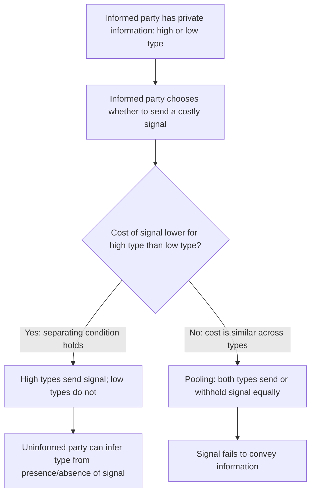
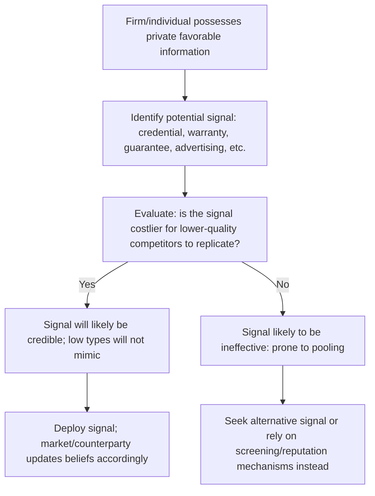

## Signaling Mechanisms and Credible Information Transfer

### Overview

Signaling is a strategy in which the party holding private information — the informed party — takes a deliberate, observable action to credibly convey that information to an uninformed party. Signaling theory, most formally developed by Michael Spence in his 1973 job market model, addresses a central puzzle in information economics: since anyone can simply *claim* to have favorable hidden characteristics, how can such claims be made credible? The answer lies in **costly signaling** — actions that are more expensive or difficult for low-quality types to undertake than for high-quality types, so that only genuine high-quality parties find it worthwhile to send the signal.

**Key Points**

- Signaling is initiated by the **informed** party, in contrast to screening, which is initiated by the **uninformed** party.
- For a signal to be credible, it must satisfy a **cost-separation condition**: the signal must be costly enough that it is not worthwhile for low-quality types to mimic, while remaining worthwhile for high-quality types.
- Effective signals need not have any intrinsic productive value — their function is purely to differentiate quality by imposing differential costs across types.

---

### The Core Logic of Costly Signaling

**Key Points**

- When the cost-separation condition holds, the market reaches a **separating equilibrium**, in which different types choose different actions, revealing their type through their choice.
- When costs do not sufficiently differ across types, the market may instead settle into a **pooling equilibrium**, in which all types behave identically and no information is revealed — the signal fails.

---

### Spence's Job Market Signaling Model

The foundational formal model of signaling theory examines how education can function as a signal of worker productivity, even if education itself does not directly increase productivity.

**Model Setup**

- Two types of workers: **high-ability** and **low-ability**, with productivity $\theta_H > \theta_L$
- Employers cannot directly observe worker ability before hiring
- Workers can obtain education at level $e$, at a cost that differs by type: $C_H(e) < C_L(e)$ for any given $e > 0$ — education is **less costly** (in effort, time, or difficulty) for high-ability workers to obtain than for low-ability workers
- Employers pay wages based on observed education level, using education as a proxy for (unobserved) ability

**The Separating Equilibrium Condition**

For education to function as a valid signal, there must exist some education level $e^*$ such that:

$$C_H(e^*) < w(e^*) - w(0) < C_L(e^*)$$

This condition states that the wage premium from obtaining education level $e^*$ exceeds the cost of obtaining it for high-ability workers (making it worthwhile for them to signal), but falls short of the cost for low-ability workers (making it not worthwhile for them to mimic).

**Worked Example**

Suppose employers offer a wage of $40,000 to workers with no college degree and $70,000 to workers with a college degree (a $30,000 premium), reflecting the market's belief that a degree signals high ability, even if the degree curriculum itself does not directly teach job-relevant skills.

- **High-ability workers**: cost of obtaining a degree (in time, tuition, effort) = $20,000 (in present-value terms)
- **Low-ability workers**: cost of obtaining a degree = $35,000 (higher, because acquiring the credential is more difficult or time-consuming for them)

For high-ability workers: $\$30{,}000 > \$20{,}000$ — the wage premium exceeds their cost, so they obtain the degree.

For low-ability workers: $\$30{,}000 < \$35{,}000$ — the wage premium is less than their cost, so they do **not** obtain the degree.

The result is a separating equilibrium: only high-ability workers acquire the credential, allowing employers to correctly infer ability from the presence or absence of a degree, even though — in this stylized example — the degree itself contributes nothing directly to productivity. [This is the central, somewhat counterintuitive insight of Spence's model; the extent to which real-world education functions primarily as a signal versus building genuine human capital remains a subject of ongoing debate among labor economists]

---

### Requirements for an Effective Signal

| Requirement | Explanation |
| --- | --- |
| **Differential cost** | The signal must cost less for high-quality types than for low-quality types (in money, effort, time, or foregone opportunity) |
| **Observability** | The uninformed party must be able to observe whether the signal was sent |
| **Credibility / non-mimicry** | The cost gap must be large enough that low-quality types genuinely prefer not to send the signal, even knowing it would improve how they are perceived |
| **Sufficient value from correct inference** | The benefit of being correctly identified as high-quality must exceed the signal's cost for high-quality types |

**Key Points**

- A signal that is equally costly (or costless) for all types **cannot** separate types — this is why simple, unverifiable claims ("trust me, my product is high quality") fail to function as credible signals; anyone can make the same claim at the same cost.
- The signal itself does not need to have any inherent connection to the underlying quality being signaled — what matters is only that the *cost* of producing the signal correlates with quality.

---

### Common Business Signals and Their Cost-Separation Logic

| Signal | Signals | Why It's Costly for Low Types to Mimic |
| --- | --- | --- |
| **Product warranties** | Product reliability/quality | A firm selling unreliable products would face high expected warranty claim costs, making long warranties unprofitable for them |
| **Money-back guarantees** | Confidence in customer satisfaction | High return rates for low-quality products make the guarantee costly for low-quality sellers |
| **Advertising expenditure** | Firm's confidence in repeat business/product quality | Large sunk advertising spend is only recouped through repeat purchases, which low-quality products are less likely to generate |
| **Formal education credentials** | Worker ability, discipline, persistence | Costlier (in time/effort) for lower-ability individuals to complete rigorous programs |
| **Founder equity retention (IPOs)** | Founder confidence in firm value | A founder confident in low true value would prefer to sell shares and diversify rather than retain a large stake |
| **High minimum price / premium positioning** | Product quality (price-as-signal) | Sustaining a premium price requires quality sufficient to support repeat purchase at that price |
| **Third-party certifications** | Verified quality or compliance | Certification bodies impose real costs and standards that low-quality producers cannot easily satisfy |
| **Extended service contracts** | Product durability | Costly to honor if the underlying product is genuinely failure-prone |

---

### Advertising as a Signal: The Nelson Model

Phillip Nelson's classic analysis extends signaling logic to advertising itself, distinguishing between:

- **Search goods**: quality can be assessed before purchase (e.g., clothing style, furniture design)
- **Experience goods**: quality can only be assessed after purchase or use (e.g., food taste, service quality, durability)

For experience goods, high levels of advertising expenditure can function as a signal of quality — not necessarily because of the informational *content* of the ad, but because large advertising outlays are a sunk cost that only pays off if the product generates sufficient repeat purchases, which in turn depends on the product actually being good. A firm selling a low-quality experience good would find heavy advertising unprofitable, since disappointed first-time buyers would not return. [Inference: this is a well-established theoretical result in the advertising-as-signal literature, though the empirical strength of this effect varies across product categories and markets]

---

### Signaling Process in Practice

---

### Illustration: Separating vs. Pooling Equilibrium

<svg xmlns="http://www.w3.org/2000/svg" viewBox="0 0 720 360" font-family="Arial, sans-serif">
<rect x="0" y="0" width="720" height="360" fill="#ffffff" stroke="#333333" />
<text x="20" y="26" font-size="16" font-weight="bold" fill="#111111">Separating vs. Pooling Equilibrium (svg_diagram)</text>
<rect x="30" y="55" width="320" height="270" fill="#dbeafe" stroke="#2563eb" stroke-width="2" />
<text x="60" y="85" font-size="14" font-weight="bold" fill="#1e3a8a">Separating Equilibrium</text>
<text x="50" y="115" font-size="12" fill="#1e3a8a">High type: sends costly signal</text>
<text x="50" y="140" font-size="12" fill="#1e3a8a">(cost &lt; benefit for high type)</text>
<text x="50" y="175" font-size="12" fill="#1e3a8a">Low type: does not send signal</text>
<text x="50" y="200" font-size="12" fill="#1e3a8a">(cost &gt; benefit for low type)</text>
<text x="50" y="240" font-size="12" font-weight="bold" fill="#1e3a8a">Result: type is revealed</text>
<text x="50" y="260" font-size="12" fill="#1e3a8a">Information asymmetry resolved</text>
<rect x="370" y="55" width="320" height="270" fill="#fee2e2" stroke="#dc2626" stroke-width="2" />
<text x="400" y="85" font-size="14" font-weight="bold" fill="#7f1d1d">Pooling Equilibrium</text>
<text x="390" y="115" font-size="12" fill="#7f1d1d">Both types send signal</text>
<text x="390" y="140" font-size="12" fill="#7f1d1d">OR both types withhold signal</text>
<text x="390" y="175" font-size="12" fill="#7f1d1d">(cost gap insufficient to</text>
<text x="390" y="200" font-size="12" fill="#7f1d1d">separate behavior)</text>
<text x="390" y="240" font-size="12" font-weight="bold" fill="#7f1d1d">Result: type is NOT revealed</text>
<text x="390" y="260" font-size="12" fill="#7f1d1d">Information asymmetry persists</text>
</svg>

---

### Signaling vs. Screening: Complementary Mechanisms

| Feature | Signaling | Screening |
| --- | --- | --- |
| Who initiates the mechanism | Informed party | Uninformed party |
| Direction of effort | Informed party takes costly action to reveal type | Uninformed party designs a menu/test to induce self-revelation |
| Example (labor market) | Worker obtains a degree to signal ability | Employer designs a multi-stage interview and testing process to sort candidates |
| Example (insurance) | Applicant provides voluntary health records to obtain lower premiums | Insurer offers a menu of deductible/premium combinations to induce self-selection |

**Key Points**

- Signaling and screening often operate **together** in real markets — for example, job candidates signal ability through credentials while employers simultaneously screen through interviews and assessments, providing multiple, mutually reinforcing channels for information to be revealed.

---

### Limitations and Risks of Signaling Strategies

- **Signaling costs are real resource costs** — from a pure efficiency standpoint, signaling can be socially wasteful if the signal (e.g., extensive credentialing) has little direct productive value beyond its separating function, representing a cost borne purely to solve an information problem. [Inference: whether specific real-world signals such as formal education are primarily wasteful signaling versus valuable skill-building remains empirically contested]
- **Risk of signal inflation ("signaling arms race")** — if a signal becomes widely adopted, its marginal value as a differentiator can erode over time, potentially requiring ever-costlier signals to maintain separation (e.g., escalating credential requirements in competitive labor markets).
- **Pooling risk** — if cost differences between types are not large enough, or if low-quality types find ways to reduce their own signaling costs, the market can collapse into a pooling equilibrium where the signal loses its informational value.
- **Signal reliability may erode with imitation** — competitors may find ways to replicate the *appearance* of a signal without bearing its true underlying cost (e.g., counterfeit certifications), undermining the signal's credibility over time. [Unverified: the specific vulnerability of any given signal to imitation depends on how easily it can be verified or counterfeited]

---

### Practical Guidance for Managers

**Key Points**

- When seeking to convey unobservable quality to customers, investors, or partners, favor signals that are **genuinely more costly for lower-quality competitors** to replicate — cheap, easily imitated claims will not be credible and may be discounted by sophisticated counterparties.
- In hiring, recognize that credentials function partly as signals; combining signal-based screening (degrees, certifications) with direct assessment (skills tests, work samples) can improve overall accuracy in identifying true candidate quality.
- In fundraising or investor relations, actions such as retaining significant personal equity, accepting performance-based compensation, or committing to milestones function as costly signals of management's confidence in the venture's prospects.
- Be cautious of relying on signals that have become common or easily replicated across an industry, since their differentiating value diminishes once most market participants can produce them at similar cost.
- The actual effectiveness of any given signal depends on market-specific factors — how well counterparties understand and trust the signal, and how easily it can be verified — so outcomes should be expected to vary across industries and contexts. [Behavior may vary depending on market sophistication and verification infrastructure]

---

**Related Topics**

- Asymmetric information and market failure
- Adverse selection and the market for lemons
- Screening and self-selection contract design
- Spence's job market signaling model (formal derivation)
- Advertising economics: search goods vs. experience goods
- Reputation mechanisms and repeated games
- Certification, licensing, and third-party verification systems