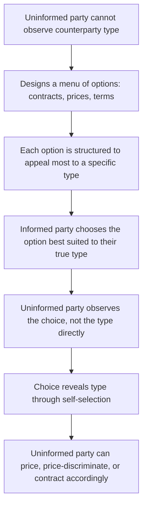
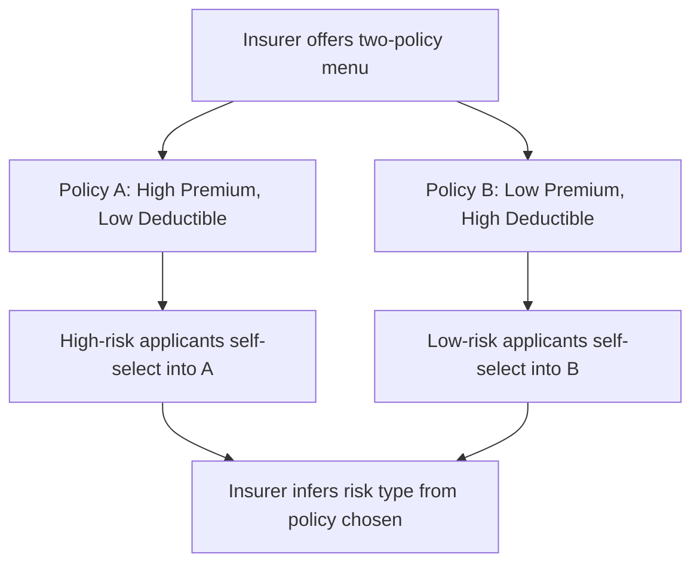
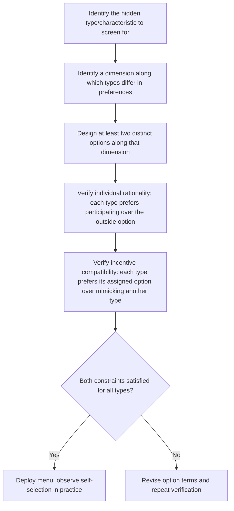

## Screening Mechanisms and Self-Selection

### Overview

Screening is a strategy in which the **uninformed** party to a transaction designs a set of choices, tests, or contract terms that induce the informed party to reveal private information indirectly, through the choices they make. Unlike signaling — which is initiated by the informed party — screening shifts the burden of resolving information asymmetry onto the uninformed party, who structures the environment so that different types of counterparties **self-select** into different options, revealing their hidden type in the process.

**Key Points**

- Screening is initiated by the uninformed party, in contrast to signaling, which is initiated by the informed party.
- The core technique is designing a **menu of options** (contracts, prices, product versions) such that each type of informed party finds it in their own interest to choose the option intended for their type.
- Screening relies on the **self-selection constraint**: the menu must be designed so that no type wants to mimic another type's choice, even though they are free to do so.

---

### The Core Logic of Screening

**Key Points**

- A successful screening menu achieves a **separating equilibrium**, where each type selects a distinct option, allowing the uninformed party to infer type from observed choice.
- If the menu is poorly designed, all types may choose the same option (a **pooling equilibrium**), and no information is revealed.

---

### Self-Selection Constraints: The Formal Structure

For a screening menu to successfully separate types, it must satisfy two categories of constraints, drawn from mechanism design theory:

**Individual Rationality (Participation) Constraint**

Each type must prefer their assigned option to not participating at all:

$$U_i(\text{assigned option}) \geq U_i(\text{outside option})$$

**Incentive Compatibility (Self-Selection) Constraint**

Each type must prefer their assigned option to any other type's option:

$$U_i(\text{option}_i) \geq U_i(\text{option}_j) \quad \text{for all } j \neq i$$

**Key Points**

- These two constraints together define the feasible set of screening menus. Constructing an effective menu means finding contract terms that satisfy both constraints simultaneously for every type in the population.
- In practice, the incentive compatibility constraint is usually the **binding** constraint for at least one type — meaning that type is just barely indifferent between their assigned option and mimicking another type, which is the standard result in screening/mechanism design theory.

---

### Classic Example: Insurance Contract Screening

An insurer cannot directly observe whether an applicant is high-risk or low-risk, but can design a menu of policies that induces self-selection by risk type.

**The Menu**

| Policy | Premium | Deductible | Coverage |
| --- | --- | --- | --- |
| **Policy A** | High | Low | Comprehensive |
| **Policy B** | Low | High | Limited |

**Why Self-Selection Works**

- **High-risk applicants** expect to file claims frequently. The low deductible in Policy A limits their expected out-of-pocket exposure, making the higher premium worthwhile to them despite its cost.
- **Low-risk applicants** expect to file claims rarely. They prefer Policy B's lower premium, since the high deductible rarely matters to them in practice — they are unlikely to need to pay it.

**Worked Numerical Example**

Assume:

- High-risk applicants: expected claim frequency = 0.30 claims/year, average claim = $5,000
- Low-risk applicants: expected claim frequency = 0.05 claims/year, average claim = $5,000

**Policy A**: Premium = $1,600/year, Deductible = $200

**Policy B**: Premium = $400/year, Deductible = $3,000

**High-risk applicant's expected annual cost under each policy:**

$$Cost_A = 1{,}600 + 0.30 \times 200 = 1{,}600 + 60 = \$1{,}660$$

$$Cost_B = 400 + 0.30 \times 3{,}000 = 400 + 900 = \$1{,}300$$

Wait — comparing expected out-of-pocket cost alone is not the full picture, since Policy A also protects against the *variance* of large claims; risk-averse applicants value that protection. For a high-risk, risk-averse applicant, the utility gain from reduced exposure to a potential $5,000 loss under Policy A can outweigh Policy B's lower expected cost, making Policy A the preferred choice despite the higher premium. [Inference: the precise policy chosen depends on the applicant's specific degree of risk aversion, which varies by individual]

**Low-risk applicant's expected annual cost under each policy:**

$$Cost_A = 1{,}600 + 0.05 \times 200 = 1{,}600 + 10 = \$1{,}610$$

$$Cost_B = 400 + 0.05 \times 3{,}000 = 400 + 150 = \$550$$

For the low-risk applicant, Policy B is both cheaper on average *and* the high deductible rarely applies, given their low claim frequency — making Policy B clearly preferable. This is the essence of successful screening: the menu is structured so each type's optimal choice, given their true risk level, reveals that risk level to the insurer.

---

### Common Screening Applications in Business

| Context | Screening Device | What It Reveals |
| --- | --- | --- |
| **Insurance** | Menu of premium/deductible combinations | Applicant's true risk level |
| **Product versioning** | "Good-better-best" tiers (e.g., economy vs. business class) | Willingness to pay / value placed on quality |
| **Employment interviews** | Structured interviews, skills tests, work samples | Candidate's true ability/fit |
| **Lending** | Loan terms varying with collateral requirements | Borrower's true creditworthiness/risk |
| **Price discrimination** | Discount coupons, advance-purchase requirements | Price sensitivity (time-rich, price-sensitive customers self-select into lower prices) |
| **Franchising** | Royalty structures with varying fixed vs. variable fees | Franchisee's confidence in expected sales volume |
| **Warranty tiers** | Optional extended warranties at different price points | Consumer's private information about product usage intensity |

---

### Screening via Product Versioning (Second-Degree Price Discrimination)

A widely used business application of screening is designing multiple versions of a product or service at different price-quality points, allowing customers to self-select based on their private willingness to pay — a technique closely related to second-degree price discrimination.

**Example: Airline Fare Classes**

| Fare Class | Price | Restrictions |
| --- | --- | --- |
| Economy (advance purchase) | Low | Non-refundable, advance booking required, no changes |
| Economy (flexible) | Medium | Refundable, changeable |
| Business class | High | Full flexibility, additional amenities |

**Key Points**

- Business travelers, whose trips are often booked on short notice and who place high value on flexibility (and whose employers typically bear the cost), tend to self-select into higher-priced, flexible fares.
- Leisure travelers, who can plan further in advance and are more price-sensitive, self-select into lower-priced, restricted fares.
- The airline never needs to directly ask "are you a price-sensitive leisure traveler or a flexible-need business traveler?" — the restrictions themselves accomplish the screening, since each traveler type's own preferences lead them to the fare class intended for them.

---

### Screening in Lending Markets

Lenders use collateral requirements and interest rate structures as a screening device to distinguish low-risk from high-risk borrowers.

**Example Menu**

| Loan Type | Interest Rate | Collateral Required |
| --- | --- | --- |
| **Loan A** | Lower rate | High collateral |
| **Loan B** | Higher rate | Low/no collateral |

**Key Points**

- Low-risk borrowers, confident in their ability to repay, are more willing to pledge collateral in exchange for a lower rate, since they perceive the risk of losing that collateral as low.
- High-risk borrowers, aware of their own elevated default risk, are more reluctant to pledge substantial collateral, and instead prefer the higher-rate, low-collateral option, even though the rate is less favorable — the risk of losing pledged collateral outweighs the interest savings for them. [This is a well-established result in the credit rationing and collateral-screening literature originating with Stiglitz and Weiss]

---

### Illustration: Screening Menu Design

<svg xmlns="http://www.w3.org/2000/svg" viewBox="0 0 720 380" font-family="Arial, sans-serif">
<rect x="0" y="0" width="720" height="380" fill="#ffffff" stroke="#333333" />
<text x="20" y="26" font-size="16" font-weight="bold" fill="#111111">Screening Menu: Self-Selection by Type (svg_diagram)</text>
<rect x="40" y="60" width="280" height="130" fill="#dbeafe" stroke="#2563eb" stroke-width="2" />
<text x="60" y="90" font-size="13" font-weight="bold" fill="#1e3a8a">Option A</text>
<text x="60" y="115" font-size="12" fill="#1e3a8a">High price / low deductible</text>
<text x="60" y="135" font-size="12" fill="#1e3a8a">Appeals to: high-risk type</text>
<text x="60" y="160" font-size="12" fill="#1e3a8a">(values downside protection)</text>
<rect x="400" y="60" width="280" height="130" fill="#dcfce7" stroke="#16a34a" stroke-width="2" />
<text x="420" y="90" font-size="13" font-weight="bold" fill="#14532d">Option B</text>
<text x="420" y="115" font-size="12" fill="#14532d">Low price / high deductible</text>
<text x="420" y="135" font-size="12" fill="#14532d">Appeals to: low-risk type</text>
<text x="420" y="160" font-size="12" fill="#14532d">(deductible rarely triggered)</text>
<rect x="180" y="250" width="360" height="90" fill="#fef3c7" stroke="#d97706" stroke-width="2" />
<text x="200" y="280" font-size="13" font-weight="bold" fill="#78350f">Result: uninformed party observes</text>
<text x="200" y="300" font-size="13" font-weight="bold" fill="#78350f">choice, infers type indirectly</text>
<text x="200" y="320" font-size="12" fill="#78350f">without ever directly asking</text>
<line x1="180" y1="190" x2="330" y2="250" stroke="#333333" stroke-width="1.5" />
<line x1="540" y1="190" x2="390" y2="250" stroke="#333333" stroke-width="1.5" />
</svg>

---

### Designing an Effective Screening Menu: Practical Steps

---

### Screening vs. Signaling: A Direct Comparison

| Feature | Screening | Signaling |
| --- | --- | --- |
| Who initiates | Uninformed party | Informed party |
| Mechanism | Menu of options inducing self-selection | Costly action demonstrating hidden quality |
| Insurance example | Insurer offers premium/deductible menu | Applicant voluntarily shares health records |
| Labor market example | Employer designs multi-round interview process | Candidate obtains a degree or certification |
| Underlying requirement | Menu must satisfy incentive compatibility across types | Signal must be differentially costly across types |

**Key Points**

- Screening and signaling are **complementary, not mutually exclusive** — in most real markets, both mechanisms operate simultaneously, providing multiple, reinforcing channels through which hidden information becomes indirectly observable.

---

### Limitations and Risks of Screening

- **Menu design complexity** — designing a screening menu that correctly satisfies both individual rationality and incentive compatibility constraints for every relevant type can be analytically demanding, particularly when there are more than two types or when type is continuous rather than discrete.
- **Risk of unintended pooling** — if the terms of different options are not sufficiently differentiated, multiple types may choose the same option, undermining the screening objective entirely.
- **Adverse customer perception** — customers may perceive elaborate screening menus (e.g., complex insurance tiers, many-round interview processes) as costly, confusing, or off-putting, potentially reducing overall participation. [Inference: the magnitude of this effect depends on market context and customer sophistication]
- **Static assumption** — many screening models assume types are fixed, when in reality behavior, risk profiles, or preferences can change over time, requiring firms to periodically revisit and redesign screening structures.
- **Gaming and strategic misrepresentation** — sophisticated informed parties may attempt to strategically misrepresent preferences to obtain favorable terms not truly suited to their type, particularly if the self-selection constraints are only weakly binding. [Unverified: the prevalence of such gaming varies substantially by market and enforcement mechanism]

---

### Practical Guidance for Managers

**Key Points**

- When direct verification of a counterparty's type is costly or impossible, consider designing a **menu of options** rather than a single uniform offering, allowing self-selection to reveal information indirectly.
- Ensure that each option in a screening menu is genuinely more attractive to its intended type than to other types — a menu with insufficient differentiation risks pooling and losing its screening value entirely.
- Combine screening with complementary signaling and reputation mechanisms where possible, since layering multiple information-revealing devices tends to produce more reliable outcomes than relying on any single mechanism alone.
- Periodically reassess screening menus, since competitive responses, changing customer behavior, or regulatory shifts can erode the effectiveness of a previously well-designed screening structure over time.
- The success of any specific screening design depends on the accuracy of assumptions about how different types value the menu's dimensions; actual self-selection behavior should be monitored and menus adjusted based on observed outcomes. [Behavior may vary by market and population characteristics]

---

**Related Topics**

- Asymmetric information and market failure
- Adverse selection and the market for lemons
- Signaling mechanisms and credible information transfer
- Second-degree price discrimination and product versioning
- Mechanism design and incentive compatibility
- Credit rationing and collateral in lending markets
- Insurance economics: risk classification and contract menus