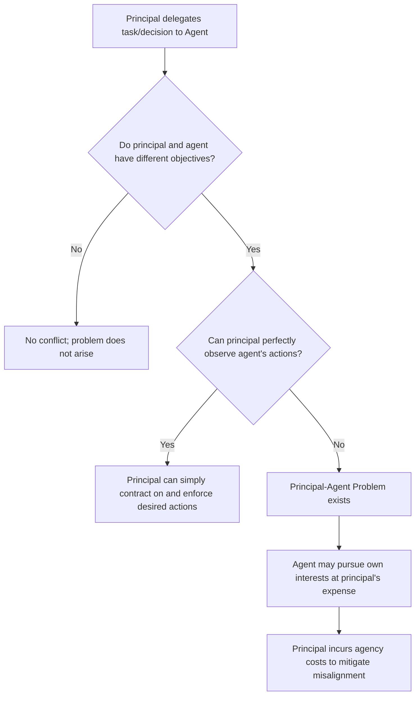
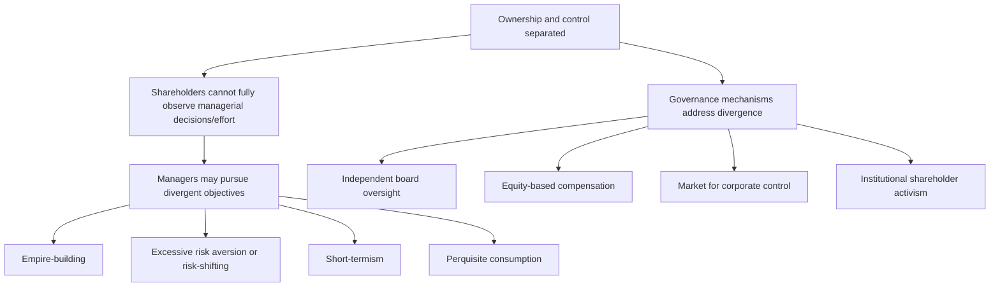

## Principal-Agent Problems in Organizations

### Overview

The principal-agent problem arises whenever one party (the **principal**) delegates decision-making authority or tasks to another party (the **agent**), and the agent's interests are not perfectly aligned with the principal's, while the principal cannot costlessly and perfectly monitor the agent's actions. This is one of the most pervasive structural challenges in organizational economics, appearing throughout firms — between shareholders and managers, employers and employees, boards and executives, and clients and professional service providers.

**Key Points**

- The problem exists because of two combined conditions: **goal divergence** (principal and agent have different objectives) and **information asymmetry** (the principal cannot fully observe the agent's actions or effort).
- If either condition were absent — if goals were perfectly aligned, or if the principal could perfectly monitor the agent — the problem would not arise.
- The costs arising from this misalignment are formally termed **agency costs**, and contract design in organizations is largely oriented toward minimizing these costs.

---

### Conditions Required for a Principal-Agent Problem

**Key Points**

- Goal divergence alone, without an observation problem, does not create an agency cost, because the principal could simply write and enforce a contract specifying the exact desired action.
- It is the *combination* of divergent interests **and** limited observability that makes the agent's private information or action a genuine economic problem rather than a simple contracting exercise.

---

### The Structure of Agency Costs

Michael Jensen and William Meckling's foundational 1976 framework decomposes the total cost of the principal-agent relationship into three components:

$$Agency\ Cost = Monitoring\ Costs + Bonding\ Costs + Residual\ Loss$$

| Component | Description | Example |
| --- | --- | --- |
| **Monitoring costs** | Expenses the principal incurs to observe, measure, or constrain agent behavior | Audits, performance reviews, board oversight, financial reporting requirements |
| **Bonding costs** | Expenses the agent incurs to credibly commit to acting in the principal's interest | Contractual covenants, performance guarantees, agent's own investment in reputation |
| **Residual loss** | The remaining value lost due to imperfect alignment, even after monitoring and bonding are optimally applied | Suboptimal decisions that still occur despite best efforts at alignment |

**Key Points**

- Residual loss exists because monitoring and bonding are themselves costly, so it is rarely efficient to spend enough on them to eliminate misalignment entirely — the optimal level of agency cost mitigation stops where the marginal cost of further monitoring/bonding exceeds the marginal reduction in residual loss.
- This framework applies broadly across nearly every hierarchical or delegated relationship within and between organizations.

---

### Common Principal-Agent Relationships in Organizations

| Principal | Agent | Divergent Interest | Typical Manifestation |
| --- | --- | --- | --- |
| Shareholders | Managers/Executives | Managers may prioritize personal power, compensation, or job security over shareholder value | Empire-building, excessive perks, entrenchment, short-termism |
| Employer | Employee | Employee may prefer less effort or different task priorities than the employer desires | Shirking, misallocated time, unauthorized personal use of resources |
| Board of Directors | CEO | CEO may pursue personal agenda not fully visible to the board | Information control, selective disclosure to the board |
| Clients | Professional advisors (lawyers, consultants, brokers) | Advisor may recommend actions that generate more fees rather than best serving the client | Overbilling, unnecessary services, conflicts of interest |
| Parent company | Subsidiary/divisional managers | Divisional managers may optimize for their unit's metrics rather than overall firm value | Suboptimal transfer pricing behavior, resource hoarding |
| Debt holders | Shareholders/Managers | Shareholders may favor riskier projects once debt is issued, since equity captures upside while debt bears more downside | Asset substitution, underinvestment near financial distress |

---

### Shareholders and Managers: The Classic Corporate Governance Case

The separation of ownership (dispersed shareholders) and control (professional managers) — first systematically analyzed by Berle and Means — creates one of the most studied principal-agent relationships in economics.

**Sources of Divergence**

- **Effort divergence**: managers may exert less effort than shareholders would prefer, particularly when individual managerial contribution to firm performance is hard to isolate and measure.
- **Risk preference divergence**: managers, whose personal wealth and career prospects are concentrated in the firm, may be more risk-averse than diversified shareholders regarding firm-level decisions, potentially causing managers to reject positive-NPV but risky projects that shareholders would prefer the firm to undertake.
- **Horizon divergence**: managers nearing retirement or facing short evaluation cycles may favor short-term results over long-term value creation.
- **Empire-building**: managers may pursue growth, acquisitions, or expanded scope that increases their personal status, compensation, or influence, even when such growth does not maximize shareholder value.

---

### Contractual and Governance Mechanisms to Mitigate the Problem

| Mechanism | How It Addresses the Problem |
| --- | --- |
| **Performance-based compensation** | Ties agent's pay to outcomes the principal cares about, partially aligning incentives |
| **Equity-based pay (stock, options)** | Directly ties manager wealth to shareholder value, reducing goal divergence |
| **Independent board oversight** | Provides a monitoring mechanism separate from management's own reporting |
| **Mandatory financial disclosure/auditing** | Reduces information asymmetry between managers and external stakeholders |
| **Market for corporate control** | Threat of takeover disciplines underperforming management, since poor performance can depress stock price and invite acquisition |
| **Debt financing** | Fixed repayment obligations constrain managerial discretion over free cash flow, reducing scope for wasteful spending |
| **Reputation in managerial labor markets** | Managers who perform poorly face reduced future employment prospects, creating an implicit incentive |
| **Explicit contractual covenants** | Legal restrictions on specific agent actions (e.g., loan covenants limiting borrower risk-taking) |

**Key Points**

- No single mechanism is sufficient on its own; effective governance typically layers multiple complementary mechanisms, since each addresses a different facet of the agency problem and each has its own limitations and costs. [Inference: the optimal combination of mechanisms varies by firm size, industry, and ownership structure]

---

### The Incentive-Risk Trade-off in Contract Design

A central technical result in principal-agent theory is that optimal contracts must balance two competing objectives: providing sufficient incentive for effort, and efficiently allocating risk between principal and agent.

$$Compensation = Fixed\ Component + \beta \times Observable\ Performance\ Measure$$

**Key Points**

- Since agents (e.g., employees, managers) are typically less able to diversify risk than principals (e.g., diversified shareholders), imposing excessive performance-based risk on the agent is costly — the agent must be compensated for bearing that risk, raising the overall cost of the contract.
- Conversely, insufficient performance-linkage weakens the agent's incentive to exert effort or act in the principal's interest.
- The theoretically optimal contract sets $\beta$ at the level that balances the marginal incentive benefit of higher $\beta$ against the marginal risk-cost imposed on the agent — a standard, well-established result in agency theory (Holmström and others).

---

### Illustration: Layered Agency Relationships in a Corporation

<svg xmlns="http://www.w3.org/2000/svg" viewBox="0 0 720 400" font-family="Arial, sans-serif">
<rect x="0" y="0" width="720" height="400" fill="#ffffff" stroke="#333333" />
<text x="20" y="26" font-size="16" font-weight="bold" fill="#111111">Layered Principal-Agent Relationships (svg_diagram)</text>
<rect x="260" y="50" width="200" height="50" fill="#dbeafe" stroke="#2563eb" stroke-width="2" />
<text x="290" y="80" font-size="13" font-weight="bold" fill="#1e3a8a">Shareholders</text>
<line x1="360" y1="100" x2="360" y2="140" stroke="#333333" stroke-width="1.5" />
<text x="370" y="125" font-size="11" fill="#555555">delegate to</text>
<rect x="260" y="140" width="200" height="50" fill="#dcfce7" stroke="#16a34a" stroke-width="2" />
<text x="290" y="170" font-size="13" font-weight="bold" fill="#14532d">Board of Directors</text>
<line x1="360" y1="190" x2="360" y2="230" stroke="#333333" stroke-width="1.5" />
<text x="370" y="215" font-size="11" fill="#555555">oversee</text>
<rect x="260" y="230" width="200" height="50" fill="#fef3c7" stroke="#d97706" stroke-width="2" />
<text x="300" y="260" font-size="13" font-weight="bold" fill="#78350f">CEO / Executives</text>
<line x1="360" y1="280" x2="360" y2="320" stroke="#333333" stroke-width="1.5" />
<text x="370" y="305" font-size="11" fill="#555555">manage</text>
<rect x="260" y="320" width="200" height="50" fill="#fee2e2" stroke="#dc2626" stroke-width="2" />
<text x="290" y="350" font-size="13" font-weight="bold" fill="#7f1d1d">Employees</text>

<text x="490" y="80" font-size="11" fill="`#555555`">Agency layer 1</text>

<text x="490" y="170" font-size="11" fill="`#555555`">Agency layer 2</text>

<text x="490" y="260" font-size="11" fill="`#555555`">Agency layer 3</text>

</svg>

Each link in this chain represents a distinct principal-agent relationship, each with its own information asymmetries and potential for goal divergence — illustrating why organizational governance requires monitoring and incentive mechanisms at multiple hierarchical levels simultaneously.

---

### Principal-Agent Problems Beyond Corporate Governance

**Key Points**

- **Multi-tasking problem**: when agents perform multiple tasks and only some are easily measurable, performance-based pay tied to measurable tasks can cause agents to systematically neglect important but hard-to-measure tasks (e.g., a salesperson focused on volume-based commission may neglect long-term customer relationship quality). [This is a well-established extension of agency theory, formalized by Holmström and Milgrom]
- **Common agency**: when multiple principals (e.g., multiple business units) share the same agent (e.g., a shared services team), the agent's effort allocation across principals can create additional coordination and incentive challenges.
- **Team production problems**: when output results from the combined effort of multiple agents and individual contributions are difficult to isolate, each agent has reduced incentive to exert full effort, since they cannot be individually credited or penalized — a related but distinct issue sometimes called the "free-rider problem" within teams.

---

### Distinguishing Principal-Agent Problems from Related Concepts

| Concept | Relationship to Principal-Agent Problem |
| --- | --- |
| **Moral hazard** | The specific behavioral mechanism through which agency problems manifest — hidden action after a relationship is established |
| **Adverse selection** | A related but distinct pre-contractual problem — hidden type before a relationship is established (e.g., selecting which agent to hire) |
| **Transaction cost economics** | Broader framework examining why firms exist and how organizational boundaries are chosen, of which agency costs are one component |
| **Contract theory** | The formal mathematical apparatus (mechanism design, incentive contracts) used to derive optimal responses to agency problems |

---

### Practical Guidance for Managers

**Key Points**

- Identify where in the organization's hierarchy information asymmetries are largest (e.g., between distant divisions and headquarters, or between specialized technical staff and non-technical management), since these are the points of greatest agency risk.
- Design compensation structures that balance incentive strength against the agent's capacity to bear risk, recognizing that purely fixed pay under-incentivizes effort while purely variable pay may impose excessive uncompensated risk.
- Be alert to the **multi-tasking problem**: incentive systems tied to easily measured metrics can inadvertently divert agent effort away from equally important but harder-to-measure responsibilities.
- Layer multiple governance mechanisms (board oversight, equity compensation, external audit, market discipline) rather than relying on any single mechanism, since each addresses different aspects of the agency problem and each carries its own limitations.
- Recognize that agency costs can never be reduced to zero in practice; the objective of contract and organizational design is to find the point that minimizes *total* agency costs, not to eliminate misalignment entirely. [Behavior may vary substantially depending on firm size, industry, ownership concentration, and regulatory environment]

---

**Related Topics**

- Moral hazard in business relationships
- Asymmetric information and market failure
- Incentive contract design and the multi-tasking problem
- Corporate governance and the separation of ownership and control
- Executive compensation design (stock options, performance pay)
- Transaction cost economics and firm boundaries
- Mechanism design and contract theory