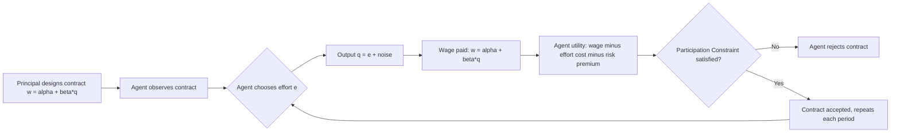

## Incentive Contract Design

### Overview

Incentive contract design is the branch of contract theory concerned with structuring compensation and payment arrangements when a **principal** (employer, insurer, shareholder) cannot fully observe or verify the **agent's** (employee, manager, insured party) effort, actions, or private information. The central challenge is aligning the agent's incentives with the principal's objectives despite information asymmetry.

**Key Points**

- Arises from **moral hazard** (hidden action) and **adverse selection** (hidden information)
- Trades off risk-sharing efficiency against incentive provision
- Foundational to executive compensation, sharecropping, insurance, franchising, and regulation design

---

### The Core Trade-off: Risk vs. Incentives

If effort were perfectly observable, the principal could simply pay a fixed wage conditional on effort and bear all risk (efficient risk-sharing, since principals are typically better diversified or risk-neutral). When effort is unobservable, the principal must tie pay to observable **outcomes** (output, profit, stock price) that are only noisy signals of effort. This exposes a risk-averse agent to income risk they would not otherwise bear.

$$w = \alpha + \beta \cdot q$$

Where:

- $w$ = agent's wage
- $\alpha$ = fixed base salary (insurance component)
- $\beta$ = pay-performance sensitivity (incentive intensity, $0 \le \beta \le 1$)
- $q$ = observed output/performance measure

A higher $\beta$ strengthens incentives but forces the agent to bear more risk, raising the risk premium the principal must pay. This is the **fundamental trade-off** in incentive design.

---

### The Principal-Agent Model (Formal Setup)

**Assumptions**

- Principal is risk-neutral; agent is risk-averse with effort cost $c(e)$, increasing and convex
- Output $q = e + \varepsilon$, where $\varepsilon \sim N(0, \sigma^2)$ is noise
- Agent's utility: $U = -\exp[-r(w - c(e))]$ (CARA utility, common simplifying assumption)
- $r$ = coefficient of absolute risk aversion

**Agent's Certainty Equivalent** (under linear contract $w = \alpha + \beta q$):

$$CE = \alpha + \beta e - c(e) - \frac{1}{2} r \beta^2 \sigma^2$$

The term $\frac{1}{2} r \beta^2 \sigma^2$ is the **risk premium** — the cost imposed by exposing the agent to output risk, increasing with risk aversion ($r$), incentive strength ($\beta^2$), and output noise ($\sigma^2$).

**Agent's optimal effort** (from maximizing $\beta e - c(e)$, first-order condition):

$$\beta = c'(e^*)$$

Effort rises with $\beta$: stronger incentives induce more effort, but only up to the point where marginal disutility of effort equals marginal incentive pay.

**Principal's optimization** (choosing $\beta$ to maximize expected profit net of wage, subject to agent's participation and incentive constraints):

$$\beta^* = \frac{1}{1 + r\sigma^2 c''(e)}$$

**Key Points**

- As **risk aversion** ($r$) or **output noise** ($\sigma^2$) increases, optimal $\beta^*$ **decreases** — weaker incentives, more insurance
- As **effort cost convexity** ($c''$) decreases (effort is cheap to increase), $\beta^*$ rises
- If $\sigma^2 = 0$ (output perfectly reflects effort) or agent is risk-neutral ($r=0$), $\beta^* = 1$ — full incentive, no distortion (first-best achieved)

---

### First-Best vs. Second-Best Contracts

|  | First-Best (effort observable) | Second-Best (effort unobservable) |
| --- | --- | --- |
| Contract form | Fixed wage conditional on effort | Output-contingent pay ($\alpha + \beta q$) |
| Risk-bearing | Fully borne by risk-neutral principal | Partially shifted to risk-averse agent |
| Efficiency | Efficient (no distortion) | Second-best: agent under-supplies effort relative to first-best, and bears inefficient risk |
| Enforcement | Requires verifiable effort | Requires only verifiable output |

The gap between first-best and second-best outcomes is the **agency cost** — the deadweight loss from information asymmetry.

---

### Two Foundational Constraints

Any incentive contract must satisfy:

1. **Participation Constraint (PC) / Individual Rationality (IR)**

   The agent's expected utility from accepting the contract must be at least their reservation utility $\bar{U}$ (outside option):

   $$E[U(w, e)] \ge \bar{U}$$
2. **Incentive Compatibility Constraint (IC)**

   The agent must find it optimal to choose the effort level the principal wants, given the contract:

   $$e^* \in \arg\max_e \, E[U(w(q), e)]$$

The principal's problem is to choose $(\alpha, \beta)$ to maximize expected profit subject to PC and IC binding (both typically bind at the optimum).

---

### Types of Incentive Contracts

**Linear Contracts**

$$w = \alpha + \beta q$$

Simple, robust to gaming, commonly used (commissions, royalty contracts, revenue-sharing). Holmström-Milgrom (1987) show linear contracts are optimal under continuous-time, CARA-normal assumptions with agent controlling drift.

**Piece-Rate Contracts**

Pay proportional to units produced ($\beta$ high, $\alpha$ low or zero). Effective when output is easily measured and low-noise (e.g., agricultural harvesting, data entry).

**Bonus/Threshold Contracts**

$$w = \begin{cases} \alpha & \text{if } q < \bar{q} \\ \alpha + B & \text{if } q \ge \bar{q} \end{cases}$$

Pay a lump-sum bonus $B$ if performance exceeds a threshold $\bar{q}$. Common in sales targets, performance reviews. Risk: can induce **threshold gaming** (manipulating timing of sales/output around the cutoff).

**Tournament/Rank-Order Contracts**

Pay based on relative rank among agents rather than absolute output (Lazear & Rosen, 1981). Useful when a common noise/shock affects all agents (filters out common uncertainty). Basis for promotion ladders and sales contests.

$$w_i = \begin{cases} w_H & \text{if rank}(q_i) = 1 \\ w_L & \text{otherwise} \end{cases}$$

**Equity-Based Contracts**

Stock options, restricted stock, profit-sharing — align long-horizon incentives, common in executive compensation. Introduce additional risk and valuation complexity (option convexity can induce risk-shifting behavior).

**Efficiency Wages**

Pay above market-clearing wage to deter shirking via the threat of job loss, rather than through output-contingent pay directly. Relies on unemployment as a disciplining device (Shapiro-Stiglitz, 1984).

---

### Multi-Task Incentive Problems

When agents perform multiple tasks with different measurability (Holmström & Milgrom, 1991), strong incentives on easily-measured tasks can crowd out effort on important-but-unmeasured tasks.

**Example**

A teacher paid on standardized test scores may neglect creativity, critical thinking, or mentorship — tasks that are valuable but unmeasured. A customer service rep paid on "calls closed per hour" may rush calls at the expense of resolution quality.

**Key Points**

- Optimal response: often **flatten** incentives on the measured task ($\beta$ lower than single-task optimum) to avoid task substitution
- Alternative: **balanced scorecards** combining multiple metrics; subjective performance evaluation supplementing objective metrics

---

### Diagram: Principal-Agent Incentive Loop

---

### Diagram: Trade-off Between Risk-Sharing and Incentives (svg_diagram)

<svg xmlns="http://www.w3.org/2000/svg" viewBox="0 0 640 380" font-family="Helvetica, Arial, sans-serif">
<text x="320" y="28" text-anchor="middle" font-size="16" font-weight="bold" fill="#1a1a1a">Incentive Intensity vs. Total Cost (svg_diagram)</text>
<line x1="70" y1="320" x2="580" y2="320" stroke="#333" stroke-width="2" />
<line x1="70" y1="320" x2="70" y2="50" stroke="#333" stroke-width="2" />
<text x="325" y="355" text-anchor="middle" font-size="13" fill="#333">Incentive Intensity (beta)</text>
<text x="30" y="185" text-anchor="middle" font-size="13" fill="#333" transform="rotate(-90 30 185)">Cost to Principal</text>
<path d="M 90 300 Q 320 60 560 300" fill="none" stroke="#c0392b" stroke-width="2.5" />
<text x="470" y="270" font-size="12" fill="#c0392b">Risk Premium (rises with beta²)</text>
<path d="M 90 90 Q 320 290 560 90" fill="none" stroke="#2980b9" stroke-width="2.5" />
<text x="90" y="80" font-size="12" fill="#2980b9">Under-Effort Loss (falls as beta rises)</text>
<path d="M 90 200 Q 220 130 320 130 Q 420 130 560 210" fill="none" stroke="#27ae60" stroke-width="3" stroke-dasharray="6,3" />
<text x="380" y="150" font-size="12" fill="#27ae60" font-weight="bold">Total Agency Cost (sum)</text>
<circle cx="320" cy="130" r="5" fill="#27ae60" />
<text x="330" y="120" font-size="12" fill="#1a1a1a" font-weight="bold">beta* (optimal)</text>
</svg>

---

### Worked Numerical Example

**Setup**: A sales agent has effort cost $c(e) = \frac{1}{2}e^2$. Output noise variance $\sigma^2 = 100$. Risk aversion $r = 0.02$. Reservation utility corresponds to certainty equivalent $\bar{U} = 0$.

**Step 1 — Optimal incentive intensity**:

$$\beta^* = \frac{1}{1 + r\sigma^2 c''(e)} = \frac{1}{1 + (0.02)(100)(1)} = \frac{1}{1+2} = \frac{1}{3} \approx 0.33$$

**Step 2 — Induced effort**: Since $\beta = c'(e^*) = e^*$, then $e^* = 0.33$.

**Step 3 — Risk premium**:

$$\frac{1}{2} r \beta^2 \sigma^2 = 0.5 \times 0.02 \times (0.33)^2 \times 100 \approx 0.109$$

**Step 4 — Base salary** $\alpha$ (from binding participation constraint, setting $CE = 0$):

$$\alpha = c(e^*) + \frac{1}{2}r\beta^2\sigma^2 - \beta e^* = 0.0545 + 0.109 - 0.109 \approx 0.0545$$

**Interpretation**: A commission rate of ~33% balances incentive provision against the risk premium the firm must compensate; a pure piece-rate ($\beta=1$) would over-expose the agent to noise given this risk aversion and variance level.

---

### Applications Across Managerial Economics

**Key Points**

- **Executive compensation**: stock options/RSUs address CEO-shareholder moral hazard; "pay-for-performance sensitivity" is empirically measured via the Jensen-Murphy coefficient
- **Sharecropping**: historically, landlords used crop-share (partial $\beta$) rather than fixed rent (full $\beta=1$, tenant bears all risk) or fixed wage ($\beta=0$, landlord bears all risk) as an intermediate risk-incentive solution
- **Insurance**: deductibles and co-pays are "negative" incentive contracts addressing moral hazard on the insured's side (reducing $\beta$ effectively via cost-sharing)
- **Franchising**: royalty rates (percentage of revenue) plus fixed franchise fee mirror the $\alpha + \beta q$ structure
- **Regulation**: price-cap vs. cost-plus regulation of utilities reflects the same high-powered ($\beta$ near 1) vs. low-powered ($\beta$ near 0) incentive spectrum

---

### Common Pitfalls in Contract Design

**Key Points**

- **Ratchet effect**: if past performance sets future targets, agents strategically underperform early to secure easier future targets [Inference: this is a well-documented dynamic prediction in repeated-agency models, though the empirical magnitude varies by setting]
- **Multitasking distortion**: over-weighting measurable output degrades unmeasured but valuable tasks (see above)
- **Gaming metrics**: agents optimize the metric rather than the underlying goal (Goodhart's Law) — e.g., call-center agents hanging up to hit "call volume" targets
- **Excessive risk-shifting**: convex payoffs (e.g., stock options) can induce agents to take on inefficiently high risk, particularly near compensation thresholds [Inference: behavioral responses to convex incentive schemes are context-dependent and may vary with governance and monitoring quality]

---

### Related Topics

- Adverse selection and screening contracts (signaling vs. screening models)
- Moral hazard in insurance markets
- Optimal risk-sharing and the Borch condition
- Holmström-Milgrom linear contract theorem
- Tournament theory and relative performance evaluation
- Efficiency wage theory
- Multitask principal-agent models
- Executive compensation and corporate governance
- Mechanism design and revelation principle