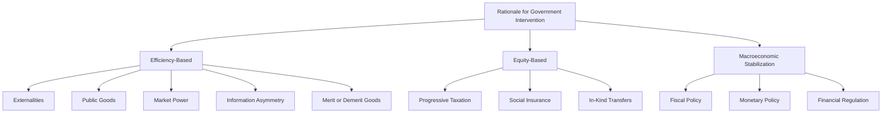

## Rationale for Government Intervention in Markets

### Overview

Government intervention in markets is justified in mainstream economic theory primarily through the concept of **market failure** — circumstances in which unregulated markets fail to allocate resources efficiently (Pareto optimally). Absent such failures, the First Welfare Theorem holds that competitive markets achieve efficient outcomes without intervention. Intervention rationales fall into efficiency-based arguments (correcting market failure) and equity-based arguments (redistribution), each with distinct theoretical justification and policy instruments.

**Key Points**

- Efficiency rationale: correct market failures (externalities, public goods, monopoly, information asymmetry)
- Equity rationale: address distributional outcomes markets do not internalize
- Macroeconomic rationale: stabilize aggregate output, employment, and prices
- Not all rationales are uncontested — public choice theory and Austrian economics offer competing views (see Critiques section)

---

### Theoretical Foundation: The First and Second Welfare Theorems

**First Welfare Theorem**: Under perfect competition, complete markets, no externalities, and full information, competitive equilibrium is Pareto efficient.

**Second Welfare Theorem**: Any Pareto-efficient allocation can be achieved as a competitive equilibrium given appropriate lump-sum redistribution of initial endowments.

Government intervention rationales largely stem from violations of the First Theorem's assumptions:

| Assumption Violated | Resulting Market Failure | Intervention Rationale |
| --- | --- | --- |
| No externalities | Externalities | Pigouvian taxes/subsidies, regulation |
| Complete markets | Public goods, missing markets | Public provision |
| Perfect competition | Market power (monopoly/oligopoly) | Antitrust, price regulation |
| Full information | Information asymmetry | Disclosure mandates, licensing |
| Rational, complete markets over time | Macroeconomic instability | Fiscal/monetary policy |

---

### 1. Externalities

An **externality** exists when a third party bears costs or benefits from a transaction they did not consent to, causing private and social costs/benefits to diverge.

**Negative Externality** (e.g., pollution): Private marginal cost (PMC) < Social marginal cost (SMC). Market overproduces relative to the social optimum.

**Positive Externality** (e.g., education, vaccination): Private marginal benefit (PMB) < Social marginal benefit (SMB). Market underproduces relative to the social optimum.

$$SMC = PMC + MEC \quad \text{(marginal external cost)}$$

**Diagram: Negative Externality and Deadweight Loss (svg_diagram)**

<svg xmlns="http://www.w3.org/2000/svg" viewBox="0 0 620 400" font-family="Helvetica, Arial, sans-serif">
<text x="310" y="26" text-anchor="middle" font-size="16" font-weight="bold" fill="#1a1a1a">Negative Externality Market (svg_diagram)</text>
<line x1="80" y1="340" x2="560" y2="340" stroke="#333" stroke-width="2" />
<line x1="80" y1="340" x2="80" y2="50" stroke="#333" stroke-width="2" />
<text x="320" y="370" text-anchor="middle" font-size="13" fill="#333">Quantity</text>
<text x="35" y="195" text-anchor="middle" font-size="13" fill="#333" transform="rotate(-90 35 195)">Price / Cost</text>
<line x1="100" y1="320" x2="540" y2="80" stroke="#2980b9" stroke-width="2.5" />
<text x="545" y="80" font-size="12" fill="#2980b9">Demand (PMB=SMB)</text>
<line x1="100" y1="320" x2="540" y2="130" stroke="#27ae60" stroke-width="2.5" />
<text x="545" y="130" font-size="12" fill="#27ae60">PMC (Supply)</text>
<line x1="100" y1="360" x2="540" y2="170" stroke="#c0392b" stroke-width="2.5" />
<text x="545" y="170" font-size="12" fill="#c0392b">SMC = PMC + MEC</text>
<circle cx="410" cy="216" r="4" fill="#1a1a1a" />
<text x="415" y="235" font-size="12" fill="#1a1a1a">Market Eqm (Qm)</text>
<circle cx="335" cy="255" r="4" fill="#1a1a1a" />
<text x="270" y="275" font-size="12" fill="#1a1a1a">Social Optimum (Qs)</text>
<polygon points="335,255 410,216 410,255" fill="#e74c3c" opacity="0.3" />
<text x="355" y="248" font-size="11" fill="#c0392b" font-weight="bold">DWL</text>
</svg>

**Policy Instruments**

- **Pigouvian tax**: set $t = MEC$ at the optimal quantity, internalizing the externality
- **Cap-and-trade / tradable permits**: sets quantity, lets market determine price (Coasian efficiency with defined property rights)
- **Direct regulation**: emissions standards, technology mandates
- **Coase Theorem**: if property rights are well-defined and transaction costs are low, private bargaining can resolve externalities without government intervention — this is often cited as a *limit* on the intervention rationale, not a justification for it

**Example**

A factory emits pollution costing nearby residents $50 per unit of output in health/property damages, but this cost doesn't appear in the factory's private cost calculus. A Pigouvian tax of $50/unit forces the factory to internalize this cost, shifting output down to the socially efficient level.

---

### 2. Public Goods

Public goods are characterized by:

- **Non-excludability**: cannot prevent non-payers from consuming (e.g., national defense)
- **Non-rivalry**: one person's consumption doesn't reduce availability to others

These properties create a **free-rider problem**: private markets underprovide public goods because individuals have no incentive to pay for something they can consume without paying.

|  | Excludable | Non-Excludable |
| --- | --- | --- |
| Rival | Private goods (food, clothing) | Common-pool resources (fisheries) |
| Non-Rival | Club goods (cable TV, toll roads) | Public goods (national defense, clean air) |

**Key Points**

- Government intervention: direct provision (funded via taxation) or subsidized provision
- **Common-pool resources** face a related but distinct problem — the "tragedy of the commons" (overuse due to non-excludability despite rivalry) — addressed via regulation, quotas, or assigning property rights

---

### 3. Market Power (Imperfect Competition)

Monopoly and oligopoly power lead to output restriction and price above marginal cost, generating deadweight loss and transferring consumer surplus to producer surplus.

$$P > MC \quad \Rightarrow \quad \text{allocative inefficiency}$$

**Rationale for intervention**:

- **Antitrust/competition law**: prevent anticompetitive mergers, prohibit collusion and predatory pricing
- **Price regulation**: for natural monopolies (e.g., utilities) where a single firm can serve the market at lower cost than multiple firms due to economies of scale — rate-of-return regulation or price caps substitute for absent competitive discipline
- **Structural remedies**: breakups, mandated access (e.g., interconnection requirements in telecom)

**Example**

A natural monopoly (water utility) has declining average cost across the relevant range of demand, making competition inefficient (duplicative infrastructure). Government typically grants exclusive franchise but regulates price at or near average cost to prevent monopoly pricing while allowing cost recovery.

---

### 4. Information Asymmetry

When one party to a transaction has more/better information than the other, markets can fail via:

**Adverse Selection** (hidden information, pre-contract): Low-quality participants disproportionately participate because information asymmetry prevents proper pricing (Akerlof's "market for lemons," 1970). Can cause market unraveling.

**Moral Hazard** (hidden action, post-contract): Insured/protected parties change behavior because they don't bear full consequences.

**Policy Instruments**

- **Mandatory disclosure**: financial statement requirements (SEC), nutrition labeling, lending disclosure (Truth in Lending)
- **Licensing and quality certification**: professional licensing (doctors, lawyers), safety certifications
- **Mandated insurance pools**: individual mandates in health insurance to prevent adverse selection death spirals
- **Regulation of contract terms**: standardized insurance policy terms

---

### 5. Merit Goods and Demerit Goods

Goods where private valuation may diverge from a socially/paternalistically-judged optimal valuation, independent of externalities.

- **Merit goods** (underconsumed relative to "optimal"): education, healthcare, vaccination — government subsidizes or mandates
- **Demerit goods** (overconsumed): tobacco, alcohol — government taxes ("sin taxes") or restricts

**Key Points**

- This rationale is more contested than externality/public-good arguments since it relies on a **paternalistic** judgment about consumer preferences rather than a pure efficiency failure — critics argue this substitutes government preferences for individual preferences [this is a normative/contested rationale rather than a strict Pareto-efficiency argument]

---

### 6. Equity and Redistribution

Even if markets are efficient, the resulting distribution of income/wealth may be judged socially undesirable. Markets have no mechanism to correct for unequal starting endowments, discrimination, or catastrophic risk (illness, disability, job loss).

**Policy Instruments**

- Progressive taxation and transfer payments
- Social insurance programs (unemployment insurance, social security, minimum wage)
- In-kind transfers (food assistance, public housing, public education)

**Key Points**

- The Second Welfare Theorem provides the classic theoretical bridge: redistribution via **lump-sum transfers** can, in principle, achieve any desired equity outcome while preserving efficiency — but real-world redistribution tools (income taxes, transfers) are typically **distortionary**, creating an equity-efficiency trade-off (the "leaky bucket," per Arthur Okun)

---

### 7. Macroeconomic Stabilization

Markets do not automatically self-correct rapidly from aggregate demand shocks, business cycles, or systemic financial instability (Keynesian rationale). Government uses:

- **Fiscal policy**: taxation and spending to manage aggregate demand
- **Monetary policy**: central bank interest rate and money supply management
- **Financial regulation**: prudential regulation (capital requirements, deposit insurance) to prevent systemic risk and bank runs, addressing the externality that individual bank failures can impose on the broader financial system

---

### Diagram: Taxonomy of Intervention Rationales

---

### Critiques and Limits of the Intervention Rationale

**Key Points**

- **Coase Theorem**: with well-defined property rights and low transaction costs, private bargaining may resolve externalities without government action — suggests intervention rationale requires transaction costs to be significant
- **Government failure**: intervention itself can be inefficient due to regulatory capture, rent-seeking, incomplete information held by regulators, and political incentives diverging from social welfare maximization (public choice theory, Stigler's capture theory)
- **Austrian/free-market critique**: argues market processes (price discovery, entrepreneurship) are more adaptive than centralized regulatory correction, and that "market failure" is sometimes a static-equilibrium artifact rather than a dynamic reality [this reflects a distinct school of thought rather than a universally accepted empirical finding]
- **Cost-benefit analysis** is the standard applied tool to determine whether a specific intervention is welfare-improving net of its administrative and compliance costs — intervention being theoretically justified does not guarantee any *particular* implementation improves welfare

---

### Worked Example: Comparing Instrument Choice

**Scenario**: A city has a congestion externality on its downtown roads — commuters do not internalize their contribution to travel-time costs imposed on others.

| Instrument | Mechanism | Efficiency | Practical Notes |
| --- | --- | --- | --- |
| Congestion pricing (Pigouvian) | Toll = marginal external cost of congestion | High — internalizes externality directly | Requires monitoring infrastructure (e.g., electronic tolling) |
| Command-and-control (odd-even plates) | Restrict access by rule | Lower — doesn't allow price-based reallocation to highest-value trips | Easier to implement, less politically costly |
| Public transit subsidy | Lower relative cost of substitute | Indirect — addresses symptom, not the externality directly | Politically popular, doesn't directly price the externality |

This illustrates that even when the *rationale* for intervention (externality correction) is well-established, the *choice of instrument* involves a separate efficiency and feasibility analysis.

---

### Related Topics

- Pigouvian taxation and optimal externality pricing
- Coase Theorem and property rights solutions
- Antitrust policy and merger review standards
- Natural monopoly regulation (rate-of-return vs. price-cap)
- Adverse selection and signaling (Akerlof, Spence)
- Public choice theory and regulatory capture
- Cost-benefit analysis in regulatory policy
- Cap-and-trade systems and environmental policy design
- Behavioral economics rationale for paternalistic intervention (nudges)