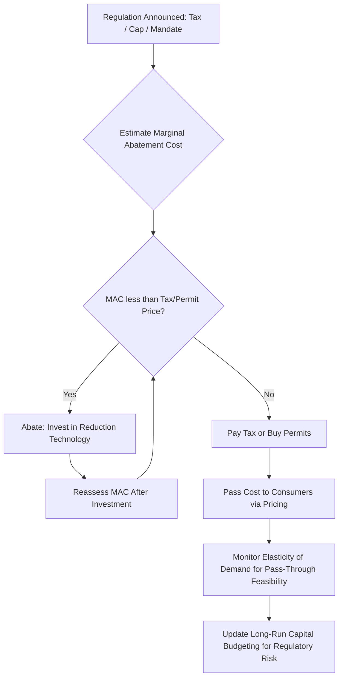

## Externalities and Their Managerial Implications

### Definition and Conceptual Foundation

An externality occurs when the production or consumption activity of one economic agent directly affects the welfare of another party who is not involved in the transaction, without that effect being reflected in market prices. The core issue is a divergence between private cost/benefit and social cost/benefit.

Two fundamental relationships define this divergence:

$$MSC = MPC + MEC$$

$$MSB = MPB + MEB$$

Where:

- $MSC$ = Marginal Social Cost
- $MPC$ = Marginal Private Cost
- $MEC$ = Marginal External Cost
- $MSB$ = Marginal Social Benefit
- $MPB$ = Marginal Private Benefit
- $MEB$ = Marginal External Benefit

At the efficient (socially optimal) output level, $MSB = MSC$. Markets left alone tend to equate $MPB = MPC$, which produces an inefficient outcome whenever externalities exist.

### Classification of Externalities

**Negative Production Externality**

A firm's output imposes uncompensated costs on third parties (e.g., a factory emitting pollutants that raise nearby residents' health costs). Since $MEC > 0$, the market produces *more* than the socially optimal quantity, and the market price is *too low* relative to true social cost.

**Positive Production Externality**

A firm's activity generates uncompensated benefits to others (e.g., a firm training workers who later benefit other employers). Underproduction relative to the social optimum results.

**Negative Consumption Externality**

Consumption by one party imposes costs on others (e.g., secondhand smoke, noise pollution from a private event). Overconsumption relative to the optimum results.

**Positive Consumption Externality**

Consumption generates spillover benefits (e.g., vaccination reducing disease transmission, education raising civic participation). Underconsumption relative to the optimum results.

### Graphical Representation (svg_diagram)

<svg xmlns="http://www.w3.org/2000/svg" viewBox="0 0 720 460" font-family="Arial, sans-serif">
<text x="360" y="24" text-anchor="middle" font-size="16" font-weight="bold">Negative Production Externality (svg_diagram)</text>
<line x1="80" y1="400" x2="680" y2="400" stroke="black" stroke-width="2" />
<line x1="80" y1="400" x2="80" y2="40" stroke="black" stroke-width="2" />
<text x="690" y="405" font-size="13">Quantity</text>
<text x="50" y="40" font-size="13">Price</text>
<line x1="80" y1="380" x2="640" y2="80" stroke="#1f77b4" stroke-width="2" />
<text x="645" y="78" font-size="12" fill="#1f77b4">MPC (Supply)</text>
<line x1="80" y1="420" x2="640" y2="60" stroke="#d62728" stroke-width="2" />
<text x="645" y="58" font-size="12" fill="#d62728">MSC = MPC + MEC</text>
<line x1="80" y1="80" x2="640" y2="380" stroke="#2ca02c" stroke-width="2" />
<text x="645" y="382" font-size="12" fill="#2ca02c">MSB = MPB (Demand)</text>
<line x1="490" y1="400" x2="490" y2="185" stroke="gray" stroke-dasharray="4" />
<text x="470" y="415" font-size="12">Q_market</text>
<circle cx="490" cy="185" r="4" fill="black" />
<line x1="370" y1="400" x2="370" y2="222" stroke="gray" stroke-dasharray="4" />
<text x="345" y="415" font-size="12">Q_optimal</text>
<circle cx="370" cy="222" r="4" fill="black" />
<polygon points="370,222 490,222 490,185" fill="#d62728" fill-opacity="0.3" />
<text x="400" y="245" font-size="12" fill="#d62728">Deadweight Loss</text>
</svg>

The shaded region between $Q_{optimal}$ and $Q_{market}$ represents the deadweight loss from overproduction — units where $MSC$ exceeds $MSB$, meaning society loses value on every unit produced beyond $Q_{optimal}$.

### Coase Theorem and Its Managerial Relevance

The Coase Theorem states that if property rights are clearly defined and transaction costs are negligible, private parties can bargain to an efficient allocation of resources regardless of the initial assignment of rights.

**Key implications for managers:**

- When transaction costs are low (few parties, low negotiation/monitoring costs), private negotiation may resolve externality disputes without regulatory intervention (e.g., negotiated easements, private nuisance settlements).
- As the number of affected parties grows, transaction costs rise sharply, making private bargaining impractical — this is precisely when regulation becomes more likely and more justifiable.
- Managers should track the assignment of property rights (emission rights, water rights, noise ordinances) since this determines who must pay whom and directly affects cost structures.

[Inference] In practice, most large-scale externalities (air pollution, climate impacts) involve too many diffuse parties for Coasean bargaining to be administratively feasible, which is why public policy instruments dominate in these domains.

### Government Policy Responses to Externalities

**1. Pigouvian Taxes (for negative externalities)**

A per-unit tax set equal to the marginal external cost at the optimal quantity:

$$t = MEC(Q_{optimal})$$

This shifts the firm's effective marginal cost curve up to coincide with $MSC$, causing the firm to internalize the externality and voluntarily reduce output to $Q_{optimal}$.

**2. Pigouvian Subsidies (for positive externalities)**

A per-unit subsidy equal to the marginal external benefit, shifting effective marginal benefit up to $MSB$, encouraging output/consumption expansion toward the optimum.

**3. Command-and-Control Regulation**

- Direct quantity limits (emission caps, zoning restrictions)
- Technology mandates (requiring scrubbers, catalytic converters)
- Less flexible than market-based instruments but administratively simpler to monitor

**4. Tradable Permits (Cap-and-Trade)**

- Regulator sets an aggregate cap on total externality-generating activity (e.g., total emissions)
- Permits are allocated or auctioned; firms can trade them
- Firms with low abatement costs sell permits; firms with high abatement costs buy them
- Achieves the cap at minimum total cost across the industry — a cost-effectiveness property that flat regulation typically lacks

**5. Property Rights Assignment / Litigation**

Establishing liability rules (strict liability vs. negligence standards) that internalize costs through the threat of legal damages.

### Managerial Implications and Strategic Responses

**Cost Structure Impact**

- Pigouvian taxes and permit purchases raise marginal private cost, directly compressing margins unless passed through to consumers.
- Managers must model the price elasticity of demand to estimate how much of an externality tax can be passed forward versus absorbed.

**Compliance Cost Planning**

- Firms should conduct a marginal abatement cost (MAC) analysis: comparing the cost of reducing one more unit of external harm against the cost of paying the tax or buying a permit.
- Optimal firm response: abate up to the point where $MAC = $ tax rate (or permit price); beyond that point, paying is cheaper than abating.

**Strategic and Reputational Considerations**

- Positive externality generation (e.g., R&D spillovers, employee training with market-wide benefits) may be underinvested in by an individual firm if competitors free-ride on the benefits, creating a *managerial incentive problem* distinct from the social one. Firms may under-invest in training precisely because trained employees can be poached.
- Firms increasingly treat externality management (ESG, carbon reporting) as a source of competitive differentiation, brand value, and access to capital (e.g., green bonds, ESG-linked credit facilities). [Inference] The magnitude of this financial benefit varies significantly by industry and investor base and is not guaranteed for every firm.

**Regulatory Risk and Lobbying**

- Because externality regulation is politically contested and evolves over time, managers must build regulatory risk into long-term capital budgeting (e.g., anticipating future carbon price increases in NPV calculations for long-lived assets).
- Firms often engage in political and lobbying activity to influence the *form* of the instrument imposed (tax vs. permit vs. mandate), since the chosen instrument materially affects relative competitiveness within an industry.

**Internal Transfer Pricing Analogy**

- Within a large firm, a divisional externality (e.g., one division's process pollutes inputs used by another division) can be managed internally using the same logic as Pigouvian taxation: charging an internal transfer price or fee equal to the estimated internal marginal external cost, prompting divisions to internalize cross-effects.

### Worked Numerical Example

A chemical plant's private marginal cost is $MPC = 10 + 2Q$. Each unit of output generates a marginal external cost of $MEC = 6$. Market demand reflects marginal social benefit: $MSB = 100 - 2Q$.

**Step 1 — Market (unregulated) equilibrium:** Set $MPB = MPC$:

$$100 - 2Q = 10 + 2Q \Rightarrow 4Q = 90 \Rightarrow Q_{market} = 22.5$$

**Step 2 — Socially optimal equilibrium:** Set $MSB = MSC$, where $MSC = MPC + MEC = 16 + 2Q$:

$$100 - 2Q = 16 + 2Q \Rightarrow 4Q = 84 \Rightarrow Q_{optimal} = 21$$

**Step 3 — Optimal Pigouvian tax:** $t = MEC = 6$ per unit.

Applying the tax raises the firm's effective marginal cost to $10 + 2Q + 6 = 16 + 2Q$, which is exactly $MSC$. The firm's privately optimal quantity now coincides with $Q_{optimal} = 21$, confirming the tax successfully internalizes the externality.

**Step 4 — Deadweight loss avoided:** The overproduction of 1.5 units ($22.5 - 21$) represents units where social cost exceeded social benefit; the tax eliminates this inefficiency.

### Comparative Summary Table

| Instrument | Cost Certainty | Quantity Certainty | Administrative Complexity | Best Suited When |
| --- | --- | --- | --- | --- |
| Pigouvian Tax | High (fixed rate) | Low (depends on response) | Moderate | Marginal damage curve well known, cost of over/under-abatement roughly symmetric |
| Cap-and-Trade | Low (permit price floats) | High (fixed cap) | High (requires monitoring, market) | Environmental threshold matters more than cost predictability |
| Command-and-Control | Low | High | Low-Moderate | Few firms, homogeneous abatement costs, urgent/simple compliance needs |
| Coasean Bargaining | Variable | Variable | Low (if few parties) | Small number of clearly identifiable affected parties |

### Process Flow: Firm Response to Externality Regulation

### Key Points

- Externalities create a wedge between private and social costs/benefits, leading markets to over- or under-produce relative to the efficient level.
- The Coase Theorem shows private bargaining can achieve efficiency without government intervention only when transaction costs are low.
- Pigouvian taxes and subsidies are designed to make private and social marginal costs/benefits coincide.
- Cap-and-trade systems achieve cost-effective aggregate reduction by allowing firms with lower abatement costs to sell permits to firms with higher costs.
- Managers must integrate externality-related costs (taxes, permits, compliance) into pricing, capital budgeting, and long-term strategic risk assessment.

### Related Topics

- Public goods and the free-rider problem
- Coase Theorem: transaction cost boundaries and legal applications
- Cap-and-trade market design and permit price volatility
- Corporate ESG strategy and its link to cost of capital
- Government failure versus market failure in regulatory design
- Common property resources and the tragedy of the commons
- Transfer pricing and internal cost allocation across divisions