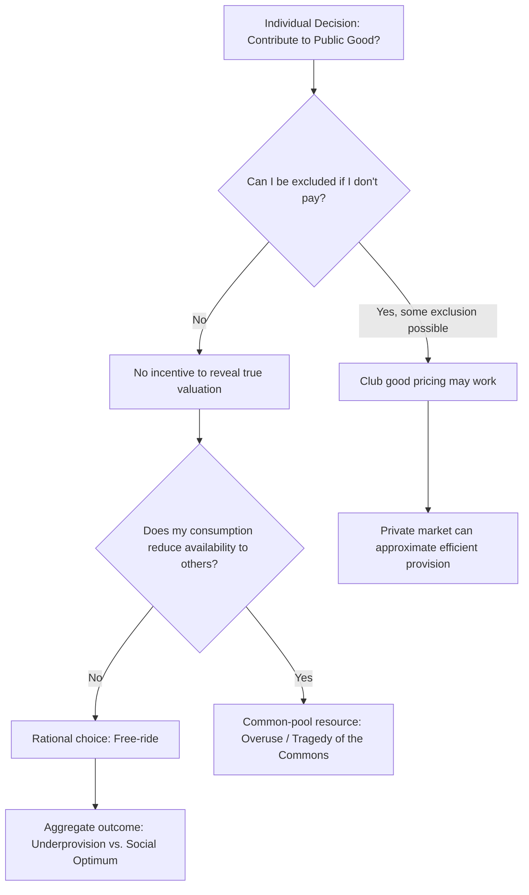

## Public Goods and the Free-Rider Problem

### Definitional Foundation: The Two Properties

Public goods are classified along two independent dimensions, which together generate a fourfold taxonomy of goods.

**Non-excludability**: It is impossible, or prohibitively costly, to prevent individuals from consuming the good once it is provided — regardless of whether they paid for it.

**Non-rivalry**: One person's consumption of the good does not reduce the quantity or quality available to others. The marginal cost of serving an additional consumer is zero.

$$MC_{additional\ user} = 0 \quad \text{(non-rivalry)}$$

A **pure public good** exhibits both properties simultaneously (e.g., national defense, a lighthouse beam, open-source software, basic scientific research, epidemiological surveillance).

### The Fourfold Classification of Goods

|  | Excludable | Non-Excludable |
| --- | --- | --- |
| **Rivalrous** | Private Goods (food, clothing, private clinic care) | Common-Pool Resources (fisheries, groundwater, congested roads) |
| **Non-Rivalrous** | Club Goods (cable TV, toll roads, streaming subscriptions, private parks) | Public Goods (national defense, clean air, open-source code, broadcast signals) |

This matrix is critical for managers because misclassifying a good leads directly to mispriced business models — for example, treating a club good (excludable but non-rivalrous, like a streaming platform) as if it were a pure private good ignores the near-zero marginal cost of serving additional subscribers, which should inform pricing strategy.

### The Free-Rider Problem: Formal Logic

Because non-excludability prevents a provider from charging non-payers, and non-rivalry means one person's use doesn't diminish availability to others, rational self-interested individuals have an incentive to consume the good without contributing to its cost — anticipating that others will pay instead.

**Formal condition for underprovision:**

For $n$ individuals with valuation $v_i$ for the public good, the socially efficient provision rule (Samuelson condition) requires:

$$\sum_{i=1}^{n} MRS_i = MRT$$

That is, the *sum* of individuals' marginal rates of substitution (their willingness to pay) must equal the marginal rate of transformation (the marginal cost of provision) — unlike private goods, where efficiency requires each individual's $MRS_i = MRT$ separately.

Because no single individual bears the full cost of their consumption decision, each individual acting alone equates only their own $MRS_i$ to $MRT$, which will be far below the summed social valuation. The result is chronic underprovision relative to the efficient quantity, and in the extreme case, zero private provision even when the good is socially valuable.

### Game-Theoretic Representation (Two-Player Public Goods Game)

|  | Player B: Contribute | Player B: Free-Ride |
| --- | --- | --- |
| **Player A: Contribute** | (2, 2) | (0, 3) |
| **Player A: Free-Ride** | (3, 0) | (1, 1) |

Regardless of what Player B does, Player A's dominant strategy is to free-ride (3 > 2 if B contributes; 1 > 0 if B free-rides). The same logic applies symmetrically to B. The unique Nash equilibrium is **(Free-Ride, Free-Ride)**, yielding payoffs of (1,1) — a Pareto-inferior outcome compared to mutual contribution (2,2). This is structurally identical to a Prisoner's Dilemma and demonstrates why voluntary private provision systematically fails even when cooperation would benefit everyone.

### Diagram: Efficient Provision vs. Market Underprovision (svg_diagram)

<svg xmlns="http://www.w3.org/2000/svg" viewBox="0 0 720 440" font-family="Arial, sans-serif">
<text x="360" y="24" text-anchor="middle" font-size="16" font-weight="bold">Public Good: Vertical Summation of Demand (svg_diagram)</text>
<line x1="80" y1="390" x2="680" y2="390" stroke="black" stroke-width="2" />
<line x1="80" y1="390" x2="80" y2="40" stroke="black" stroke-width="2" />
<text x="690" y="395" font-size="13">Quantity</text>
<text x="50" y="40" font-size="13">Price / MRS</text>
<line x1="80" y1="330" x2="500" y2="60" stroke="#1f77b4" stroke-width="2" />
<text x="505" y="58" font-size="12" fill="#1f77b4">MRS_A (Individual A demand)</text>
<line x1="80" y1="370" x2="500" y2="140" stroke="#2ca02c" stroke-width="2" />
<text x="505" y="142" font-size="12" fill="#2ca02c">MRS_B (Individual B demand)</text>
<line x1="80" y1="20" x2="330" y2="390" stroke="#d62728" stroke-width="3" />
<text x="335" y="20" font-size="12" fill="#d62728">Sum MRS_A + MRS_B (Social Demand)</text>
<line x1="80" y1="380" x2="680" y2="90" stroke="gray" stroke-dasharray="6" />
<text x="685" y="88" font-size="12" fill="gray">MC (Supply)</text>
<line x1="215" y1="390" x2="215" y2="215" stroke="black" stroke-dasharray="3" />
<text x="180" y="410" font-size="12">Q_efficient</text>
<circle cx="215" cy="215" r="4" fill="black" />

<text x="240" y="215" font-size="11" fill="#333">Efficient point:</text>

<text x="240" y="230" font-size="11" fill="#333">sum(MRS) = MC</text>

</svg>

Unlike private goods where individual demand curves are summed horizontally, public good demand curves are summed **vertically** — because all consumers simultaneously consume the same unit, their individual willingness-to-pay values are additive at each quantity level.

### Common Solutions to the Free-Rider Problem

**1. Government Provision Financed by Compulsory Taxation**

Removes the voluntary contribution decision entirely; funding is collected regardless of individual willingness to reveal preferences. This is the most common real-world solution for pure public goods like national defense and basic research infrastructure.

**2. Lindahl Pricing (Theoretical Benchmark)**

Each individual is charged a personalized "tax price" equal to their own marginal benefit from the public good, such that:

$$\sum_{i} t_i = MC \quad \text{and} \quad t_i = MRS_i$$

[Inference] Lindahl pricing is efficient in theory but rarely implementable in practice because it requires accurate knowledge of each individual's true valuation, which individuals have no incentive to reveal honestly (the preference revelation problem).

**3. Exclusion Mechanisms (Converting Public Goods to Club Goods)**

Where technologically feasible, firms convert non-excludable goods into excludable ones to enable market pricing:

- Paywalls and subscription models for digital content
- Scrambled satellite/cable signals requiring decoder access
- Toll roads and congestion pricing
- Encryption and DRM for digital goods

**4. Assurance Contracts / Crowdfunding Mechanisms**

Contributions are collected conditionally — funds are only charged (or the good is only provided) if a pre-committed threshold of total contributions is reached (e.g., Kickstarter's "all-or-nothing" model). This reduces free-riding by making individual contribution pivotal to whether the good is provided at all.

**5. Private Provision via Bundling and Joint Products**

Firms bundle a public good with an excludable private good to recoup costs (e.g., broadcast television historically bundled "free" programming with paid advertising slots; open-source software firms bundle free code with paid support contracts).

**6. Social Norms, Reciprocity, and Reputation Mechanisms**

[Inference] Behavioral and experimental economics research finds that real-world contribution rates to public goods are often higher than the pure free-rider prediction, attributable to conditional cooperation, social preferences, and reputational concerns — though contributions still typically fall short of the socially efficient level and tend to decay with repeated interaction in laboratory settings.

### Managerial Implications

**Business Model Design**

- Managers evaluating a product's revenue model must first classify it on the excludability/rivalry matrix. Digital goods (software, data, media) are frequently non-rivalrous, so profitability hinges entirely on constructing artificial excludability (licensing, DRM, authentication) rather than on physical scarcity.
- Freemium models exploit the public-good-like character of digital content: since the marginal cost of serving an additional free user is near zero, firms can use a wide free tier as customer acquisition while monetizing excludable premium features.

**Industry Self-Regulation as a Quasi-Public Good**

- Industry standards, safety certifications, and quality assurance frameworks (e.g., ISO certifications, security disclosure norms) function as club/public goods among firms. Individual firms may under-invest in these common resources (e.g., cybersecurity threat intelligence sharing) unless collective mechanisms (trade associations, information-sharing consortia) enforce contribution.
- [Inference] Firms with market power sometimes voluntarily supply industry-wide public goods (e.g., publishing open standards, funding open-source foundations) as a strategic move to shape ecosystem direction in their favor, not purely out of altruism.

**R&D and Innovation Spillovers**

- Basic research has strong public-good characteristics: findings are non-rivalrous (once discovered, unlimited firms can use them) and difficult to fully exclude others from (patents provide only partial, time-limited excludability).
- This explains chronic private underinvestment in basic R&D relative to the social optimum, and is the standard economic justification for public funding of research institutions, university grants, and R&D tax credits.
- Managers deciding on R&D strategy must weigh the appropriability of returns: applied, patentable, firm-specific R&D is more privately profitable than open, foundational research, which tends to be systematically underfunded by private firms acting alone.

**Common-Pool Resource Management (the Related "Tragedy of the Commons")**

- Where a resource is rivalrous but non-excludable (fisheries, shared aquifers, radio spectrum before licensing, corporate shared IT infrastructure), the parallel failure mode is overuse rather than underprovision.
- Managerial tools: internal usage quotas, chargeback/internal pricing systems for shared corporate resources (e.g., shared cloud computing budgets, shared sales leads pools), and monitoring systems to prevent internal free-riding on common departmental resources.

**Public-Private Partnerships (PPPs)**

- Managers in infrastructure, healthcare, and utilities frequently interact with government as a co-provider of quasi-public goods (roads, water systems, broadband). Contract design must anticipate free-rider dynamics among competing private consortium partners bidding for or executing shared infrastructure projects.

### Worked Numerical Example

Two firms, A and B, jointly benefit from a shared industry cybersecurity threat-intelligence platform. Firm A's marginal benefit from platform quality is $MB_A = 40 - 2Q$; Firm B's is $MB_B = 30 - Q$. The marginal cost of building platform capacity is $MC = 20$.

**Step 1 — Social (efficient) provision level:** Sum marginal benefits vertically:

$$MB_A + MB_B = (40 - 2Q) + (30 - Q) = 70 - 3Q$$

Set equal to $MC$:

$$70 - 3Q = 20 \Rightarrow 3Q = 50 \Rightarrow Q^{*} = 16.67$$

**Step 2 — Individually optimal levels if each firm acted alone (ignoring the other's benefit):**

Firm A alone: $40 - 2Q = 20 \Rightarrow Q_A = 10$

Firm B alone: $30 - Q = 20 \Rightarrow Q_B = 10$

**Step 3 — Free-rider outcome:** If each firm expects the other to build the platform, and platform capacity is non-rivalrous once built, the realistic non-cooperative outcome is that only the higher-valuation firm invests, likely producing a quantity closer to $Q_A = 10$ or lower — well below the jointly efficient $Q^{*} = 16.67$. This 6.67-unit shortfall represents the welfare loss from uncoordinated private provision, motivating an industry consortium, trade-association cost-sharing agreement, or regulatory mandate to close the gap.

### Key Points

- Public goods are defined by non-excludability and non-rivalry; the combination of these two properties (not either alone) produces the free-rider problem.
- Efficient public good provision requires summing individual valuations *vertically* (Samuelson condition), not horizontally as with private goods.
- Rational individual behavior under non-excludability leads to systematic underprovision relative to the social optimum — a structurally identical outcome to the Prisoner's Dilemma.
- Real-world solutions include compulsory government financing, engineered excludability (club goods), assurance contracts, and social/reputational mechanisms, each with distinct trade-offs.
- Managers must classify goods correctly on the excludability/rivalry matrix, since this determines whether a market-based pricing model is even feasible, and must anticipate underinvestment in shared industry resources like R&D and standard-setting.

### Related Topics

- Tragedy of the commons and common-pool resource management
- Lindahl pricing and preference revelation mechanisms
- Cost-benefit analysis for public infrastructure projects
- Intellectual property law as a partial excludability mechanism
- Behavioral public goods experiments (conditional cooperation, punishment mechanisms)
- Club theory and optimal club size
- Public-private partnership contract design