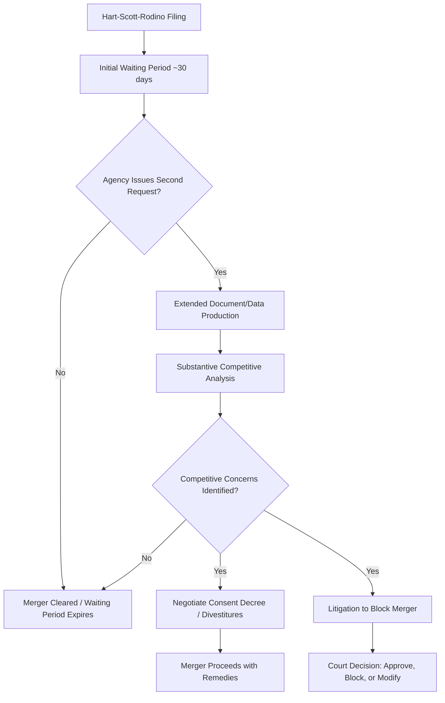

## Antitrust Law and Competition Policy

### Economic Rationale for Antitrust Intervention

Antitrust policy exists to correct market failures arising from market power — the ability of a firm or group of firms to profitably raise price above the competitive level (marginal cost) and restrict output. The efficiency loss from market power is captured by deadweight loss:

$$DWL = \frac{1}{2}(P_m - P_c)(Q_c - Q_m)$$

Where $P_m, Q_m$ are the monopoly price and quantity, and $P_c, Q_c$ are the competitive equivalents. Beyond static deadweight loss, economists also identify **allocative inefficiency**, **X-inefficiency** (reduced internal cost discipline absent competitive pressure), and **dynamic inefficiency** (reduced incentive to innovate) as harms from unchecked market power. [Inference] Some economists (notably associated with the Schumpeterian tradition) argue temporary market power from innovation can be dynamically efficient, which is why antitrust doctrine generally distinguishes market power *earned* through superior products from power *maintained* through exclusionary conduct.

### The Three Pillars of U.S. Antitrust Law

**Sherman Antitrust Act (1890)**

- **Section 1**: Prohibits contracts, combinations, or conspiracies in restraint of trade (the legal basis for prosecuting cartels and certain vertical/horizontal agreements)
- **Section 2**: Prohibits monopolization or attempted monopolization — not the mere possession of monopoly power, but the willful acquisition or maintenance of it through anticompetitive conduct (as distinct from "superior product, business acumen, or historic accident")

**Clayton Act (1914)**

- Section 2: Prohibits price discrimination that substantially lessens competition (as amended by the Robinson-Patman Act, 1936)
- Section 3: Prohibits tying arrangements and exclusive dealing that may substantially lessen competition
- Section 7: Prohibits mergers and acquisitions where the effect "may be substantially to lessen competition, or tend to create a monopoly" — the primary statutory basis for merger review
- Section 8: Prohibits interlocking directorates among competing firms above certain size thresholds

**Federal Trade Commission Act (1914)**

- Section 5: Prohibits "unfair methods of competition" and "unfair or deceptive acts or practices," giving the FTC broader, more flexible jurisdiction than the Sherman Act's criminal-oriented framework

### Per Se Illegality vs. Rule of Reason

**Per Se Violations**

Certain conduct is considered so inherently and predictably anticompetitive that courts do not require proof of actual market harm — the conduct itself is conclusively presumed illegal. Classic per se categories:

- Horizontal price fixing among competitors
- Bid rigging
- Horizontal market allocation (dividing customers or territories among competitors)
- Certain group boycotts

**Rule of Reason**

Most other conduct is evaluated under a fact-specific balancing test weighing procompetitive justifications against anticompetitive effects:

$$\text{Net Effect} = \text{Procompetitive Benefits} - \text{Anticompetitive Harms}$$

Courts assess market definition, market power, actual or likely competitive harm, and legitimate business justifications (efficiency, quality improvement) before determining legality. [Inference] The boundary between per se and rule-of-reason categories has narrowed over recent decades of U.S. jurisprudence, with courts increasingly favoring rule-of-reason analysis even for some historically per se categories (e.g., certain vertical restraints).

### Horizontal vs. Vertical Restraints

**Horizontal restraints** occur between competitors at the same level of the supply chain (e.g., two rival manufacturers agreeing on price). These carry the highest antitrust risk because they directly eliminate competition between substitutes.

**Vertical restraints** occur between firms at different levels of the supply chain (e.g., a manufacturer and its distributor). Examples include:

- Resale price maintenance (RPM) — minimum or maximum resale prices set by a manufacturer
- Exclusive territories and exclusive dealing
- Tying arrangements (conditioning sale of one product on purchase of another)

[Inference] Vertical restraints are generally treated more leniently than horizontal restraints in modern antitrust analysis because they can also generate efficiency benefits (e.g., preventing free-riding on retailer service investments, ensuring quality control), though this varies by jurisdiction and specific restraint type.

### Merger Review Framework

**Herfindahl-Hirschman Index (HHI)**

The primary quantitative screening tool for horizontal merger review, calculated as the sum of squared market shares of all firms in a relevant market:

$$HHI = \sum_{i=1}^{n} s_i^2$$

Where $s_i$ is the market share (in percentage points) of firm $i$.

**U.S. DOJ/FTC Horizontal Merger Guidelines thresholds:**

| Post-Merger HHI | Market Classification | Regulatory Concern |
| --- | --- | --- |
| Below 1,500 | Unconcentrated | Generally unlikely to warrant scrutiny |
| 1,500 – 2,500 | Moderately Concentrated | Mergers raising HHI by more than 100 points may warrant scrutiny |
| Above 2,500 | Highly Concentrated | Mergers raising HHI by more than 100 points are presumed likely to enhance market power; increases above 200 points raise significant concern |

**Worked HHI Example:**

Before a proposed merger, a market has four firms with shares 35%, 30%, 20%, and 15%:

$$HHI_{before} = 35^2 + 30^2 + 20^2 + 15^2 = 1225 + 900 + 400 + 225 = 2750$$

If the two smallest firms (20% and 15%) merge, their combined share becomes 35%:

$$HHI_{after} = 35^2 + 30^2 + 35^2 = 1225 + 900 + 1225 = 3350$$

$$\Delta HHI = 3350 - 2750 = 600$$

Since the post-merger HHI (3350) exceeds 2,500 and the change (600) exceeds 200, this merger falls squarely within the presumptively problematic zone and would likely trigger extended regulatory review.

**Merger review process stages (U.S.):**

### Monopolization and Exclusionary Conduct Doctrines

**Predatory Pricing**

Pricing below cost to drive out rivals, with the intent to recoup losses later through supracompetitive pricing. Under prevailing U.S. doctrine (*Brooke Group* standard), plaintiffs must show:

1. Prices below an appropriate measure of cost (typically average variable cost)
2. A dangerous probability of recouping losses after rivals exit

[Inference] This recoupment requirement makes predatory pricing claims difficult to win in U.S. courts, since it requires proving the defendant could plausibly restore high prices post-exit without inviting new entry.

**Tying and Bundling**

Conditioning the sale of a "tying" product on purchase of a "tied" product, potentially foreclosing competitors in the tied product market. Evaluated under rule of reason in most modern cases, examining market power in the tying product and actual foreclosure effects.

**Exclusive Dealing**

Agreements requiring a buyer to purchase exclusively (or nearly so) from one seller, potentially foreclosing rivals' access to distribution or inputs.

**Refusal to Deal**

Generally, firms (even monopolists) have wide latitude to choose their business partners; liability requires narrow circumstances such as terminating a prior voluntary and profitable course of dealing without legitimate business justification.

### Global Comparative Frameworks

| Jurisdiction | Key Statute(s) | Distinctive Feature |
| --- | --- | --- |
| United States | Sherman Act, Clayton Act, FTC Act | Emphasis on consumer welfare standard; private right of action with treble damages |
| European Union | Treaty on the Functioning of the EU (TFEU) Articles 101 & 102 | Broader "abuse of dominance" concept; heavier emphasis on protecting competitive market structure, not just consumer prices; Digital Markets Act adds ex-ante obligations on "gatekeeper" platforms |
| United Kingdom (post-Brexit) | Competition Act 1998, Enterprise Act 2002 | Independent CMA enforcement mirroring EU-style analysis with UK-specific market investigations regime |
| China | Anti-Monopoly Law (2008, amended 2022) | State involvement in enforcement priorities; growing focus on platform economy regulation |

[Inference] The EU's "abuse of dominance" framework under Article 102 is often characterized as more interventionist than the U.S. consumer-welfare-centric approach, though both systems have moved toward increased scrutiny of large digital platforms in recent years.

### Managerial Implications

**Merger and Acquisition Strategy**

- Prior to announcing any merger, managers must conduct internal HHI and market-definition analysis to estimate antitrust risk and anticipate whether a Second Request (extended review) is likely.
- Deal timelines and valuations must incorporate regulatory risk premiums; termination fees ("reverse breakup fees") are frequently negotiated specifically to address the risk of a deal being blocked.
- Divestiture packages are often pre-negotiated as a contingency to preempt objections in horizontally concentrated markets.

**Pricing and Distribution Policy**

- Managers setting minimum advertised price (MAP) or resale price maintenance policies must structure them to fall within the more lenient rule-of-reason treatment rather than triggering per se horizontal price-fixing risk (which requires no direct agreement with competitors).
- Sales and marketing teams must be trained to avoid even informal communication with competitors about prices, output, customers, or bids — this is a leading cause of criminal Sherman Act Section 1 exposure. [Inference] Antitrust compliance training is standard corporate practice specifically because informal, undocumented communications (at trade shows, industry associations) are a common evidentiary source in cartel prosecutions.

**Platform and Digital Market Strategy**

- Firms operating multi-sided platforms must evaluate whether bundling, self-preferencing, or tying practices could trigger Section 2 monopolization claims or, in the EU, Digital Markets Act gatekeeper obligations.
- Data advantages and network effects are increasingly treated as sources of durable market power warranting antitrust scrutiny, distinct from traditional price-based dominance analysis.

**Litigation and Enforcement Risk Management**

- Private antitrust litigation in the U.S. carries treble damages exposure (three times proven damages) plus attorney's fees, creating asymmetric litigation risk that shapes settlement incentives.
- Managers should maintain document retention and communication policies anticipating that internal emails/messages are frequently central evidence in both government enforcement actions and private follow-on litigation.

**International Compliance Complexity**

- Multinational firms must navigate divergent standards simultaneously — conduct permissible under the U.S. consumer welfare standard may constitute an actionable "abuse of dominance" under EU law, requiring jurisdiction-specific compliance programs rather than a single global policy.

### Key Points

- Antitrust policy targets deadweight loss and dynamic inefficiency from market power, distinguishing power earned through competitive merit from power maintained through exclusionary conduct.
- The Sherman Act, Clayton Act, and FTC Act form the core U.S. statutory framework, enforced through both per se rules (for inherently anticompetitive conduct like price fixing) and rule-of-reason balancing for most other conduct.
- HHI is the standard quantitative tool for horizontal merger screening, with post-merger HHI above 2,500 and a change above 200 points presumptively raising competitive concern.
- Predatory pricing claims require proof of below-cost pricing and a plausible recoupment strategy, making them difficult to establish under current U.S. doctrine.
- Multinational managers face materially different antitrust standards across jurisdictions (U.S. consumer welfare vs. EU abuse of dominance), requiring differentiated compliance strategies.

### Related Topics

- Cartel detection and leniency/amnesty programs
- Digital Markets Act and platform gatekeeper regulation
- Vertical merger analysis and foreclosure theories of harm
- Price discrimination and the Robinson-Patman Act
- Network effects and antitrust in two-sided markets
- Private antitrust litigation and treble damages
- Regulatory economics and cost-benefit analysis of regulation