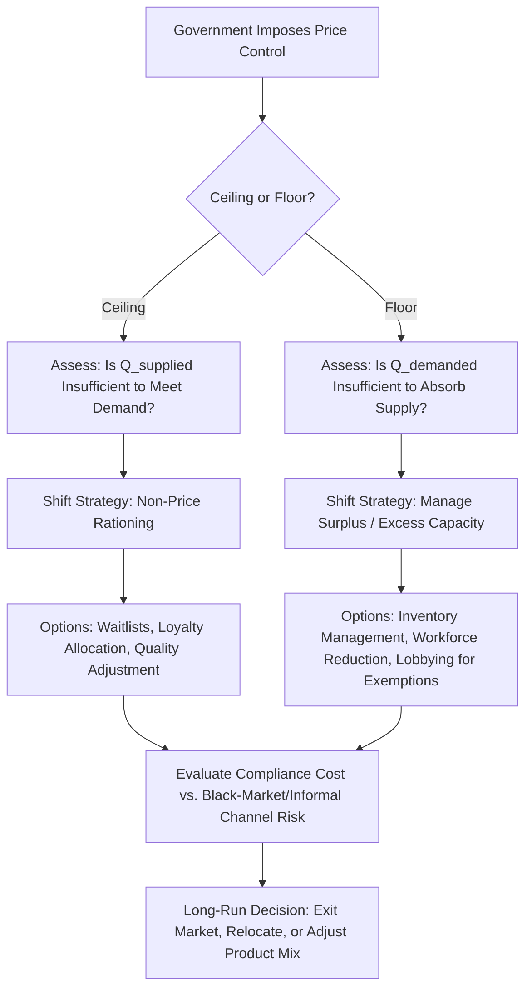

## Price Controls: Ceilings, Floors, and Market Distortions

### Definitional Foundation

A price control is a government-imposed legal limit on the price that can be charged (or paid) for a good or service, overriding the price that would otherwise emerge from market equilibrium. Price controls are classified by which side of the equilibrium price they constrain.

**Price Ceiling**: A legal *maximum* price, set below the natural equilibrium price, intended to make a good more affordable to buyers.

**Price Floor**: A legal *minimum* price, set above the natural equilibrium price, intended to guarantee a minimum return to sellers.

A critical technical point: a price control is only *binding* (has real market effects) if it is set on the "wrong side" of equilibrium — a ceiling above equilibrium price or a floor below equilibrium price has no effect, since the market naturally settles at a point already satisfying the constraint.

### Price Ceilings: Mechanics and Effects

Consider a market with demand $Q_d = a - bP$ and supply $Q_s = c + dP$, with natural equilibrium at $P^*$. A binding price ceiling $\bar{P} < P^*$ is imposed.

At the ceiling price:

$$Q_d(\bar{P}) = a - b\bar{P} \qquad Q_s(\bar{P}) = c + d\bar{P}$$

Since $\bar{P} < P^*$, quantity demanded exceeds quantity supplied:

$$Q_d(\bar{P}) > Q_s(\bar{P})$$

This gap is the **shortage** (excess demand):

$$\text{Shortage} = Q_d(\bar{P}) - Q_s(\bar{P})$$

Only $Q_s(\bar{P})$ units are actually transacted — the market cannot force sellers to supply more than they are willing to at the capped price, regardless of how much buyers want.

### Diagram: Price Ceiling and Shortage (svg_diagram)

<svg xmlns="http://www.w3.org/2000/svg" viewBox="0 0 720 440" font-family="Arial, sans-serif">
<text x="360" y="24" text-anchor="middle" font-size="16" font-weight="bold">Binding Price Ceiling (svg_diagram)</text>
<line x1="80" y1="390" x2="680" y2="390" stroke="black" stroke-width="2" />
<line x1="80" y1="390" x2="80" y2="40" stroke="black" stroke-width="2" />
<text x="690" y="395" font-size="13">Quantity</text>
<text x="50" y="40" font-size="13">Price</text>
<line x1="80" y1="370" x2="640" y2="80" stroke="#1f77b4" stroke-width="2" />
<text x="645" y="78" font-size="12" fill="#1f77b4">Supply</text>
<line x1="80" y1="80" x2="640" y2="370" stroke="#2ca02c" stroke-width="2" />
<text x="645" y="372" font-size="12" fill="#2ca02c">Demand</text>
<line x1="80" y1="225" x2="440" y2="225" stroke="gray" stroke-dasharray="4" />
<text x="45" y="229" font-size="12">P*</text>
<circle cx="440" cy="225" r="4" fill="black" />
<line x1="80" y1="300" x2="680" y2="300" stroke="#d62728" stroke-width="2" stroke-dasharray="6" />
<text x="45" y="304" font-size="12" fill="#d62728">P_ceiling</text>
<line x1="270" y1="390" x2="270" y2="300" stroke="black" stroke-dasharray="3" />
<text x="245" y="410" font-size="11">Qs</text>
<line x1="580" y1="390" x2="580" y2="300" stroke="black" stroke-dasharray="3" />
<text x="565" y="410" font-size="11">Qd</text>
<polygon points="270,300 580,300 440,225" fill="#d62728" fill-opacity="0.3" />
<text x="380" y="270" font-size="12" fill="#d62728">Shortage</text>
<polygon points="270,225 440,225 270,300" fill="orange" fill-opacity="0.4" />
<text x="150" y="260" font-size="11" fill="#994c00">DWL</text>
</svg>

**Non-price rationing mechanisms triggered by shortages:**

- Waiting lines / queuing (time cost substitutes for price as the rationing mechanism)
- Seller discrimination (favoring preferred customers, bundling with other purchases)
- Black markets (illegal transactions above the ceiling price, sometimes at prices exceeding even the original equilibrium $P^*$ due to added legal risk premium)
- Reduced product quality (sellers cut quality to reduce effective cost while nominally complying with the price cap)
- Underground/informal economy expansion

**Classic real-world examples:** rent control (residential housing markets), gasoline price caps during 1970s oil shocks, and some pharmaceutical price caps.

### Price Floors: Mechanics and Effects

With a binding price floor $\underline{P} > P^*$:

$$Q_s(\underline{P}) > Q_d(\underline{P})$$

This gap is the **surplus** (excess supply):

$$\text{Surplus} = Q_s(\underline{P}) - Q_d(\underline{P})$$

Only $Q_d(\underline{P})$ units are actually sold — sellers cannot force buyers to purchase more than they demand at the floor price.

**Classic real-world examples:** minimum wage laws (labor market floor), agricultural price supports, historically the pre-deregulation era of transportation and telecommunications tariffs.

**Non-price effects of surpluses:**

- Unemployment (in labor markets: quantity of labor supplied exceeds quantity demanded at the minimum wage)
- Government stockpiling/purchase programs (common in agricultural price support systems, where government buys the surplus to sustain the floor price)
- Reduced non-wage benefits or working conditions as employers compensate for the mandated wage floor
- Rationing of who is served among willing sellers (in agricultural quotas)

### Deadweight Loss from Price Controls

For both ceilings and floors, the deadweight loss arises because the quantity actually transacted ($Q_{transacted}$) is below the efficient equilibrium quantity $Q^*$:

$$DWL = \frac{1}{2} \times |Q^* - Q_{transacted}| \times |MSB(Q_{transacted}) - MSC(Q_{transacted})|$$

This represents the value of mutually beneficial trades between willing buyers and sellers that are prevented from occurring because of the binding price constraint — regardless of whether the constraint favors buyers (ceiling) or sellers (floor).

### Worked Numerical Example: Rent Ceiling

Housing market: $Q_d = 10{,}000 - 40P$ and $Q_s = -2{,}000 + 20P$ (P in dollars per month, Q in units).

**Step 1 — Equilibrium price and quantity:**

$$10{,}000 - 40P = -2{,}000 + 20P \Rightarrow 12{,}000 = 60P \Rightarrow P^* = 200$$

$$Q^* = 10{,}000 - 40(200) = 2{,}000$$

**Step 2 — Government imposes a rent ceiling at $\bar{P} = 150$:**

$$Q_d(150) = 10{,}000 - 40(150) = 4{,}000$$

$$Q_s(150) = -2{,}000 + 20(150) = 1{,}000$$

**Step 3 — Shortage:**

$$\text{Shortage} = 4{,}000 - 1{,}000 = 3{,}000 \text{ units}$$

Only 1,000 units are actually rented (the supply-constrained quantity), down from 2,000 at equilibrium — meaning the ceiling actually *reduces* the number of housing units available on the market, even as it increases the number of people who *want* housing at that price.

**Step 4 — Deadweight loss:**

At $Q = 1{,}000$: inverse demand gives $P_d = \frac{10{,}000 - 1{,}000}{40} = 225$; inverse supply gives $P_s = \frac{1{,}000 + 2{,}000}{20} = 150$.

$$DWL = \frac{1}{2}(2{,}000 - 1{,}000)(225 - 150) = \frac{1}{2}(1{,}000)(75) = 37{,}500$$

[Inference] Beyond this static deadweight loss, empirical literature on rent control generally finds long-run supply reductions (landlords converting units to condos, reduced new construction, deferred maintenance) that are not captured in this simple static model but are frequently cited as a dynamic cost of sustained price ceilings.

### Comparative Summary Table

| Feature | Price Ceiling | Price Floor |
| --- | --- | --- |
| Position relative to $P^*$ | Below | Above |
| Binding condition | $\bar{P} < P^*$ | $\underline{P} > P^*$ |
| Market imbalance | Shortage (excess demand) | Surplus (excess supply) |
| Quantity transacted | $Q_s(\bar{P})$ (supply-constrained) | $Q_d(\underline{P})$ (demand-constrained) |
| Beneficiaries (intended) | Buyers/consumers | Sellers/producers |
| Common non-price effects | Queuing, black markets, quality reduction | Unemployment, government stockpiling |
| Classic example | Rent control | Minimum wage |

### Process Flow: Managerial Response to a Binding Price Control

### Managerial Implications

**Operating Under a Price Ceiling**

- Firms facing a binding price ceiling (e.g., rent-controlled housing, price-capped utilities, capped insurance premiums) must find non-price margins to manage excess demand: allocation by seniority/loyalty, bundling with fee-based ancillary services not covered by the cap, or quality/service-level adjustments.
- Long-run investment decisions are directly affected: [Inference] persistent price ceilings tend to discourage new capital investment in the constrained sector, since expected returns are capped below what unconstrained markets would offer, which is a standard argument made in debates over rent control and utility rate regulation.
- Firms should evaluate the legal and reputational risk of any conduct that could be characterized as circumventing the ceiling (e.g., disguised fees), as this frequently draws regulatory scrutiny.

**Operating Under a Price Floor**

- A minimum wage increase raises marginal labor cost directly; managers must model the elasticity of labor demand for their specific labor segment to estimate employment effects versus price pass-through effects.
- [Inference] Empirical minimum wage research finds mixed and context-dependent employment effects, particularly in monopsonistic labor markets where a wage floor can, in some models, increase both wages and employment relative to an unconstrained monopsony outcome — this remains an active area of empirical debate rather than settled consensus.
- Firms may respond to wage floors through automation investment, reduced hours, reduced non-wage benefits, or, if margins allow, price pass-through to consumers — the optimal mix depends on relative elasticities of labor supply, labor demand, and product demand.

**Regulatory Relations and Lobbying Strategy**

- Firms in price-controlled industries frequently engage in regulatory advocacy to influence the *level* at which a ceiling or floor is set, since the binding constraint directly determines profitability.
- Understanding whether a proposed control is likely to bind (based on current market equilibrium estimates) allows managers to prioritize lobbying resources toward controls that pose genuine binding risk versus symbolic ones unlikely to affect actual market outcomes.

**Strategic Market Exit and Entry**

- Persistent binding price controls can make a market unattractive for new entrants or prompt exit by existing firms, particularly if the controlled price falls below the firm's long-run average cost — this is a standard explanation offered for housing supply contraction in markets with sustained rent control regimes.

### Key Points

- A price control only has real market effects if it binds — a ceiling above or a floor below the equilibrium price is non-binding and irrelevant to actual outcomes.
- Ceilings cause shortages by capping price below equilibrium; floors cause surpluses by setting a minimum above equilibrium; in both cases, the quantity actually transacted is determined by the "short side" of the market.
- Deadweight loss arises because mutually beneficial trades near the margin are prevented from occurring, regardless of which side of the market the control favors.
- Non-price rationing mechanisms (queuing, black markets, quality reduction, or unemployment/surplus stockpiling) inevitably emerge to allocate the resulting imbalance.
- Managers must plan for both static (deadweight loss) and dynamic (long-run investment, entry/exit) effects when operating in price-controlled markets, and often engage in active regulatory advocacy given the direct profitability impact of where a binding control is set.

### Related Topics

- Minimum wage economics and monopsony labor markets
- Rent control policy design and long-run housing supply effects
- Agricultural price supports and government stockpiling programs
- Black markets and the economics of illegal price premiums
- Regulatory economics and cost-benefit analysis of price regulation
- Elasticity estimation for pass-through and employment effect analysis
- Windfall profits taxes and price gouging laws during emergencies