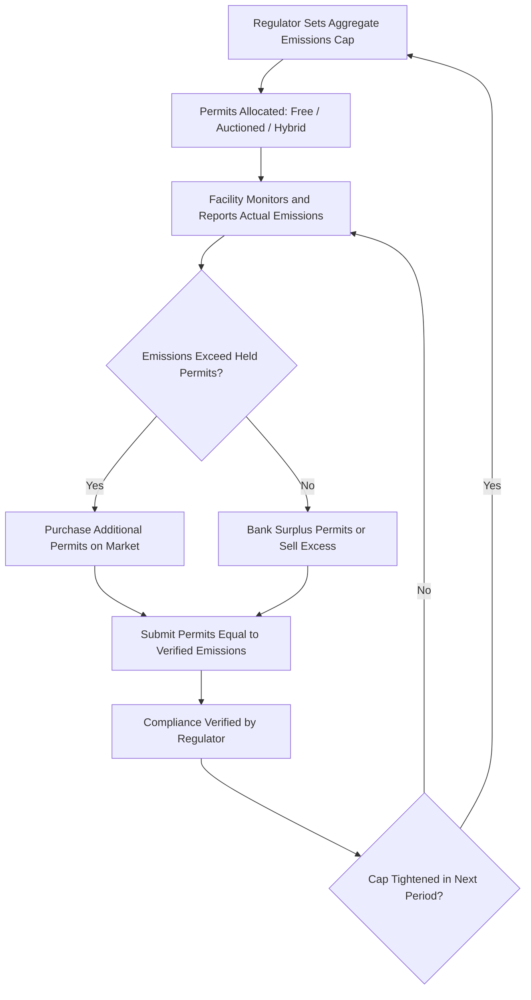

## Environmental Regulation and Market-Based Instruments

### Economic Rationale

Environmental regulation exists to correct the negative externality problem inherent in pollution: emitters do not bear the full social cost of the environmental damage they cause, so unregulated markets systematically overproduce pollution relative to the socially efficient level. The efficient level of pollution abatement is where the marginal cost of abatement equals the marginal external damage avoided:

$$MAC(e) = MD(e)$$

Where $MAC$ is marginal abatement cost (the cost of reducing one more unit of emissions) and $MD$ is marginal damage (the harm caused by one more unit of emissions), both expressed as functions of emissions level $e$.

Two broad regulatory philosophies exist for reaching this target: **command-and-control** regulation (direct legal mandates) and **market-based instruments** (price or quantity signals that let firms optimize their own compliance response).

### Command-and-Control Instruments

**Technology Standards**: Regulation mandates specific pollution-control equipment or processes (e.g., requiring scrubbers on smokestacks, catalytic converters on vehicles).

**Performance Standards**: Regulation sets a maximum allowable emissions rate per unit of output or per facility, without dictating the specific technology used to achieve it.

**Key limitation**: [Inference] Because firms in an industry typically face heterogeneous abatement costs, uniform command-and-control standards force high-abatement-cost firms and low-abatement-cost firms to reduce emissions by the same amount, which is generally not the cost-minimizing way to achieve a given aggregate reduction target — this is the central theoretical argument economists use in favor of market-based alternatives.

### Market-Based Instrument 1: Pigouvian Emissions Taxes

A per-unit tax on emissions set equal to marginal damage at the efficient emissions level:

$$t^{*} = MD(e^{*})$$

Facing this tax, a profit-maximizing firm will abate up to the point where its own marginal abatement cost equals the tax rate:

$$MAC_i(e_i) = t^{*}$$

**Key property — cost-effectiveness**: Since every firm in the industry faces the *same* tax rate, each firm independently abates until its own $MAC$ equals $t^*$. This automatically equalizes marginal abatement costs across all firms:

$$MAC_1 = MAC_2 = \dots = MAC_n = t^{*}$$

This is the condition for achieving any given aggregate emissions reduction at minimum total industry cost — firms with cheap abatement options abate more; firms with expensive abatement options abate less and pay more tax instead.

**Revenue and price certainty**: A tax fixes the *price* of emissions with certainty, but the resulting *quantity* of aggregate abatement depends on the (potentially uncertain) shape of aggregate marginal abatement costs — the regulator cannot guarantee a specific total emissions outcome in advance.

### Market-Based Instrument 2: Cap-and-Trade (Tradable Permits)

The regulator sets a fixed aggregate emissions cap $\bar{E}$ and distributes (via free allocation or auction) tradable permits summing to that cap. Firms may buy or sell permits freely.

**Equilibrium condition**: In a competitive permit market, trading continues until marginal abatement costs are equalized across all firms at the market-clearing permit price $P_{permit}$:

$$MAC_1 = MAC_2 = \dots = MAC_n = P_{permit}$$

This is the identical cost-effectiveness condition achieved by a tax — a foundational result (related to the Coase Theorem) showing that, under idealized conditions (competitive permit market, negligible transaction costs), a well-designed cap-and-trade system and a well-calibrated tax achieve the same efficient, cost-minimizing allocation of abatement effort, differing mainly in which variable (price vs. quantity) is fixed by the regulator.

**Quantity certainty, price uncertainty**: Unlike a tax, cap-and-trade fixes the *quantity* of total emissions with certainty (equal to the cap), while the resulting permit *price* fluctuates based on market conditions, economic activity levels, and abatement cost realizations.

### Diagram: Tax vs. Cap-and-Trade Under Uncertainty (svg_diagram)

<svg xmlns="http://www.w3.org/2000/svg" viewBox="0 0 720 460" font-family="Arial, sans-serif">
<text x="360" y="24" text-anchor="middle" font-size="15" font-weight="bold">Price (Tax) vs. Quantity (Cap) Instrument Choice (svg_diagram)</text>
<line x1="80" y1="220" x2="680" y2="220" stroke="black" stroke-width="1" />
<text x="30" y="120" font-size="13" font-weight="bold">Tax:</text>
<line x1="80" y1="120" x2="680" y2="120" stroke="#1f77b4" stroke-width="2" />
<text x="685" y="122" font-size="11" fill="#1f77b4">Fixed Tax Price</text>
<path d="M 100 200 Q 300 90 640 60" stroke="#2ca02c" stroke-width="2" fill="none" stroke-dasharray="5" />
<text x="645" y="58" font-size="10" fill="#2ca02c">MAC (high estimate)</text>
<path d="M 100 200 Q 300 160 640 140" stroke="#d62728" stroke-width="2" fill="none" stroke-dasharray="5" />
<text x="645" y="142" font-size="10" fill="#d62728">MAC (low estimate)</text>
<text x="90" y="200" font-size="10">Under a tax: price is fixed, resulting abatement quantity varies with true MAC</text>

<text x="30" y="340" font-size="13" font-weight="bold">Cap:</text>

<line x1="400" y1="260" x2="400" y2="440" stroke="`#1f77b4`" stroke-width="2" />

<text x="405" y="255" font-size="11" fill="`#1f77b4`">Fixed Cap Quantity</text>

<path d="M 100 420 Q 300 310 640 280" stroke="`#2ca02c`" stroke-width="2" fill="none" stroke-dasharray="5" />

<text x="645" y="278" font-size="10" fill="`#2ca02c`">MAC (high estimate)</text>

<path d="M 100 420 Q 300 380 640 360" stroke="`#d62728`" stroke-width="2" fill="none" stroke-dasharray="5" />

<text x="645" y="362" font-size="10" fill="`#d62728`">MAC (low estimate)</text>

<text x="90" y="440" font-size="10">Under a cap: quantity is fixed, resulting permit price varies with true MAC</text>

</svg>

[Inference] The Weitzman (1974) "prices versus quantities" framework shows that the preferred instrument under cost uncertainty depends on the relative slopes of the marginal abatement cost and marginal damage curves: taxes are generally preferred when marginal damage is relatively flat (a small quantity error produces small damage change), while quantity controls (caps) are preferred when marginal damage rises steeply with emissions (a small quantity error, if left uncorrected by a fixed-price instrument, could produce large damage).

### Market-Based Instrument 3: Emissions Trading System Design Variants

**Cap-and-Trade with Free Allocation (Grandfathering)**: Permits distributed to existing emitters based on historical emissions, reducing compliance cost burden on incumbents but foregoing government revenue and potentially raising windfall-profit concerns.

**Cap-and-Trade with Auctioning**: Permits sold via auction, generating government revenue that can be used to reduce other distortionary taxes (the "double dividend" hypothesis) or fund clean energy investment. [Inference] The double dividend hypothesis — that revenue-recycling can offset the efficiency cost of environmental regulation, potentially yielding a net efficiency gain beyond the environmental benefit itself — remains debated in the public finance literature regarding its magnitude and conditions for occurring.

**Baseline-and-Credit Systems**: Rather than an absolute cap, firms are assigned an emissions-intensity baseline (emissions per unit of output); firms beating their baseline generate tradable credits, while those exceeding it must purchase credits. Common in systems seeking to avoid direct output constraints on industry.

**Offset Mechanisms**: Allow regulated entities to meet compliance obligations partly through certified emissions reductions achieved outside the capped sector (e.g., reforestation projects, methane capture at unregulated facilities), expanding the pool of low-cost abatement options but raising verification and additionality concerns. [Inference] A persistent design and enforcement challenge is ensuring offset credits reflect genuine "additional" reductions beyond what would have occurred anyway — a topic subject to ongoing methodological debate and periodic scandal in voluntary and compliance carbon markets alike.

### Process Flow: Emissions Trading Compliance Cycle

### Worked Numerical Example: Comparing Two Firms Under a Tax vs. Uniform Standard

Two firms each currently emit 100 tons. Firm A has $MAC_A = 4 + 0.1(100-e_A)$; Firm B has $MAC_B = 2 + 0.4(100-e_B)$ where $e_i$ is remaining emissions. Regulator wants total abatement of 60 tons combined (total emissions reduced from 200 to 140).

**Uniform Standard (30 tons abatement each):**

$$MAC_A(30\text{ abated}) = 4 + 0.1(30) = 7 \qquad MAC_B(30\text{ abated}) = 2 + 0.4(30) = 14$$

Total cost (approximated as average cost × quantity for illustration): unequal marginal costs (7 ≠ 14) signal this allocation is inefficient — Firm B is abating at higher marginal cost than Firm A, so reallocating abatement toward Firm A would lower total cost.

**Tax or Cap-and-Trade at price $t = 10$:**

Firm A abates until $MAC_A = 10$: $4 + 0.1x = 10 \Rightarrow x_A = 60$ tons abated

Firm B abates until $MAC_B = 10$: $2 + 0.4x = 10 \Rightarrow x_B = 20$ tons abated

Total abatement: $60 + 20 = 80$ tons (regulator would calibrate $t$ down slightly to hit exactly 60 tons combined, but the illustration shows the mechanism): Firm A, with the flatter/cheaper MAC curve, abates far more than Firm B — precisely the reallocation that lowers total industry cost relative to the uniform standard, confirming the cost-effectiveness advantage of the price/permit mechanism.

### Comparative Summary Table

| Instrument | Price Certainty | Quantity Certainty | Cost-Effectiveness | Revenue Generation | Political/Administrative Note |
| --- | --- | --- | --- | --- | --- |
| Command-and-Control | High (compliance cost fixed by mandate) | Moderate | Low (ignores cost heterogeneity) | None | Easiest to explain and monitor |
| Emissions Tax | High | Low | High | Yes (unless revenue-neutral by design) | Politically sensitive as a "tax" |
| Cap-and-Trade | Low | High | High | Yes if auctioned; No if grandfathered | Politically framed as market-based, often more palatable than a tax |
| Baseline-and-Credit | Low | Moderate | Moderate-High | Minimal | Avoids absolute output constraints, eases industry transition |

### Managerial Implications

**Compliance Strategy and Abatement Investment**

- Firms should conduct internal marginal abatement cost curve analysis across all facilities/processes to identify which reductions are cheapest to make internally versus where purchasing permits or paying a tax is more economical — the same $MAC = \text{price}$ logic that drives industry-wide efficiency applies at the level of individual facility decision-making.
- Under cap-and-trade, firms with abatement costs below the expected permit price have a direct financial incentive to over-comply and sell surplus permits, converting environmental compliance into a potential profit center rather than a pure cost.

**Carbon Pricing and Capital Budgeting**

- Long-lived capital investments (power plants, industrial facilities) should incorporate a forward-looking internal carbon price assumption into NPV analysis, since future regulatory tightening is a material risk to asset value over multi-decade investment horizons. [Inference] Many large firms already apply an internal shadow carbon price in capital allocation decisions specifically to stress-test projects against future regulatory scenarios, though the specific price assumptions used vary widely across firms and are not standardized.

**Offset and Credit Market Participation**

- Firms considering offset purchases (for voluntary net-zero commitments or compliance flexibility) must conduct due diligence on additionality and verification quality, given documented instances of offset credits corresponding to reductions that would have occurred regardless of the offset payment.

**Regulatory Risk Management and Scenario Planning**

- Because political administrations shift environmental policy stringency over multi-year cycles, managers in emissions-intensive industries must scenario-plan across a range of policy outcomes (tax vs. cap, stringency levels, border carbon adjustments on imports) rather than committing capital to a single expected regulatory trajectory.

**Competitive and Trade Considerations**

- Asymmetric environmental regulation stringency across jurisdictions creates "carbon leakage" risk — production shifting to less-regulated jurisdictions rather than genuine emissions reduction — which is the underlying economic rationale for border carbon adjustment mechanisms (e.g., the EU's Carbon Border Adjustment Mechanism); managers in trade-exposed, emissions-intensive sectors must monitor these mechanisms closely as they directly affect competitive positioning of imports versus domestic production.

### Key Points

- Environmental regulation corrects the negative externality of pollution by aligning private marginal abatement cost decisions with the marginal damage caused by emissions.
- Both a well-calibrated emissions tax and a well-designed cap-and-trade system achieve cost-effectiveness by equalizing marginal abatement costs across all firms — the core theoretical advantage of market-based instruments over uniform command-and-control standards.
- Taxes offer price certainty with quantity uncertainty; cap-and-trade offers quantity certainty with price uncertainty — the Weitzman framework suggests instrument choice should depend on the relative steepness of marginal damage versus marginal abatement cost curves.
- Design choices within cap-and-trade systems (free allocation vs. auctioning, offsets, baseline-and-credit variants) create materially different revenue, incentive, and political economy outcomes.
- Managers must integrate carbon/emissions pricing into capital budgeting, treat compliance flexibility (banking, trading, offsets) as an active cost-management lever, and monitor cross-jurisdictional regulatory asymmetry for competitive and trade policy risk.

### Related Topics

- Externalities and their managerial implications (foundational theory)
- Weitzman "prices versus quantities" framework under uncertainty
- Carbon border adjustment mechanisms and trade policy
- Corporate internal carbon pricing and capital budgeting integration
- Offset market design, additionality, and verification standards
- Double dividend hypothesis in environmental tax policy
- ESG reporting and climate-related financial disclosure regulation