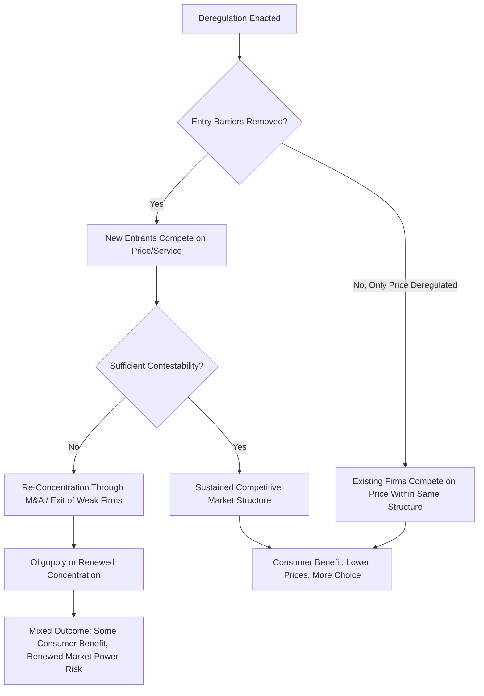

## Deregulation and Its Effects on Market Structure

### Definitional Foundation

Deregulation is the reduction or elimination of government rules governing an industry's prices, entry conditions, or operating practices, typically undertaken when the original rationale for regulation (natural monopoly, information asymmetry, externality) has weakened due to technological change, or when regulation is judged to have imposed net costs exceeding its benefits. Deregulation is distinct from **deregulation of price** alone (which may retain safety/entry rules) and **full market liberalization** (removing price, entry, and often ownership restrictions simultaneously).

### Economic Rationale for Deregulation

**1. Technological Erosion of Natural Monopoly Conditions**

A central justification is that technological change can convert a market from natural monopoly to potentially competitive structure. Formally, if cost subadditivity no longer holds across the relevant demand range:

$$C(Q_1) + C(Q_2) < C(Q_1 + Q_2)$$

then multiple firms can now serve the market at lower combined cost than one firm — the economic basis for regulation has disappeared even though it may persist administratively. Classic case: telecommunications, where fiber optics, wireless, and internet-based (VoIP) technologies eroded the natural monopoly characteristics of the traditional copper-wire local exchange network.

**2. Regulatory Failure and Capture Costs**

Where the costs of regulation (compliance burden, X-inefficiency from reduced competitive pressure, resource misallocation from rate-of-return distortions, potential regulatory capture) are judged to exceed the market-failure costs regulation was meant to correct, deregulation becomes the efficiency-improving policy choice.

**3. Unbundling as a Partial Alternative**

Rather than full deregulation, many historically regulated industries pursued **unbundling**: separating the genuinely natural-monopoly segment (e.g., the electricity transmission grid, the telecom local loop, rail track infrastructure) from the potentially competitive segments (electricity generation and retail supply, telecom long-distance and value-added services, rail operations), regulating only the former while liberalizing the latter.

### Diagram: Structural Unbundling Model (svg_diagram)

<svg xmlns="http://www.w3.org/2000/svg" viewBox="0 0 720 380" font-family="Arial, sans-serif">
<text x="360" y="24" text-anchor="middle" font-size="15" font-weight="bold">Vertical Unbundling: Electricity Sector Example (svg_diagram)</text>
<rect x="60" y="60" width="180" height="70" fill="#c6dbef" stroke="#1f77b4" stroke-width="2" />
<text x="150" y="90" text-anchor="middle" font-size="12" font-weight="bold">Generation</text>
<text x="150" y="108" text-anchor="middle" font-size="10">Competitive Market</text>
<rect x="270" y="60" width="180" height="70" fill="#fdd0a2" stroke="#e6550d" stroke-width="2" />
<text x="360" y="90" text-anchor="middle" font-size="12" font-weight="bold">Transmission</text>
<text x="360" y="108" text-anchor="middle" font-size="10">Regulated Natural Monopoly</text>
<rect x="480" y="60" width="180" height="70" fill="#c6dbef" stroke="#1f77b4" stroke-width="2" />
<text x="570" y="90" text-anchor="middle" font-size="12" font-weight="bold">Retail Supply</text>
<text x="570" y="108" text-anchor="middle" font-size="10">Competitive Market</text>
<line x1="240" y1="95" x2="270" y2="95" stroke="black" stroke-width="2" marker-end="url(#arrow)" />
<line x1="450" y1="95" x2="480" y2="95" stroke="black" stroke-width="2" marker-end="url(#arrow)" />

<text x="360" y="180" text-anchor="middle" font-size="12" font-weight="bold">Regulatory Treatment:</text>

<text x="150" y="220" text-anchor="middle" font-size="11">Market entry, price</text>

<text x="150" y="235" text-anchor="middle" font-size="11">competition allowed</text>

<text x="360" y="220" text-anchor="middle" font-size="11">Rate-of-return or</text>

<text x="360" y="235" text-anchor="middle" font-size="11">price-cap regulated,</text>

<text x="360" y="250" text-anchor="middle" font-size="11">open-access mandated</text>

<text x="570" y="220" text-anchor="middle" font-size="11">Market entry, price</text>

<text x="570" y="235" text-anchor="middle" font-size="11">competition allowed</text>

</svg>

### Historical Case Studies (U.S.)

**Airlines (Airline Deregulation Act, 1978)**

Eliminated CAB (Civil Aeronautics Board) control over routes and fares. Effects: rise of hub-and-spoke networks, entry of low-cost carriers, greater fare variability/price discrimination (yield management), increased industry consolidation over subsequent decades, and eventual re-concentration in several major hub markets. [Inference] The long-run outcome is often characterized as a mix of genuine consumer benefit from lower average fares alongside reduced service to some smaller/rural markets and periodic industry-wide financial distress, illustrating that deregulation's welfare effects are not uniformly positive across all market segments.

**Trucking (Motor Carrier Act, 1980)**

Removed ICC (Interstate Commerce Commission) control over routes and rates for interstate trucking. Effects: significant reduction in shipping costs, increased entry, and a shift toward more price-competitive, lower-margin industry structure.

**Telecommunications (Telecommunications Act, 1996)**

Mandated local exchange carriers to provide competitors access to their networks (unbundled network elements), intended to introduce competition into local telephone service. [Inference] Actual competitive entry into the local loop was more limited than originally anticipated by policymakers, with facilities-based competition (cable, wireless, fiber) ultimately proving more transformative than the network-sharing provisions of the Act itself.

**Electricity (State-level restructuring, 1990s–2000s)**

Many U.S. states unbundled generation from transmission/distribution, creating competitive wholesale generation markets while retaining regulated transmission and distribution. Effects varied substantially by state, with some restructured markets (e.g., Texas, parts of the Northeast) achieving robust wholesale competition, while others reverted toward more regulated structures following early experience with price volatility (notably the California electricity crisis of 2000–2001).

**Banking (Gramm-Leach-Bliley Act, 1999)**

Repealed Glass-Steagall Act barriers separating commercial banking, investment banking, and insurance. [Inference] This is widely discussed as one contributing structural factor in the increased complexity and interconnectedness of financial institutions ahead of the 2008 financial crisis, though the relative weight of this factor versus other causes (subprime lending practices, derivatives markets, regulatory gaps in shadow banking) remains a subject of ongoing debate among economists and policy analysts.

### Effects on Market Structure: A Framework

**Contestability theory** is central to predicting deregulation outcomes: a market can behave competitively even with few firms if entry and exit are free and costless ("hit-and-run" entry threat disciplines incumbent pricing). Where sunk costs are low and entry/exit barriers are genuinely minimal post-deregulation, even concentrated markets can sustain competitive pricing discipline. Where sunk costs remain high (e.g., aircraft fleets, network infrastructure) despite formal deregulation, re-concentration toward oligopoly is a common empirical pattern.

### Worked Numerical Illustration: Price Effects of Entry Following Deregulation

A regulated market has one incumbent monopolist with $MC = 20$ facing demand $Q = 100 - P$. Under monopoly pricing ($MR = MC$):

$$MR = 100 - 2Q = 20 \Rightarrow Q_m = 40, \quad P_m = 60$$

Following deregulation, assume the market becomes a Cournot duopoly (incumbent plus one new entrant), each with $MC = 20$. Cournot equilibrium quantity per firm in a linear duopoly:

$$q_i = \frac{a - MC}{3b}$$

With $a = 100, b = 1, MC = 20$:

$$q_i = \frac{100 - 20}{3} = 26.67 \text{ per firm}, \quad Q_{total} = 53.33$$

$$P_{duopoly} = 100 - 53.33 = 46.67$$

**Result**: Price falls from $60 to $46.67 (a 22% reduction) and total quantity rises from 40 to 53.33 (a 33% increase) as a direct consequence of entry — illustrating the standard prediction that deregulation-enabled entry moves market outcomes closer to the competitive benchmark, though not all the way to it (Cournot duopoly price remains above the competitive price of $20).

### Comparative Summary Table: Regulation vs. Deregulation Trade-offs

| Dimension | Under Regulation | Post-Deregulation (Typical Pattern) |
| --- | --- | --- |
| Pricing | Administratively set (cost-of-service or price cap) | Market-determined, more variable, often lower on average |
| Entry | Restricted/licensed | Open (subject to remaining structural barriers) |
| Innovation incentive | Often weaker (guaranteed returns reduce urgency) | Generally stronger (competitive pressure rewards innovation) |
| Service uniformity | High (cross-subsidization common, e.g., rural service) | Lower (service tailored to profitable segments; universal service concerns arise) |
| Industry concentration (long-run) | Stable by regulatory design | Variable — can increase (M&A, exit) or sustain competition depending on contestability |
| Systemic/financial risk | Lower (constrained risk-taking) | [Inference] Potentially higher in financial sectors, per debates around banking deregulation |

### Managerial Implications

**Strategic Positioning Ahead of Deregulation**

- Incumbent firms anticipating deregulation should assess which of their historical advantages (regulatory relationships, guaranteed returns, protected market share) will erode, and proactively build competitive capabilities (cost efficiency, marketing, customer relationship management) that were less critical under the prior regulated regime.
- Firms should evaluate whether unbundling will separate a genuinely valuable regulated asset (e.g., transmission infrastructure with guaranteed regulated returns) from a now-competitive segment requiring a fundamentally different strategic and operational skill set.

**Entry Strategy for New Competitors**

- Firms considering entry into a newly deregulated market must assess true contestability — the presence of low formal barriers is insufficient if high sunk costs (specialized capital, brand, network effects) create effective barriers even absent legal ones.
- First-mover advantages in newly competitive segments (e.g., early low-cost airline entrants, early electricity retail suppliers) can be significant, but sustained profitability depends on whether the underlying cost structure allows genuine differentiation versus pure price competition eroding margins.

**Risk Management Under Increased Volatility**

- Deregulated markets typically exhibit greater price volatility than regulated ones (electricity spot markets being a canonical example); managers must develop hedging strategies, forward contracting capabilities, and risk management functions that were largely unnecessary under administratively stable regulated pricing.

**M&A and Consolidation Strategy**

- Because deregulated industries frequently experience a "shakeout" period of consolidation as weaker competitors exit or are acquired, managers should assess their own firm's position (cost leader, niche differentiator, or vulnerable middle-market competitor) to determine whether to pursue acquisitive growth, defensive positioning, or planned exit during the restructuring period.

**Regulatory Reversal Risk**

- Deregulation is not always permanent — periods of market instability (e.g., the California electricity crisis prompting partial re-regulation, post-2008 financial reforms reintroducing banking restrictions) demonstrate that firms operating in newly deregulated industries must scenario-plan for potential regulatory reversal, particularly following visible market failures or crises that generate political pressure for renewed intervention.

### Key Points

- Deregulation is typically justified either by technological erosion of natural monopoly conditions or by a judgment that regulatory costs exceed the market failure they were meant to correct.
- Structural unbundling — separating genuinely natural-monopoly segments from potentially competitive ones — is a common middle path between full regulation and full deregulation.
- Contestability theory predicts that market structure outcomes after deregulation depend heavily on the height of sunk-cost barriers to entry and exit, not merely on the formal removal of legal restrictions.
- Historical U.S. case studies (airlines, trucking, telecommunications, electricity, banking) show that deregulation outcomes are industry-specific and often involve a mix of consumer benefit and new risks (volatility, re-concentration, in some sectors systemic risk).
- Managers must adapt strategic capabilities (competitive pricing, risk management, M&A positioning) when operating in newly deregulated markets, and must account for the possibility of regulatory reversal following market instability or crises.

### Related Topics

- Regulation of natural monopolies and public utilities (contrast and complement)
- Contestability theory and hit-and-run entry
- Vertical unbundling and open-access network regulation
- Antitrust law and competition policy in newly liberalized markets
- Financial deregulation and systemic risk (Glass-Steagall repeal debate)
- Cournot and Bertrand oligopoly models
- Regulatory capture and the political economy of re-regulation