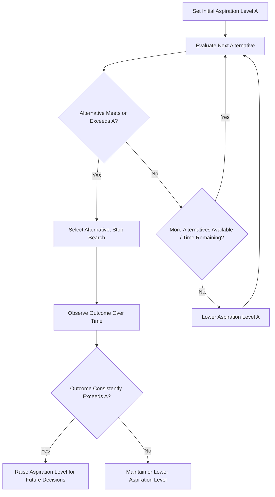

## Bounded Rationality and Satisficing Behavior

### Definitional Foundation

Bounded rationality, a concept developed by Herbert Simon, describes decision-making under realistic constraints on cognitive capacity, available information, and time — in contrast to the neoclassical assumption of unbounded rationality, where economic agents are assumed to costlessly process all available information and select the objectively optimal choice from a fully known set of alternatives.

Formally, standard rational choice theory assumes an agent solves:

$$\max_{x \in X} U(x)$$

where the full choice set $X$ and utility function $U$ are known with certainty and processed without cost. Bounded rationality instead recognizes three binding real-world constraints:

1. **Limited information**: Agents rarely know the complete set of alternatives or their consequences
2. **Limited cognitive processing capacity**: Even with full information, agents cannot costlessly compute the optimal choice
3. **Limited time**: Decisions must often be made before exhaustive search and evaluation is possible

### Satisficing: The Behavioral Alternative to Optimizing

Simon's central behavioral proposition is that, given these constraints, decision-makers do not optimize — they **satisfice**: they search sequentially through alternatives until they find one that meets a pre-specified **aspiration level**, then stop searching and choose that option, even if superior alternatives might exist but remain undiscovered.

Formally, satisficing behavior can be represented as: the decision-maker evaluates alternatives $x_1, x_2, \dots$ sequentially and selects the first $x_k$ such that

$$U(x_k) \geq A$$

where $A$ is the aspiration level (a "good enough" threshold), rather than continuing to search for:

$$x^* = \arg\max_{x \in X} U(x)$$

**Key distinction from optimization under a search-cost constraint**: Some economic models treat limited search as itself an optimization problem (optimal stopping theory, where the decision-maker weighs the expected marginal benefit of one more search against its cost). [Inference] Simon's original satisficing concept is distinguished from this "optimal search" reframing by his broader claim that human cognition is not merely constrained but structurally incapable of the kind of exhaustive, consistent utility computation assumed in fully rational choice models — a stronger and more foundational claim than simply adding a search-cost term to an otherwise standard optimization problem, though later economic literature has sometimes modeled satisficing as formally equivalent to optimal stopping under search costs.

### Diagram: Satisficing Search Process (svg_diagram)

<svg xmlns="http://www.w3.org/2000/svg" viewBox="0 0 720 400" font-family="Arial, sans-serif">
<text x="360" y="24" text-anchor="middle" font-size="15" font-weight="bold">Satisficing vs. Optimizing Search (svg_diagram)</text>
<line x1="60" y1="360" x2="680" y2="360" stroke="black" stroke-width="2" />
<text x="690" y="365" font-size="12">Alternatives Evaluated (sequential)</text>
<line x1="60" y1="360" x2="60" y2="60" stroke="black" stroke-width="2" />
<text x="20" y="60" font-size="12">Utility</text>
<line x1="60" y1="150" x2="680" y2="150" stroke="#d62728" stroke-width="2" stroke-dasharray="6" />
<text x="685" y="152" font-size="11" fill="#d62728">Aspiration Level (A)</text>
<circle cx="130" cy="290" r="5" fill="#1f77b4" />
<text x="120" y="315" font-size="10">x1</text>
<circle cx="230" cy="240" r="5" fill="#1f77b4" />
<text x="220" y="265" font-size="10">x2</text>
<circle cx="330" cy="130" r="6" fill="#2ca02c" />
<text x="320" y="115" font-size="10" fill="#2ca02c">x3: meets A → STOP (satisficing choice)</text>
<circle cx="430" cy="90" r="5" fill="gray" fill-opacity="0.5" />
<text x="420" y="75" font-size="9" fill="gray">x4 (undiscovered, possibly better)</text>
<circle cx="530" cy="70" r="5" fill="gray" fill-opacity="0.5" />
<text x="520" y="55" font-size="9" fill="gray">x5 (undiscovered, possibly optimal)</text>
<line x1="330" y1="130" x2="330" y2="360" stroke="#2ca02c" stroke-dasharray="3" />
<text x="335" y="380" font-size="10" fill="#2ca02c">Search stops here</text>
</svg>

### Related Cognitive Mechanisms Supporting Bounded Rationality

**Heuristics**: Simplified mental shortcuts or rules of thumb that reduce cognitive load, allowing quick decisions without exhaustive analysis (e.g., "buy the second-cheapest option" as a simplified quality-price heuristic).

**Framing effects**: Decisions are influenced by how choices are presented, not solely by their objective substance — a departure from the rationality assumption that preferences are stable and representation-independent.

**Anchoring**: Initial reference points (even arbitrary ones) disproportionately influence subsequent judgments and negotiation outcomes.

**Cognitive load and decision fatigue**: [Inference] Experimental and field research suggests decision quality can deteriorate as the cumulative number of decisions made in a period increases, consistent with a resource-depletion model of bounded cognitive capacity, though the robustness and generalizability of specific "ego depletion" findings has been contested in the psychology replication literature.

### Aspiration-Level Adjustment Dynamics

A key behavioral feature of satisficing is that the aspiration level $A$ itself is not fixed — it adapts over time based on experience:

- If search consistently yields alternatives exceeding $A$, the decision-maker tends to *raise* their aspiration level over subsequent decisions
- If search consistently fails to find alternatives meeting $A$, the decision-maker tends to *lower* their aspiration level to make satisficing achievable

This creates a feedback loop distinct from static utility maximization, where the "target" itself is behaviorally determined rather than fixed by an underlying, unchanging utility function.

### Bounded Rationality vs. Full Rationality vs. Irrationality

It is important to distinguish bounded rationality from irrationality. Bounded rationality assumes agents are still **purposeful and adaptive** — they are attempting to make good decisions — but are constrained by real cognitive and informational limits. This differs from models of pure irrationality (systematic errors with no adaptive logic) and from the neoclassical full-rationality benchmark (unconstrained optimization).

| Framework | Information Assumed | Processing Capacity | Decision Rule |
| --- | --- | --- | --- |
| Neoclassical Full Rationality | Complete, costlessly available | Unlimited | Global optimization: $\max U(x)$ |
| Bounded Rationality (Simon) | Incomplete, costly to acquire | Limited | Satisficing: first $x$ with $U(x) \geq A$ |
| Behavioral/Heuristic Models | Variable, often selectively attended to | Limited, systematically biased | Heuristics, framing-dependent choice |

### Organizational and Managerial Applications (Simon's Original Domain)

Simon developed bounded rationality specifically in the context of **organizational decision-making**, not just individual consumer choice, which makes it directly foundational to managerial economics:

**Organizations as satisficing systems**: Firms rarely conduct exhaustive search over all possible strategies, suppliers, hires, or investments. Instead, organizational routines and standard operating procedures function as institutionalized satisficing mechanisms — reducing the cognitive burden of re-deriving optimal decisions from scratch for every recurring problem.

**Administrative behavior and hierarchy**: Bounded rationality is a core justification for hierarchical organizational structures — decomposing complex problems into smaller, more tractable sub-decisions delegated to different organizational units, since no single decision-maker (or even a top management team) can process the full complexity of a large organization's decision space.

**Incrementalism in strategic decision-making**: [Inference] Bounded rationality is frequently cited as underlying support for incremental, adaptive strategic planning approaches (in contrast to comprehensive, exhaustive strategic planning models), on the reasoning that large-scale exhaustive strategic analysis exceeds realistic organizational information-processing capacity — a view associated with related organizational theorists such as Charles Lindblom ("the science of muddling through"), building on Simon's foundational insight.

### Managerial Implications

**Hiring and Recruitment Decisions**

- Hiring managers rarely interview an exhaustive candidate pool; they satisfice by setting a hiring aspiration level (a threshold combination of qualifications) and selecting the first candidate meeting it, rather than continuing to search indefinitely for a theoretically optimal candidate — a practice directly explainable via satisficing rather than pure optimization, and one which has real cost implications (search costs vs. risk of foregoing better later candidates).
- Managers should be aware that unnecessarily prolonged search (attempting to approximate full optimization) carries its own opportunity costs (delayed hire, candidate withdrawal, search expense), meaning that consciously calibrated satisficing thresholds can be a deliberate and economically sound managerial tool rather than merely a cognitive shortcut to be corrected.

**Vendor and Supplier Selection**

- Procurement processes frequently employ explicit satisficing criteria (minimum quality certifications, maximum price thresholds, minimum reliability track record) rather than exhaustive supplier search, both because exhaustive search is costly and because "good enough" suppliers meeting clear thresholds reduce decision risk and negotiation time.

**Pricing and Product Design Decisions**

- Recognizing that consumers themselves satisfice (rather than exhaustively comparing all product alternatives) has direct implications for marketing and product positioning strategy: making a product easy to identify as meeting a customer's aspiration-level criteria (clear certifications, simplified comparison points, "good enough" framing on key attributes) can be more effective than competing purely on marginal, hard-to-perceive optimization of a single attribute.

**Organizational Design and Delegation**

- Because no individual or team can process the full complexity of large-scale organizational decisions, managers should design decision-rights structures (which decisions are delegated to which organizational level) explicitly around the bounded-rationality insight that decomposition and standard operating procedures are necessary, not merely convenient, for organizational functioning at scale.
- Standard operating procedures and decision heuristics embedded in organizational routines should be periodically reviewed and updated, since satisficing thresholds and heuristics that were once well-calibrated can become outdated as the underlying business or competitive environment changes.

**Strategic Planning Process Design**

- Firms adopting more incremental, adaptive strategic planning cycles (frequent review and adjustment) rather than infrequent, exhaustive comprehensive strategic plans can be understood as a rational organizational response to bounded rationality, reducing the risk of committing to a comprehensively "optimized" plan built on necessarily incomplete information and analysis at the time of planning.

**Risk of Over-Reliance on Satisficing**

- [Inference] A managerial risk of satisficing is that aspiration levels, once set, may not be revisited even as market conditions change, potentially leading organizations to accept persistently suboptimal outcomes (an "OK is good enough" organizational culture) — suggesting managers should periodically stress-test whether existing satisficing thresholds remain appropriate rather than treating them as permanently fixed.

### Key Points

- Bounded rationality (Herbert Simon) describes decision-making under realistic limits on information, cognitive processing capacity, and time, in contrast to the neoclassical assumption of unconstrained optimization.
- Satisficing is the core behavioral decision rule under bounded rationality: searching sequentially until an alternative meeting a pre-set aspiration level is found, then stopping — rather than continuing to search for the theoretically optimal choice.
- Aspiration levels are not fixed; they adjust upward or downward based on the decision-maker's recent search experience, creating an adaptive feedback loop distinct from static utility maximization.
- Simon's original application was organizational: standard operating procedures, hierarchical delegation, and incremental strategic planning are all organizational-level manifestations of bounded rationality, not just individual cognitive limitations.
- Managers can treat calibrated satisficing thresholds as a deliberate, economically sound tool (given real search costs) in hiring, procurement, and product design, while remaining alert to the risk that outdated aspiration levels can entrench suboptimal organizational outcomes over time.

### Related Topics

- Heuristics and biases in managerial decision-making
- Prospect theory and reference-dependent choice
- Organizational routines and standard operating procedures
- Herbert Simon's administrative behavior and decision theory
- Incrementalism and "muddling through" in strategic planning
- Search theory and optimal stopping problems
- Behavioral explanations of hiring and procurement decisions