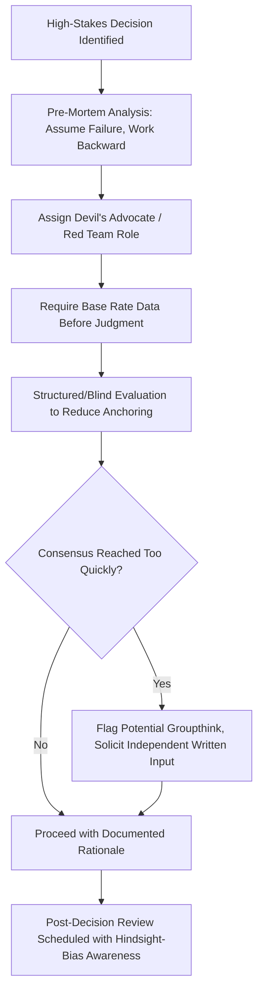

## Heuristics and Cognitive Biases in Business Decisions

### Definitional Foundation

Heuristics are simplified cognitive shortcuts that allow decision-makers to reach judgments quickly with reduced information-processing effort. Cognitive biases are systematic, predictable deviations from normatively rational judgment that arise from the application of these heuristics — the key distinction being that heuristics are often adaptive and useful under time/information constraints, while biases represent the specific error patterns that emerge when heuristics are applied outside conditions where they work well. This framework was substantially developed by Daniel Kahneman and Amos Tversky, building on Herbert Simon's foundational concept of bounded rationality.

### Dual-Process Theory: System 1 and System 2

Kahneman's dual-process framework (popularized in *Thinking, Fast and Slow*) distinguishes two modes of cognitive processing:

**System 1**: Fast, automatic, intuitive, effortless, operates largely below conscious awareness. Generates most heuristic-based judgments.

**System 2**: Slow, deliberate, effortful, consciously controlled. Capable of overriding System 1 outputs but requires cognitive resources and is used sparingly due to its higher processing cost.

[Inference] Most business decisions — even those managers believe are carefully deliberated — are substantially influenced by System 1 processing, since System 2 engagement is cognitively costly and is often only selectively applied to check or override initial intuitive judgments rather than replacing them entirely.

### The Core Heuristics (Tversky and Kahneman's Original Framework)

**1. Availability Heuristic**

Judging the probability or frequency of an event based on how easily relevant instances come to mind, rather than on actual statistical frequency.

**Business manifestation**: Managers may overestimate the risk of a recent, vivid supply-chain disruption recurring, while underestimating the risk of less memorable but statistically more probable operational failures — leading to risk management resources being misallocated toward recently salient rather than genuinely high-probability threats.

**2. Representativeness Heuristic**

Judging the probability that an object or person belongs to a category based on how similar it is to a typical/stereotypical member of that category, often while neglecting relevant base rates.

**Business manifestation**: Assuming a startup "looks like" a previous successful investment (similar founder profile, similar pitch style) and is therefore likely to succeed, without adequately weighting the base rate of startup failure across the category as a whole.

**3. Anchoring and Adjustment Heuristic**

Final judgments are disproportionately influenced by an initial reference point (the "anchor"), even when that anchor is arbitrary or irrelevant, with insufficient adjustment away from it.

**Business manifestation**: Initial price quotes, first salary offers in negotiation, and initial budget proposals disproportionately shape final outcomes, since counter-offers and adjustments tend to be insufficiently distant from the anchor.

### Diagram: Anchoring Effect on Negotiation Outcomes (svg_diagram)

<svg xmlns="http://www.w3.org/2000/svg" viewBox="0 0 720 320" font-family="Arial, sans-serif">
<text x="360" y="24" text-anchor="middle" font-size="15" font-weight="bold">Anchoring Effect in Price Negotiation (svg_diagram)</text>
<line x1="80" y1="270" x2="640" y2="270" stroke="black" stroke-width="2" />
<text x="650" y="275" font-size="12">Price</text>
<line x1="200" y1="260" x2="200" y2="80" stroke="#d62728" stroke-width="2" />
<circle cx="200" cy="80" r="5" fill="#d62728" />
<text x="150" y="70" font-size="11" fill="#d62728">High Anchor Offer</text>
<text x="150" y="290" font-size="10">Scenario A</text>
<line x1="220" y1="260" x2="220" y2="130" stroke="#d62728" stroke-dasharray="4" />
<circle cx="220" cy="130" r="5" fill="#2ca02c" />
<text x="225" y="128" font-size="10" fill="#2ca02c">Final agreed price (pulled up)</text>
<line x1="450" y1="260" x2="450" y2="200" stroke="#1f77b4" stroke-width="2" />
<circle cx="450" cy="200" r="5" fill="#1f77b4" />
<text x="410" y="190" font-size="11" fill="#1f77b4">Low Anchor Offer</text>
<text x="410" y="290" font-size="10">Scenario B</text>
<line x1="470" y1="260" x2="470" y2="225" stroke="#1f77b4" stroke-dasharray="4" />
<circle cx="470" cy="225" r="5" fill="#2ca02c" />
<text x="475" y="223" font-size="10" fill="#2ca02c">Final agreed price (pulled down)</text>
</svg>

### Additional Key Biases Relevant to Managerial Decisions

**Overconfidence Bias**: Systematic overestimation of the accuracy of one's own judgments, forecasts, and abilities relative to actual outcomes. [Inference] Overconfidence is one of the most consistently replicated findings in behavioral decision research and has been extensively documented in managerial forecasting and M&A contexts specifically, though the precise magnitude varies across studies and populations.

**Confirmation Bias**: The tendency to seek out, interpret, and recall information in ways that confirm pre-existing beliefs, while discounting disconfirming evidence.

**Sunk Cost Fallacy**: Continuing to invest in a decision based on the cumulative resources already committed (which are, by definition, unrecoverable) rather than on the forward-looking marginal costs and benefits of continuing versus stopping. Formally, rational decision theory dictates that only future costs and benefits should influence a go/no-go decision:

$$\text{Continue if: } E[\text{Future Benefit}] > E[\text{Future Cost}]$$

with prior sunk costs $S$ correctly excluded from this comparison, yet decision-makers systematically allow $S$ to influence the decision.

**Loss Aversion**: Losses are weighted more heavily in decision-making than equivalently sized gains — a core component of prospect theory (Kahneman and Tversky, 1979), typically characterized by a loss-aversion coefficient $\lambda > 1$ in value functions of the form:

$$v(x) = \begin{cases} x^{\alpha} & x \geq 0 \\ -\lambda(-x)^{\beta} & x < 0 \end{cases}$$

**Status Quo Bias**: A preference for maintaining current conditions or decisions over switching to alternatives, even when switching would be objectively beneficial, often related to loss aversion (framing a change as a potential loss relative to the reference point of the status quo).

**Planning Fallacy**: Systematic underestimation of the time, costs, and risks of future projects while overestimating the benefits, frequently documented in large capital projects and product launch timelines.

**Groupthink**: A group-level (not purely individual-cognitive) bias in which the desire for consensus and cohesion within a decision-making group suppresses critical evaluation of alternatives, dissenting views, and realistic appraisal of risks.

**Hindsight Bias**: After an outcome is known, the tendency to perceive it as having been more predictable beforehand than it actually was — which can distort post-mortem evaluations of past decisions and lead to inappropriately harsh (or lenient) evaluation of decision-makers' original judgment quality.

### Comparative Summary Table

| Bias | Core Mechanism | Typical Business Context |
| --- | --- | --- |
| Availability | Recall ease substitutes for true frequency | Risk assessment, insurance/hedging decisions |
| Representativeness | Similarity substitutes for base-rate probability | Hiring, investment screening, forecasting |
| Anchoring | Initial reference point under-adjusted | Negotiation, budgeting, pricing |
| Overconfidence | Systematic overestimation of judgment accuracy | Forecasting, M&A valuation, project timelines |
| Confirmation Bias | Selective information search/interpretation | Strategic planning, due diligence |
| Sunk Cost Fallacy | Backward-looking costs influence forward decisions | Project continuation, R&D investment |
| Loss Aversion | Losses weighted more than equivalent gains | Pricing, compensation design, risk-taking |
| Status Quo Bias | Default/current state disproportionately preferred | Organizational change management, vendor switching |
| Planning Fallacy | Systematic optimism bias in project estimation | Capital budgeting, product launch timelines |
| Groupthink | Consensus pressure suppresses dissent | Board decisions, executive team strategy sessions |
| Hindsight Bias | Past outcomes seen as more predictable than they were | Post-mortem reviews, performance evaluation |

### Process Flow: Debiasing Intervention in Organizational Decision-Making

### Debiasing Strategies for Organizations

**Pre-Mortem Analysis**: Before finalizing a decision, the team imagines the decision has already failed and works backward to identify plausible causes — this reframing helps surface risks that optimism bias and overconfidence might otherwise suppress.

**Structured Decision Processes**: Requiring explicit base-rate data, independent written judgments before group discussion (to reduce anchoring on the first-stated opinion), and formal devil's advocate roles are standard organizational debiasing mechanisms.

**Reference Class Forecasting**: Rather than estimating a project's timeline/cost from scratch (prone to planning fallacy and optimism bias), basing estimates on the actual historical outcomes of a reference class of similar past projects.

**Blind Evaluation Processes**: Removing identifying information (e.g., candidate names, brand names in product testing) during early evaluation stages to reduce the influence of representativeness-based stereotyping and confirmation bias.

[Inference] While these debiasing techniques have empirical support in reducing specific bias effects under controlled conditions, the durability and generalizability of debiasing interventions across diverse real-world organizational contexts is an active area of ongoing research, and no single technique reliably eliminates bias across all decision types.

### Managerial Implications

**Capital Budgeting and Project Approval**

- The planning fallacy and overconfidence bias together explain the well-documented tendency of large capital projects to run over budget and over schedule; incorporating reference class forecasting and requiring independent third-party review of optimistic projections are standard countermeasures in capital allocation governance.
- Sunk cost fallacy poses a direct risk to project continuation decisions: managers should institutionalize periodic "fresh look" reviews that explicitly exclude prior spending from the continue/stop decision criteria, focusing evaluators only on forward-looking costs and benefits.

**Negotiation Strategy**

- Understanding anchoring effects allows managers to strategically set an initial anchor favorable to their negotiating position (when initiating an offer) while training negotiators to consciously counteract anchoring bias (when responding to a counterparty's opening offer) by independently establishing their own reservation value before hearing any anchor.

**Forecasting and Strategic Planning**

- Sales forecasts, market entry projections, and competitive response predictions are all susceptible to overconfidence and availability bias; building structured forecasting processes (e.g., requiring documented base rates, using multiple independent forecasters, tracking historical forecast accuracy) improves calibration over time.

**Hiring and Performance Evaluation**

- Representativeness heuristic and confirmation bias can distort hiring decisions (favoring candidates who "look like" past successful hires) and performance reviews (interpreting ambiguous performance evidence in ways that confirm a manager's pre-existing opinion of an employee); structured, criteria-based evaluation processes reduce (though do not eliminate) these effects.

**Risk Management and Insurance Decisions**

- Availability bias can lead firms to over-insure against recently experienced, vivid risks (e.g., purchasing extensive cyber insurance immediately following a highly publicized industry breach) while under-insuring against statistically more significant but less salient risks — a pattern managers should actively correct for using quantitative risk assessment rather than relying on recent memorable events.

**Board and Executive Team Dynamics**

- Groupthink risk rises with team cohesion and hierarchical deference to senior executives; formal mechanisms (rotating devil's advocate roles, anonymous pre-meeting written input, external advisors without organizational loyalty pressures) are standard governance responses to this risk in board-level strategic decisions.

**Post-Decision Learning and Organizational Memory**

- Hindsight bias distorts organizational learning from past decisions: post-mortems conducted without documented records of the original pre-decision reasoning and probability estimates tend to unfairly judge past decision-makers by outcomes rather than by the quality of reasoning available at the time the decision was made — good decisions can have bad outcomes due to genuine uncertainty, and this distinction is frequently lost without contemporaneous documentation.

### Key Points

- Heuristics are cognitive shortcuts that are often adaptive under real-world constraints, while cognitive biases are the systematic, predictable errors that emerge when these heuristics are misapplied or applied outside the conditions where they work well.
- Kahneman's dual-process framework (System 1 fast/intuitive, System 2 slow/deliberate) provides the cognitive-architecture foundation for understanding why biases arise and persist even among experienced decision-makers.
- Anchoring, availability, representativeness, overconfidence, sunk cost fallacy, loss aversion, and groupthink are among the most managerially consequential biases, each with distinct organizational manifestations and countermeasures.
- Debiasing techniques (pre-mortems, structured decision processes, reference class forecasting, blind evaluation) have empirical support but do not reliably eliminate bias across all contexts, requiring ongoing organizational vigilance rather than one-time fixes.
- Managers should build institutional processes — not merely rely on individual awareness or willpower — since even highly experienced, intelligent decision-makers remain susceptible to these systematic biases.

### Related Topics

- Prospect theory and reference-dependent choice under risk
- Bounded rationality and satisficing behavior (foundational theory)
- Behavioral game theory and strategic decision-making
- Nudge theory and choice architecture in organizational design
- Groupthink and board governance mechanisms
- Reference class forecasting in capital project management
- Overconfidence in mergers and acquisitions decision-making