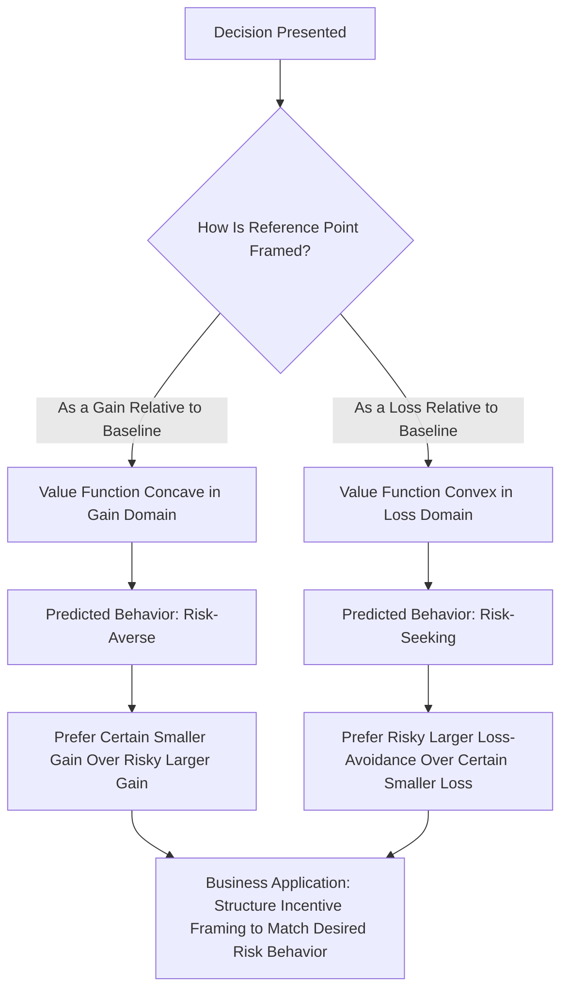

## Prospect Theory and Reference-Dependent Choice

### Definitional Foundation and Historical Context

Prospect theory, developed by Daniel Kahneman and Amos Tversky (1979), is a descriptive model of decision-making under risk that systematically explains observed deviations from expected utility theory, the previously dominant normative model of rational choice under uncertainty. Rather than assuming decision-makers evaluate outcomes based on their final absolute wealth levels (as expected utility theory assumes), prospect theory proposes that people evaluate outcomes as **gains or losses relative to a reference point**, and that the psychological weighting of these gains and losses is asymmetric and non-linear.

### The Three Core Components of Prospect Theory

**1. Reference Dependence**

Outcomes are evaluated relative to a reference point (often, but not always, the status quo) rather than in terms of final wealth states. The same objective outcome can be perceived as a gain or a loss purely depending on how the reference point is framed — this is the foundational departure from expected utility theory, which is reference-independent by construction.

**2. Loss Aversion**

Losses loom larger than equivalently sized gains. The pain of losing a given amount is psychologically more intense than the pleasure of gaining the same amount. This is captured by the loss-aversion coefficient $\lambda$, typically estimated empirically at approximately $\lambda \approx 2$ to $2.5$ [Unverified — specific point estimates vary substantially across studies, populations, and elicitation methods, and should not be treated as a precise universal constant].

**3. Diminishing Sensitivity**

The psychological impact of a given change diminishes as one moves further from the reference point, in both the gain and loss domains — analogous to, but operating symmetrically around, standard diminishing marginal utility. This produces risk-averse behavior in the gain domain and risk-seeking behavior in the loss domain (the reflection effect).

### The Prospect Theory Value Function

$$v(x) = \begin{cases} x^{\alpha} & \text{if } x \geq 0 \text{ (gains)} \\ -\lambda(-x)^{\beta} & \text{if } x < 0 \text{ (losses)} \end{cases}$$

Where:

- $x$ = outcome measured relative to the reference point (positive = gain, negative = loss)
- $\alpha, \beta$ = curvature parameters (typically estimated around 0.88 in the original Kahneman-Tversky specification), both less than 1, producing diminishing sensitivity in both domains
- $\lambda$ = loss-aversion coefficient, greater than 1, producing the steeper slope for losses than gains

### Diagram: The Prospect Theory Value Function (svg_diagram)

<svg xmlns="http://www.w3.org/2000/svg" viewBox="0 0 720 460" font-family="Arial, sans-serif">
<text x="360" y="24" text-anchor="middle" font-size="15" font-weight="bold">Prospect Theory Value Function v(x) (svg_diagram)</text>
<line x1="60" y1="230" x2="680" y2="230" stroke="black" stroke-width="2" />
<text x="690" y="235" font-size="12">x (Gain/Loss)</text>
<line x1="360" y1="420" x2="360" y2="40" stroke="black" stroke-width="2" />
<text x="365" y="40" font-size="12">v(x)</text>
<path d="M 360 230 Q 470 150 680 100" stroke="#2ca02c" stroke-width="3" fill="none" />
<text x="500" y="120" font-size="12" fill="#2ca02c">Gains: concave (risk-averse)</text>
<path d="M 360 230 Q 250 320 60 400" stroke="#d62728" stroke-width="3" fill="none" />
<text x="90" y="380" font-size="12" fill="#d62728">Losses: convex (risk-seeking)</text>

<text x="365" y="250" font-size="11">Reference Point (0)</text>

<circle cx="360" cy="230" r="4" fill="black" />

<line x1="440" y1="230" x2="440" y2="185" stroke="gray" stroke-dasharray="3" />
<line x1="60" y1="230" x2="60" y2="400" stroke="gray" stroke-dasharray="3" />
<text x="150" y="440" font-size="11">Steeper slope for losses than gains illustrates loss aversion (lambda greater than 1)</text>
</svg>

### Probability Weighting Function

A fourth key component (sometimes treated as a separate element from the value function) is that prospect theory replaces objective probabilities $p$ with a **decision weight function** $w(p)$ that systematically distorts probabilities:

$$w(p) \neq p$$

Empirically documented pattern: people tend to **overweight small probabilities** (contributing to the appeal of lottery tickets and low-probability insurance purchases) and **underweight moderate-to-high probabilities** relative to their true objective values, with the weighting function typically exhibiting an inverse-S shape.

### The Reflection Effect: Combining Loss Aversion and Probability Weighting

The classic empirical demonstration involves paired choices:

**Gain domain**: Choose between (A) a certain gain of $3,000, or (B) an 80% chance of $4,000 (and 20% chance of $0). Most subjects choose the certain gain (A) — risk-averse behavior — even though $B$ has higher expected value ($0.8 \times 4000 = 3200 > 3000$).

**Loss domain**: Choose between (C) a certain loss of $3,000, or (D) an 80% chance of losing $4,000 (and 20% chance of losing $0). Most subjects choose the risky option (D) — risk-seeking behavior — reversing the pattern observed in the gain domain, despite the formally identical probability structure.

This reversal (risk-averse for gains, risk-seeking for losses) is precisely what expected utility theory, with its assumption of a single globally concave utility function over final wealth, cannot explain — but which the S-shaped prospect theory value function (concave for gains, convex for losses) predicts directly.

### The Endowment Effect

A well-documented behavioral consequence of loss aversion: individuals demand a substantially higher price to give up (sell) an object they already own than they would be willing to pay to acquire the same object if they did not already own it. Formally:

$$WTA > WTP$$

Where $WTA$ is willingness-to-accept (minimum selling price) and $WTP$ is willingness-to-pay (maximum buying price) for the identical good. This gap is explained by prospect theory as follows: giving up an owned item is coded as a *loss* relative to the reference point of current ownership, while acquiring an item not yet owned is coded as a *gain* — and because losses are weighted more heavily than gains ($\lambda > 1$), the seller's reservation price exceeds the buyer's.

### Process Flow: How Framing Shapes Risk Choices

### Worked Numerical Example: Framing Effect on Employee Bonus Structure

An employer considers two equivalent ways to frame the same $5,000 average compensation adjustment tied to performance, holding expected value constant.

**Frame A ("Bonus Gain" framing)**: Base pay of $95,000, with a bonus of up to $10,000 for hitting performance targets (expected $5,000 if targets are met with 50% probability).

**Frame B ("Loss Avoidance" framing)**: Base pay of $105,000, with a potential clawback of up to $10,000 if performance targets are missed (same expected value: $5,000 expected reduction with 50% probability).

Objectively, both frames have identical expected compensation ($100,000) and identical risk (50% chance of a $10,000 swing). However, prospect theory predicts materially different behavioral responses:

- Frame A codes the variable component as a *gain* relative to the $95,000 reference point — predicting employees will be relatively risk-averse regarding the uncertain bonus, potentially reducing effort/risk-taking below the level needed to reliably hit stretch targets.
- Frame B codes the variable component as a potential *loss* relative to the $105,000 reference point — predicting employees will be more loss-averse and motivated to avoid the clawback, potentially producing higher effort intensity than the objectively equivalent gain-framed bonus, precisely because losses are weighted more heavily than equivalent gains under $\lambda > 1$.

[Inference] While this framing logic follows directly from prospect theory's core predictions and is widely discussed in compensation design literature, the magnitude of behavioral difference between economically equivalent gain- and loss-framed compensation structures in real organizational settings depends on contextual factors (trust in the clawback process, perceived fairness) that are not fully captured by the basic theoretical model alone.

### Comparative Summary: Expected Utility Theory vs. Prospect Theory

| Feature | Expected Utility Theory | Prospect Theory |
| --- | --- | --- |
| Reference point | None (evaluates final wealth states) | Explicit reference point (often status quo) |
| Utility/value function shape | Single, globally concave (risk-averse throughout) | S-shaped: concave for gains, convex for losses |
| Loss treatment | Symmetric with equivalent gains | Losses weighted more heavily ($\lambda > 1$) |
| Probabilities | Used as given (objective) | Transformed via decision weight function $w(p)$ |
| Predicts risk-seeking behavior? | No (assumes universal risk aversion under standard concavity) | Yes, in the loss domain (reflection effect) |
| Explains endowment effect? | No | Yes, directly, via loss aversion |

### Managerial Implications

**Pricing and Promotions Strategy**

- Framing a price as a "loss of a discount" (e.g., "you lose your 20% discount if you don't act by Friday") tends to be more behaviorally motivating than framing the identical price change as a "gain from acting" (e.g., "get 20% off if you act by Friday"), because the former frames inaction as a loss relative to an implied reference point of already having the discount.
- Rebates, cashback offers, and "money-back guarantees" leverage reference-point manipulation: presenting a purchase price with a rebate as a reference point shift can make the net cost feel like a smaller loss than the equivalent lower sticker price framed without a rebate structure, even when the final cost is mathematically identical.

**Compensation and Incentive Design**

- As illustrated above, structuring variable compensation as avoidable losses (clawback/malus structures) relative to a higher nominal reference salary can generate different (often more intense) effort responses than economically equivalent gain-framed bonus structures — a consideration directly relevant to executive compensation and sales incentive plan design.
- Managers should be cautious that loss-framed compensation structures, while potentially more behaviorally powerful, may also generate greater perceived unfairness or anxiety if not carefully communicated, since employees may resent structures perceived as "taking away" earned compensation even when the expected value is unchanged.

**Product Bundling and Endowment Effect Exploitation**

- Free trial periods exploit the endowment effect: once a consumer has "owned" (used) a product or service during a trial period, giving it up at the end of the trial is coded as a loss relative to the newly established reference point of possession, making conversion to paid subscription more likely than if the same product were simply offered for purchase without a trial period.
- Real estate, automotive, and other markets have observed WTA-WTP gaps in seller/buyer negotiations; sales professionals should anticipate that current owners will systematically demand more to part with an asset than a rational, purely forward-looking valuation would suggest.

**Risk Management and Capital Allocation Communication**

- When presenting investment or divestment decisions to boards or investment committees, framing matters: presenting a risky project relative to a reference point where failure is framed as "losing" invested capital (loss domain) may induce more risk-seeking approval behavior than framing the identical decision relative to a reference point emphasizing the safe, certain alternative (gain domain) — managers and analysts preparing capital allocation recommendations should be aware their framing choices can influence committee risk appetite independent of the underlying economics.

**Organizational Change Management**

- Resistance to organizational change (new systems, restructuring, process changes) can be partly explained by loss aversion relative to the status quo reference point: even objectively beneficial changes may be resisted because the certain losses associated with change (learning costs, disrupted routines) are weighted more heavily than the equivalent or larger expected future gains, suggesting change management communication should explicitly address and legitimize the perceived losses rather than focusing solely on future benefits.

**Insurance and Hedging Product Design**

- The overweighting of small probabilities helps explain consumer demand for extended warranties, low-deductible insurance, and other products insuring against low-probability events at prices exceeding their actuarially fair value — a pattern directly predicted by the probability weighting function component of prospect theory, with direct relevance for firms designing and pricing such products.

### Key Points

- Prospect theory replaces expected utility theory's assumption of evaluation over final wealth states with reference-dependent evaluation of gains and losses relative to a reference point, which is typically but not always the status quo.
- Loss aversion (losses weighted roughly twice as heavily as equivalent gains, per common empirical estimates) combined with diminishing sensitivity produces an S-shaped value function: concave (risk-averse) for gains, convex (risk-seeking) for losses.
- The probability weighting function systematically overweights small probabilities and underweights moderate-to-high probabilities, explaining otherwise puzzling patterns in lottery and insurance purchasing behavior.
- The endowment effect (WTA > WTP for identical goods) is a direct, well-documented behavioral consequence of loss aversion applied to the reference point of current ownership.
- Managers can apply reference-point and framing principles deliberately in pricing, compensation design, product trial strategy, and change management communication, while remaining attentive to fairness and trust considerations that can moderate the predicted behavioral effects in real organizational contexts.

### Related Topics

- Heuristics and cognitive biases in business decisions (foundational context)
- The endowment effect and WTA-WTP gap in negotiation and valuation
- Nudge theory and choice architecture
- Mental accounting and behavioral budgeting
- Behavioral explanations of insurance and lottery purchasing
- Executive compensation design and incentive alignment
- Framing effects in marketing and consumer choice