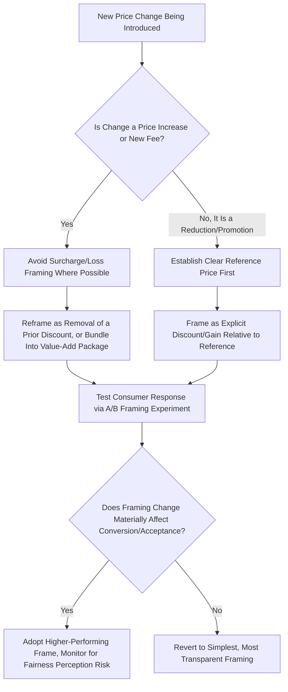

## Loss Aversion and Framing Effects in Pricing and Negotiation

### Definitional Foundation

Loss aversion is the empirical finding that losses are psychologically weighted more heavily than equivalently sized gains, formalized in prospect theory via a loss-aversion coefficient $\lambda > 1$. Framing effects are the related finding that presenting logically/mathematically identical information in different ways (as a gain versus a loss, relative to different reference points) systematically alters choice behavior, even though a fully rational decision-maker's preferences should be invariant to such surface-level presentation differences. Together, these two concepts form one of the most commercially actionable areas of behavioral economics, with direct application to pricing strategy, sales tactics, and negotiation design.

### The Formal Basis: Asymmetric Weighting of Gains and Losses

From the prospect theory value function:

$$v(x) = \begin{cases} x^{\alpha} & x \geq 0 \\ -\lambda(-x)^{\beta} & x < 0 \end{cases}$$

The practical implication for pricing and negotiation is that the same objective dollar amount produces a larger change in subjective value when framed as avoiding a loss than when framed as achieving an equivalent gain:

$$|v(-x)| > |v(x)| \quad \text{for the same } |x|, \text{ since } \lambda > 1$$

This single asymmetry underlies nearly all of the specific pricing and negotiation tactics discussed below.

### Framing Effect Taxonomy for Pricing

**1. Gain Frame vs. Loss Frame (the "Surcharge vs. Discount" Problem)**

A classic, empirically documented pricing framing distinction: a cash discount ("pay with cash and save 3%") versus a credit card surcharge ("pay a 3% surcharge for using credit") are mathematically identical price differentials, but consumers respond more negatively to the surcharge framing because it is coded as a loss relative to the reference price, whereas the discount is coded as a gain relative to that same reference price.

**2. Reference Price Anchoring**

Presenting a "was $150, now $99" comparison establishes an artificial reference point (the "was" price) against which the sale price is coded as a gain (a discount received) rather than being evaluated on its own absolute merits. [Inference] The persuasive power of reference-price anchoring in retail is well documented in marketing and consumer behavior research, though regulatory scrutiny of inflated or fabricated "was" prices exists in multiple jurisdictions specifically because of this framing power's potential for consumer deception.

**3. Bundling and Partitioned Pricing**

Bundling multiple items into a single price can obscure the "loss" associated with any individual high-priced component, since the consumer evaluates the bundle's aggregate value rather than separately coding each component. Conversely, partitioned pricing (base price plus itemized add-on fees, e.g., shipping and handling) can sometimes reduce perceived total cost if the base price serves as the salient reference point and add-ons are evaluated as smaller, separate transactions rather than aggregated into a single larger loss.

### Diagram: Discount vs. Surcharge Framing of an Identical Price Differential (svg_diagram)

<svg xmlns="http://www.w3.org/2000/svg" viewBox="0 0 720 340" font-family="Arial, sans-serif">
<text x="360" y="24" text-anchor="middle" font-size="15" font-weight="bold">Identical Price Gap, Different Frames (svg_diagram)</text>
<rect x="60" y="60" width="280" height="220" fill="#e8f5e9" stroke="#2ca02c" stroke-width="2" />
<text x="200" y="90" text-anchor="middle" font-size="13" font-weight="bold" fill="#2ca02c">Discount Frame</text>
<text x="200" y="120" text-anchor="middle" font-size="11">Reference: Credit Price ($103)</text>
<text x="200" y="145" text-anchor="middle" font-size="11">"Pay cash, save $3"</text>
<text x="200" y="180" text-anchor="middle" font-size="12" fill="#2ca02c">Coded as: GAIN</text>
<text x="200" y="210" text-anchor="middle" font-size="11">Perceived favorably</text>
<text x="200" y="240" text-anchor="middle" font-size="10">v(+3) — smaller magnitude</text>
<rect x="380" y="60" width="280" height="220" fill="#ffebee" stroke="#d62728" stroke-width="2" />
<text x="520" y="90" text-anchor="middle" font-size="13" font-weight="bold" fill="#d62728">Surcharge Frame</text>
<text x="520" y="120" text-anchor="middle" font-size="11">Reference: Cash Price ($100)</text>
<text x="520" y="145" text-anchor="middle" font-size="11">"Pay $3 credit surcharge"</text>
<text x="520" y="180" text-anchor="middle" font-size="12" fill="#d62728">Coded as: LOSS</text>
<text x="520" y="210" text-anchor="middle" font-size="11">Perceived unfavorably</text>
<text x="520" y="240" text-anchor="middle" font-size="10">v(-3) — larger magnitude (lambda &gt; 1)</text>
</svg>

### Framing and Negotiation Tactics

**Concession Framing**

In negotiation, presenting a concession as the negotiator "giving up" something (a loss for the concession-giver, emphasized to the counterparty as a sacrifice) tends to increase the perceived value of that concession to the receiving party, beyond its objective dollar value — because the receiving party implicitly recognizes the counterparty is absorbing a coded loss.

**Multi-Issue Bundling in Negotiation**

Because loss aversion means concessions on issues framed as losses are weighted heavily, skilled negotiators often bundle multiple small concessions together rather than making them sequentially, since sequential losses (even of the identical total magnitude) tend to be experienced as more painful in aggregate than a single bundled loss, per the diminishing-sensitivity property of the value function:

$$v(x_1) + v(x_2) < v(x_1 + x_2) \quad \text{for losses, given diminishing sensitivity (convexity in the loss domain)}$$

This principle (segregating gains, integrating losses) is a direct application of prospect theory's "hedonic editing" framework: because the loss value function is convex, a single larger loss is preferred by the receiver to multiple smaller separate losses of the same total magnitude.

**Reservation Point Framing**

How a negotiator frames their own BATNA (Best Alternative to a Negotiated Agreement) and reservation point affects their own risk tolerance during negotiation: framing the current negotiation as being evaluated relative to a strong outside alternative (gain frame if the deal exceeds that alternative) produces different risk-taking behavior than framing the negotiation relative to a target/aspiration price not yet achieved (loss frame if falling short of the target).

### Process Flow: Applying Framing Principles to a Pricing Decision

### Worked Numerical Example: Segregating Gains vs. Integrating Losses in a Vendor Negotiation

A procurement negotiator is offering a supplier two possible concession packages of identical total value.

**Package A (Integrated single concession)**: One combined price reduction of $50,000 across the full contract.

**Package B (Segregated multiple concessions)**: Five separate concessions of $10,000 each, announced across five negotiation rounds.

Applying the value function with illustrative parameters ($\alpha = 0.88$, using gain-domain curvature since concessions received by the supplier are gains to them):

$$v(50{,}000) = 50{,}000^{0.88} \approx 19{,}498$$

$$5 \times v(10{,}000) = 5 \times 10{,}000^{0.88} \approx 5 \times 4{,}365 = 21{,}825$$

Since $21{,}825 > 19{,}498$, the supplier's aggregate subjective value is higher when the identical $50,000 concession is **segregated** into five smaller gains rather than integrated into one large gain — consistent with prospect theory's prediction that gains should be segregated (presented separately) to maximize perceived value, the mirror image of the "integrate losses" principle discussed above. This suggests the negotiator offering concessions should consider spreading them across multiple rounds/announcements rather than a single lump concession, if maximizing the counterparty's perceived value (for the same total cost) is the objective.

### Comparative Summary Table: Framing Tactics and Their Mechanism

| Tactic | Mechanism | Typical Application |
| --- | --- | --- |
| Discount framing (vs. surcharge) | Codes price differential as gain, not loss | Payment method pricing, promotional pricing |
| Reference price anchoring | Establishes inflated comparison point | Retail "was/now" pricing, MSRP display |
| Bundling losses | Diminishing sensitivity reduces pain of combined loss | Fee restructuring, price increases across multiple products |
| Segregating gains | Diminishing sensitivity increases perceived value of separated gains | Negotiation concessions, phased rebate/reward programs |
| Loss-framed compensation | Loss aversion increases motivational intensity | Sales incentive structures, clawback provisions |
| Free trial / endowment | Ownership reference point makes non-renewal feel like a loss | Subscription services, software licensing |

### Ethical and Regulatory Considerations

[Inference] Because framing tactics can influence consumer and counterparty behavior independent of the underlying economic substance of a transaction, several jurisdictions have introduced disclosure or fairness regulations specifically targeting some of these practices (e.g., rules governing reference-price advertising, credit card surcharge disclosure requirements, "drip pricing" restrictions on partitioned pricing that hides fees until late in a purchase process) — managers should treat regulatory compliance in this area as a distinct, actively evolving consideration rather than assuming any behaviorally effective framing tactic is automatically legally unproblematic across all markets.

### Managerial Implications

**Pricing Communication Design**

- When introducing price increases or new fees, managers should evaluate whether the change can be legitimately framed as the removal of a prior discount/promotional rate (loss of a gain, generally less painful than a newly introduced explicit loss) rather than as a novel surcharge, while remaining within applicable disclosure regulations.
- Reference price displays ("compare at," "regular price," "MSRP") should be used carefully, both because of their genuine framing power and because of growing regulatory and reputational risk associated with reference prices perceived as artificially inflated or fabricated.

**Sales Team Training and Negotiation Playbooks**

- Sales negotiators should be trained to bundle any necessary price concessions into a single presentation rather than offering them incrementally in response to sequential customer pushback, since sequential losses to the seller's own margin (each concession is a "loss" from the seller's initial anchor) may be perceived by the seller's own team as more painful in aggregate, potentially leading to premature concession fatigue or under-optimized negotiation outcomes.
- Conversely, when a negotiator wants to maximize the counterparty's perceived value of concessions being extended to them, segregating (announcing) concessions separately across multiple points in the negotiation, rather than granting them all at once, can increase the counterparty's aggregate subjective valuation of an economically identical concession package.

**Subscription and Renewal Design**

- Free trials and "use before you decide" structures leverage the endowment effect directly: framing non-renewal as a loss of an already-possessed service (rather than framing subscription as a new gain to be acquired) is a standard and effective retention mechanism, though managers should ensure cancellation processes remain genuinely accessible to avoid regulatory risk associated with "dark pattern" retention practices.

**Cross-Functional Consistency**

- Because framing effects can be applied inconsistently across different customer touchpoints (marketing, sales, billing, customer service), managers should establish consistent organizational guidelines on pricing communication framing to avoid consumer confusion or a perception of manipulative inconsistency between, for example, promotional marketing framing and subsequent invoice/billing framing of the same charges.

**International and Cultural Considerations**

- [Inference] While the core loss-aversion asymmetry has been documented across many cultural contexts in the behavioral economics literature, the specific magnitude of framing effects and the social acceptability of certain tactics (e.g., surcharge vs. discount framing, aggressive reference-price anchoring) may vary meaningfully by market and regulatory environment, suggesting multinational firms should validate framing strategies locally rather than assuming uniform applicability of tactics validated in one market.

### Key Points

- Loss aversion ($\lambda > 1$ in the prospect theory value function) means that identical price differentials produce different subjective reactions depending on whether they are framed as a loss (surcharge) or a foregone/obtained gain (discount).
- Reference price anchoring, bundling of losses, and segregation of gains are all direct, actionable applications of the underlying diminishing-sensitivity and loss-aversion properties of the prospect theory value function.
- In negotiation, sequential losses are generally more painful in aggregate than a single bundled loss of equal magnitude, while segregated gains are generally more valued in aggregate than a single integrated gain of equal magnitude — informing how price increases versus concessions should be structured and communicated.
- These framing tactics carry genuine commercial effectiveness but also increasing regulatory and reputational scrutiny in several jurisdictions, particularly regarding reference-price accuracy, fee disclosure, and subscription cancellation practices.
- Managers should apply framing principles deliberately and consistently across pricing, sales, and retention touchpoints, while validating both effectiveness and compliance across different markets and regulatory contexts rather than assuming universal applicability.

### Related Topics

- Prospect theory and reference-dependent choice (foundational theory)
- The endowment effect and WTA-WTP gap
- Behavioral pricing strategies and drip pricing regulation
- Anchoring heuristic in negotiation and price-setting
- Mental accounting and consumer budgeting behavior
- Dark patterns and consumer protection regulation in digital commerce
- Executive and sales compensation incentive design