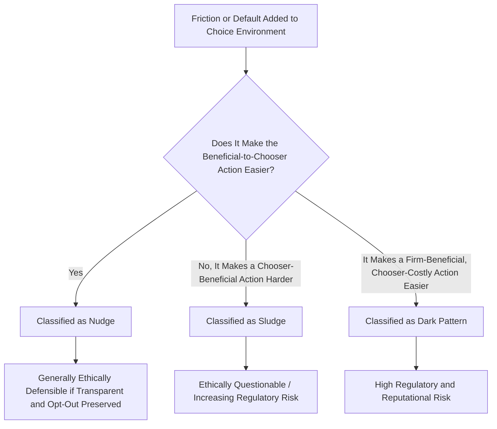

## Nudge Theory and Choice Architecture

### Definitional Foundation

Nudge theory, developed primarily by Richard Thaler and Cass Sunstein (formalized in their 2008 book *Nudge*), describes interventions that alter the environment in which decisions are made — the "choice architecture" — to influence behavior in predictable ways, without restricting options, changing economic incentives, or forbidding any choice. A nudge is defined as any aspect of the choice architecture that alters people's behavior in a predictable way without forbidding any options or significantly changing their economic incentives.

**Choice architecture** refers to the broader design of the environment in which decisions are presented — every context in which a choice is offered has some form of choice architecture (there is no truly "neutral" way to present options), meaning the designer of any decision environment is inevitably influencing outcomes through structural choices, whether or not this influence is intentional.

### Libertarian Paternalism: The Philosophical Framework

Thaler and Sunstein's approach is explicitly framed as **libertarian paternalism**: paternalistic in that choice architects intentionally attempt to steer people toward choices that will improve their welfare (as judged by the people themselves), while remaining libertarian in that no option is eliminated and people retain full freedom to choose differently from the nudged default. This is philosophically distinguished from:

- **Mandates**: Legal requirements removing choice entirely (e.g., mandatory seatbelt laws)
- **Economic incentives**: Taxes or subsidies that change the relative price of options (e.g., a sugar tax)
- **Pure information provision**: Simply providing facts without any structural influence on the default path

A nudge sits distinctly in the space of structural, non-coercive, non-price-based behavioral influence.

### Core Nudge Mechanisms

**1. Default Options (Status Quo Framing)**

Because of status quo bias and the cognitive/effort cost of actively opting out, setting a particular option as the default dramatically increases the proportion of people who end up with that option, even when opting out is costless and simple.

**Canonical example — retirement savings**: [Inference] Employer-sponsored retirement plan enrollment rates have been extensively documented in behavioral economics research to be substantially higher under automatic-enrollment-with-opt-out designs compared to voluntary opt-in designs, even though the actual economic choice available to employees is identical in both cases — this default effect is one of the most robustly replicated findings underlying the nudge literature and has directly informed pension policy reform in multiple countries.

**2. Simplification and Reduced Friction**

Reducing the number of steps, amount of information processing, or cognitive effort required to take a particular action increases the likelihood of that action being taken — independent of any change in the underlying incentive to act.

**3. Social Norm Feedback**

Providing information about what most other people do (descriptive social norms) tends to move individual behavior toward that norm. Widely used in energy conservation programs (comparing a household's energy use to neighborhood averages) and tax compliance messaging.

**4. Salience and Framing**

Making certain information or options more visually or cognitively prominent increases the likelihood they are considered and chosen, leveraging the availability heuristic and attention-based decision processes.

**5. Precommitment Devices**

Structural mechanisms that allow individuals to lock in future behavior in advance, at a point when self-control and long-term interest are more salient, to counteract present bias and self-control problems at the moment of temptation (e.g., automatic escalation of retirement savings contributions tied to future salary increases, "Save More Tomorrow" programs).

### Diagram: Choice Architecture Decision Tree for a Nudge Intervention (svg_diagram)

<svg xmlns="http://www.w3.org/2000/svg" viewBox="0 0 720 420" font-family="Arial, sans-serif">
<text x="360" y="24" text-anchor="middle" font-size="15" font-weight="bold">Anatomy of a Nudge Intervention (svg_diagram)</text>
<rect x="60" y="60" width="600" height="60" fill="#e3f2fd" stroke="#1565c0" stroke-width="2" />
<text x="360" y="95" text-anchor="middle" font-size="13">Target Behavior Identified (e.g., low retirement savings enrollment)</text>
<rect x="60" y="150" width="280" height="80" fill="#e8f5e9" stroke="#2e7d32" stroke-width="2" />
<text x="200" y="180" text-anchor="middle" font-size="12" font-weight="bold">Nudge Approach</text>
<text x="200" y="200" text-anchor="middle" font-size="10">Change default enrollment,</text>
<text x="200" y="215" text-anchor="middle" font-size="10">preserve full opt-out choice</text>
<rect x="380" y="150" width="280" height="80" fill="#fff3e0" stroke="#e65100" stroke-width="2" />
<text x="520" y="180" text-anchor="middle" font-size="12" font-weight="bold">Non-Nudge Alternatives</text>
<text x="520" y="200" text-anchor="middle" font-size="10">Mandate (no choice) OR</text>
<text x="520" y="215" text-anchor="middle" font-size="10">Tax incentive (price change)</text>
<rect x="60" y="280" width="280" height="100" fill="#f3e5f5" stroke="#6a1b9a" stroke-width="2" />
<text x="200" y="305" text-anchor="middle" font-size="11" font-weight="bold">Test via Randomized Trial</text>
<text x="200" y="325" text-anchor="middle" font-size="10">A/B test default vs. opt-in</text>
<text x="200" y="345" text-anchor="middle" font-size="10">Measure enrollment rate change</text>
<text x="200" y="365" text-anchor="middle" font-size="10">Verify no hidden coercion</text>
<line x1="200" y1="230" x2="200" y2="280" stroke="black" stroke-width="1" />
</svg>

### The GAIN Framework and Ethical Design Principles

Thaler and Sunstein propose that nudges should generally satisfy certain design principles to remain ethically defensible:

- **Transparency**: The nudge should not be hidden or deceptive; ideally, it should function even when the target is fully aware of its existence and mechanism
- **Easy opt-out**: The alternative path must remain genuinely accessible, not merely nominally available while practically obstructed
- **Alignment with the chooser's own welfare**: The nudge should move behavior toward what the individual would choose with full information and self-control, not toward outcomes that primarily benefit the choice architect at the chooser's expense

**Sludge**: A related concept (introduced by Thaler in later work) referring to the mirror-image phenomenon — friction deliberately added to make a desired action (e.g., cancelling a subscription, filing a rebate claim) more difficult, exploiting the same behavioral mechanisms as nudges but for outcomes that benefit the choice architect rather than the chooser. Sludge is increasingly the subject of regulatory attention (e.g., rules requiring subscription cancellation to be no more difficult than sign-up).

### Process Flow: Nudge vs. Sludge Distinction

### Worked Numerical Illustration: Default Effect Magnitude

Suppose a company redesigns its 401(k)-equivalent retirement plan enrollment from opt-in to automatic-enrollment-with-opt-out, with all other plan terms unchanged.

Under the opt-in system: enrollment rate = 40% of eligible employees.

Under automatic enrollment with opt-out: enrollment rate = 85% of eligible employees.

$$\Delta \text{Enrollment} = 85\% - 40\% = 45 \text{ percentage points}$$

This magnitude of change — achieved purely through a change in the default option, with the underlying economic terms of the retirement plan completely unchanged — illustrates why default-setting is considered one of the most powerful and cost-effective tools in the choice architecture toolkit. [Inference] These specific percentages are illustrative rather than drawn from a single universal study; actual magnitudes vary by plan design, employee demographics, and default contribution rate chosen, but directionally large default effects of this general character are a well-established empirical pattern in the retirement savings literature.

### Comparative Summary Table: Nudge Mechanisms and Applications

| Mechanism | Underlying Bias Exploited | Common Business/Policy Application |
| --- | --- | --- |
| Default options | Status quo bias, effort aversion | Retirement auto-enrollment, opt-out organ donation, default subscription tiers |
| Simplification | Cognitive load, decision fatigue | Streamlined checkout flows, simplified benefit enrollment forms |
| Social norm feedback | Conformity, social proof | Energy usage comparison reports, tax compliance letters |
| Salience/framing | Availability heuristic, attention limits | Product placement, calorie labeling, warning label design |
| Precommitment devices | Present bias, self-control problems | Automatic savings escalation, commitment-based fitness apps |

### Managerial Implications

**Employee Benefits and HR Program Design**

- HR managers designing retirement, health insurance, and other elective benefit programs should treat default option selection as a primary design lever, not an afterthought, given the substantial and well-documented magnitude of default effects on enrollment outcomes.
- Automatic enrollment with a reasonable default contribution/coverage level, combined with a genuinely simple opt-out process, can materially improve employee financial and health outcomes at minimal direct cost to the organization, functioning as a low-cost complement to (not a substitute for) direct financial education efforts.

**Digital Product and UX Design**

- Product and UX teams should be deliberate about default settings (e.g., default privacy settings, default subscription tiers, default notification preferences), recognizing that whatever is chosen as the default will disproportionately determine actual user outcomes regardless of the theoretical availability of alternative settings.
- Firms should distinguish internally between nudges (defaults and friction reductions that align with genuine user benefit) and sludge/dark patterns (friction deliberately added to obstruct actions that benefit the user but cost the firm, such as subscription cancellation), given both the ethical distinction and the escalating regulatory risk associated with the latter category in multiple jurisdictions.

**Sustainability and Corporate Social Responsibility Programs**

- Choice architecture tools (default settings for double-sided printing, default sustainable shipping options, opt-out rather than opt-in for paperless billing) are commonly used corporate mechanisms to shift employee and customer behavior toward sustainability goals at low direct cost, leveraging the same default-effect logic documented in retirement savings contexts.

**Marketing and Customer Communication**

- Social norm messaging (e.g., "90% of customers in your area chose the eco-friendly option") can be an effective, low-cost behavioral lever in marketing communications, though managers should ensure any stated norm claims are factually accurate, given both ethical considerations and consumer protection regulations around truthful advertising.

**Regulatory Compliance and Consumer Protection Risk Management**

- Given the growing regulatory focus on "sludge" and dark patterns (particularly in subscription services, data privacy consent flows, and financial product enrollment), managers should proactively audit customer-facing choice architecture for asymmetric friction (easy sign-up, difficult cancellation) that could expose the firm to regulatory action or reputational damage, treating symmetry of friction as a compliance-relevant design principle rather than purely a UX consideration.

**Internal Organizational Nudges**

- Beyond customer-facing applications, choice architecture principles can be applied internally: default settings in expense reporting systems, project management tool configurations, or internal training enrollment can nudge employee behavior toward organizationally beneficial norms (compliance training completion, expense policy adherence) without mandating specific behavior through hard rules.

### Key Points

- Nudge theory describes non-coercive, choice-preserving interventions in the structure of a decision environment (choice architecture) that predictably influence behavior without restricting options or substantially changing economic incentives.
- Libertarian paternalism is the philosophical framework underlying nudges: paternalistic in intent (steering toward improved welfare as judged by the individual) while remaining libertarian in preserving full freedom to choose otherwise.
- Default options are empirically one of the most powerful nudge mechanisms, given status quo bias and the effort cost of active opt-out, with well-documented large effects in contexts like retirement plan enrollment.
- "Sludge" is the ethically distinct mirror-image concept — friction deliberately added to obstruct chooser-beneficial actions for the choice architect's benefit — and is increasingly subject to regulatory scrutiny, particularly around subscription cancellation and consent flows.
- Managers can apply nudge principles cost-effectively across HR benefits design, digital product UX, sustainability programs, and internal organizational processes, while treating the nudge/sludge/dark-pattern distinction as a live compliance and reputational risk consideration, not merely an academic one.

### Related Topics

- Prospect theory and reference-dependent choice (foundational theory)
- Heuristics and cognitive biases in business decisions
- Status quo bias and default effects in benefits enrollment
- Dark patterns and consumer protection regulation in digital commerce
- Behavioral public policy and government "nudge units"
- Present bias, self-control, and precommitment devices
- Social proof and norm-based marketing strategies