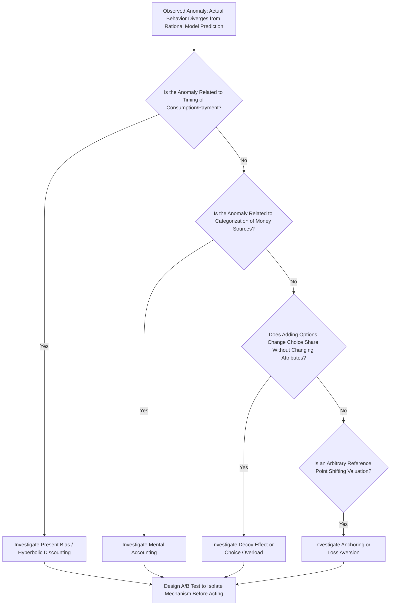

## Behavioral Biases in Consumer Decision Making

### Definitional Foundation

Behavioral biases in consumer decision making refer to the systematic, predictable deviations of actual consumer choice behavior from the predictions of the standard rational choice model, in which consumers are assumed to have stable, well-defined preferences and to make utility-maximizing decisions given a budget constraint. Behavioral economics identifies specific, recurring patterns of deviation — many rooted in the heuristics, prospect theory, and bounded rationality frameworks covered elsewhere in this chapter — that manifest specifically in the consumer purchasing context. This topic synthesizes and applies those foundational concepts directly to the mechanics of consumer choice.

### Mental Accounting

Developed by Richard Thaler, mental accounting describes the cognitive process by which people categorize, budget, and evaluate financial outcomes into separate mental "accounts," rather than treating money as fully fungible as standard economic theory assumes.

**Formal violation of fungibility**: Standard economic theory assumes money is fungible — a dollar is a dollar regardless of its source or intended use:

$$U(\text{total wealth } W) = U(w_1 + w_2 + \dots + w_n)$$

Mental accounting instead treats separate "pots" of money as psychologically distinct, even when this has no bearing on the household's actual aggregate budget constraint:

$$U(w_1) + U(w_2) + \dots \neq U(w_1 + w_2 + \dots)$$

**Consumer manifestations:**

- Treating a tax refund or work bonus as "found money" to be spent on discretionary/luxury items, rather than integrating it into the general household budget or allocating it toward debt repayment (even when the latter would be objectively wealth-maximizing given typical debt interest rates)
- Maintaining a "vacation fund" or "gift budget" as a mentally separate account that is not raided even when other categories of spending face genuine financial pressure
- Being more willing to spend a windfall gain than an equivalent amount of "regular" income, despite both increasing total wealth identically

### Diagram: Mental Accounting vs. Fungible Money (svg_diagram)

<svg xmlns="http://www.w3.org/2000/svg" viewBox="0 0 720 340" font-family="Arial, sans-serif">
<text x="360" y="24" text-anchor="middle" font-size="15" font-weight="bold">Mental Accounts vs. Standard Fungibility (svg_diagram)</text>

<text x="180" y="60" text-anchor="middle" font-size="13" font-weight="bold">Standard Economic Model</text>

<rect x="60" y="80" width="240" height="100" fill="`#e3f2fd`" stroke="`#1565c0`" stroke-width="2" />

<text x="180" y="120" text-anchor="middle" font-size="12">Single Unified Budget</text>

<text x="180" y="145" text-anchor="middle" font-size="11">All income fully fungible</text>

<text x="180" y="165" text-anchor="middle" font-size="11">across any spending category</text>

<text x="540" y="60" text-anchor="middle" font-size="13" font-weight="bold">Mental Accounting Model</text>

<rect x="420" y="80" width="100" height="55" fill="`#c8e6c9`" stroke="`#2e7d32`" stroke-width="1.5" />

<text x="470" y="112" text-anchor="middle" font-size="10">Windfall/</text>

<text x="470" y="125" text-anchor="middle" font-size="10">Bonus</text>

<rect x="420" y="145" width="100" height="55" fill="`#ffe0b2`" stroke="`#e65100`" stroke-width="1.5" />

<text x="470" y="177" text-anchor="middle" font-size="10">Regular</text>

<text x="470" y="190" text-anchor="middle" font-size="10">Salary</text>

<rect x="540" y="80" width="100" height="55" fill="`#e1bee7`" stroke="`#6a1b9a`" stroke-width="1.5" />

<text x="590" y="112" text-anchor="middle" font-size="10">Vacation</text>

<text x="590" y="125" text-anchor="middle" font-size="10">Fund</text>

<rect x="540" y="145" width="100" height="55" fill="`#ffcdd2`" stroke="`#c62828`" stroke-width="1.5" />

<text x="590" y="177" text-anchor="middle" font-size="10">Debt</text>

<text x="590" y="190" text-anchor="middle" font-size="10">Payment</text>

<text x="540" y="230" text-anchor="middle" font-size="10">Each treated as psychologically</text>

<text x="540" y="245" text-anchor="middle" font-size="10">separate, non-transferable pots</text>

</svg>

### Present Bias and Hyperbolic Discounting

Standard intertemporal choice models assume exponential discounting, where the discount factor between any two adjacent time periods is constant:

$$U = \sum_{t=0}^{T} \delta^t u(c_t), \quad \delta \in (0,1) \text{ constant}$$

Empirical consumer behavior instead often exhibits **present bias**, better modeled by hyperbolic (or quasi-hyperbolic, "beta-delta") discounting, which places disproportionately heavy weight on immediate consumption relative to any future period, with the relative weighting of two future periods being much closer to time-consistent:

$$U = u(c_0) + \beta \sum_{t=1}^{T} \delta^t u(c_t), \quad \beta < 1$$

The $\beta$ parameter captures the extra discount applied specifically to the "present versus any future" comparison, producing the empirically observed pattern of **preference reversal**: a consumer may prefer $100 today over $110 in one week (impatience dominates at short horizons), yet prefer $110 in 53 weeks over $100 in 52 weeks (patience dominates once both options are in the future) — a reversal that constant exponential discounting cannot generate, since it implies stable relative preferences regardless of when in absolute time the comparison is evaluated.

**Consumer manifestations**: Under-saving for retirement, impulse purchases, subscription services retained despite low ongoing usage (present bias means the effort of canceling now is weighted more heavily than the accumulating future cost), gym membership overpayment relative to actual attendance patterns.

### Choice Overload

[Inference] A body of research beginning with the influential "jam study" (Iyengar and Lepper, 2000) suggests that, under certain conditions, increasing the number of options presented to consumers can reduce both the likelihood of purchase and post-purchase satisfaction, contrary to the standard economic assumption that more choice (weakly) increases consumer welfare by expanding the feasible set. However, subsequent replication attempts have produced mixed results, and the choice-overload effect appears to depend substantially on contextual moderating factors (the difficulty of comparing options, the consumer's existing preference clarity, time pressure, and the presence of decision aids) rather than being a universal phenomenon across all product categories and choice-set sizes.

### Decoy Effect (Asymmetric Dominance)

Adding a third option to a two-option choice set — one that is clearly inferior to one existing option but not directly comparable to the other — can shift consumer preference toward the option that dominates the decoy, even though the decoy itself is never chosen. This directly violates the rational choice axiom of **independence of irrelevant alternatives**, which requires that the relative preference between two original options should not be affected by the introduction of a third, non-chosen option.

**Classic business application**: A subscription pricing page offering (A) Digital-only at $59, (B) Print-only at $125, and (C) Digital+Print at $125 — where option B is a decoy that makes option C appear to offer overwhelming value (same price as the decoy, but with added digital access), shifting consumer choice toward C relative to a two-option menu containing only A and C.

### Comparative Summary Table

| Bias | Core Deviation from Rational Choice | Typical Consumer Manifestation |
| --- | --- | --- |
| Mental Accounting | Treats money as non-fungible across "accounts" | Windfall spending, category-specific budgets |
| Present Bias / Hyperbolic Discounting | Disproportionate weight on immediate consumption | Under-saving, impulse buying, subscription inertia |
| Choice Overload | More options can reduce (not increase) satisfaction/purchase likelihood, context-dependent | Analysis paralysis in large product catalogs |
| Decoy Effect | Violates independence of irrelevant alternatives | Three-tier pricing menus, asymmetric product bundling |
| Anchoring (see also Heuristics topic) | Initial reference point disproportionately shapes valuation | "Was/now" pricing, initial price exposure effects |
| Loss Aversion (see also Prospect Theory topic) | Losses weighted more than equivalent gains | Free trial retention, rebate/cashback appeal |

### Process Flow: Diagnosing a Consumer Behavioral Bias in a Purchase Funnel

### Worked Numerical Example: Present Bias and Subscription Retention

A consumer subscribes to a streaming service for $15/month. Under exponential discounting with $\delta = 0.99$ monthly, the present value of continuing an unused subscription for 12 more months (with a monthly "hassle cost" of canceling perceived as equivalent to $5) would be evaluated consistently across time.

Under quasi-hyperbolic discounting with $\beta = 0.7, \delta = 0.99$:

$$\text{Perceived cost of canceling "now"} = 5 \text{ (undiscounted, immediate)}$$

$$\text{Perceived value of savings starting "next month"} = \beta \times \delta \times 15 = 0.7 \times 0.99 \times 15 \approx 10.40$$

Even though $10.40 in avoided cost next month objectively exceeds the $5 immediate hassle cost of canceling, the consumer may still fail to cancel in any given month because the $\beta$ discount specifically shrinks the weight placed on the future savings relative to the immediate, undiscounted hassle — and critically, this same comparison recurs unresolved in every subsequent month, since the "present versus one month ahead" comparison is evaluated afresh each period rather than being committed to once. This is the standard behavioral explanation offered in the literature on subscription "zombie" retention: services retained well past the point of any genuine ongoing consumer value.

### Managerial Implications

**Product Bundling and Tiered Pricing Design**

- Managers designing multi-tier pricing menus can deliberately introduce a decoy tier to shift consumer preference toward a target (typically higher-margin) tier, though this practice carries some reputational risk if consumers perceive the pricing structure as manipulative once the mechanism becomes apparent or widely discussed.
- Choice set size should be calibrated to the specific product category and consumer context; while offering more variants can seem strictly beneficial to revenue by capturing more of the market's heterogeneous preferences, excessive choice can in some contexts reduce conversion — managers should test rather than assume that "more SKUs/options" uniformly improves outcomes.

**Subscription Business Model Design**

- Present bias directly explains a substantial share of subscription revenue retained from consumers with low ongoing usage; while this can be commercially advantageous in the short run, managers should weigh the reputational and regulatory risk (given increasing "sludge" and dark-pattern scrutiny discussed under Nudge Theory) of retention strategies that rely heavily on present-bias-driven inertia rather than genuine ongoing value delivery.
- Structuring cancellation as a low-friction process, paired with clear usage reminders, can be a deliberate strategic choice for firms prioritizing long-term brand trust and regulatory compliance over short-term inertia-driven retention revenue.

**Marketing and Windfall-Targeted Promotions**

- Recognizing mental accounting effects, marketers can time promotional campaigns around common windfall periods (tax refund season, annual bonus periods) when consumers are more willing to allocate funds to discretionary "found money" categories, potentially increasing responsiveness to premium or luxury product marketing during these windows relative to regular pay-cycle periods.

**Financial Product and Savings Program Design**

- Present bias has direct implications for financial services product design: automatic savings escalation programs (tying future contribution increases to future salary increases, so the "cost" is always in the future when future gains are also present) exploit the same present-bias mechanic to increase savings rates without requiring immediate, painful behavior change — mirroring the precommitment device concept discussed under Nudge Theory.

**Retail Assortment and Category Management**

- Category managers should be attentive to choice-overload risk specifically in categories with high attribute complexity and low consumer expertise (e.g., financial products, technical equipment, wine), where structured decision aids, curated "best for X" recommendations, or reduced default assortments may improve both conversion and post-purchase satisfaction relative to maximal product variety.

### Key Points

- Consumer behavioral biases represent systematic, predictable deviations from the rational choice model, many of which extend the heuristics, prospect theory, and bounded rationality frameworks into the specific context of purchasing decisions.
- Mental accounting violates the fungibility assumption of standard economics, leading consumers to treat money differently based on its source or designated "account" even when this has no bearing on the household's actual budget constraint.
- Present bias (quasi-hyperbolic discounting) explains the empirically observed preference-reversal pattern between near-term and distant intertemporal trade-offs, and is a leading explanation for under-saving and subscription retention despite low usage.
- The decoy effect demonstrates a direct, well-documented violation of the independence-of-irrelevant-alternatives axiom, with significant practical application in tiered pricing menu design.
- Managers can apply these consumer bias frameworks to pricing menu design, subscription retention strategy, and promotional timing, while weighing the growing reputational and regulatory scrutiny associated with tactics that rely on exploiting rather than genuinely serving consumer interests.

### Related Topics

- Prospect theory and reference-dependent choice
- Heuristics and cognitive biases in business decisions
- Nudge theory and choice architecture
- Loss aversion and framing effects in pricing and negotiation
- Intertemporal choice and hyperbolic discounting in household finance
- Dark patterns and consumer protection regulation
- Behavioral segmentation in marketing strategy