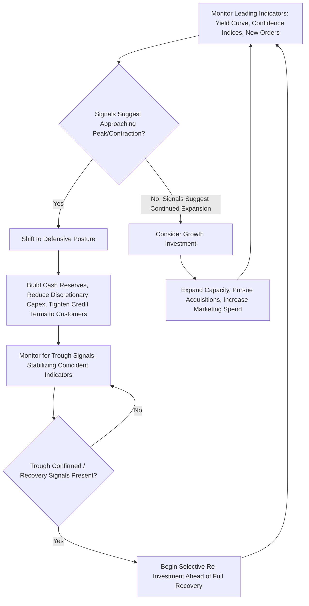

## Business Cycles and Their Impact on Managerial Decisions

### Definitional Foundation

A business cycle refers to the recurring, though irregular, fluctuation of aggregate economic activity around its long-run trend growth path, typically measured through real GDP, employment, industrial production, and income. Business cycles are not perfectly periodic (unlike a fixed mathematical cycle) but do exhibit recognizable, recurring phases, which is why they are studied as a distinct macroeconomic phenomenon rather than treated as pure random noise around trend.

### The Four Phases of the Business Cycle

**1. Expansion (Recovery/Growth)**: Real GDP, employment, and income rise; capacity utilization increases; consumer and business confidence improve; typically accompanied by rising investment and, in later stages, rising inflationary pressure as the economy approaches full capacity.

**2. Peak**: The upper turning point — the point of maximum economic activity before contraction begins. Often characterized by full or over-full employment, capacity constraints, and elevated inflation risk.

**3. Contraction (Recession)**: Real GDP declines (conventionally, though not universally, defined as two consecutive quarters of negative real GDP growth in common usage, though official recession dating bodies such as the U.S. NBER use a broader, multi-indicator definition); employment and income fall; business and consumer confidence deteriorate; investment typically declines sharply.

**4. Trough**: The lower turning point — the point of minimum economic activity before recovery begins, at which point the cycle transitions back into expansion.

### Diagram: The Business Cycle (svg_diagram)

<svg xmlns="http://www.w3.org/2000/svg" viewBox="0 0 720 400" font-family="Arial, sans-serif">
<text x="360" y="24" text-anchor="middle" font-size="15" font-weight="bold">Phases of the Business Cycle (svg_diagram)</text>
<line x1="60" y1="340" x2="680" y2="340" stroke="black" stroke-width="2" />
<text x="690" y="345" font-size="12">Time</text>
<line x1="60" y1="340" x2="60" y2="40" stroke="black" stroke-width="2" />
<text x="20" y="40" font-size="12">Real GDP</text>
<line x1="60" y1="250" x2="680" y2="130" stroke="gray" stroke-dasharray="6" />
<text x="600" y="120" font-size="11" fill="gray">Long-Run Trend Growth</text>

<path d="M 60 280 Q 150 180 240 130 Q 300 100 340 130 Q 420 220 480 290 Q 540 340 620 250 Q 660 210 680 170" stroke="`#1f77b4`" stroke-width="3" fill="none" />

<circle cx="240" cy="130" r="5" fill="#d62728" />
<text x="200" y="110" font-size="12" fill="#d62728">Peak</text>
<circle cx="60" cy="280" r="5" fill="#2ca02c" />
<text x="30" y="300" font-size="12" fill="#2ca02c">Expansion begins</text>
<circle cx="540" cy="340" r="5" fill="#ff7f0e" />
<text x="500" y="365" font-size="12" fill="#ff7f0e">Trough</text>

<text x="150" y="200" font-size="11">Expansion</text>

<text x="330" y="240" font-size="11">Contraction (Recession)</text>

<text x="580" y="280" font-size="11">Recovery</text>

</svg>

### Leading, Lagging, and Coincident Indicators

Managers and policymakers classify macroeconomic indicators by their timing relationship to the overall business cycle:

**Leading Indicators** (change before the overall cycle turns): stock market indices, building permits, new orders for durable goods, average weekly manufacturing hours, yield curve slope (the spread between long-term and short-term interest rates), consumer confidence indices.

**Coincident Indicators** (move roughly simultaneously with the cycle): real GDP, industrial production, personal income (excluding transfer payments), employment levels.

**Lagging Indicators** (change after the cycle has already turned): unemployment rate duration, corporate profits, inventory-to-sales ratios, labor cost per unit of output, prime interest rate.

[Inference] The inverted yield curve (short-term rates exceeding long-term rates) has been widely discussed in financial and economic literature as one of the more historically reliable leading indicators of U.S. recessions, though the lead time and reliability of this signal has varied across historical episodes and remains a subject of ongoing empirical debate rather than a mechanically precise predictive rule.

### Theoretical Explanations for Business Cycle Causes

**Demand-Side (Keynesian) Explanations**: Fluctuations in aggregate demand — driven by shifts in consumer/business confidence, investment sentiment, fiscal policy, or monetary policy — as the primary driver of short-run output fluctuations, with prices and wages assumed sticky in the short run, preventing immediate market clearing.

**Real Business Cycle (RBC) Theory**: Attributes business cycle fluctuations primarily to real supply-side shocks (technology shocks, productivity changes, resource availability shifts) rather than demand-side or monetary factors, with markets assumed to clear continuously and fluctuations representing efficient responses to real shocks rather than market failures requiring correction.

**Monetarist Explanations**: Emphasize the role of unstable money supply growth and monetary policy errors (excessive tightening or loosening) as a primary driver of cyclical fluctuations, historically associated with Milton Friedman's analysis of the role of monetary contraction in deepening the Great Depression.

**Financial Accelerator / Credit Cycle Theories**: Emphasize how financial market conditions (credit availability, asset prices, balance sheet health of borrowers and lenders) can amplify and propagate initial economic shocks, with credit contractions during downturns intensifying and prolonging the negative phase of the cycle beyond what the initial shock alone would produce.

[Inference] Contemporary macroeconomic modeling frequently incorporates elements from multiple of these traditions (as in New Keynesian DSGE models that combine sticky prices with rational expectations and supply-shock elements) rather than treating them as mutually exclusive competing explanations, reflecting an evolution in the field away from strict adherence to any single school's framework.

### Business Cycle Sensitivity by Industry

Industries differ systematically in their sensitivity to the business cycle, a distinction directly relevant to managerial strategy:

**Cyclical industries**: Demand highly sensitive to overall economic conditions — durable goods manufacturing, construction, automobiles, luxury goods, discretionary travel/hospitality, industrial capital equipment. Revenue and profitability swing substantially across the cycle.

**Defensive (non-cyclical) industries**: Demand relatively stable regardless of economic conditions — utilities, healthcare, basic consumer staples (food, household necessities), discount retail (which can even see counter-cyclical demand increases as consumers trade down during downturns).

**Counter-cyclical industries**: Demand that actually increases during economic downturns — examples include discount retailers (trade-down effect), certain repair services (consumers repair rather than replace during downturns), and some forms of continuing/vocational education (increased enrollment during periods of elevated unemployment).

### Process Flow: Managerial Business Cycle Response Framework

### Worked Numerical Example: Sales Sensitivity Estimation Using Cyclicality (Beta-Like Measure)

A manager wants to estimate how sensitive their firm's sales are to overall economic conditions, using a regression analogous to the CAPM beta concept but applied to sales growth versus GDP growth:

$$\%\Delta Sales_t = \alpha + \beta_{cyclical} (\%\Delta GDP_t) + \epsilon_t$$

Suppose historical data yields $\beta_{cyclical} = 2.3$ for a durable goods manufacturer. This means that for every 1 percentage point change in real GDP growth, the firm's sales growth is estimated to change by approximately 2.3 percentage points in the same direction — a high-cyclicality firm. By contrast, a grocery retailer might show $\beta_{cyclical} = 0.3$, indicating sales are relatively insulated from broader economic swings.

**Application**: If leading indicators suggest GDP growth will slow from 3% to 1% (a 2-percentage-point deceleration) over the coming year, the durable goods manufacturer should anticipate approximately:

$$2.3 \times (-2\%) = -4.6\% \text{ additional sales deceleration}$$

relative to its recent trend, informing inventory planning, workforce scheduling, and capital investment timing decisions well ahead of the actual downturn materializing in reported financial results.

### Comparative Summary Table: Cyclicality and Managerial Posture by Cycle Phase

| Cycle Phase | Typical Firm Priority (Cyclical Industries) | Typical Firm Priority (Defensive Industries) |
| --- | --- | --- |
| Early Expansion | Rebuild inventory, resume hiring, cautious capex increase | Steady-state operations, minimal cycle-driven adjustment |
| Late Expansion / Peak | Monitor capacity constraints, input cost inflation, consider locking in financing before rates rise further | Continue steady growth, monitor input costs |
| Contraction | Cost control, inventory reduction, workforce right-sizing, defer discretionary capex | Potential opportunity for market share gains (trade-down effects) |
| Trough / Early Recovery | Selective re-investment, opportunistic M&A of distressed competitors, rebuild capacity ahead of demand recovery | Continue steady operations, monitor for eventual normalization of competitive intensity |

### Managerial Implications

**Capital Budgeting and Investment Timing**

- Because cyclical industries face amplified swings in demand, managers should incorporate scenario-based sensitivity analysis (using estimated cyclicality measures like the $\beta_{cyclical}$ illustrated above) into capital budgeting decisions, recognizing that projects with long payback periods are particularly exposed to the risk of demand deterioration if initiated near a cyclical peak.
- [Inference] A frequently observed but economically counter-intuitive corporate pattern is that capital investment tends to be pro-cyclical (rising during expansions, falling during contractions) even though the lowest-cost financing and construction conditions, along with the greatest strategic opportunity to gain capacity advantage ahead of competitors, often occur during downturns — suggesting a potential strategic opportunity for financially resilient firms willing to invest counter-cyclically.

**Workforce Planning**

- Managers in cyclical industries must balance the cost of workforce reductions during downturns (severance costs, loss of institutional knowledge, rehiring/retraining costs when demand recovers) against the ongoing labor cost burden of maintaining excess capacity — a trade-off frequently addressed through flexible staffing models (temporary workers, cross-training, overtime management) that allow labor input to flex with demand without full-scale layoff/rehire cycles.

**Inventory and Supply Chain Management**

- Because inventory-to-sales ratios are a lagging indicator, managers should avoid over-relying on current inventory positions as a signal of near-term demand conditions, instead prioritizing leading indicators (new order trends, customer sentiment surveys) for inventory planning decisions to avoid the bullwhip-effect-style overcorrection common when supply chain decisions are based on lagging rather than leading signals.

**Pricing and Margin Management**

- During contractions, cyclical-industry managers often face pressure to discount aggressively to maintain volume, but should evaluate the long-run brand and margin implications of deep discounting versus alternative demand-management strategies (financing incentives, bundling, targeted promotions) that may better preserve long-run pricing power once the cycle turns.

**Strategic Diversification and Portfolio Balance**

- Firms with concentrated exposure to highly cyclical end-markets may consider diversification into defensive or counter-cyclical business lines specifically to smooth aggregate firm-level cash flow volatility across the cycle, a strategic rationale distinct from (though sometimes complementary to) diversification pursued purely for growth or market-expansion reasons.

**Financing Strategy and Balance Sheet Management**

- Given that credit availability itself tends to tighten during contractions (consistent with financial accelerator theory), managers in cyclical industries should consider securing longer-term, more flexible financing arrangements during expansion phases (when credit is more readily available and cheaper) specifically to maintain liquidity access through the subsequent contraction phase, rather than relying on the ability to access credit markets on favorable terms precisely when conditions have deteriorated.

### Key Points

- The business cycle consists of four recurring phases (expansion, peak, contraction, trough) reflecting fluctuations in aggregate economic activity around long-run trend growth, without being perfectly periodic in timing or magnitude.
- Leading, coincident, and lagging indicators serve distinct planning purposes; managers should prioritize leading indicators for forward-looking strategic decisions rather than relying on lagging indicators, which by definition confirm cycle turns only after they have already occurred.
- Multiple theoretical traditions (Keynesian demand-side, Real Business Cycle supply-side, monetarist, and financial accelerator/credit cycle theories) offer distinct but increasingly integrated explanations for business cycle causes and propagation mechanisms.
- Industries differ systematically in cyclical sensitivity (cyclical, defensive, counter-cyclical), and this classification should directly inform capital budgeting, workforce planning, and strategic diversification decisions.
- Because capital investment and credit availability both tend to be pro-cyclical even though downturns often present the best strategic opportunity for counter-cyclical investment, financially resilient managers who plan financing and capacity decisions ahead of the cycle can gain a durable competitive advantage over less prepared competitors.

### Related Topics

- Leading economic indicators and recession forecasting methodology
- Real Business Cycle theory and supply-side shock propagation
- Financial accelerator theory and credit cycle dynamics
- Monetary policy transmission mechanisms and interest rate cycles
- Fiscal policy, automatic stabilizers, and countercyclical government spending
- Inventory management and the bullwhip effect in supply chains
- Corporate financing strategy and counter-cyclical capital investment