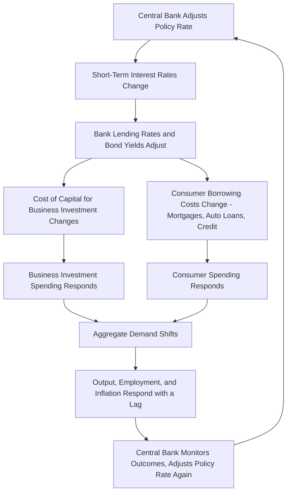

## Inflation, Interest Rates, and Business Planning

### Definitional Foundation

Inflation is the sustained increase in the general price level of goods and services in an economy over time, conventionally measured by indices such as the Consumer Price Index (CPI) or the GDP deflator:

$$\pi_t = \frac{P_t - P_{t-1}}{P_{t-1}} \times 100$$

Interest rates represent the price of money over time — the compensation lenders require for deferring consumption and bearing risk, and the cost borrowers pay for accessing funds today rather than in the future. The relationship between inflation and interest rates is one of the most operationally consequential linkages in managerial economics, since nearly every corporate financing, pricing, and investment decision is sensitive to both variables.

### The Fisher Equation: Nominal vs. Real Interest Rates

The Fisher equation formalizes the relationship between nominal interest rates, real interest rates, and expected inflation:

$$(1 + i) = (1 + r)(1 + \pi^e)$$

Where $i$ is the nominal interest rate, $r$ is the real interest rate, and $\pi^e$ is expected inflation. For practical business use, this is commonly approximated (accurate for small values) as:

$$i \approx r + \pi^e$$

**Managerial significance**: A firm evaluating a financing rate or a required rate of return must distinguish whether a given quoted rate is nominal or real, since real purchasing power — the metric ultimately relevant to genuine wealth creation — depends on the real rate, not the nominal rate. Borrowing at a high nominal rate during a period of high expected inflation may still represent a favorable financing cost in real terms if $\pi^e$ is large enough.

### Diagram: Fisher Equation Relationship (svg_diagram)

<svg xmlns="http://www.w3.org/2000/svg" viewBox="0 0 720 320" font-family="Arial, sans-serif">
<text x="360" y="24" text-anchor="middle" font-size="15" font-weight="bold">Nominal Rate = Real Rate + Expected Inflation (svg_diagram)</text>
<rect x="100" y="80" width="180" height="90" fill="#e3f2fd" stroke="#1565c0" stroke-width="2" />
<text x="190" y="115" text-anchor="middle" font-size="13" font-weight="bold">Real Rate (r)</text>
<text x="190" y="140" text-anchor="middle" font-size="11">Compensation for true</text>
<text x="190" y="155" text-anchor="middle" font-size="11">time value of money</text>

<text x="300" y="130" text-anchor="middle" font-size="20" font-weight="bold">+</text>

<rect x="330" y="80" width="180" height="90" fill="#fff3e0" stroke="#e65100" stroke-width="2" />
<text x="420" y="115" text-anchor="middle" font-size="13" font-weight="bold">Expected Inflation</text>
<text x="420" y="140" text-anchor="middle" font-size="11">Compensation for</text>
<text x="420" y="155" text-anchor="middle" font-size="11">expected loss of</text>
<text x="420" y="168" text-anchor="middle" font-size="10">purchasing power</text>

<text x="530" y="130" text-anchor="middle" font-size="20" font-weight="bold">=</text>

<rect x="560" y="80" width="140" height="90" fill="#e8f5e9" stroke="#2e7d32" stroke-width="2" />
<text x="630" y="115" text-anchor="middle" font-size="13" font-weight="bold">Nominal Rate (i)</text>
<text x="630" y="140" text-anchor="middle" font-size="11">Quoted, contracted</text>
<text x="630" y="155" text-anchor="middle" font-size="11">market rate</text>

<text x="360" y="230" text-anchor="middle" font-size="12">If actual inflation differs from expected inflation, wealth transfers occur</text>

<text x="360" y="250" text-anchor="middle" font-size="12">between borrowers and lenders (unexpected inflation favors borrowers)</text>

</svg>

### Monetary Policy Transmission Mechanism

Central banks (e.g., the U.S. Federal Reserve) influence economy-wide interest rates and, through them, inflation and real economic activity, primarily through policy rate adjustments:

**Key operational fact for managers**: This transmission mechanism operates with **significant and variable time lags** (often cited as ranging from several months to over a year for the full effect on inflation and output to materialize), meaning current interest rate levels reflect monetary policy decisions made considerably earlier, and current policy changes will not fully affect the economy until well into the future — a critical consideration for scenario planning, since the economic environment several quarters from now is already partly determined by monetary policy actions already taken.

### Inflation's Direct Effects on Business Operations

**Input Cost Pressure**: Rising inflation increases the nominal cost of raw materials, labor, energy, and other inputs, compressing margins unless prices can be adjusted correspondingly and promptly.

**Menu Costs**: The real resource costs associated with changing prices (updating price lists, contracts, systems, communicating changes to customers) rise in relevance during high-inflation periods, since firms must more frequently incur these costs to keep pace with rising input costs — a friction that can cause temporary margin compression between price adjustment cycles.

**Inventory Valuation Effects**: Under inflationary conditions, the choice between LIFO (Last-In-First-Out) and FIFO (First-In-First-Out) inventory accounting methods produces materially different reported cost of goods sold and taxable income — LIFO tends to report higher COGS (using more recent, higher-cost inventory first) and correspondingly lower reported taxable income during inflationary periods, a consideration directly relevant to tax planning and financial reporting strategy.

**Debt Contract Effects**: Unexpected inflation benefits borrowers with fixed-rate debt (since they repay in currency of reduced real purchasing power relative to what was originally borrowed) and correspondingly harms lenders holding fixed-rate claims — this wealth transfer effect is a key reason firms evaluate whether to lock in fixed-rate versus variable-rate financing based partly on their own inflation expectations relative to the market's embedded expectations.

**Wage-Price Dynamics**: Sustained inflation can trigger wage-price spiral dynamics, where employees demand higher nominal wages to maintain real purchasing power, which in turn raises firm input costs and can perpetuate further price increases — a dynamic of particular concern to labor-intensive businesses during sustained inflationary periods.

### Interest Rate Effects on Capital Budgeting

The discount rate used in net present value (NPV) analysis is directly tied to prevailing interest rate conditions through the cost of capital:

$$NPV = \sum_{t=0}^{T} \frac{CF_t}{(1+r)^t}$$

Where $r$ typically reflects a weighted average cost of capital (WACC) that itself embeds the current risk-free rate (closely tied to central bank policy and bond market conditions) plus a risk premium.

**Sensitivity implication**: Because future cash flows are discounted more heavily as $r$ rises, rising interest rate environments systematically reduce the present value of long-duration projects (those with cash flows concentrated in later years) more than short-duration projects — meaning capital-intensive, long-payback infrastructure and R&D investments become relatively less attractive on a risk-adjusted basis as rates rise, all else equal.

### Worked Numerical Example: Interest Rate Sensitivity of Project NPV

A firm evaluates a project with an initial investment of $1,000,000 and expected cash flows of $300,000 annually for 5 years.

**Scenario A — Discount rate of 6%:**

$$NPV_A = -1{,}000{,}000 + \sum_{t=1}^{5} \frac{300{,}000}{(1.06)^t}$$

$$NPV_A = -1{,}000{,}000 + 1{,}264{,}066 = 264{,}066$$

**Scenario B — Discount rate rises to 10% (reflecting central bank tightening):**

$$NPV_B = -1{,}000{,}000 + \sum_{t=1}^{5} \frac{300{,}000}{(1.10)^t}$$

$$NPV_B = -1{,}000{,}000 + 1{,}137{,}236 = 137{,}236$$

**Result**: A 4-percentage-point increase in the discount rate reduces project NPV by approximately $126,830 (roughly 48%), illustrating why capital budgeting decisions are highly sensitive to the prevailing interest rate environment and why firms should stress-test project viability across a plausible range of future rate scenarios rather than relying on a single point estimate of the discount rate, particularly for longer-duration projects where this sensitivity is magnified further.

### Comparative Summary Table: Inflation and Interest Rate Regimes and Business Response

| Regime | Characteristics | Typical Managerial Priority |
| --- | --- | --- |
| Low Inflation, Low Rates | Stable prices, cheap financing | Favorable for long-duration capital investment, expansion |
| Rising Inflation, Rising Rates (tightening cycle) | Central bank raising rates to combat inflation | Margin protection via pricing, hedge input costs, favor shorter-duration projects |
| High Inflation, Lagging Rate Response | Real rates may be negative or low | Consider fixed-rate borrowing to benefit from erosion of real debt value; inventory/pricing strategy critical |
| Disinflation/Deflation Risk, Falling Rates | Central bank easing to stimulate demand | Opportunity to lock in low-cost long-term financing; caution on pricing power (deflationary pressure on margins) |
| Stagflation (high inflation, weak growth) | Simultaneous cost pressure and demand weakness | Most challenging environment: cost discipline needed alongside limited pricing power |

### Managerial Implications

**Pricing Strategy Under Inflation**

- Firms should evaluate the frequency and mechanism of price adjustments (e.g., automatic indexation clauses in long-term contracts, more frequent list price reviews) to manage the trade-off between menu costs and the margin erosion risk of infrequent price adjustment during inflationary periods.
- Contract design with customers and suppliers should explicitly address inflation risk allocation — escalation clauses tied to published price indices are a standard mechanism to avoid bearing disproportionate inflation risk in long-term supply or service agreements.

**Financing Strategy**

- The choice between fixed-rate and variable-rate debt should reflect the firm's own view of future inflation and interest rate trajectories relative to the rates currently embedded in available financing terms; firms expecting inflation to run higher than currently priced into fixed-rate debt markets may find locking in fixed-rate financing advantageous, since they would benefit from the resulting erosion in the real value of their debt obligation.
- Given the significant time lags in monetary policy transmission discussed above, managers should treat current policy rate trajectories (and central bank forward guidance) as informative about likely future financing conditions several quarters ahead, incorporating this into financing timing decisions.

**Capital Budgeting and Investment Prioritization**

- As illustrated in the worked example, rising rate environments should prompt increased scrutiny of long-duration capital projects, with managers stress-testing NPV analyses across a range of plausible discount rate scenarios rather than a single base-case assumption, and potentially prioritizing shorter-payback projects during periods of rate uncertainty or expected tightening.

**Working Capital and Inventory Management**

- Inflationary periods increase the opportunity cost of holding cash (given rising nominal returns available elsewhere) while also increasing the nominal cost of inventory replacement, requiring managers to reassess optimal inventory levels and payment terms with both customers and suppliers to manage working capital efficiency under changing price conditions.
- The LIFO/FIFO inventory accounting choice should be revisited during sustained inflationary periods given its direct effect on reported taxable income and financial statement presentation, in consultation with tax and accounting advisors given jurisdiction-specific rules governing method changes.

**Labor Cost and Compensation Planning**

- Anticipating wage-price spiral dynamics, managers in labor-intensive industries should build inflation expectations into compensation planning and budgeting cycles, balancing the risk of employee retention/morale issues from wages lagging inflation against the risk of embedding permanently higher cost structures if wage increases outpace the eventual moderation of inflation.

**Scenario Planning and Macroeconomic Monitoring**

- Given the lagged and uncertain nature of monetary policy transmission, managers should maintain ongoing monitoring of leading indicators (yield curve shape, inflation expectations surveys, central bank communications) as inputs into rolling scenario planning, rather than treating interest rate and inflation forecasts as static assumptions to be set once during an annual budgeting cycle.

### Key Points

- The Fisher equation ($i \approx r + \pi^e$) formalizes the relationship between nominal rates, real rates, and expected inflation, and managers must distinguish nominal from real rates when evaluating financing costs and required returns.
- Monetary policy operates through a transmission mechanism from policy rates to broader financing conditions to aggregate demand to inflation and output, with substantial and variable time lags that managers must account for in forward-looking planning.
- Inflation directly affects business operations through input cost pressure, menu costs, inventory valuation choices (LIFO/FIFO), debt contract wealth transfers, and wage-price spiral risk.
- Rising interest rates disproportionately reduce the present value of long-duration capital projects relative to short-duration ones, making capital budgeting decisions highly sensitive to the discount rate assumption, as illustrated by the substantial NPV swing in the worked numerical example.
- Managers should treat inflation and interest rate conditions as dynamic, forward-looking inputs to pricing, financing, capital budgeting, and labor cost planning, given the lagged nature of monetary policy effects and the material sensitivity of business outcomes to these macroeconomic variables.

### Related Topics

- Business cycles and their impact on managerial decisions (foundational context)
- Weighted average cost of capital (WACC) and discount rate estimation
- Monetary policy transmission mechanisms and central bank communication
- LIFO/FIFO inventory accounting and tax planning under inflation
- Yield curve analysis and recession forecasting
- Fixed-rate vs. variable-rate corporate financing strategy
- Stagflation and simultaneous cost/demand-side macroeconomic challenges